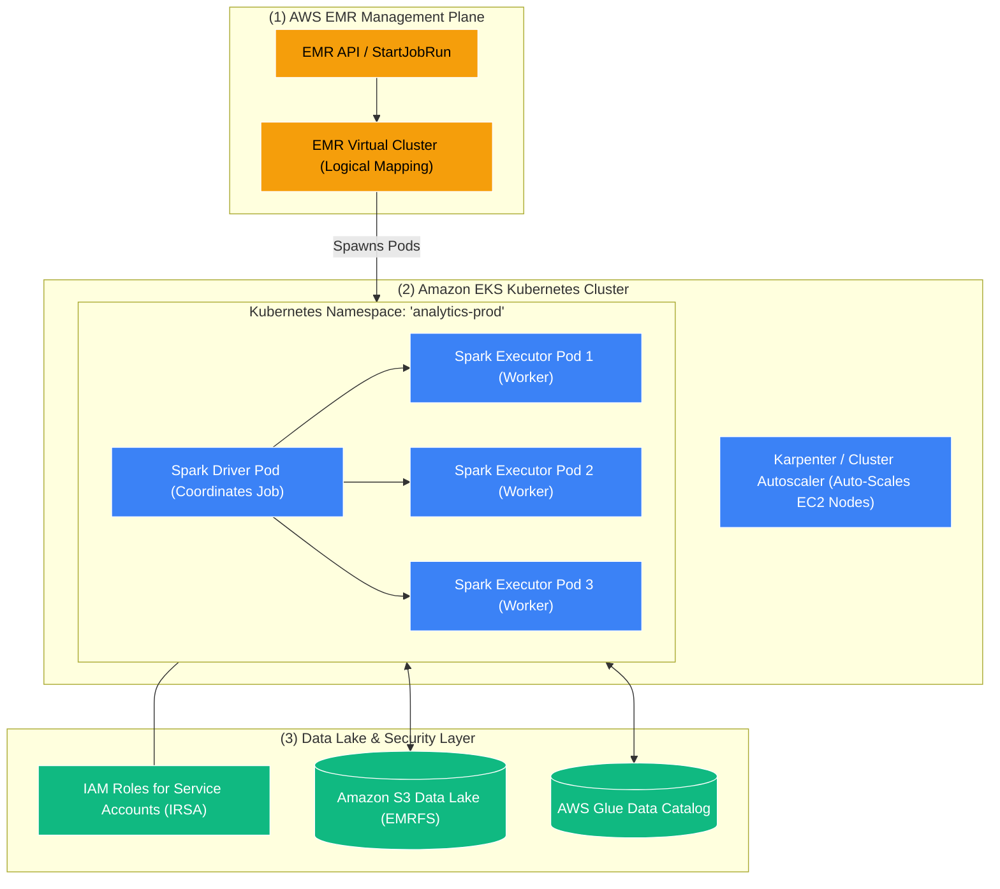

# ☸️ Amazon EMR on EKS (Containerized Big Data on Kubernetes)

- **Category**: Analytics / Containerized Distributed Processing
- **Language / ဘာသာစကား**: [English (Original)](/en/02-services/analytics-streaming/emr/emr-on-eks) | **မြန်မာဘာသာ (Burmese)**
- **Primary Use Case**: Microservices များနှင့် compute infrastructure များကို မျှဝေသုံးစွဲရန်နှင့် လျင်မြန်သော pod-level autoscaling ရရှိစေရန် Amazon EKS Kubernetes clusters များအတွင်း Apache Spark application များကို run ရန်။
- **Slide Reference**: Pages 383–413 in `[AWSCertifiedDataEngineerSlides.pdf](/docs/AWSCertifiedDataEngineerSlides.pdf)`
- **Hub Links**: `[[mm/index|index]]` | `[[mm/02-services/analytics-streaming/emr/emr|emr]]` | `[[mm/02-services/compute-containers/ecr-ecs-eks|ecr-ecs-eks]]` | `[[mm/01-domains/domain-1-ingestion-and-processing|domain-1-ingestion-and-processing]]`

---

## 1. High-Level Summary (အကျဉ်းချုပ် ခြုံငုံသုံးသပ်ချက်)

**Amazon EMR on EKS** သည် EMR management layer ကို အောက်ခံ compute infrastructure ထံမှ သီးခြားခွဲထုတ် (decouple လုပ်) ပေးသည့် deployment model တစ်ခုကို ပံ့ပိုးပေးပြီး၊ အဖွဲ့အစည်းများအနေဖြင့် **Apache Spark** application များကို **Amazon Elastic Kubernetes Service (Amazon EKS)** ပေါ်တွင် တိုက်ရိုက် run နိုင်စေပါသည်။

Big data analytics အတွက် သီးသန့် long-running EC2 cluster များကို provision ပြုလုပ်မည့်အစား data engineering team များသည် လက်ရှိရှိပြီးသား shared enterprise Kubernetes cluster များကို အသုံးချနိုင်ပါသည်။ EMR on EKS သည် standard Kubernetes pod များအတွင်း **EMR Runtime for Apache Spark** ၏ lifecycle ကို အလိုအလျောက် install ပြုလုပ်ခြင်း၊ configure လုပ်ခြင်းနှင့် စီမံခန့်ခွဲခြင်းတို့ကို ဆောင်ရွက်ပေးပါသည်။

---

## 2. Core Architecture & Key Capabilities (အဓိက ဗိသုကာနှင့် စွမ်းဆောင်ရည်များ)

### 1. EMR Virtual Clusters
- **EMR Virtual Cluster** ဆိုသည်မှာ Amazon EKS cluster အတွင်းရှိ သီးခြား **Kubernetes Namespace** တစ်ခုနှင့် တိုက်ရိုက်ချိတ်ဆက်ပေးသည့် (maps လုပ်ပေးသည့်) Amazon EMR အတွင်းရှိ logical entity တစ်ခုဖြစ်ပါသည်။
- Analytical team အမျိုးမျိုး (ဥပမာ `data-engineering`၊ `data-science`၊ `marketing-analytics`) အနေဖြင့် physical EKS cluster တစ်ခုတည်းပေါ်တွင် မတူညီသော namespace များနှင့် ချိတ်ဆက်ထားသည့် သီးခြား Virtual Cluster များကို ထားရှိနိုင်ပြီး တင်းကျပ်သော multi-tenant compute isolation နှင့် Kubernetes ResourceQuotas များကို သတ်မှတ်အသုံးပြုနိုင်ပါသည်။

---

### 2. IRSA (IAM Roles for Service Accounts) ဖြင့် စေ့စပ်တိကျသော လုံခြုံရေး (Fine-Grained Security)
- ရိုးရိုး EMR on EC2 တွင် instance ပေါ်၌ run နေသော application အားလုံးသည် EC2 Instance Profile IAM role ကို ဆက်ခံရယူကြပါသည်။
- **EMR on EKS** တွင်မူ Spark Job Run တစ်ခုစီသည် IAM role သတ်မှတ်ထားသော (annotated လုပ်ထားသော) **Kubernetes Service Account** (**IRSA**) နှင့် တိုက်ရိုက် ချိတ်ဆက် (bind လုပ်) ပါသည်။
- **လုံခြုံရေးဆိုင်ရာ အကျိုးကျေးဇူး (Security Benefit)**: အောက်ခံ worker node တစ်ခုတည်းပေါ်တွင် ဘေးချင်းကပ် run နေသော်လည်း Job A အနေဖြင့် S3 bucket `s3://finance-data/` သို့ read-only access ရရှိနိုင်ပြီး Job B အနေဖြင့် `s3://marketing-data/` သို့ write access ရရှိနိုင်စေပါသည်။

---

### 3. လျင်မြန်သော Pod Startup နှင့် Karpenter Autoscaling
- သမားရိုးကျ EC2 instance များကို စတင် launch လုပ်ရန် **၅ မိနစ်မှ ၁၅ မိနစ်အထိ** ကြာမြင့်ပါသည်။
- Kubernetes pod များသည် **စက္ကန့်ပိုင်းအတွင်း** စတင်တက်လာနိုင်သောကြောင့် Spark job များအနေဖြင့် data များကို ချက်ချင်းနီးပါး စတင် process လုပ်နိုင်ပါသည်။
- **Karpenter** ကဲ့သို့သော ခေတ်မီ Kubernetes autoscaler များနှင့် တွဲဖက်အသုံးပြုသည့်အခါ ဝင်ရောက်လာသော Spark pod တောင်းဆိုချက်များအပေါ် အခြေခံ၍ သင့်လျော်သော အရွယ်အစားရှိသည့် EC2 instance များကို (On-Demand၊ Spot နှင့် AWS Graviton node များကို ရောနှော၍) cluster က dynamic အနေဖြင့် အလိုအလျောက် provision ပြုလုပ်ပေးပါသည်။

---

### 4. Amazon ECR မှတစ်ဆင့် Custom Container Image များကို အသုံးပြုခြင်း
- Data engineer များသည် custom Spark application များ၊ Python virtual environment များ၊ compiled C++ extension များနှင့် custom JAR များကို standard Docker container image များအတွင်း ထည့်သွင်း package ပြုလုပ်နိုင်ပါသည်။
- Image များကို **[[mm/02-services/compute-containers/ecr-ecs-eks|Amazon ECR]]** သို့ publish ပြုလုပ်ပြီး job submission payload ထဲတွင် ရည်ညွှန်းအသုံးပြုနိုင်ပါသည်။

---

## 3. နှိုင်းယှဉ်ချက်ဇယား (Comparison Matrix): EMR on EKS vs. EMR on EC2 vs. EMR Serverless

| Feature (အသွင်အပြင်) | Amazon EMR on EKS | Amazon EMR on EC2 | Amazon EMR Serverless |
| :--- | :--- | :--- | :--- |
| **Compute Infrastructure** | **Shared Kubernetes (EKS)** | **Dedicated EC2 Instances** | **100% Serverless** |
| **Infrastructure Management** | Kubernetes Team / DevOps မှ စီမံခန့်ခွဲသည် | Data Engineering Team မှ စီမံခန့်ခွဲသည် | AWS မှ အပြည့်အဝ စီမံခန့်ခွဲသည် |
| **Multi-Tenancy** | **High** (Namespace နှင့် Pod အဆင့်) | Medium (သီးခြား EC2 cluster များ) | High (Logical Applications) |
| **Startup Latency** | **Fast (စက္ကန့်ပိုင်း)** | Slow (၅–၁၅ မိနစ်) | Fast (Warm pool ဖြင့် < ၅ စက္ကန့်) |
| **Supported Frameworks** | **Apache Spark** | Spark, Hive, Presto, Flink, HBase | Spark, Apache Hive |
| **Security Isolation** | **IAM Roles for Service Accounts (IRSA)** | EC2 Instance Profiles / Kerberos | IAM Job Execution Roles |
| **အသင့်တော်ဆုံး အသုံးပြုမှု (Best Used For)** | Workload များကို ပေါင်းစည်းလိုသည့် လက်ရှိ Kubernetes platform ရှိပြီးသား ကုမ္ပဏီများအတွက်။ | Spark မဟုတ်သော အခြား framework များ (HBase, Trino) ကို run သည့် အမြဲတမ်း 24/7 သီးသန့် cluster များအတွက်။ | Cluster management လုံးဝလုပ်စရာမလိုဘဲ ad-hoc သို့မဟုတ် scheduled Spark pipeline များကို run ရန်အတွက်။ |

---

## 4. DEA-C01 စာမေးပွဲ အကြံပြုချက်များနှင့် မေးခွန်း Scenario များ (Exam Tips & Scenarios)

> [!IMPORTANT]
> **EMR on EKS အတွက် အဓိက စာမေးပွဲ Decision Trigger များ**:
>
> - **"Consolidate big data Apache Spark analytics onto an existing corporate Amazon EKS Kubernetes cluster"** $\rightarrow$ **Amazon EMR on EKS**.
> - **"Enforce granular, least-privilege IAM permissions per Spark job on a shared cluster"** $\rightarrow$ **EMR on EKS using IAM Roles for Service Accounts (IRSA)**.
> - **"Achieve sub-minute startup times for Spark batch jobs using containerized infrastructure"** $\rightarrow$ **Amazon EMR on EKS**.
> - **"Share compute infrastructure between web microservices and batch analytics to maximize server utilization"** $\rightarrow$ **Amazon EMR on EKS**.

---

## 📌 ဆက်စပ် မှတ်စုများ (Related Notes)
- `[[mm/02-services/analytics-streaming/emr/emr|emr]]` — Amazon EMR Overview Hub
- `[[mm/02-services/analytics-streaming/emr/emr-serverless|emr-serverless]]` — Serverless Big Data Compute
- `[[mm/02-services/analytics-streaming/emr/emr-cluster-architecture|emr-cluster-architecture]]` — Provisioned EMR on EC2 Clusters
- `[[mm/02-services/compute-containers/ecr-ecs-eks|ecr-ecs-eks]]` — Amazon ECR, ECS & EKS Architecture
