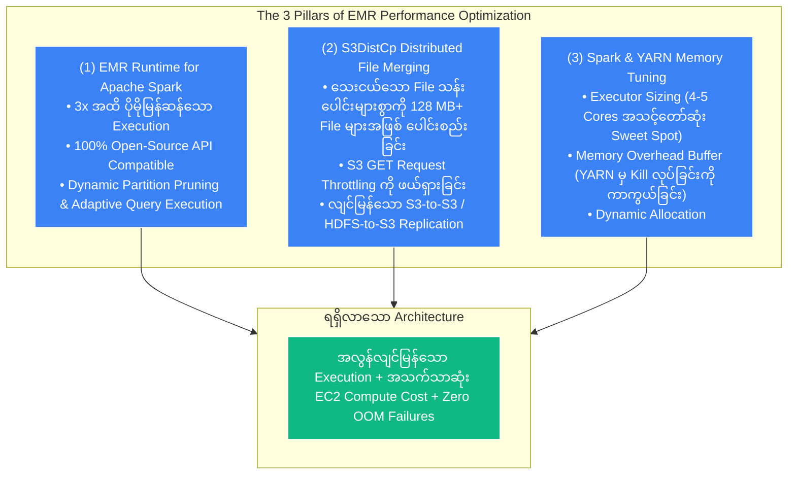
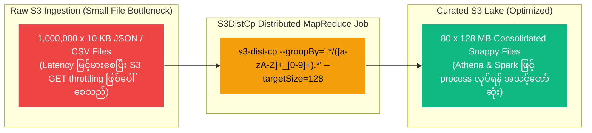
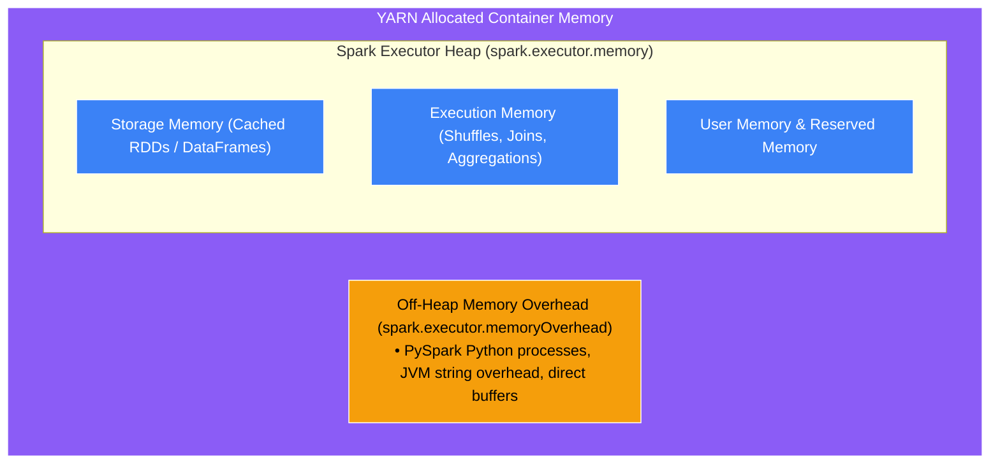

# ⚡ EMR Performance Optimization & S3DistCp

- **Category**: Analytics / Big Data Tuning & Distributed Data Transfer
- **Language / ဘာသာစကား**: [English (Original)](/en/02-services/analytics-streaming/emr/emr-performance-optimization) | **မြန်မာဘာသာ (Burmese)**
- **Primary Use Case**: Spark execution performance ကို အမြင့်ဆုံးမြှင့်တင်ရန်၊ S3DistCp မှတစ်ဆင့် small file ပြဿနာကို ဖြေရှင်းရန်နှင့် YARN/Spark memory allocation များကို အသေးစိတ် ညှိယူပြင်ဆင်ရန် (fine-tuning)။
- **Slide Reference**: `[AWSCertifiedDataEngineerSlides.pdf](/docs/AWSCertifiedDataEngineerSlides.pdf)` ရှိ စာမျက်နှာ 383–413
- **Hub Links**: `[[mm/index|index]]` | `[[mm/02-services/analytics-streaming/emr/emr|emr]]` | `[[mm/02-services/storage/s3/s3|s3]]` | `[[domain-3-data-processing]]`

---

## 1. High-Level Summary

Amazon EMR ပေါ်တွင် performance optimization ပြုလုပ်ခြင်း၌ **compute execution engine (Apache Spark / YARN)** နှင့် **အောက်ခံ storage I/O layer (Amazon S3 / EMRFS)** နှစ်ခုစလုံးကို optimize လုပ်ခြင်း ပါဝင်သည်။ 

DEA-C01 စာမေးပွဲတွင် ထူးချွန်ရန်အတွက် data engineer များသည် **EMR Runtime for Apache Spark** ၏ performance အကျိုးကျေးဇူးများ၊ **S3DistCp** ကို အသုံးပြု၍ သေးငယ်သော file သန်းပေါင်းများစွာကို စုစည်းပေါင်းစပ်ပုံ (consolidate) နှင့် out-of-memory (OOM) error များနှင့် YARN container evictions များကို ဖယ်ရှားရန် Spark Driver နှင့် Executor memory ကို မည်သို့ သတ်မှတ်ရမည်ကို နားလည်ထားရမည်။



---

## 2. EMR Runtime for Apache Spark

Amazon EMR တွင် ခေတ်မီ EMR cluster များ (EMR 5.28+ နှင့် EMR 6.x / 7.x) ၌ default အနေဖြင့် ပါဝင်သော AWS မှ တီထွင်ဖန်တီးထားသည့် proprietary **EMR Runtime for Apache Spark** ပါဝင်သည် -
- **3x Performance Boost**: EC2 ပေါ်ရှိ standard open-source Apache Spark နှင့် နှိုင်းယှဉ်ပါက **query performance ကို 3.2x အထိ ပိုမိုမြန်ဆန်စေပြီး** compute cost များကို **71%** အထိ လျှော့ချပေးသည်။
- **Zero Code Changes**: Standard Apache Spark နှင့် **100% API compatibility** ကို ပေးစွမ်းသည်။ Open-source Spark အတွက် ရေးသားထားသော application များသည် ကုဒ်ပြင်ဆင်ရန်မလိုဘဲ အပြောင်းအလဲမရှိ run နိုင်သည်။
- **Key Enhancements**: Optimized dynamic partition pruning (DPP)၊ Adaptive Query Execution (AQE) မြှင့်တင်မှုများနှင့် Amazon S3 object store များအတွက် တိုက်ရိုက် optimize ပြုလုပ်ထားသော vectorized Parquet reader များ ပါဝင်သည်။

---

## 3. Deep Dive: S3DistCp (Distributed Copy & File Consolidation)

**S3DistCp (S3 Distributed Copy)** သည် Hadoop `DistCp` ၏ open-source extension တစ်ခုဖြစ်ပြီး MapReduce ကို အသုံးပြု၍ AWS နှင့် Amazon S3 တို့နှင့် တွဲဖက်လုပ်ဆောင်နိုင်ရန် native ဖြစ်အောင် optimize ပြုလုပ်ထားသည်။



### Core S3DistCp Capabilities:
1. **Parallel Distributed Copying**: Multi-terabyte/petabyte ပမာဏရှိသော dataset ကြီးများကို S3 bucket များအကြား (သို့မဟုတ်) HDFS နှင့် Amazon S3 အကြား ပြိုင်တူ (parallel) distributed ကူးယူပေးနိုင်သည်။
2. **Solving the Small File Problem with `--groupBy`**:
   - Regular expression နှင့် ကိုက်ညီသော သေးငယ်သည့် file ထောင်ပေါင်းများစွာကို ပိုမိုကြီးမားသော composite file များအဖြစ် စုစည်းပေးသည်။
   - နမူနာ Command:
     ```bash
     s3-dist-cp \
       --src s3://raw-landing-lake/hourly-logs/ \
       --dest s3://curated-lake/consolidated-logs/ \
       --groupBy='.*/([a-zA-Z]+_[0-9]+).*' \
       --targetSize=128
     ```
3. **Data Compression Conversion**: Data ကူးယူနေစဉ်အတွင်း file များကို compress လုပ်ခြင်း (သို့မဟုတ်) decompress လုပ်ခြင်း (ဥပမာ - Gzip မှ Snappy သို့ ပြောင်းလဲခြင်း) တို့ကို ဆောင်ရွက်နိုင်သည်။

---

## 4. Apache Spark Memory & Executor Tuning on EMR

DEA-C01 စာမေးပွဲတွင် Spark job များ ကျရှုံးရခြင်း၏ အဓိက အဖြစ်များဆုံး အကြောင်းရင်းတစ်ခုမှာ အောက်ပါ error ကြောင့်ဖြစ်သည် -  
`"Container killed by YARN for exceeding memory limits"`



### Sizing Rules & Best Practices:
1. **Executor Cores (`spark.executor.cores`)**:
   - **Sweet Spot**: Executor တစ်ခုလျှင် **4 သို့မဟုတ် 5 vCPUs** သတ်မှတ်ပါ။ 5 cores ထက်ပို၍ သတ်မှတ်ပါက HDFS/S3 I/O throughput ကို ကျဆင်းစေပြီး 1 core သာ သတ်မှတ်ပါက multi-threading efficiency ကို အလဟဿ ဖြစ်စေသည်။
2. **Memory Overhead (`spark.executor.memoryOverhead`)**:
   - Non-JVM process များအတွက် (ဥပမာ - PySpark Python worker process များ) JVM heap ပြင်ပတွင် သတ်မှတ်ပေးထားသော memory ဖြစ်သည်။
   - Rule: Default တန်ဖိုးမှာ `max(384MB, 0.10 * spark.executor.memory)` ဖြစ်သည်။ YARN container အသတ်ခံရခြင်း (termination) မှ ကာကွယ်ရန် **transformation များပြားသော PySpark job များကို run သောအခါ ဤတန်ဖိုးကို တိုးမြှင့်ပေးပါ (ဥပမာ - 20–30% သို့)**။
3. **Dynamic Allocation (`spark.dynamicAllocation.enabled`)**:
   - Task များ တန်းစီနေချိန်တွင် Spark အား executor များကို dynamic တောင်းဆိုစေပြီး lightweight stage များတွင် အသုံးမပြုသော executor များကို ပြန်လည် release လုပ်ခွင့်ပေးသည်။

---

## 5. DEA-C01 Exam Tips & Scenarios

> [!IMPORTANT]
> **Key Exam Decision Triggers for EMR Performance**:
>
> - **"Millions of small 10 KB files in S3 are causing slow EMR and Athena query performance"** $\rightarrow$ **Small file များကို 128 MB file များအဖြစ် merge လုပ်ရန် `--groupBy` နှင့် `--targetSize` ပါဝင်သော `s3-dist-cp` ကို အသုံးပြုပါ**။
> - **"EMR Spark job fails with 'Container killed by YARN for exceeding memory limits'"** $\rightarrow$ Cluster configuration တွင် **`spark.executor.memoryOverhead` ကို တိုးမြှင့်ပါ**။
> - **"Accelerate Spark query performance on EMR without modifying application code"** $\rightarrow$ **EMR Runtime for Apache Spark** ကို အသုံးပြုပါ (EMR 6.x/7.x တွင် default ပါဝင်သည်)။
> - **"Copy petabytes of data from HDFS to Amazon S3 in parallel with minimal latency"** $\rightarrow$ **`s3-dist-cp` ကို အသုံးပြုပါ**။
> - **"Optimal number of cores per Spark executor"** $\rightarrow$ **Executor တစ်ခုလျှင် 4 မှ 5 vCPUs**။

---

## 📌 Related Notes
- `[[mm/02-services/analytics-streaming/emr/emr|emr]]` — Amazon EMR Overview Hub
- `[[mm/02-services/analytics-streaming/emr/emr-cluster-architecture|emr-cluster-architecture]]` — Node Types & Storage
- `[[mm/02-services/analytics-streaming/athena/athena-performance|athena-performance]]` — Athena Small File Optimization
- `[[mm/03-concepts/data-formats-and-compression|data-formats-and-compression]]` — Parquet, ORC, Snappy & ZSTD
