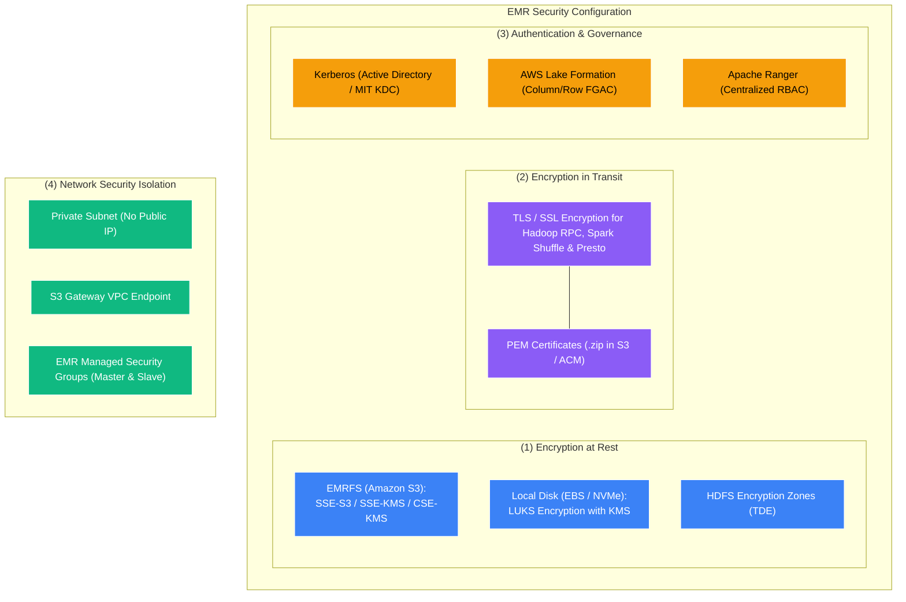
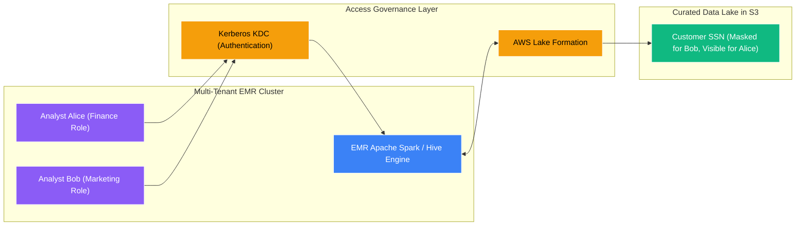

# 🔒 EMR Security, Encryption & Governance

- **Category**: Analytics / Enterprise Security, Encryption & Compliance
- **Language / ဘာသာစကား**: [English (Original)](/en/02-services/analytics-streaming/emr/emr-security-and-governance) | **မြန်မာဘာသာ (Burmese)**
- **Primary Use Case**: EMR Security Configurations, at-rest/in-transit encryption, Kerberos authentication နှင့် AWS Lake Formation fine-grained governance တို့ကို အသုံးပြု၍ EMR clusters များကို လုံခြုံစိတ်ချရအောင် ပြုလုပ်ခြင်း။
- **Slide Reference**: Pages 383–413 in `[AWSCertifiedDataEngineerSlides.pdf](/docs/AWSCertifiedDataEngineerSlides.pdf)`
- **Hub Links**: `[[mm/index|index]]` | `[[mm/02-services/analytics-streaming/emr/emr|emr]]` | `[[domain-5-security-and-governance]]` | `[[kms]]` | `[[mm/02-services/security-governance/lake-formation|lake-formation]]`

---

## ၁။ အကျဉ်းချုပ် (High-Level Summary)

လုပ်ငန်းသုံး (Enterprise) big data workloads များသည် အထိခိုက်မခံနိုင်သော လုပ်ငန်းဆိုင်ရာ အချက်အလက်များနှင့် စည်းမျဉ်းစည်းကမ်းများအရ ထိန်းချုပ်ထားသော customer data များ (ဥပမာ- PII, HIPAA သို့မဟုတ် ဘဏ္ဍာရေးမှတ်တမ်းများ) ကို မကြာခဏ process လုပ်ရလေ့ရှိသည်။ Amazon EMR ကို လုံခြုံစိတ်ချရစေရန်အတွက် **at-rest encryption**၊ **in-transit encryption**၊ **network isolation (VPCs & Private Endpoints)** နှင့် **fine-grained user access governance (Kerberos, Lake Formation, and Apache Ranger)** တို့ ပါဝင်သော ဘက်စုံကာကွယ်ရေး (defense-in-depth) မဟာဗျူဟာ လိုအပ်သည်။

Amazon EMR သည် encryption၊ authentication နှင့် authorization setting များကို cluster အများအပြားတွင် တစ်သမတ်တည်း ထည့်သွင်းသတ်မှတ်ပေးနိုင်သော ပြန်လည်အသုံးပြုနိုင်သည့် security template များဖြစ်သည့် **Security Configurations** ကို ပံ့ပိုးပေးထားသည်။

---

## ၂။ EMR Security Configurations ဆိုင်ရာ အသေးစိတ် (EMR Security Configurations Deep Dive)

**EMR Security Configuration** သည် EMR တွင် သိမ်းဆည်းထားသော managed template တစ်ခုဖြစ်ပြီး cluster များကို launch လုပ်သည့်အခါ ချိတ်ဆက်သတ်မှတ်ပေးနိုင်သည်-

### ၁။ Encryption at Rest (သိုလှောင်ထားချိန်တွင် Encrypt ပြုလုပ်ခြင်း)
- **Amazon S3 (EMRFS)**:
  - **Server-Side Encryption**: `SSE-S3` (Amazon-managed) သို့မဟုတ် `SSE-KMS` (Customer Managed Key)။
  - **Client-Side Encryption**: `CSE-KMS` သို့မဟုတ် `CSE-C` (Client-side custom master key)။
- **Local Disks (EBS Volumes & NVMe Instance Store)**:
  - AWS KMS keys များကို အသုံးပြုထားသော **Linux Unified Key Setup (LUKS)** block-level encryption ကို အသုံးပြုသည်။
  - Spark intermediate shuffle data နှင့် HDFS storage အတွက် အသုံးပြုသော local scratch space များကို အလိုအလျောက် encrypt ပြုလုပ်ပေးသည်။
- **HDFS Transparent Data Encryption (TDE)**:
  - Hadoop key management ကို အသုံးပြု၍ သီးခြား folder များ (encryption zones) အတွင်းရှိ HDFS blocks များကို encrypt ပြုလုပ်သည်။

---

### ၂။ Encryption in Transit (Node-to-Node ကြား ချိတ်ဆက်ပို့ဆောင်ချိန်တွင် Encrypt ပြုလုပ်ခြင်း)
- Internal daemon ဆက်သွယ်မှုအားလုံးအတွက် TLS 1.2+ encryption ကို မဖြစ်မနေ အသုံးပြုစေသည်၊ ၎င်းတို့တွင် အောက်ပါတို့ ပါဝင်သည်-
  - Spark internal shuffle block လွှဲပြောင်းမှုများ။
  - Hadoop MapReduce shuffle လွှဲပြောင်းမှုများ။
  - Hadoop RPC နှင့် HDFS DataNode traffic များ။
  - Presto / Trino inter-node queries များ။
- **Certificate Provider**: Encryption keys များနှင့် PEM certificates များကို သီးသန့် ကန့်သတ်ထားသော S3 bucket ထဲတွင် `.zip` ဖိုင်အဖြစ် သိမ်းဆည်းထားနိုင်သည် သို့မဟုတ် custom certificate provider script မှတစ်ဆင့် ထောက်ပံ့ပေးနိုင်သည်။

---

## ၃။ User Authentication နှင့် Fine-Grained Access Control

### ၁။ Kerberos Authentication
- မျှဝေသုံးစွဲသော multi-tenant cluster များပေါ်တွင် ခိုင်မာအားကောင်းသည့် ticket-based user authentication ကို ပံ့ပိုးပေးသည်။
- **Active Directory နှင့် Cross-Realm Trust ပြုလုပ်ခြင်း**: အသုံးပြုသူများသည် ၎င်းတို့၏ လုပ်ငန်းသုံး Active Directory credentials များကို အသုံးပြု၍ EMR သို့ authenticate ပြုလုပ်နိုင်သည်။
- **Internal MIT KDC**: EMR သည် Primary node ပေါ်တွင် local MIT Kerberos Key Distribution Center (KDC) တစ်ခုကို အလိုအလျောက် configure လုပ်ပေးနိုင်သည်။

### ၂။ AWS Lake Formation Integration
- EMR ပေါ်ရှိ Apache Spark နှင့် Apache Hive တို့အတွက် **Fine-Grained Access Control (FGAC)** ကို ရရှိစေသည်။
- Lake Formation policies များအပေါ် အခြေခံ၍ column-level security (ဥပမာ- `credit_card_number` ကို mask ပြုလုပ်ခြင်း)၊ row-level filters (ဥပမာ- `country = 'US'`) နှင့် cell-level permissions များကို သတ်မှတ်အသုံးချနိုင်သည်။

### ၃။ Apache Ranger Integration
- EMR သည် Hive, Spark နှင့် HBase တို့အတွက် ဗဟိုချုပ်ကိုင်မှုရှိသော authorization policies များကို စီမံခန့်ခွဲရန် Apache Ranger နှင့် native integration ပြုလုပ်ခြင်းကို ပံ့ပိုးပေးသည်။

---

## ၄။ Network Security နှင့် VPC Architecture

- **Private Subnet တွင် Deploy ပြုလုပ်ခြင်း**: အကောင်းဆုံးလုပ်ဆောင်ချက် (Best practice) မှာ EMR cluster node အားလုံးကို public IP address မပါဝင်သော **Private Subnet** အတွင်း၌သာ deploy ပြုလုပ်ရန် ဖြစ်သည်။
- **VPC Endpoints**:
  - **S3 Gateway Endpoint**: EMR nodes များအနေဖြင့် NAT Gateway ကို ဖြတ်သန်းစရာမလိုဘဲ S3 data lakes များကို အခမဲ့ (free) ဝင်ရောက်ရယူခွင့် ပေးသည်။
  - **Glue Interface Endpoint**: Private VPC အတွင်းမှနေ၍ AWS Glue Data Catalog ထံမှ metadata များ ရယူခွင့် ပေးသည်။
- **EMR Managed Security Groups**:
  - **Master Security Group**: Primary node သို့ ဝင်ရောက်လာသော inbound traffic များကို ထိန်းချုပ်သည်။
  - **Slave Security Group**: Core နှင့် Task worker node များအကြား cluster အတွင်း ဆက်သွယ်မှုများကို ထိန်းချုပ်သည်။

---

## ၅။ DEA-C01 စာမေးပွဲ အကြံပြုချက်များနှင့် မေးခွန်းပုံစံများ (Exam Tips & Scenarios)

> [!IMPORTANT]
> **EMR Security ဆိုင်ရာ စာမေးပွဲ အဓိက သော့ချက်များ (Decision Triggers)**:
>
> - **"Ensure all data stored on local EBS volumes and S3 data lakes is encrypted with KMS CMKs"** (Local EBS volumes နှင့် S3 data lakes ပေါ်ရှိ ဒေတာအားလုံးကို KMS CMKs ဖြင့် encrypt ပြုလုပ်ရန်) $\rightarrow$ **EBS LUKS encryption နှင့် EMRFS SSE-KMS ကို ဖွင့်ထားသော EMR Security Configuration တစ်ခု ဖန်တီးပါ**။
> - **"Enforce column-level data masking for EMR Spark users without maintaining separate datasets"** (Dataset သီးခြားစီ ခွဲထားစရာမလိုဘဲ EMR Spark users များအတွက် column-level data masking သတ်မှတ်ရန်) $\rightarrow$ Amazon EMR ကို **AWS Lake Formation** နှင့် တွဲဖက်ချိတ်ဆက်ပါ (Integrate)။
> - **"Allow corporate Active Directory users to authenticate securely to an EMR cluster"** (လုပ်ငန်းသုံး Active Directory users များကို EMR cluster သို့ လုံခြုံစွာ authenticate ပြုလုပ်ခွင့်ပေးရန်) $\rightarrow$ **Active Directory cross-realm trust ဖြင့် Kerberos** ကို configure ပြုလုပ်ပါ။
> - **"Encrypt inter-node communication (Spark shuffle data) between worker nodes"** (Worker nodes အချင်းချင်းအကြား ဆက်သွယ်မှု Spark shuffle data များကို encrypt ပြုလုပ်ရန်) $\rightarrow$ **PEM certificates များကို အသုံးပြု၍ EMR Security Configuration တွင် In-Transit Encryption ကို ဖွင့်ပါ (Enable)**။
> - **"Prevent EMR cluster from accessing the public internet while communicating with S3"** (EMR cluster သည် S3 နှင့် ဆက်သွယ်နေစဉ် public internet သို့ ထွက်ခြင်းကို ကာကွယ်ရန်) $\rightarrow$ EMR ကို **Amazon S3 Gateway VPC Endpoint ပါဝင်သော Private Subnet** တွင် deploy ပြုလုပ်ပါ။

---

## 📌 ဆက်စပ် မှတ်စုများ (Related Notes)
- `[[mm/02-services/analytics-streaming/emr/emr|emr]]` — Amazon EMR Overview Hub
- `[[mm/02-services/analytics-streaming/emr/emr-cluster-architecture|emr-cluster-architecture]]` — Node Types & Storage
- `[[mm/02-services/security-governance/lake-formation|lake-formation]]` — AWS Lake Formation Governance
- `[[kms]]` — AWS Key Management Service (KMS)
