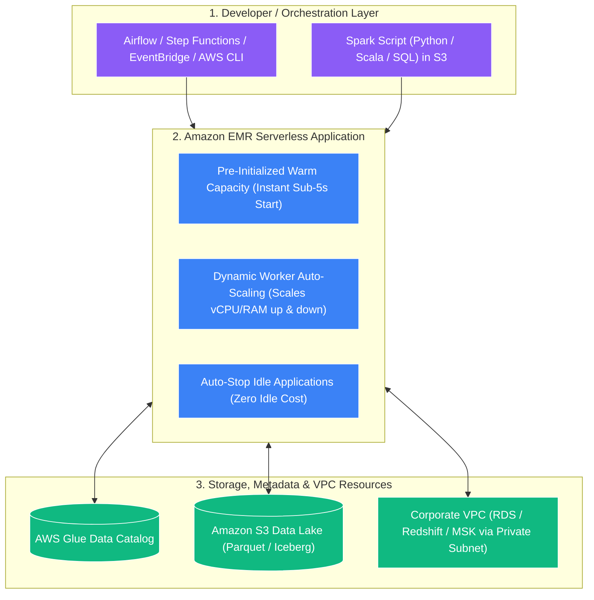

# ☁️ Amazon EMR Serverless (မြန်မာဘာသာ)

- **Category**: Analytics / Serverless Big Data Processing
- **Language / ဘာသာစကား**: [English (Original)](/en/02-services/analytics-streaming/emr/emr-serverless) | **မြန်မာဘာသာ (Burmese)**
- **Primary Use Case**: အောက်ခံ EC2 cluster များကို provision လုပ်ခြင်း၊ အရွယ်အစား သတ်မှတ်ခြင်း (sizing)၊ စီမံခန့်ခွဲခြင်း (managing) သို့မဟုတ် tuning ပြုလုပ်ခြင်းများ မလိုအပ်ဘဲ အကြီးစား Apache Spark နှင့် Apache Hive workload များကို run ရန်။
- **Slide Reference**: `[[AWSCertifiedDataEngineerSlides.pdf]]` ရှိ စာမျက်နှာ 383–413
- **Hub Links**: `[[mm/index]]` | `[[emr]]` | `[[glue-etl-jobs]]` | `[[athena-spark]]` | `[[domain-3-data-processing]]`

---

## 1. High-Level Summary (အကျဉ်းချုပ် ခြုံငုံသုံးသပ်ချက်)

**Amazon EMR Serverless** သည် open-source **Apache Spark** နှင့် **Apache Hive** တို့ကို အသုံးပြု၍ တည်ဆောက်ထားသော big data application များကို လွယ်ကူပြီး ကုန်ကျစရိတ် သက်သာစွာ run နိုင်စေရန် ပြုလုပ်ပေးသည့် Amazon EMR အတွက် serverless deployment option တစ်ခု ဖြစ်ပါသည်။

EMR Serverless တွင် data engineer များအနေဖြင့် cluster topology များကို configure လုပ်ခြင်း၊ EC2 instance type များကို ရွေးချယ်ခြင်း၊ Auto Scaling policy များကို ချိန်ညှိခြင်း (tune လုပ်ခြင်း) သို့မဟုတ် operating system patch များကို manage လုပ်ခြင်းတို့ ပြုလုပ်ရန် မလိုအပ်ပါ။ EMR Serverless သည် application အတွက် လိုအပ်သော တိကျသည့် compute နှင့် memory resource များကို အလိုအလျောက် provision ပြုလုပ်ပေးပြီး၊ data ပမာဏ အတက်အကျပေါ် မူတည်၍ capacity ကို dynamic အနေဖြင့် scale ပြုလုပ်ပေးကာ job ပြီးဆုံးသည်နှင့် resource များကို ချက်ချင်း deallocate လုပ်ပေးပါသည်။

---

## 2. Core Architecture & Key Concepts (အဓိက ဗိသုကာနှင့် အဓိက သဘောတရားများ)

### 1. Applications vs. Job Runs
- **Application**: သီးခြား release version များ၊ network VPC configuration များနှင့် maximum capacity limit များဖြင့် configure ပြုလုပ်ထားသော open-source framework (ဥပမာ **Apache Spark 3.4** သို့မဟုတ် **Apache Hive 3.1**) အတွက် logical container တစ်ခု ဖြစ်ပါသည်။
- **Job Run**: Application အတွင်း workload တစ်ခုကို သီးခြားခွဲထုတ်၍ run ခြင်း (ဥပမာ `s3://bucket/scripts/daily_etl.py` ကို execute လုပ်ခြင်း သို့မဟုတ် Spark JAR တစ်ခုကို submit လုပ်ခြင်း) ဖြစ်ပါသည်။

---

### 2. Pre-Initialized Capacity (Sub-5s Starts အတွက် Warm Pools)
- ပုံမှန် standard serverless job များသည် cold-start provisioning ကြောင့် နှောင့်နှေးမှုများ (၁–၃ မိနစ်) ကြုံတွေ့ရလေ့ရှိပါသည်။
- EMR Serverless သည် administrator များအား **Pre-Initialized Capacity** (ကြိုတင်နွေးထားသော pre-warmed worker pool တစ်ခု) ကို ထိန်းသိမ်းထားရှိရန် ခွင့်ပြုပေးပါသည်။
- **အကျိုးကျေးဇူး (Benefit)**: Pre-initialized application များသို့ submit လုပ်သော job များသည် data များကို **၁ မှ ၅ စက္ကန့်အောက် (under 1 to 5 seconds)** အတွင်း စတင် process လုပ်နိုင်သဖြင့် SLA-sensitive ဖြစ်သော batch pipeline များအတွက် အလွန် သင့်လျော်ပါသည်။

---

### 3. Granular Worker Sizing & Dynamic Scaling (တိကျသော Worker အရွယ်အစား သတ်မှတ်ခြင်းနှင့် Dynamic Scaling)
Job တစ်ခုကို submit လုပ်သည့်အခါ Spark Driver နှင့် Executor များအတွက် custom worker configuration များကို သတ်မှတ်နိုင်ပါသည်:
- **vCPU**: Worker တစ်ခုလျှင် 1, 2, 4, 8, သို့မဟုတ် 16 vCPUs။
- **Memory**: Worker တစ်ခုလျှင် 1 GB မှ 64 GB အထိ (1 GB အဆင့်ဆင့် တိုးမြှင့်နိုင်သည်)။
- **Disk Storage**: Worker တစ်ခုလျှင် 20 GB မှ 200 GB အထိ local ephemeral storage။
- **Auto-Scaling**: EMR Serverless သည် Spark stage concurrency အပေါ် အခြေခံ၍ worker များကို dynamic အနေဖြင့် အလိုအလျောက် scale လုပ်ပေးပြီး stage ပြီးဆုံးသည်နှင့် ချက်ချင်း deallocate ပြုလုပ်ပေးပါသည်။

---

### 4. Auto-Stop Idle Applications (အသုံးမပြုဘဲ ရပ်နားနေသော Application များကို အလိုအလျောက် ရပ်တန့်ခြင်း)
- အသုံးမပြုဘဲ ရပ်နားနေသော infrastructure ကြောင့် ကုန်ကျစရိတ် မဖြုန်းတီးစေရန် application များသည် idle timeout တစ်ခု (default: **၁၅ မိနစ် / 15 minutes**) ကျော်လွန်ပါက `STOPPED` state သို့ အလိုအလျောက် ကူးပြောင်းသွားပါသည်။
- Job အသစ်တစ်ခု submit လုပ်လာသည့်အခါ application သည် manual intervention ပြုလုပ်စရာမလိုဘဲ အလိုအလျောက် ပြန်လည် restart ဖြစ်လာပါသည်။

---

### 5. Custom Container Images (စိတ်ကြိုက် Container Image များ)
- သင့် Spark application တွင် runtime ၌ PyPI မှတစ်ဆင့် install လုပ်၍မရသော သီးခြား C++ library များ၊ proprietary Python package များ သို့မဟုတ် သီးခြား Java dependency များ လိုအပ်ပါက EMR Serverless သည် **[[ecr-ecs-eks|Amazon ECR]]** တွင် သိမ်းဆည်းထားသော **Custom Docker Container Images** များကို support လုပ်ပေးပါသည်။

---

## 3. Serverless Spark Decision Matrix: EMR Serverless vs. Glue ETL vs. Athena Spark (Serverless Spark ရွေးချယ်မှုဆိုင်ရာ နှိုင်းယှဉ်ချက်ဇယား)

| Feature (အသွင်အပြင်) | Amazon EMR Serverless | AWS Glue ETL Jobs | Athena for Apache Spark |
| :--- | :--- | :--- | :--- |
| **Primary Workload (အဓိက အသုံးပြုမှု)** | **Scheduled Big Data Batch & Streaming (Spark/Hive)** | **Scheduled Batch & CDC Pipelines** | **Interactive Ad-hoc Exploration (Jupyter)** |
| **Startup Latency (စတင်ချိန် ကြာမြင့်မှု)** | **< ၅ စက္ကန့်** (Pre-Initialized Capacity ဖြင့်) | ၁–၂ မိနစ် | **< ၁ စက္ကန့် (ချက်ချင်း / Instant)** |
| **Supported Frameworks (ထောက်ပံ့ပေးသော Framework များ)** | **Apache Spark, Apache Hive** | Apache Spark, Python Shell, Ray | Apache Spark (PySpark) |
| **Custom Containers (စိတ်ကြိုက် Container များ)** | **ရရှိနိုင်သည် (Yes)** (Full custom ECR Docker images) | တစ်စိတ်တစ်ပိုင်း (Custom libraries / wheel files) | မရရှိနိုင်ပါ (No) |
| **State Tracking (အခြေအနေ ခြေရာခံခြင်း)** | Custom application state | **Native Job Bookmarks** | Interactive session memory |
| **Pricing Model (ကုန်ကျစရိတ် တွက်ချက်မှု ပုံစံ)** | vCPU-hour, Memory GB-hour, Storage GB-hour | အသုံးပြုသော DPU-second အလိုက် ($0.44/DPU-hr) | အသုံးပြုနေသော DPU-hour အလိုက် |
| **အသင့်တော်ဆုံး အသုံးပြုမှု (Best Used For)** | Code rewrite လုပ်စရာမလိုဘဲ on-premise Spark/Hive များကို serverless သို့ migrate လုပ်ရန်။ | Native AWS lakehouse ETL၊ visual DAGs နှင့် automatic schema drift handling များအတွက်။ | Data scientist များအနေဖြင့် Python chart များဖြင့် S3 dataset များကို interactive exploration ပြုလုပ်ရန်။ |

---

## 4. DEA-C01 Exam Tips & Scenarios (စာမေးပွဲ အကြံပြုချက်များနှင့် မေးခွန်း Scenario များ)

> [!IMPORTANT]
> **EMR Serverless အတွက် အဓိက စာမေးပွဲ Decision Trigger များ (Key Exam Decision Triggers)**:
>
> - **"Run Apache Spark or Apache Hive jobs without managing EC2 clusters, but need sub-5-second job start times"** (EC2 cluster များကို manage လုပ်စရာမလိုဘဲ Apache Spark သို့မဟုတ် Apache Hive job များကို run လိုပြီး ၅ စက္ကန့်အောက် job start time လိုအပ်သည်) $\rightarrow$ **Amazon EMR Serverless with Pre-Initialized Capacity**။
> - **"Migrate existing Apache Hive batch scripts from on-premises to a serverless AWS environment without rewriting into Spark"** (Spark သို့ ပြန်လည်မရေးသားဘဲ လက်ရှိ on-premises Apache Hive batch script များကို serverless AWS environment သို့ migrate လုပ်ရန်) $\rightarrow$ **Amazon EMR Serverless (Hive Application)**။
> - **"Ensure serverless Spark jobs do not exceed departmental cloud budgets"** (Serverless Spark job များသည် ဌာနဆိုင်ရာ cloud budget ထက် မကျော်လွန်စေရန် သေချာစေခြင်း) $\rightarrow$ EMR Serverless Application ပေါ်တွင် **Maximum Capacity Limits (Max vCPU and Max Memory)** ကို သတ်မှတ်ပါ (Set)။
> - **"Require custom operating system packages and proprietary C/C++ libraries for a serverless Spark job"** (Serverless Spark job တစ်ခုအတွက် custom operating system package များနှင့် proprietary C/C++ library များ လိုအပ်သည်) $\rightarrow$ **Amazon ECR တွင် host လုပ်ထားသော Custom Docker Images ဖြင့် EMR Serverless** ကို အသုံးပြုပါ (Use)။
> - **"Connect EMR Serverless jobs securely to private RDS databases without traversing the public internet"** (Public internet ကို ဖြတ်သန်းစရာမလိုဘဲ EMR Serverless job များကို private RDS database များသို့ လုံခြုံစွာ ချိတ်ဆက်ရန်) $\rightarrow$ EMR Serverless application အား **VPC Private Subnet နှင့် Security Group association များ** ဖြင့် configure ပြုလုပ်ပါ။

---

## 📌 ဆက်စပ် မှတ်စုများ (Related Notes)
- `[[emr]]` — Amazon EMR Overview Hub
- `[[emr-cluster-architecture]]` — Provisioned EMR on EC2 Clusters
- `[[emr-on-eks]]` — Containerized Spark on Kubernetes
- `[[glue-etl-jobs]]` — AWS Glue Serverless Spark Alternative
- `[[athena-spark]]` — Interactive Serverless Spark Notebooks
