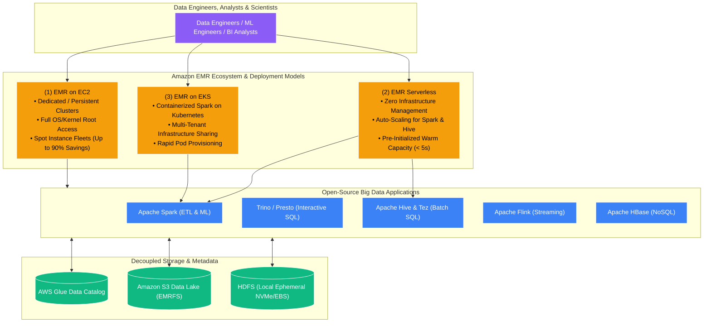
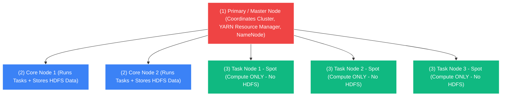

# 🐘 Amazon EMR Overview (Elastic MapReduce)

- **Category**: Analytics / Big Data & Distributed Processing
- **Language / ဘာသာစကား**: [English (Original)](/en/02-services/analytics-streaming/emr/emr) | **မြန်မာဘာသာ (Burmese)**
- **Primary Use Case**: Petabyte-scale distributed data processing, SQL analytics, real-time streaming နှင့် open-source big data frameworks (Apache Spark, Hadoop, Presto/Trino, Hive, Flink, HBase, Hudi, Iceberg) များကို အသုံးပြု၍ machine learning လုပ်ငန်းများ ဆောင်ရွက်ရန်။
- **Slide Reference**: Pages 383–413 in `[[AWSCertifiedDataEngineerSlides.pdf]]`
- **Hub Links**: `[[mm/index]]` | `[[service-catalog]]` | `[[domain-1-ingestion-and-processing]]` | `[[domain-3-data-processing]]` | `[[s3]]`

---

## 1. High-Level Summary (အကျဉ်းချုပ် ခြုံငုံသုံးသပ်ချက်)

**Amazon EMR (Elastic MapReduce)** သည် AWS ပေါ်တွင် လုပ်ငန်းခွင်သုံး အဆင့်မီပြီး cloud-native ဖြစ်သော ထိပ်တန်း big data platform တစ်ခု ဖြစ်သည်။ ၎င်းသည် data engineer များနှင့် data scientist များအား **Apache Spark**၊ **Apache Hadoop (YARN & HDFS)**၊ **Apache Hive**၊ **Presto / Trino**၊ **Apache Flink**၊ **Apache HBase** နှင့် **Apache Iceberg / Hudi** ကဲ့သို့သော open-source distributed application များကို လျင်မြန်စွာ provision ပြုလုပ်ခြင်း၊ scale ချဲ့ထွင်ခြင်းနှင့် run နိုင်စေရန် ကူညီပေးသည်။

သတ်မှတ်ထားသော execution sandbox များရှိသည့် managed serverless engine များ (ဥပမာ AWS Glue သို့မဟုတ် Athena ကဲ့သို့သော) နှင့် မတူဘဲ၊ Amazon EMR သည် petabyte မှ exabyte အတိုင်းအတာ scale အတွက် **မကြုံစဖူး ပြောင်းလွယ်ပြင်လွယ်ရှိမှု (flexibility)၊ လိုအပ်သလို စိတ်ကြိုက်ပြင်ဆင်နိုင်မှု (customization) နှင့် ကုန်ကျစရိတ် သက်သာမှု (cost efficiency)** တို့ကို ပေးစွမ်းသည်။ Data engineer များအနေဖြင့် အောက်ခံ cluster operating system များ၊ compute instance topology များ (EC2, Graviton, Spot Fleets)၊ containerization (Amazon EKS) နှင့် serverless execution model များ (**EMR Serverless**) တို့အပေါ် အပြည့်အဝ ထိန်းချုပ်ခွင့် (full control) ရရှိသည်။

---

## 2. EMR Sub-Modules Breakdown for DEA-C01 (DEA-C01 အတွက် EMR Sub-Module များ ခွဲခြမ်းစိတ်ဖြာချက်)

AWS Certified Data Engineer စာမေးပွဲအတွက် Amazon EMR ကို ကျွမ်းကျင်စွာ နားလည်စေရန် အောက်ပါ အသေးစိတ် deep-dive မှတ်စုများကို လေ့လာပါ-

| Sub-Module Note | Primary Technical Focus | Key Exam Concepts |
| :--- | :--- | :--- |
| **[[emr-cluster-architecture]]** | Master, Core နှင့် Task node topology များ၊ Instance Groups vs. Instance Fleets၊ HDFS vs. EMRFS။ | Task node များတွင် Spot Instances အသုံးပြုခြင်း၊ Core node များတွင် data loss မဖြစ်အောင် ကာကွယ်ခြင်း၊ EMRFS S3 decoupling။ |
| **[[emr-serverless]]** | Spark နှင့် Hive အတွက် Serverless big data compute။ | Pre-initialized capacity၊ auto-scaling worker pools၊ EC2 cluster maintain လုပ်စရာ မလိုခြင်း (zero maintenance)။ |
| **[[emr-on-eks]]** | Amazon EKS Kubernetes pod များအတွင်း Spark application များကို run ခြင်း။ | Virtual clusters၊ multi-tenant infrastructure consolidation၊ IRSA role mapping။ |
| **[[emr-performance-optimization]]** | Spark အတွက် EMR Runtime (3 ဆ အထိ ပိုမိုမြန်ဆန်ခြင်း)၊ S3DistCp နှင့် memory/executor tuning။ | Small file များကို `s3-dist-cp --groupBy` ဖြင့် စုစည်းခြင်း၊ Spark dynamic allocation နှင့် shuffle tuning။ |
| **[[emr-security-and-governance]]** | EMR Security Configurations၊ Kerberos၊ Lake Formation နှင့် VPC private networking။ | In-transit နှင့် at-rest encryption၊ fine-grained access control၊ Apache Ranger၊ private subnets။ |
| **[[emr-lifecycle-and-cost]]** | Bootstrap actions၊ Steps execution၊ Transient vs. Persistent clusters နှင့် Auto-Scaling။ | Custom package တပ်ဆင်ခြင်း၊ transient batch ETL ပြီးဆုံးပါက cluster terminate ပြုလုပ်ခြင်း၊ Managed Auto Scaling policies။ |

---

## 3. High-Level Node Topology Summary (Node Topology ၏ အကျဉ်းချုပ် ခြုံငုံသုံးသပ်ချက်)

Amazon EMR on EC2 cluster တစ်ခုတွင် သီးခြားကွဲပြားသော node အမျိုးအစား (၃) မျိုး ပါဝင်သည်-

1. **Primary Node (ယခင် Master Node)**: Distributed task များကို ညှိနှိုင်းစီမံခြင်း (coordinate လုပ်ခြင်း)၊ job execution များကို စောင့်ကြည့်မှတ်သားခြင်းနှင့် YARN Resource Manager နှင့် Hadoop NameNode တို့ကို စီမံခန့်ခွဲပေးသည်။
2. **Core Nodes**: Distributed processing task များကို run ပေးခြင်း (YARN NodeManager) **အပြင် distributed file system (HDFS DataNodes) ကိုလည်း သိမ်းဆည်းထားပေးသည်**။ Core node များကို terminate လုပ်လိုက်ပါက HDFS under-replication ဖြစ်ပေါ်ပြီး အချက်အလက်များ အပြီးတိုင် ဆုံးရှုံးသွားခြင်း (permanent data loss) ဖြစ်စေနိုင်ပါသည်။
3. **Task Nodes**: Compute processing task များကို **သာ** လုပ်ဆောင်ပေးသည်။ ၎င်းတို့သည် HDFS storage တွင် **ပါဝင်ခြင်း မရှိပါ**။ ထို့ကြောင့် ရုတ်တရက် ရပ်တန့်သွားခြင်း (sudden termination) ဖြစ်ပေါ်ပါကလည်း ခံနိုင်ရည် ၁၀၀% ရှိပြီး **Amazon EC2 Spot Instances** အသုံးပြုရန် အသင့်တော်ဆုံး ဖြစ်သည် (ကုန်ကျစရိတ် ၉၀% အထိ သက်သာစေနိုင်ပါသည်)။

---

## 4. Big Data Processing Decision Matrix: EMR vs. Glue vs. Athena (Big Data Processing ရွေးချယ်မှုဆိုင်ရာ Decision Matrix)

| Architecture Dimension | Amazon EMR (EC2 / EKS) | Amazon EMR Serverless | AWS Glue ETL Jobs | Amazon Athena |
| :--- | :--- | :--- | :--- | :--- |
| **Execution Model** | **Provisioned Cluster (EC2/EKS)** | **Serverless Big Data Apps** | **Serverless Spark / Python** | **Serverless Interactive SQL / Spark** |
| **Underlying Engine** | Spark, Flink, Trino, Hive, HBase, Presto | Spark, Apache Hive (Tez) | AWS Glue Spark / Ray | Trino (v3) / Spark Notebooks |
| **Startup Latency** | 5–15 minutes (EC2 launch) | < 5 seconds (warm pool ဖြင့်) | 1–2 minutes | Sub-second |
| **Customizability** | **အမြင့်ဆုံး (Full OS/Kernel/JARs)** | မြင့်မားသည် (Custom images & JARs) | အလယ်အလတ် (Python/JAR args) | Fixed SQL runtime |
| **Cost Structure** | EC2 instance hours + EMR fee | vCPU-hour + Memory GB-hour | သုံးစွဲသော DPU-second အလိုက် | Scan ဖတ်သော တစ် TB လျှင် $5.00 |
| **အသင့်တော်ဆုံး အသုံးပြုမှု (Best Used For)** | Petabyte clusters များ၊ 24/7 run သော workloads များ၊ custom big data frameworks များ။ | EC2 cluster tuning ပြုလုပ်စရာမလိုသော Scheduled Spark batch pipelines များ။ | Serverless batch ETL၊ Job Bookmarks၊ Data Catalog integration။ | Ad-hoc SQL exploration၊ log analytics၊ BI dashboards။ |

---

## 5. DEA-C01 Exam Tips & Decision Triggers (စာမေးပွဲအတွက် အကြံပြုချက်များနှင့် Decision Triggers)

> [!IMPORTANT]
> **Amazon EMR အတွက် အဓိက စာမေးပွဲ Decision Triggers များ**:
>
> - **"Cluster instance များ၊ custom open-source library များနှင့် operating system package များအပေါ် အပြည့်အဝ ထိန်းချုပ်ခွင့်ဖြင့် petabyte-scale distributed processing လိုအပ်ခြင်း"** $\rightarrow$ **Amazon EMR on EC2**။
> - **"Job fail ဖြစ်ခြင်း သို့မဟုတ် data ပျက်စီးဆုံးရှုံးခြင်း မဖြစ်စေဘဲ EMR cluster ၏ ကုန်ကျစရိတ်ကို အများဆုံး ချွေတာနိုင်ရန် မည်သို့ ပြုလုပ်ရမည်နည်း?"** $\rightarrow$ **Primary နှင့် Core node များအတွက် On-Demand Instances** ကို သုံးပြီး **Task node များအတွက် Spot Instances** ကို သုံးပါ။
> - **"EMR cluster terminate ဖြစ်သွားသည့်အခါ data loss မဖြစ်အောင် ကာကွယ်ခြင်း"** $\rightarrow$ Cluster ကို transient အဖြစ်သာ သဘောထားပြီး persistent input နှင့် output data အားလုံးကို **EMRFS အသုံးပြု၍ Amazon S3** တွင် သိမ်းဆည်းပါ။
> - **"မျှဝေသုံးစွဲထားသော compute resource များရှိသည့် လက်ရှိ Kubernetes platform ပေါ်သို့ Spark data pipeline များကို ပေါင်းစည်းခြင်း (consolidate လုပ်ခြင်း)"** $\rightarrow$ **Amazon EMR on EKS**။
> - **"EC2 cluster များကို sizing ပြုလုပ်ခြင်း၊ စီမံခန့်ခွဲခြင်း သို့မဟုတ် tune လုပ်ခြင်းများ မလိုဘဲ Apache Spark နှင့် Hive batch workload ကြီးများကို run ခြင်း"** $\rightarrow$ **Amazon EMR Serverless**။
> - **"Hadoop မစတင်မီ custom initialization script များ (ဥပမာ Python package များ install လုပ်ခြင်း သို့မဟုတ် ပြင်ပ config file များ download ဆွဲခြင်း) ကို run ခြင်း"** $\rightarrow$ **EMR Bootstrap Actions** ကို အသုံးပြုပါ။

---

## 📌 ဆက်စပ် မှတ်စုများ (Related Notes)
- `[[emr-cluster-architecture]]` — Node Types, Instance Fleets & Storage
- `[[emr-serverless]]` — Serverless Spark & Hive Applications
- `[[emr-on-eks]]` — Containerized Distributed Processing on Kubernetes
- `[[emr-performance-optimization]]` — Spark Optimization, S3DistCp & Performance
- `[[emr-security-and-governance]]` — Security Configurations, Kerberos & Lake Formation
- `[[emr-lifecycle-and-cost]]` — Bootstrap Actions, Steps & Cost Governance
- `[[glue]]` — AWS Glue Serverless Data Integration
- `[[athena]]` — Serverless Interactive SQL on S3
