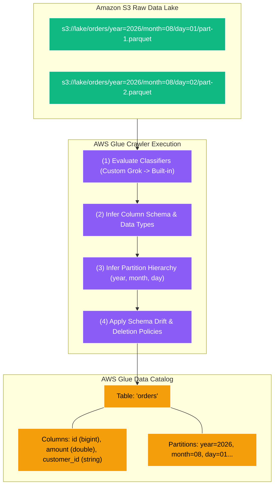
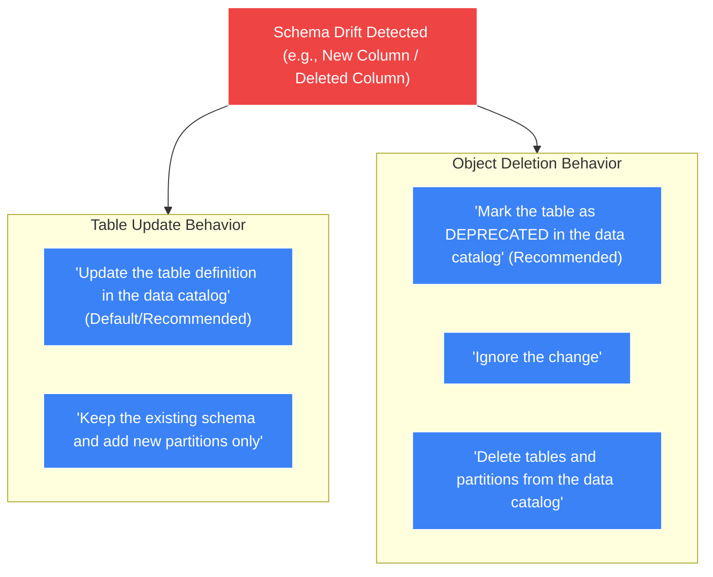

# 🕷️ AWS Glue Crawlers

- **Category**: Analytics / Automated Schema Discovery & Partition Management
- **Language / ဘာသာစကား**: [English (Original)](/en/02-services/analytics-streaming/glue/glue-crawlers) | **မြန်မာဘာသာ (Burmese)**
- **Primary Use Case / အဓိက အသုံးပြုမှု**: Schema များကို အလိုအလျောက် ရှာဖွေဖော်ထုတ်ခြင်း (Automatic schema inference)၊ Partition ခွဲခြားသတ်မှတ်ခြင်း (partition detection)၊ Schema ပြောင်းလဲမှုများကို ကိုင်တွယ်ခြင်း (schema drift handling) နှင့် Glue Data Catalog အတွင်းသို့ metadata များကို အလိုအလျောက် ဖြည့်သွင်းခြင်း။
- **Slide Reference**: Pages 331–364 in `[AWSCertifiedDataEngineerSlides.pdf](/docs/AWSCertifiedDataEngineerSlides.pdf)`
- **Hub Links**: `[[mm/index|index]]` | `[[mm/02-services/analytics-streaming/glue/glue|glue]]` | `[[mm/02-services/analytics-streaming/glue/glue-data-catalog|glue-data-catalog]]` | `[[mm/02-services/analytics-streaming/athena/athena|athena]]`

---

## 1. High-Level Summary (ခြုံငုံသုံးသပ်ချက်)

**AWS Glue Crawlers** များသည် Amazon S3, Amazon RDS, Amazon Aurora, Amazon DynamoDB, Amazon DocumentDB, Amazon Redshift နှင့် အခြား ပြင်ပ JDBC databases များတွင် သိမ်းဆည်းထားသော ဒေတာများကို အလိုအလျောက် စစ်ဆေးရှာဖွေပေးသည့် discovery agents များ ဖြစ်ကြသည်။

Crawler တစ်ခုသည် data store ထဲမှ sample file များကို ဖတ်ရှုပြီး ဒေတာ format နှင့် schema (column အမည်များနှင့် data types များ) ကို infer လုပ်ကာ၊ Hive-compatible partition hierarchies များကို ခွဲခြားသတ်မှတ်ပြီး **[[mm/02-services/analytics-streaming/glue/glue-data-catalog|glue-data-catalog]]** ထဲတွင် metadata table များကို အသစ်ဖန်တီးခြင်း သို့မဟုတ် update ပြုလုပ်ပေးခြင်းတို့ကို ဆောင်ရွက်သည်။



---

## 2. Core Capabilities & Mechanics (အဓိက စွမ်းဆောင်ရည်များနှင့် လုပ်ဆောင်ချက်များ)

### 1. Built-in vs. Custom Classifiers

**Classifier** တစ်ခုသည် data file တစ်ခုသည် သတ်မှတ်ထားသော format တစ်ခုခုနှင့် ကိုက်ညီမှုရှိမရှိ စစ်ဆေးပြီး schema ကို ထုတ်ယူပေးသည်။

```mermaid
graph LR
    InputData["Input Data File"] --> Step1{"(1) Custom Classifiers (Checked in Priority Order)"}
    Step1 -->|Match Found| SchemaOut["Generate Schema Definition"]
    Step1 -->|No Match| Step2{"(2) Built-in Classifiers (Checked in Fixed Order)"}
    Step2 -->|Match (Parquet, JSON, CSV...)| SchemaOut
    Step2 -->|No Match| Unknown["UNKNOWN_CLASSIFIER_EXCEPTION"]

    classDef eval fill:#3b82f6,stroke:#fff,stroke-width:1px,color:#fff;
    classDef res fill:#10b981,stroke:#fff,stroke-width:1px,color:#fff;
    classDef fail fill:#ef4444,stroke:#fff,stroke-width:1px,color:#fff;

    class Step1,Step2 eval;
    class SchemaOut res;
    class Unknown fail;
```

1. **Custom Classifiers (ဦးစားပေး အမြင့်ဆုံး - Highest Priority)**:
   - User သတ်မှတ်ထားသော ဦးစားပေး အစီအစဉ်အတိုင်း **ပထမဆုံး (first)** စစ်ဆေးသည်။
   - **Grok patterns**, XML paths သို့မဟုတ် custom CSV delimiters များကို အသုံးပြု၍ တည်ဆောက်သည်။
   - သီးသန့် proprietary log ဖိုင်များ (ဥပမာ- custom web server logs, syslog, mainframe formats) အတွက် အထူးသင့်လျော်သည်။
2. **Built-in Classifiers (အရန်အဖြစ် စစ်ဆေးခြင်း - Fallback)**:
   - Custom classifier များနှင့် မကိုက်ညီပါက စစ်ဆေးသည်။
   - **Apache Parquet, Apache ORC, Apache Avro, JSON, CSV, TSV, XML, နှင့် Common Log formats** များကို မူလအတိုင်း (native) ထောက်ပံ့ပေးသည်။

---

### 2. S3 Partition Detection Heuristics

Glue Crawlers များသည် S3 prefix paths များကို လေ့လာဆန်းစစ်ပြီး partition keys များကို အလိုအလျောက် ဆုံးဖြတ်ပေးသည်:

| S3 URI Pattern | Partition Detection ရလဒ် | မှတ်ချက် |
| :--- | :--- | :--- |
| `s3://bucket/orders/year=2026/month=08/data.parquet` | **Hive-style**: Partition columns များကို `year` နှင့် `month` ဟု အမည်ပေးသည်။ | **အကောင်းဆုံး နည်းလမ်း (Best Practice)**။ Key အမည်များကို တိကျစွာ ဖော်ပြထားသည်။ |
| `s3://bucket/orders/2026/08/data.parquet` | **Non-Hive style**: Partition columns များကို `partition_0` နှင့် `partition_1` ဟု အလိုအလျောက် အမည်ပေးသည်။ | Folder structures များသည် directory အားလုံးတွင် အတိအကျ တူညီမှသာ အလုပ်လုပ်သည်။ |
| `s3://bucket/orders/2026/08/data.parquet`<br>`s3://bucket/orders/2026/data.parquet` | **Inconsistent schemas**: Partitioned table တစ်ခုတည်း အစား **သီးခြား table နှစ်ခု (two separate tables)** အဖြစ် ဖန်တီးသွားနိုင်သည်။ | Folder depth နှင့် trailing slashes များကို တသမတ်တည်း တူညီအောင် ထားရှိခြင်းဖြင့် ဖြေရှင်းနိုင်သည်။ |

---

### 3. Handling Schema Evolution & Drift

Source schema များသည် အချိန်နှင့်အမျှ ပြောင်းလဲတတ်သည် (ဥပမာ- developer များက column အသစ်ထည့်ခြင်း၊ data types များ ပြောင်းလဲခြင်း သို့မဟုတ် field များကို ဖျက်ပစ်ခြင်း)။ Glue Crawlers များသည် schema drift ကို ကိုင်တွယ်ရန် အသေးစိတ် configuration policy များကို ထောက်ပံ့ပေးထားသည်:



#### Policy Configurations for DEA-C01:
- **Schema ပြောင်းလဲသည့်အခါ (When Schema Changes)**:
  - `Update the table definition in the data catalog`: Table metadata ထဲသို့ column အသစ်များကို အလိုအလျောက် ထည့်သွင်းပေးသည်။
  - `Keep the existing schema`: Column အသစ်များကို လျစ်လျူရှုပြီး ရှိပြီးသား table definition သို့ partition path အသစ်များကိုသာ ထည့်သွင်းပေးသည်။
- **S3 ရှိ Data များ ဖျက်လိုက်သည့်အခါ (When Data is Deleted in S3)**:
  - `Mark the table as DEPRECATED`: Metadata ကို catalog ထဲတွင် ဆက်လက်ထားရှိသော်လည်း deprecated အဖြစ် အမှတ်အသားပြုသည် (audit လုပ်ရန်အတွက် အလုံခြုံဆုံး ရွေးချယ်မှုဖြစ်သည်)။
  - `Ignore the change`: ဖိုင်များ ဖျက်လိုက်သော်လည်း catalog ကို မည်သို့မျှ မပြောင်းလဲပါ။
  - `Delete tables and partitions from the data catalog`: Metadata definition များကို ချက်ချင်း ဖျက်ပစ်သည် (ဖိုင်များကို မတော်တဆ ရွှေ့ပြောင်းမိပါက အန္တရာယ်ရှိနိုင်သည်)။

---

### 4. Incremental & Event-Driven Crawling

Multi-terabyte ပမာဏရှိသော data lake တစ်ခုလုံးကို သတ်မှတ်ချိန်တိုင်း crawl လုပ်ခြင်းသည် နှေးကွေးပြီး ကုန်ကျစရိတ် များပြားစေသည်။ AWS Glue သည် optimization ပြုလုပ်ရန် နည်းလမ်းနှစ်ခုကို ထောက်ပံ့ပေးသည်:

1. **Crawl New Sub-Folders Only (Sub-Folder အသစ်များကိုသာ Crawl လုပ်ခြင်း)**:
   - Crawler သည် ယခင်က scan ဖတ်ပြီးသား folder များ၏ internal commit log ကို မှတ်သားထားသည်။
   - နောက်တစ်ကြိမ် run သောအခါ **အသစ်ဖန်တီးထားသော S3 sub-folders များကိုသာ** စစ်ဆေးသဖြင့် runtime ကို သိသိသာသာ လျှော့ချပေးသည်။
2. **Event-Driven Crawlers (Amazon EventBridge + SQS)**:
   - S3 မှ `s3:ObjectCreated:*` events များကို **Amazon EventBridge** သို့ ပေးပို့သည်။
   - EventBridge က အဆိုပါ messages များကို **Amazon SQS Queue** သို့ လမ်းကြောင်းလွှဲပေးသည်။
   - Glue Crawler သည် SQS queue မှ ဖတ်ရှုပြီး event ဖြစ်ပေါ်စေခဲ့သော **သက်ဆိုင်ရာ သီးသန့် S3 objects များကိုသာ crawl ပြုလုပ်**သဖြင့် near-real-time schema updates ကို ရရှိစေသည်။

---

### 5. Exclude Patterns & IAM Permissions

- **Exclude Patterns**: မလိုအပ်သော ဖိုင်များကို crawler မဖတ်စေရန် glob expressions များကို သုံး၍ ကာကွယ်နိုင်သည်:
  - `**/*.tmp` (ယာယီ temporary ဖိုင်များကို ချန်လှပ်ရန်)
  - `**/*.crc` (checksum ဖိုင်များကို ချန်လှပ်ရန်)
  - `**/archive/**` (သိမ်းဆည်းထားပြီးဖြစ်သော historical partitions များကို ချန်လှပ်ရန်)
- **IAM Role လိုအပ်ချက်များ (IAM Role Requirements)**:
  - Crawler သည် `AWSGlueServiceRole` managed policy ပါဝင်သော IAM role တစ်ခု လိုအပ်သည်။
  - ပစ်မှတ် S3 bucket ARN (`arn:aws:s3:::my-bucket/*` နှင့် `arn:aws:s3:::my-bucket`) ပေါ်တွင် တိကျသော S3 permissions များဖြစ်သည့် `s3:GetObject` နှင့် `s3:ListBucket` လိုအပ်သည်။
  - အကယ်၍ ပစ်မှတ် S3 ဒေတာကို AWS KMS CMK ဖြင့် encrypt လုပ်ထားပါက ထို role တွင် သက်ဆိုင်ရာ KMS key အတွက် `kms:Decrypt` permission ပါရှိရမည်။

---

## 3. Troubleshooting & Common Failure Scenarios (ပြဿနာဖြေရှင်းခြင်းနှင့် အဖြစ်များသော အမှားများ)

| ပြဿနာ / လက္ခဏာ (Issue / Symptom) | ဖြစ်ရသည့် အကြောင်းရင်း (Root Cause) | DEA-C01 စာမေးပွဲအတွက် ဖြေရှင်းနည်း (Solution) |
| :--- | :--- | :--- |
| **Crawler ၏ status သည် 'SUCCEEDED' ဖြင့် ပြီးဆုံးသော်လည်း table တစ်ခုမှ မဖန်တီးခြင်း** | 1. `s3:GetObject` သို့မဟုတ် `s3:ListBucket` IAM permissions မရှိခြင်း။<br>2. S3 include path သည် folder အစား file တစ်ခုကို ညွှန်ပြနေခြင်း။<br>3. Exclude pattern က ဖိုင်အားလုံးနှင့် မတော်တဆ ကိုက်ညီသွားခြင်း။ | IAM role တွင် `s3:GetObject` ပါဝင်မှု ရှိမရှိ စစ်ဆေးပါ၊ S3 path format (`s3://my-bucket/dataset/`) မှန်ကန်မှု ရှိမရှိ စိစစ်ပါ။ |
| **Crawler သည် partitioned table တစ်ခုတည်း အစား သီးခြား table အများအပြား ဖန်တီးခြင်း** | 1. Folder hierarchy depth မတူညီခြင်း။<br>2. Partition folder များအကြား Schema မကိုက်ညီခြင်း (ဥပမာ- column type သည် `int` မှ `string` သို့ ပြောင်းသွားခြင်း)။ | Crawler configuration တွင် **"Create a single schema for each S3 path"** ကို သတ်မှတ်ပါ သို့မဟုတ် folder structure များကို တူညီအောင် ပြုလုပ်ပါ။ |
| **Athena queries များက အသစ်ထည့်ထားသော S3 partitions များကို မတွေ့ရခြင်း** | ဖိုင်အသစ်များ ရောက်လာပြီးနောက် Crawler မ run ရသေးခြင်း သို့မဟုတ် partition discovery မပါဘဲ table ကို manually ဖန်တီးထားခြင်း။ | Glue Crawler ကို schedule ဆွဲပါ၊ EventBridge/SQS ဖြင့် trigger လုပ်ပါ သို့မဟုတ် Athena တွင် `MSCK REPAIR TABLE` ကို run ပါ။ |
| **S3 ပေါ်တွင် Crawler run ရာတွင် နာရီပေါင်းများစွာ ကြာမြင့်နေခြင်း** | သေးငယ်သော ဖိုင်ပေါင်း သန်းချီကို scan ဖတ်နေရခြင်း သို့မဟုတ် bucket တစ်ခုလုံးကို အစမှ ပြန်လည် scan ဖတ်နေရခြင်း။ | **"Crawl new sub-folders only"** ကို ဖွင့်ပါ သို့မဟုတ် **SQS မှတစ်ဆင့် Event-driven crawling** ကို ပြင်ဆင်သတ်မှတ်ပါ။ |

---

## 4. DEA-C01 Exam Tips & Scenarios (စာမေးပွဲအတွက် အဓိက အချက်များ)

> [!IMPORTANT]
> **Key Exam Decision Triggers for Glue Crawlers**:
>
> - **"Automate the discovery of new partitions added to S3 daily without manual SQL intervention"** $\rightarrow$ **Schedule an AWS Glue Crawler**.
> - **"Source system added new columns; Athena queries must automatically reflect new fields"** $\rightarrow$ Crawler တွင် **"Update the table definition in the data catalog"** ကို Configure လုပ်ပါ။
> - **"Parse proprietary, non-standard server logs into the Glue Data Catalog"** $\rightarrow$ **Grok patterns ကိုသုံး၍ Custom Classifier** ဖန်တီးပြီး Crawler နှင့် တွဲဖက်ပါ။
> - **"Update the Data Catalog immediately when new files land in S3 with minimal compute cost"** $\rightarrow$ **Amazon S3 Event Notifications, EventBridge, နှင့် SQS ကိုသုံးသော Event-driven Glue Crawler** ကို အသုံးပြုပါ။
> - **"Prevent temporary or metadata files from polluting the Data Catalog"** $\rightarrow$ Crawler တွင် **Exclude Patterns** (`**/*.tmp`, `**/*.crc`) များကို ထည့်သွင်းပါ။

---

## 📌 ဆက်စပ် မှတ်စုများ (Related Notes)
- `[[mm/02-services/analytics-streaming/glue/glue|glue]]` — AWS Glue Overview
- `[[mm/02-services/analytics-streaming/glue/glue-data-catalog|glue-data-catalog]]` — Glue Data Catalog Metastore
- `[[mm/02-services/analytics-streaming/athena/athena|athena]]` — Querying Crawler-Generated Tables
- `[[mm/03-concepts/data-modeling-and-partitioning|data-modeling-and-partitioning]]` — S3 Partition Strategies
