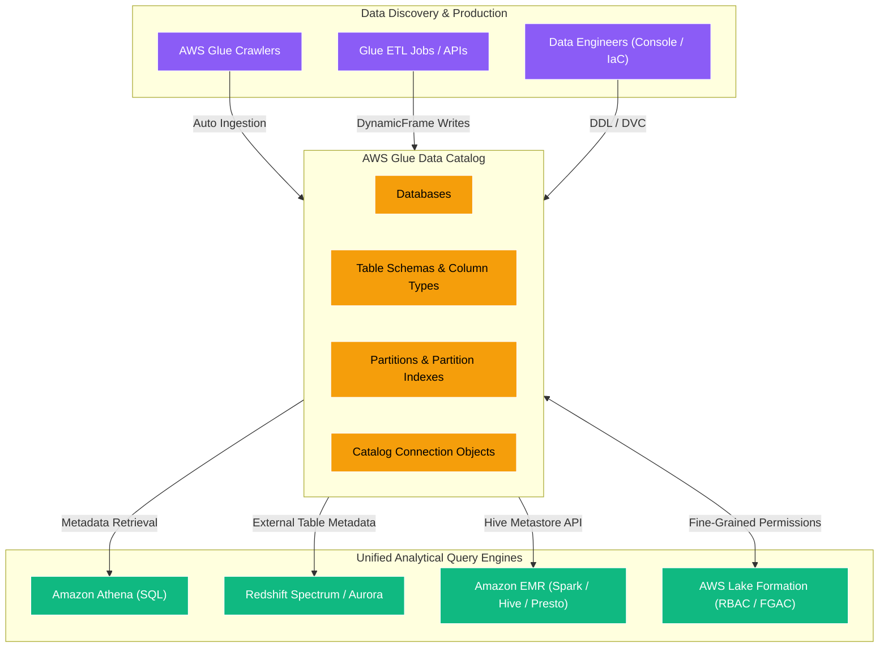
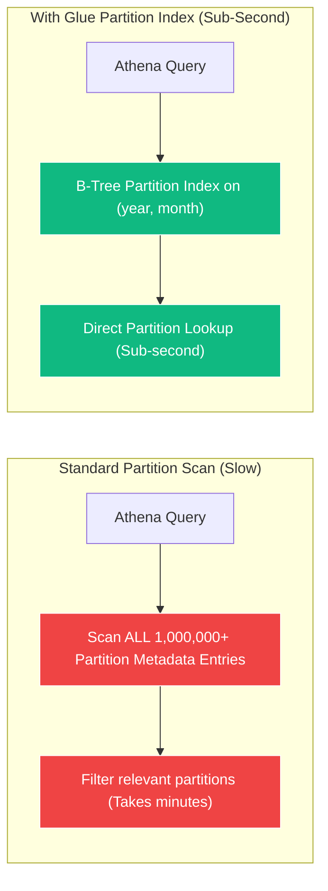
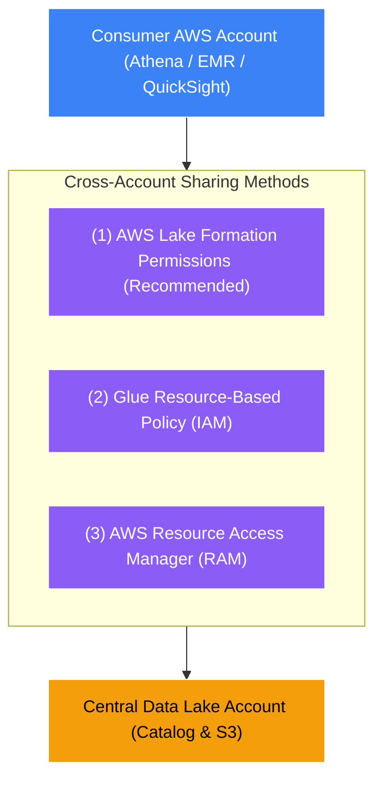

# 📖 AWS Glue Data Catalog

- **Category**: Analytics / Metadata Management & Governance
- **Language / ဘာသာစကား**: [English (Original)](/en/02-services/analytics-streaming/glue/glue-data-catalog) | **မြန်မာဘာသာ (Burmese)**
- **Primary Use Case**: S3 Data Lakes, Athena, EMR နှင့် Redshift Spectrum တို့အတွက် ဗဟိုပြု persistent Apache Hive-compatible metastore အဖြစ် အသုံးပြုခြင်း။
- **Slide Reference**: Pages 331–364 in `[AWSCertifiedDataEngineerSlides.pdf](/docs/AWSCertifiedDataEngineerSlides.pdf)`
- **Hub Links**: `[[mm/index]]` | `[[glue]]` | `[[athena]]` | `[[lake-formation]]` | `[[domain-2-data-store-management]]`

---

## ၁။ အကျဉ်းချုပ် (High-Level Summary)

**AWS Glue Data Catalog** သည် fully managed, serverless ဖြစ်ပြီး ဗဟို Apache Hive-compatible metastore တစ်ခုဖြစ်သည်။ ၎င်းသည် Amazon S3, Amazon RDS, Amazon Redshift, Amazon DynamoDB နှင့် ပြင်ပ JDBC sources များတွင် သိမ်းဆည်းထားသော ဒေတာများအတွက် structural နှင့် operational metadata များကို သိုလှောင်ထိန်းသိမ်းပေးသည်။

သီးသန့် EC2 instances သို့မဟုတ် Amazon EMR ပေါ်တွင် Apache Hive Metastore ကို ကိုယ်တိုင် run ပြီး ထိန်းသိမ်းစရာမလိုဘဲ Glue Data Catalog သည် AWS analytics ecosystem တစ်ခုလုံးအတွက် single source of truth (ဗဟိုအချက်အလက်ရင်းမြစ်) အဖြစ် အသုံးတော်ခံသည်။ Glue Data Catalog တွင် သတ်မှတ်ထားသော မည်သည့် schema ကိုမဆို **[[athena]]**, **[[emr]]**, **[[redshift]]** (Redshift Spectrum နှင့် federated queries များမှတစ်ဆင့်) နှင့် **AWS Glue ETL jobs** များက ချက်ချင်း query ပြုလုပ်နိုင်သည်။

---

## ၂။ အဓိက Architecture အစိတ်အပိုင်းများ (Core Architectural Components)

### 1. Catalog Hierarchy: Databases, Tables, and Partitions
- **Databases**: ဆက်စပ်နေသော table များကို စုစည်းထားသည့် logical namespaces များဖြစ်သည်။
- **Tables**: အောက်ခြေ data files များ၏ metadata ဖော်ပြချက်များဖြစ်သည်။ Table သည် အမှန်တကယ် data များကို သိမ်းဆည်းထားခြင်း **မရှိပါ** (does **not** store actual data)။ ၎င်းတွင် အောက်ပါတို့ကို သတ်မှတ်ဖော်ပြထားသည်-
  - **Storage Location**: S3 URI prefix (ဥပမာ- `s3://my-lake/curated/sales/`)။
  - **Classification / Format**: Serialization/Deserialization library (SerDe) များဖြစ်သည့် Apache Parquet, ORC, Avro, JSON သို့မဟုတ် CSV။
  - **Schema Definition**: Column names, data types (ဥပမာ- `string`, `bigint`, `struct`, `array`) နှင့် comments များ။
  - **Table Properties**: Key-value metadata pairs များ (ဥပမာ- compression format, skip header line counts)။
- **Partitions**: S3 ရှိ sub-directory folders များနှင့် ချိတ်ဆက်ထားသော keys များဖြစ်သည် (ဥပမာ- `year=2026/month=08/day=17/`)။ Partitions များသည် မသက်ဆိုင်သော directories များကို scan ဖတ်ခြင်းမှ ကျော်လွှားစေပြီး query engines များ၏ query execution ကို အလွန်အမင်း မြန်ဆန်စေသည်။

---

### 2. Partition Indexes နှင့် Partition Filtering

Data Lakes များသည် partition သန်းနှင့်ချီ ကြီးထွားလာသည်နှင့်အမျှ API calls များမှတစ်ဆင့် partition metadata များကို list လုပ်ခြင်းနှင့် စစ်ဆေးခြင်းသည် Amazon Athena နှင့် EMR တို့တွင် သိသာထင်ရှားသော query latency (နှောင့်နှေးကြန့်ကြာမှု) ကို ဖြစ်ပေါ်စေသည်။

#### Partition Indexes များ အလုပ်လုပ်ပုံ-
1. **Creation**: မိမိအနေဖြင့် သတ်မှတ်ထားသော partition keys များ (ဥပမာ- `year`, `month`, `customer_id`) ပေါ်တွင် partition index တစ်ခုကို တည်ဆောက်သည်။
2. **Indexing Mechanism**: AWS Glue သည် partition keys များပေါ်တွင် လျင်မြန်သော index တစ်ခုကို တည်ဆောက်ပေးသည်။
3. **Partition Filtering**: Athena SQL query တစ်ခုသည် `WHERE` clause (ဥပမာ- `WHERE year = '2026' AND month = '08'`) ဖြင့် run သောအခါ Athena သည် ကိုက်ညီသော partition metadata ကိုသာ တိုက်ရိုက်ဆွဲယူရန် index ကို အသုံးပြုပြီး query planning time ကို မိနစ်ပိုင်းမှ milliseconds အဆင့်သို့ လျှော့ချပေးသည်။
4. **Capacity**: Table တစ်ခုလျှင် **partition indexes ၃ ခုအထိ** (up to 3 partition indexes per table) တည်ဆောက်နိုင်သည်။

> [!TIP]
> **Partition Index နှင့် Partition Projection နှိုင်းယှဉ်ချက်**:
> - **Partition Index**: Glue Data Catalog တွင် တည်ဆောက်သည်။ Athena နှင့် EMR အတွက် catalog API မှ metadata ထုတ်ယူမှုကို မြန်ဆန်စေသည်။
> - **Partition Projection**: Athena table properties တွင် တိုက်ရိုက် configure လုပ်သည်။ Predefined ranges/regex များကို အသုံးပြုပြီး partition paths များကို သင်္ချာနည်းအရ တွက်ချက်ကာ Glue Data Catalog metadata lookups များကို လုံးဝ bypass လုပ်ကျော်လွှားသည်။

---

### 3. Cross-Account Data Catalog Sharing

ခေတ်မီ Data Mesh architectures များတွင် central governance account တစ်ခုက Data Catalog ကို ပိုင်ဆိုင်ထားပြီး consumer accounts များက Athena သို့မဟုတ် EMR queries များကို run လေ့ရှိသည်။

AWS သည် AWS accounts များအကြား Glue Data Catalog ကို မျှဝေရန် နည်းလမ်း ၃ သွယ်ကို ထောက်ပံ့ပေးထားသည်-

1. **AWS Lake Formation Cross-Account Grants (DEA-C01 အတွက် အကြံပြုထားသော နည်းလမ်း)**:
   - Lake Formation Tag-based access control (LF-TBAC) သို့မဟုတ် direct resource links များကို အသုံးပြုသည်။
   - ရှုပ်ထွေးသော IAM bucket policies များ မလိုအပ်ဘဲ cross-account users များအတွက် အသေးစိတ် column-level, row-level နှင့် cell-level filtering များကို ပံ့ပိုးပေးသည်။
2. **Glue Catalog Resource-Based Policy**:
   - Consumer account ID ထံမှ `glue:*` actions များကို ခွင့်ပြုရန် owner account ရှိ Data Catalog တွင် တိုက်ရိုက် ချိတ်ဆက်ထားသော JSON policy ဖြစ်သည်။
3. **S3 Bucket Policy လိုအပ်ချက်**:
   - Catalog ကို cross-account access ပေးရုံဖြင့် *metadata* ကိုသာ ဝင်ရောက်ခွင့်ရရှိမည်ဖြစ်သည်။ Consumer account သည် central account ၏ **S3 Bucket Policy** တွင်လည်း `s3:GetObject` permissions များ ရရှိထားရန် မဖြစ်မနေ လိုအပ်သည်။

---

### 4. Data Catalog အတွင်းရှိ Connection Objects

Data Catalog သည် ပြင်ပ data stores များအတွက် authentication နှင့် network settings များကို ထုပ်ပိုးသိမ်းဆည်းထားသော **Connection objects** များကိုလည်း သိမ်းဆည်းပေးသည်-

| Connection Type | Target Systems | Key Configuration Requirements |
| :--- | :--- | :--- |
| **JDBC** | Amazon RDS, Aurora, Amazon Redshift, PostgreSQL, MySQL, Oracle, SQL Server | JDBC URL, username, password (Secrets Manager တွင် သိမ်းဆည်းထားသော), VPC subnet, Security Group (self-referencing rule ပါရှိသော)။ |
| **Network** | Private VPC resources without credentials | VPC Subnet နှင့် Security Group။ Spark inter-node routing အတွက် အသုံးပြုသည်။ |
| **Kafka / Amazon MSK** | Apache Kafka, Amazon MSK | Bootstrap servers, SSL/SASL credentials, VPC configuration။ |
| **MongoDB / DocumentDB** | Amazon DocumentDB, MongoDB Atlas | Connection string, authentication database, SSL certificate။ |

---

### 5. Data Catalog Encryption နှင့် လုံခြုံရေး (Security)

**AWS Key Management Service (AWS KMS)** ကို အသုံးပြု၍ Glue Data Catalog metadata တစ်ခုလုံးကို encrypt ပြုလုပ်နိုင်သည်-
- **Metadata Encryption**: Catalog databases, tables, partition definitions နှင့် connection properties များကို AWS KMS Customer Managed Key (CMK) ဖြင့် at rest encryption ပြုလုပ်သည်။
- **Password Encryption for Connections**: JDBC connections များအတွင်း သိမ်းဆည်းထားသော passwords များကို AWS KMS keys များကို အသုံးပြု၍ အလိုအလျောက် encrypt ပြုလုပ်ပေးသည်။

---

## ၃။ DEA-C01 စာမေးပွဲ အဓိက အချက်အလက်များနှင့် မေးခွန်း Scenario များ (Exam Tips & Scenarios)

> [!IMPORTANT]
> **Glue Data Catalog အတွက် အဓိက စာမေးပွဲ စည်းမျဉ်းများ**:
>
> - **"Query planning in Athena takes too long on an S3 table with hundreds of thousands of partitions"** $\rightarrow$ **Glue Data Catalog တွင် Partition Index တစ်ခု တည်ဆောက်ပါ (Create a Partition Index in the Glue Data Catalog)**။
> - **"Centralized metastore replacement for Apache Hive on Amazon EMR"** $\rightarrow$ EMR ကို **AWS Glue Data Catalog အား ပြင်ပ Hive Metastore အဖြစ် အသုံးပြုရန်** configure လုပ်ပါ (`hive.metastore.client.factory.class` ကို Glue factory သို့ သတ်မှတ်ပါ)။
> - **"Cross-account users can see table schemas in Athena but get 'Access Denied' when executing the query"** $\rightarrow$ အသုံးပြုသူတွင် Data Catalog permissions ရှိသော်လည်း central account ၏ **S3 Bucket Policy** တွင် read permissions (`s3:GetObject`, `s3:ListBucket`) ပျောက်ဆုံးနေခြင်းကြောင့် ဖြစ်သည်။
> - **"Enforce column-level or row-level masking across multiple consumer accounts"** $\rightarrow$ **AWS Lake Formation** ကို အသုံးပြု၍ Glue Data Catalog permissions များကို စီမံခန့်ခွဲပါ။
> - **"Store database connection credentials securely for Glue ETL jobs"** $\rightarrow$ **AWS Secrets Manager** နှင့် ချိတ်ဆက်ထားသော **Glue Catalog JDBC Connection** တစ်ခု တည်ဆောက်ပါ။

---

## 📌 ဆက်စပ် မှတ်စုများ (Related Notes)
- `[[glue]]` — AWS Glue Architecture & Taxonomy
- `[[glue-crawlers]]` — Automating Data Catalog Schema Population
- `[[lake-formation]]` — Fine-Grained Access Control over Data Catalog
- `[[athena]]` — Querying Tables in the Glue Data Catalog
- `[[athena-performance]]` — Partition Projection vs. Partition Indexes
- `[[redshift]]` — Querying Glue Data Catalog tables with Redshift Spectrum
