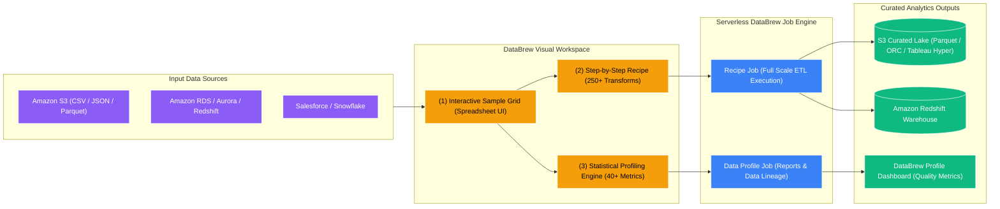

# ☕ AWS Glue DataBrew

- **Category**: Analytics / Visual No-Code Data Preparation & Profiling
- **Language / ဘာသာစကား**: [English (Original)](/en/02-services/analytics-streaming/glue/glue-databrew) | **မြန်မာဘာသာ (Burmese)**
- **Primary Use Case**: Analysts များနှင့် Data Scientists များအတွက် Visual၊ Zero-code Data Cleaning၊ Statistical Data Profiling၊ PII Masking နှင့် Data Normalization ပြုလုပ်ခြင်း။
- **Slide Reference**: Pages 331–364 in `[AWSCertifiedDataEngineerSlides.pdf](/docs/AWSCertifiedDataEngineerSlides.pdf)`
- **Hub Links**: `[[mm/index]]` | `[[glue]]` | `[[glue-studio]]` | `[[data-validation-and-profiling]]`

---

## 1. High-Level Summary

**AWS Glue DataBrew** သည် Data Analysts များ၊ Business Intelligence Developers များနှင့် Data Scientists များအနေဖြင့် Code တစ်ကြောင်းမှ ရေးစရာမလိုဘဲ ဒေတာများကို သန့်စင်ခြင်း (clean)၊ ပုံမှန်ဖြစ်အောင် ညှိယူခြင်း (normalize)၊ အချက်အလက် ဖြည့်ဆည်းခြင်း (enrich) နှင့် အသေးစိတ် အရည်အသွေး စစ်ဆေးသုံးသပ်ခြင်း (profile) တို့ကို ပြုလုပ်နိုင်စေသည့် Visual Data Preparation Tool တစ်ခုဖြစ်သည်။

၎င်းတွင် အသင့်သုံးနိုင်သော Built-in Transformations ပေါင်း **၂၅၀ ကျော် (250+ pre-built transformations)** ပါဝင်သည့် Spreadsheet ကဲ့သို့သော Interface ကို ထောက်ပံ့ပေးထားသည်။ DataBrew သည် နောက်ကွယ်ရှိ Compute Infrastructure များကို ကိုင်တွယ်ပေးထားသဖြင့် အသုံးပြုသူများသည် Sample Dataset ပေါ်တွင် Transformation "Recipe" တစ်ခုကို ဖန်တီးတည်ဆောက်နိုင်ပြီး၊ ထို့နောက် အဆိုပါ Recipe ကို Amazon S3၊ Amazon Redshift၊ Amazon RDS သို့မဟုတ် SaaS Applications များ (ဥပမာ- Salesforce၊ Snowflake) တွင် သိမ်းဆည်းထားသော Terabytes ချီသည့် ဒေတာများပေါ်တွင် Serverless Batch Job အနေဖြင့် Run နိုင်သည်။

---

## 2. Core Architectural Components

### 1. The DataBrew Workflow Hierarchy

| Component | Definition & Purpose | DEA-C01 Exam Context |
| :--- | :--- | :--- |
| **Dataset** | Data Source သို့ ညွှန်ပြသည့် Pointer တစ်ခုဖြစ်သည် (S3 files, Glue Data Catalog tables, RDS/Redshift connections)။ | Source Data Formats (CSV, JSON, Parquet, Excel) များနှင့် ချိတ်ဆက်သည်။ |
| **Project** | ဒေတာ၏ Sample (ပထမဆုံး N rows) ကို စစ်ဆေးကြည့်ရှုပြီး Transformation Steps များကို ရေးဆွဲဒီဇိုင်းထုတ်သည့် Interactive Visual Workspace ဖြစ်သည်။ | Analysts များ Recipe များကို မျက်စိဖြင့် ကြည့်၍ တည်ဆောက်ရန် အသုံးပြုသည်။ |
| **Recipe** | အစီအစဉ်တကျ စီထားသော Data Transformation ညွှန်ကြားချက်များ ဖြစ်သည် (ဥပမာ- Null များကို အစားထိုးခြင်း၊ Columns များကို ခွဲထုတ်ခြင်း၊ PII Mask ပြုလုပ်ခြင်း၊ ရက်စွဲ Format ပြောင်းခြင်း)။ | ပြန်လည်အသုံးပြုနိုင်ပြီး JSON/YAML အနေဖြင့် Export ထုတ်နိုင်သည်။ |
| **Recipe Job** | Recipe တစ်ခုကို **Multi-Terabyte Dataset တစ်ခုလုံး** ပေါ်သို့ သက်ရောက်စေပြီး သန့်စင်ပြီးသား ဒေတာများကို S3 သို့မဟုတ် Redshift သို့ ထုတ်ပေးသည့် Serverless Batch Job ဖြစ်သည်။ | Scale-out Batch Execution ဖြစ်သည်။ |
| **Profile Job** | Statistical Distributions များ၊ Anomaly Reports များနှင့် Data Quality Metrics များကို တွက်ချက်ရန် Dataset တစ်ခုလုံးကို အလိုအလျောက် ခွဲခြမ်းစိတ်ဖြာစစ်ဆေးပေးသည့် Job ဖြစ်သည်။ | Initial Data Discovery နှင့် Audit Reporting အတွက် အသုံးပြုသည်။ |

---

### 2. Statistical Data Profiling (Profile Jobs)

Dataset အသစ်တစ်ခုကို အကဲဖြတ်သည့်အခါ **DataBrew Profile Job** ကို Run ခြင်းဖြင့် Visual Dashboard တွင် ပြသပေးမည့် **Statistical Metrics ပေါင်း ၄၀ ကျော် (40+ statistical metrics)** ကို ထုတ်ပေးသည်-
- **Column Statistics**: Min, max, mean, median, standard deviation, variance။
- **Data Quality & Hygiene**: Missing/null count နှင့် percentage၊ duplicate values၊ distinct value counts၊ data type validity။
- **Distribution & Shape**: Value histograms၊ frequency distributions၊ outlier များကို ရှာဖွေဖော်ထုတ်ရန် box plots များ။
- **Correlation**: Machine Learning အတွက် Collinear Features များကို ဖော်ထုတ်ရန် Numerical Columns များကြားရှိ Correlation Matrix။

---

### 3. Pre-built Transformations & PII Masking

DataBrew သည် အသုံးများသော Data Wrangling လုပ်ငန်းစဉ်များကို ဖြေရှင်းရန် Built-in Operations ၂၅၀ ကျော်ကို ထောက်ပံ့ပေးထားသည်-
1. **PII Masking & Obfuscation**:
   - Credit card numbers၊ Social Security Numbers (SSN) သို့မဟုတ် Email addresses များကို Hashing၊ Deterministic Encryption သို့မဟုတ် Regex Masking (`****-****-****-1234`) အသုံးပြု၍ Mask ပြုလုပ်ခြင်း။
2. **Data Cleansing**:
   - Missing values များကို Mean, Median, Mode သို့မဟုတ် သတ်မှတ်ထားသော Custom Defaults များဖြင့် အစားထိုးဖြည့်သွင်းခြင်း။
   - Duplicate rows များကို ဖယ်ရှားခြင်းနှင့် Whitespace များကို ဖယ်ရှားသန့်စင်ခြင်း (strip whitespace)။
3. **Data Structuring**:
   - Pivot, unpivot, transpose ပြုလုပ်ခြင်း၊ Composite Columns များကို ခွဲထုတ်ခြင်း (ဥပမာ- `"First Last"` ကို `"First"` နှင့် `"Last"` အဖြစ် ခွဲထုတ်ခြင်း) နှင့် Columns များကို ပေါင်းစည်းခြင်း (merge columns)။
4. **Encoding & Categorical Features**:
   - Machine Learning ပြင်ဆင်မှုအတွက် One-hot encoding၊ Label encoding နှင့် Binned values များ ပြုလုပ်ခြင်း။

---

### 4. Comparison: DataBrew vs. Glue Studio vs. Glue ETL Jobs

| Feature | AWS Glue DataBrew | AWS Glue Studio | AWS Glue ETL Jobs |
| :--- | :--- | :--- | :--- |
| **Target User** | **Data Analysts / BI Users / Citizen Data Scientists** | **Data Engineers / ETL Developers** | **Data Engineers / Software Engineers** |
| **User Interface** | Visual Spreadsheet / Sample Grid | Visual DAG (Directed Acyclic Graph) | Script Editor / IDE / CLI |
| **Coding Requirement** | **Zero code (100% No-Code)** | Low-code (Visual with code preview) | Full Code (PySpark / Scala / Python) |
| **Output Artifact** | Reusable **DataBrew Recipes** | Generated **PySpark / Scala scripts** | Custom **Spark Application** |
| **Supported Outputs** | Parquet, ORC, CSV, JSON, Avro, **Tableau Hyper** | Any Spark target (S3, JDBC, Redshift, Iceberg) | Any Spark target, custom APIs |
| **Best For** | Ad-hoc cleaning, data profiling, PII masking, BI prep။ | Visual pipeline building နှင့် job monitoring။ | Complex joins, high-scale ETL, streaming, custom logic။ |

---

## 3. DEA-C01 Exam Tips & Scenarios

> [!IMPORTANT]
> **Key Exam Decision Triggers for Glue DataBrew**:
>
> - **"Empower business and data analysts to clean, transform, and normalize data without writing code"** $\rightarrow$ **AWS Glue DataBrew**။
> - **"Need visual statistical profiling to calculate missing values, distributions, and outliers across a multi-TB dataset"** $\rightarrow$ **AWS Glue DataBrew Profile Job** ကို Run ပါ။
> - **"Mask sensitive PII data (credit cards, SSNs) visually before sharing datasets with external teams"** $\rightarrow$ **Built-in PII masking transforms ပါဝင်သော AWS Glue DataBrew Recipes**။
> - **"Export prepared data directly into Tableau Hyper format for immediate BI consumption"** $\rightarrow$ **AWS Glue DataBrew Recipe Job**။
> - **"Apply a standardized set of 20 cleaning transformations across 50 different incoming datasets"** $\rightarrow$ **Reusable DataBrew Recipe** တစ်ခု ဖန်တီးပြီး Recipe Jobs အများအပြားသို့ ချိတ်ဆက်အသုံးပြုပါ။

---

## 📌 Related Notes
- `[[glue]]` — AWS Glue Architecture Overview
- `[[glue-studio]]` — Glue Studio Visual DAG Authoring
- `[[glue-etl-jobs]]` — Code-based Spark Transformations
- `[[data-validation-and-profiling]]` — Concept: Data Profiling vs. Validation
