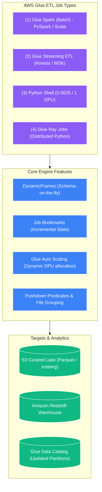
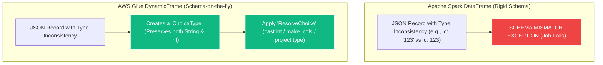
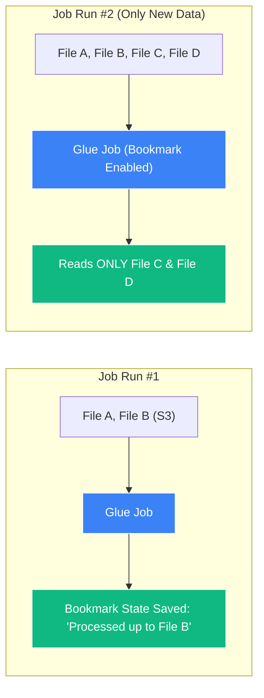
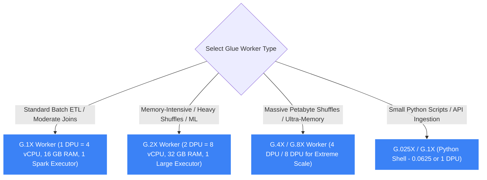

# ⚙️ AWS Glue ETL Jobs & DynamicFrames

- **Category**: Analytics / Distributed Serverless Processing
- **Language / ဘာသာစကား**: [English (Original)](/en/02-services/analytics-streaming/glue/glue-etl-jobs) | **မြန်မာဘာသာ (Burmese)**
- **Primary Use Case / အဓိက အသုံးပြုမှု**: Serverless Apache Spark & Python ETL၊ Job Bookmarks ဖြင့် incremental processing ပြုလုပ်ခြင်း၊ DynamicFrames ဖြင့် semi-structured data များကို ကိုင်တွယ်ခြင်းနှင့် performance tuning ပြုလုပ်ခြင်း။
- **Slide Reference**: Pages 331–364 in `[AWSCertifiedDataEngineerSlides.pdf](/docs/AWSCertifiedDataEngineerSlides.pdf)`
- **Hub Links**: `[[mm/index]]` | `[[glue]]` | `[[emr]]` | `[[domain-3-data-processing]]`

---

## 1. High-Level Summary (အကျဉ်းချုပ်)

**AWS Glue ETL Jobs** သည် data transformation script များကို fully managed ဖြစ်သော serverless Apache Spark (PySpark သို့မဟုတ် Scala) သို့မဟုတ် Python Shell environment တွင် execute ပြုလုပ်ပေးသည်။ 

Engineer များအနေဖြင့် EC2/EKS cluster များကို size သတ်မှတ်ခြင်း (sizing)၊ provision ပြုလုပ်ခြင်း၊ monitor လုပ်ခြင်းနှင့် scale ပြုလုပ်ခြင်းများ ပြုလုပ်ရသည့် **[[emr]]** နှင့်မတူဘဲ AWS Glue သည် cluster lifecycle management အားလုံးကို အလိုအလျောက် စီမံခန့်ခွဲပေးသည်။ Jobs များသည် လျင်မြန်စွာ စတင်နိုင်ပြီး အသုံးပြုသည့် **Data Processing Units (DPUs)** အရေအတွက်ပေါ် အခြေခံ၍ စက္ကန့်ပိုင်းအလိုက် တိကျစွာ ကောက်ခံပါသည် (1 DPU = 4 vCPUs နှင့် 16 GB of memory)။



---

## 2. Core Technical Concepts for DEA-C01 (DEA-C01 အတွက် အဓိက နည်းပညာဆိုင်ရာ သဘောတရားများ)

### 1. Glue DynamicFrames vs. Apache Spark DataFrames

Native Apache Spark သည် တင်းကျပ်ပြီး ကြိုတင်သတ်မှတ်ထားသော upfront schema လိုအပ်သည့် **DataFrames** များကို အသုံးပြုသော်လည်း AWS Glue တွင် **DynamicFrames** ကို မိတ်ဆက်ထားသည်။



#### Comparison Matrix:

| Feature (လုပ်ဆောင်ချက်) | Apache Spark DataFrame | AWS Glue DynamicFrame |
| :--- | :--- | :--- |
| **Schema Requirement** | Rigid ဖြစ်သည်၊ execute မလုပ်မီ ကြိုတင်သတ်မှတ်ထားရမည်။ | Dynamic ဖြစ်သည်၊ row တစ်ကြောင်းချင်းစီအလိုက် on the fly ဖော်ထုတ်တွက်ချက်ပေးသည်။ |
| **Inconsistent Types Handling** | Exception များ throw လုပ်သည် သို့မဟုတ် မကိုက်ညီသော တန်ဖိုးများကို `null` အဖြစ် ပြောင်းလဲပစ်သည်။ | တွေ့ရှိသမျှ variant အားလုံး ပါဝင်သော `ChoiceType` တစ်ခုကို ဖန်တီးပေးသည်။ |
| **Nested JSON Flattening** | `explode()` ဖြင့် ရှုပ်ထွေးသော recursive queries များ လိုအပ်သည်။ | Built-in `Relationalize` သို့မဟုတ် `Unnest` transforms များကို အသုံးပြုသည်။ |
| **Interoperability** | Native Spark API ဖြစ်သည်။ | `.toDF()` နှင့် `DynamicFrame.fromDF()` တို့ကို အသုံးပြု၍ အချိန်မရွေး ပြောင်းလဲနိုင်သည်။ |

---

### 2. Essential DynamicFrame Transforms (PySpark Code Snippets)

#### A. Reading Data from the Catalog
```python
import sys
from awsglue.transforms import *
from awsglue.utils import getResolvedOptions
from pyspark.context import SparkContext
from awsglue.context import GlueContext
from awsglue.job import Job

glueContext = GlueContext(SparkContext.getOrCreate())

# Read directly from Glue Data Catalog with Pushdown Predicate
datasource = glueContext.create_dynamic_frame.from_catalog(
    database="analytics_db",
    table_name="raw_orders",
    push_down_predicate="year == '2026' and month == '08'",
    transformation_ctx="datasource"
)
```

#### B. `ApplyMapping` (Renaming, Casting, and Dropping Columns)
```python
# Rename columns, change data types, or drop unmapped columns in one step
mapped_frame = ApplyMapping.apply(
    frame=datasource,
    mappings=[
        ("order_id", "string", "id", "long"),
        ("customer_name", "string", "customer", "string"),
        ("amount", "string", "order_total", "double"),
        ("temp_col", "string", None, None) # Dropped from target
    ],
    transformation_ctx="mapped_frame"
)
```

#### C. `ResolveChoice` (Resolving Conflicting Data Types)
Column တစ်ခုတွင် mixed types များ ပါဝင်နေသည့်အခါ (ဥပမာ- integer နှင့် string နှစ်မျိုးလုံး ရောနှောပါဝင်နေခြင်း) -
- `cast:target_type`: တန်ဖိုးအားလုံးကို သတ်မှတ်ထားသော type တစ်ခုသို့ အတင်းပြောင်းလဲစေသည် (force cast) (ဥပမာ- `cast:int`)။
- `make_cols`: Column ကို သီးခြား column နှစ်ခုအဖြစ် ခွဲထုတ်ပစ်သည် (ဥပမာ- `id_int` နှင့် `id_string`)။
- `project:type`: သတ်မှတ်ထားသော type ကိုသာ သိမ်းဆည်းထားပြီး ပဋိပက္ခဖြစ်နေသော ကျန်တန်ဖိုးများကို drop လုပ်သည် (ဖယ်ထုတ်သည်)။

```python
resolved_frame = ResolveChoice.apply(
    frame=mapped_frame,
    choice="cast:long",
    specs=[("id", "cast:long")],
    transformation_ctx="resolved_frame"
)
```

#### D. `Relationalize` (Flattening Complex Nested JSON)
- ရှုပ်ထွေးသော nested JSON/arrays များကို flat relational tables အများအပြားအဖြစ် ခွဲထုတ်ပေးသည်။
- Child tables များနှင့် ချိတ်ဆက်ပေးသော foreign key IDs များပါဝင်သည့် `root` table တစ်ခုကို ဖန်တီးပေးသည်။

```python
# Returns a DynamicFrameCollection containing 'root' and nested child tables
relationalized_tables = Relationalize.apply(
    frame=datasource,
    staging_path="s3://my-lake/staging/",
    name="orders_relational",
    transformation_ctx="relationalized_tables"
)
root_table = relationalized_tables.select("orders_relational")
```

---

### 3. Job Bookmarks (Incremental State Management)

**AWS Glue Job Bookmarks** သည် S3 bucket အတွင်းရှိ မည်သည့်ဖိုင်များ သို့မဟုတ် JDBC database အတွင်းရှိ မည်သည့် rows များကို ယခင် runs များတွင် လုပ်ဆောင်ပြီးဖြစ်ကြောင်း အလိုအလျောက် track လုပ်ထားပေးသည်။



#### Bookmark States for DEA-C01:
- **Enable (Default)**: State ကို ဆက်လက်ထိန်းသိမ်းထားပြီး နောက်ဆုံးအောင်မြင်ခဲ့သော run နောက်ပိုင်း အသစ်ရောက်ရှိလာသော ဒေတာများကိုသာ process လုပ်ပေးသည်။
- **Disable**: State ကို လျစ်လျူရှုသည်၊ အစမှစတင်၍ **dataset တစ်ခုလုံး** ကို ပြန်လည်ဖတ်ရှုပြီး ပြန်လည်လုပ်ဆောင် (reprocess) သည်။
- **Pause**: လက်ရှိ run အတွင်း အသစ်ရောက်ရှိလာသော ဒေတာများကိုသာ ဖတ်ရှုသော်လည်း ပြီးဆုံးချိန်တွင် state bookmark ကို update **မလုပ်ပါ** (debugging နှင့် dry-runs များအတွက် အသုံးဝင်သည်)။
- **Rewind**: သမိုင်းကြောင်းဆိုင်ရာ ဒေတာဟောင်းများကို ပြန်လည်လုပ်ဆောင်ရန်အတွက် bookmark state ကို ယခင် job run timestamp တစ်ခုသို့ ပြန်လည် reset လုပ်သည်။

---

### 4. Performance Tuning & Cost Optimization (Performance မြှင့်တင်ခြင်းနှင့် ကုန်ကျစရိတ် ချွေတာခြင်း)

| Optimization Technique | Implementation / Parameter | Impact on Performance & Cost |
| :--- | :--- | :--- |
| **Pushdown Predicates** | `from_catalog()` တွင် `push_down_predicate="year=='2026'"` | Spark memory ထဲသို့ files များကို မတင်မီ S3 partition prefixes များကို **Glue Catalog level** တွင် ကြိုတင်ဖြတ်ထုတ် (prune) ပေးသည်။ S3 GET requests များနှင့် I/O ကို သိသိသာသာ လျှော့ချပေးသည်။ |
| **Catalog Partition Predicates** | `catalogPartitionPredicate="year='2026'"` | Partition filtering ကို **Glue Catalog အတွင်း server-side** တွင် စစ်ထုတ်တွက်ချက်ပေးသဖြင့် partitions သန်းပေါင်းများစွာရှိသော tables များအတွက် query planning ကို မြန်ဆန်စေသည်။ |
| **File Grouping (Small Files)** | `additional_options={"groupFiles": "inPartition", "groupSize": "134217728"}` (128 MB) | သေးငယ်သော S3 files ထောင်ပေါင်းများစွာကို Spark task တစ်ခုစီအတွက် 128 MB in-memory chunks များအဖြစ် ပေါင်းစည်းပေးပြီး **Small File Problem** ကို ဖြေရှင်းပေးကာ executor out-of-memory (OOM) errors များကို ကာကွယ်ပေးသည်။ |
| **Glue Auto Scaling** | Job Details တွင် **Auto Scaling** ကို Enable လုပ်ပါ | Spark executor queue depth ပေါ် မူတည်၍ DPUs များကို dynamically provision လုပ်ခြင်းနှင့် decommission လုပ်ခြင်း ပြုလုပ်ပေးသည်။ Manual over-provisioning ကို ဖယ်ရှားပေးသည်။ |
| **Bounded Execution** | `boundedFiles=1000` သို့မဟုတ် `boundedSize=10737418240` | ကြာရှည်စွာ run သည့် timeouts များကို ကာကွယ်ရန်နှင့် memory ကို စီမံခန့်ခွဲရန် job run တစ်ခုစီအတွက် process လုပ်မည့် files အရေအတွက် သို့မဟုတ် bytes ပမာဏကို ကန့်သတ်ပေးသည်။ |

---

### 5. Worker Types & DPU Sizing (Capacity Planning)

1 DPU = **4 vCPUs** နှင့် **16 GB of memory** ဖြစ်သည်။ AWS Glue သည် အောက်ပါ worker configurations များကို ထောက်ပံ့ပေးသည်-



- **`G.1X`**: 1 DPU (4 vCPU, 16 GB RAM)။ Worker node တစ်ခုလျှင် Spark executor ၁ ခု သတ်မှတ်ပေးသည်။ အထွေထွေသုံး batch processing နှင့် standard transforms များအတွက် အကောင်းဆုံးဖြစ်သည်။
- **`G.2X`**: 2 DPU (8 vCPU, 32 GB RAM)။ Worker node တစ်ခုလျှင် ကြီးမားသော Spark executor ၁ ခု သတ်မှတ်ပေးသည်။ Memory အများအပြားလိုအပ်သော transformations များ၊ large skew joins များနှင့် ML transforms (`FindMatches`) များအတွက် အကြံပြုထားသည်။
- **`G.4X` / `G.8X`**: Worker တစ်ခုလျှင် 4 သို့မဟုတ် 8 DPUs။ Memory အလွန်အမင်း လိုအပ်သော workloads များနှင့် petabyte-scale data lakes များအတွက် သင့်လျော်သည်။
- **`G.025X` (Python Shell)**: 0.0625 DPU (1 vCPU, 256 MB RAM)။ Spark overhead မပါဘဲ lightweight Python scripts များကို run ရန်အတွက် အလွန်တရာ ကုန်ကျစရိတ် သက်သာသော option ဖြစ်သည်။

---

### 6. Glue Streaming ETL & Glue Ray Jobs

1. **Glue Streaming ETL**:
   - **Amazon Kinesis Data Streams**, **Amazon MSK (Apache Kafka)** သို့မဟုတ် EC2 ပေါ်ရှိ Apache Kafka တို့၏ အပေါ်တွင် streaming PySpark jobs များကို run ပေးသည်။
   - Windowing (tumbling နှင့် sliding windows) ဖြင့် စဉ်ဆက်မပြတ် micro-batches များအပေါ်တွင် လုပ်ဆောင်သည်။
   - Fault tolerance နှင့် exactly-once processing ကို အာမခံနိုင်ရန် S3 checkpointing ကို အသုံးပြုသည်။
2. **AWS Glue Ray Jobs**:
   - Serverless Glue backend ပေါ်တွင် **Ray open-source framework** ကို run ပေးသည်။
   - Spark paradigm နှင့် မကိုက်ညီသော distributed Python workloads များအတွက် ဒီဇိုင်းထုတ်ထားသည် (ဥပမာ- scikit-learn/PyTorch models များကို distributed training ပြုလုပ်ခြင်း၊ large-scale matrix operations များ သို့မဟုတ် distributed Pandas dataframes များ)။

---

## 3. DEA-C01 Exam Tips & Scenarios

> [!IMPORTANT]
> **Key Exam Decision Triggers for Glue ETL**:
>
> - **"Process nested, semi-structured JSON with changing schemas and conflicting data types without failing"** $\rightarrow$ **AWS Glue DynamicFrames ကို `ResolveChoice` ဖြင့် အသုံးပြုပါ**။
> - **"Flatten deeply nested JSON structures into relational tables with parent-child key relationships"** $\rightarrow$ **`Relationalize` transform ကို အသုံးပြုပါ**။
> - **"Process only newly arrived files in S3 without custom DynamoDB state tracking"** $\rightarrow$ **AWS Glue Job Bookmarks ကို Enable လုပ်ပါ**။
> - **"Job is failing with Out-of-Memory (OOM) errors during heavy shuffle/join operations"** $\rightarrow$ Worker type ကို **`G.1X` မှ `G.2X` သို့** ပြောင်းလဲပါ (executor တစ်ခုလျှင် 32 GB memory ရရှိသည်)။
> - **"Job is slow due to reading millions of small 10 KB files from S3"** $\rightarrow$ `groupFiles="inPartition"` နှင့် `groupSize="134217728"` (128 MB) ဖြင့် **S3 File Grouping** ကို Enable လုပ်ပါ/ဖွင့်ပါ။
> - **"Prune irrelevant S3 partitions before loading data into Spark memory"** $\rightarrow$ `from_catalog()` တွင် **`push_down_predicate`** ကို အသုံးပြုပါ။
> - **"Deduplicate records across two tables without a unique identifier using Machine Learning"** $\rightarrow$ **`FindMatches` ML transform** ကို အသုံးပြုပါ။
> - **"Run lightweight Python scripts without provisioning Spark workers"** $\rightarrow$ **`G.025X` workers ဖြင့် AWS Glue Python Shell ကို အသုံးပြုပါ**။

---

## 📌 Related Notes (ဆက်စပ် မှတ်စုများ)
- `[[glue]]` — AWS Glue Overview & Architecture
- `[[glue-data-catalog]]` — Glue Data Catalog Metastore
- `[[glue-flex]]` — Saving 35% on Batch ETL with Flex Execution
- `[[glue-data-quality]]` — Integrating Data Validation into Glue Jobs
- `[[emr]]` — Comparing Glue Serverless Spark vs. Amazon EMR Clusters
