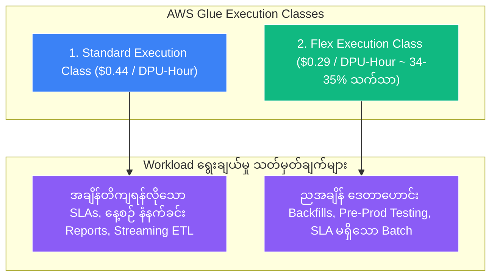

# 💰 AWS Glue Flex Execution Class

- **Category**: Analytics / Cost Optimization & Execution Classes
- **Language / ဘာသာစကား**: [English (Original)](/en/02-services/analytics-streaming/glue/glue-flex) | **မြန်မာဘာသာ (Burmese)**
- **Primary Use Case**: အချိန် အရေးမကြီးသော၊ သတ်မှတ်ချိန် deadline (SLA) မရှိသော data integration workload များအတွက် ကုန်ကျစရိတ်ကို အများအပြား (၃၅% အထိ) လျှော့ချရန်။
- **Slide Reference**: Pages 331–364 in `[[AWSCertifiedDataEngineerSlides.pdf]]`
- **Hub Links**: `[[mm/index]]` | `[[glue]]` | `[[glue-etl-jobs]]` | `[[cost-management]]`

---

## ၁။ အကျဉ်းချုပ် (High-Level Summary)

**AWS Glue Flex** (Flexible Execution Class) သည် AWS Glue ETL batch job များအတွက် Standard execution class နှင့် နှိုင်းယှဉ်ပါက compute ကုန်ကျစရိတ်ကို **၃၅% အထိ** လျှော့ချပေးနိုင်သော cost-optimized execution tier တစ်ခု ဖြစ်သည်။ 

သဘောတရားအရ **Amazon EC2 Spot Instances** များနှင့် ဆင်တူပြီး Glue Flex သည် AWS data center များအတွင်း အသုံးမပြုဘဲ ကျန်ရှိနေသော spare, non-critical compute capacity များကို အသုံးချပါသည်။ ကုန်ကျစရိတ် သိသာစွာ သက်သာခွင့်ရရှိသည့်အတွက် Flex class အောက်တွင် run သော job များသည် စတင်သည့်အချိန် (start time) အပြောင်းအလဲရှိနိုင်ပြီး ရွေးချယ်ထားသော AWS Region ရှိ capacity ရရှိနိုင်မှုအပေါ် မူတည်၍ execution time မှာလည်း အတက်အကျ ရှိနိုင်ပါသည်။

---

## ၂။ Standard vs. Flex Execution Class နှိုင်းယှဉ်ချက် (Standard vs. Flex Execution Class Comparison)

| Feature (အင်္ဂါရပ်) | Standard Execution Class | Flexible (Flex) Execution Class |
| :--- | :--- | :--- |
| **Pricing (စျေးနှုန်း)** | **$0.44 per DPU-Hour** (တစ်စက္ကန့်ချင်းအလိုက် တွက်ချက်သည်) | **$0.29 per DPU-Hour** (**၃၅% အထိ သက်သာသည်**) |
| **Start Time Predictability (စတင်ချိန် ခန့်မှန်းနိုင်မှု)** | **မြန်ဆန်ပြီး ခန့်မှန်းရ လွယ်ကူသည်** (Worker များကို ချက်ချင်း provision လုပ်ပေးသည်) | **အပြောင်းအလဲရှိနိုင်သည်** (Regional capacity မလုံလောက်ပါက နှောင့်နှေးနိုင်သည်) |
| **Execution Duration (ကြာမြင့်ချိန်)** | တသမတ်တည်းရှိပြီး တည်ငြိမ်သည် | Background resource balancing ပေါ်မူတည်၍ အတက်အကျ ရှိနိုင်သည် |
| **Job Interruption Risk (ရပ်တန့်သွားနိုင်ခြေ)** | အလွန်နည်းပါးသည် / မရှိသလောက်ဖြစ်သည် | **ဖြစ်နိုင်ခြေရှိသည်** (Standard demand များ မြင့်တက်လာပါက AWS မှ capacity ကို ပြန်လည်ရယူနိုင်သည်) |
| **Supported Worker Types (အသုံးပြုနိုင်သော Worker Types)** | `G.1X`, `G.2X`, `G.4X`, `G.8X`, `G.025X` (Python Shell) | `G.1X`, `G.2X` (Spark jobs များအတွက်သာ) |
| **Supported Job Types (အသုံးပြုနိုင်သော Job အမျိုးအစားများ)** | Spark Batch, Streaming ETL, Python Shell, Ray | **Spark Batch Jobs များအတွက်သာ** |
| **Best Suited Workloads (အသင့်တော်ဆုံး Workloads)** | အချိန်တိကျရန် လိုအပ်သော ETL၊ ဘဏ္ဍာရေးဆိုင်ရာ အစီရင်ခံစာများ၊ live streaming pipelines များ။ | Historical backfills များ၊ staging/testing ပတ်ဝန်းကျင်များ၊ ညအချိန် run သည့် အရေးမကြီးသော batch လုပ်ငန်းစဉ်များ။ |

---

## ၃။ DEA-C01 အတွက် ကုန်ကျစရိတ် တွက်ချက်မှု ဥပမာ (Cost Calculation Example for DEA-C01)

အဖွဲ့အစည်းတစ်ခုသည် **100 DPUs** အသုံးပြု၍ ၁၀ နာရီကြာမြင့်သော historical data backfill ETL job တစ်ခုကို run သည်ဟု ဆိုပါစို့-

$$\text{Standard Cost} = 100 \text{ DPUs} \times 10 \text{ Hours} \times \$0.44 = \$440.00$$

$$\text{Flex Cost} = 100 \text{ DPUs} \times 10 \text{ Hours} \times \$0.29 = \$290.00$$

$$\textbf{Total Savings} = \$440 - \$290 = \mathbf{\$150.00 \text{ (34.1\% Cost Reduction)}}$$

---

## ၄။ အကောင်းဆုံး လိုက်နာရန် နည်းလမ်းများနှင့် လမ်းညွှန်ချက်များ (Best Practices & Workload Guidelines)

### AWS Glue Flex ကို မည်သည့်အခါတွင် အသုံးပြုသင့်သနည်း (When to Use AWS Glue Flex):
1. **Historical Data Backfills**: ပြီးစီးမည့်အချိန် နံနက် ၂:၀၀ နာရီဖြစ်စေ၊ နံနက် ၃:၃၀ နာရီဖြစ်စေ စီးပွားရေးလုပ်ငန်းအပေါ် သက်ရောက်မှုမရှိသော လွန်ခဲ့သည့် ၅ နှစ်စာ log ဒေတာဟောင်းများကို ပြန်လည် process ပြုလုပ်သည့်အခါ။
2. **Development, Staging, and Testing**: Non-production AWS account များတွင် pipeline များကို စမ်းသပ် run သည့်အခါ။
3. **Non-Urgent Nightly Aggregations**: အပတ်စဉ် သို့မဟုတ် လစဉ် trend models များအတွက် raw telemetry သို့မဟုတ် clickstream ဒေတာများကို transform ပြုလုပ်သည့်အခါ။

### AWS Glue Flex ကို မည်သည့်အခါတွင် မသုံးသင့်သနည်း / စာမေးပွဲ အထောင်အချောက်များ (When NOT to Use AWS Glue Flex - Exam Traps):
1. **Strict SLA Workloads**: ဘဏ္ဍာရေးစျေးကွက်များ မဖွင့်မီ နံနက် ၇:၀၀ နာရီ တိတိတွင် အမှုဆောင်အရာရှိများ၏ dashboards များကို update ပြုလုပ်ရန် လိုအပ်ပါက **Standard execution ကို အသုံးပြုပါ**။
2. **Glue Streaming ETL**: Streaming jobs များသည် အဆက်မပြတ် dedicated compute လိုအပ်သောကြောင့် Flex ကို အသုံးပြု၍ မရပါ။
3. **Python Shell Jobs**: Python Shell jobs များသည် fractional DPUs (`G.025X` at $0.0625/DPU) ဖြင့် လုပ်ဆောင်ပြီးဖြစ်သောကြောင့် Flex ကို support မလုပ်ပါ။
4. **Interactive Notebooks / Data Previews**: Glue Studio interactive sessions များတွင် development လုပ်ဆောင်ရာတွင် ချက်ချင်း တုံ့ပြန်မှု (immediate responsiveness) လိုအပ်ပါသည်။

---

## ၅။ DEA-C01 စာမေးပွဲ အကြံပြုချက်များနှင့် မေးခွန်းပုံစံများ (DEA-C01 Exam Tips & Scenarios)

> [!IMPORTANT]
> **Glue Flex အတွက် စာမေးပွဲ ဆုံးဖြတ်ချက်ဆိုင်ရာ အဓိက သော့ချက်များ (Key Exam Decision Triggers)**:
>
> - **"A company wants to reduce the cost of nightly batch ETL jobs that have no strict completion deadlines"** $\rightarrow$ **Job execution class ကို AWS Glue Flex သို့ ပြောင်းလဲပါ (ကုန်ကျစရိတ် ~၃၅% သက်သာစေသည်)**။
> - **"Cost-optimize historical data backfills on terabytes of S3 data"** $\rightarrow$ **`G.1X` သို့မဟုတ် `G.2X` workers များနှင့်အတူ AWS Glue Flex Execution Class ကို အသုံးပြုပါ**။
> - **"A pipeline must finish within a 30-minute maintenance window every morning"** $\rightarrow$ **Glue Flex ကို လုံးဝ မသုံးပါနှင့်**; start time နှင့် runtime ကို တိကျသေချာစေရန် **Standard Execution Class** ကို အသုံးပြုပါ။
> - **"Can Glue Flex be used for Kinesis streaming ETL?"** $\rightarrow$ **မရပါ (No)**; Flex သည် batch Spark workloads များအတွက်သာ သီးသန့် ဖြစ်သည်။

---

## 📌 ဆက်စပ် မှတ်စုများ (Related Notes)
- `[[glue]]` — AWS Glue Architecture Overview
- `[[glue-etl-jobs]]` — AWS Glue Worker Types & Capacity Planning
- `[[cost-management]]` — AWS Analytics Cost Optimization Strategies
