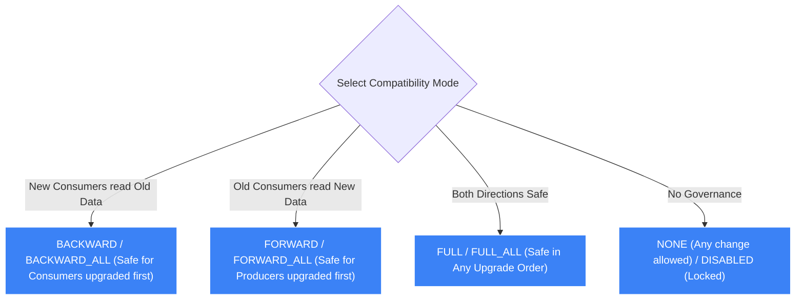

# 🧬 AWS Glue Schema Registry

- **Category**: Analytics / Streaming Schema Governance & Evolution
- **Language / ဘာသာစကား**: [English Version](/en/02-services/analytics-streaming/glue/glue-schema-registry) | **မြန်မာဘာသာ (Burmese)**
- **Primary Use Case**: Amazon MSK, Amazon Kinesis နှင့် Apache Flink တို့အတွက် event stream schemas များကို ဗဟိုမှ ရှာဖွေတွေ့ရှိခြင်း (discovery)၊ စစ်ဆေးအတည်ပြုခြင်း (validation) နှင့် စနစ်တကျ ထိန်းချုပ်ပြောင်းလဲခြင်း (controlled evolution) ပြုလုပ်ရန်။
- **Slide Reference**: Pages 331–364 in `[AWSCertifiedDataEngineerSlides.pdf](/docs/AWSCertifiedDataEngineerSlides.pdf)`
- **Hub Links**: `[[mm/index|index]]` | `[[mm/02-services/analytics-streaming/glue/glue|glue]]` | `[[mm/02-services/analytics-streaming/msk/msk|msk]]` | `[[mm/02-services/analytics-streaming/kinesis/kinesis|kinesis]]`

---

## 1. High-Level Summary

**AWS Glue Schema Registry** သည် streaming data applications များတစ်လျှောက် schemas များကို စစ်ဆေးအတည်ပြုခြင်း (validating)၊ ရှာဖွေဖော်ထုတ်ခြင်း (discovering) နှင့် စနစ်တကျ ပြောင်းလဲတိုးချဲ့ခြင်း (evolving) တို့အတွက် ဗဟို repository တစ်ခုကို ထောက်ပံ့ပေးသော AWS Glue ၏ serverless feature တစ်ခု ဖြစ်သည်။ 

**[[mm/02-services/analytics-streaming/msk/msk|msk]]**, **[[mm/02-services/analytics-streaming/kinesis/kinesis|kinesis]]** သို့မဟုတ် **Amazon Managed Service for Apache Flink** တို့ကို အသုံးပြု၍ distributed streaming architectures များကို တည်ဆောက်ရာတွင် သီးခြားစီဖြစ်နေသော producer နှင့် consumer အဖွဲ့များသည် တိကျသော data contract တစ်ခုကို လိုက်နာရမည်ဖြစ်သည်။ Glue Schema Registry သည် ဤ contract ကို producer level တွင် စတင်သတ်မှတ်ထိန်းချုပ် (enforce) ပေးပြီး ပုံစံမကျသော (malformed) သို့မဟုတ် စနစ်ကို ပျက်စီးစေနိုင်သော (breaking) schema အပြောင်းအလဲများသည် data streams များအတွင်းသို့ မရောက်ရှိအောင် တားဆီးပေးသည်။

```mermaid
graph LR
    subgraph Producers["(1) Streaming Producers"]
        JavaApp["Producer Application (Kafka / Kinesis SDK)"]
        Serializer["Glue Client-Side Serializer"]
        JavaApp --> Serializer
    end

    subgraph Governance["(2) AWS Glue Schema Registry"]
        Registry[("Central Schema Registry (Avro / JSON / Protobuf)")]
        Compatibility{"Compatibility Check Engine (BACKWARD / FULL)"}
        Registry <--> Compatibility
    end

    subgraph DataStream["(3) Streaming Transport"]
        KinesisStream[("Amazon Kinesis / Amazon MSK Stream")]
    end

    subgraph Consumers["(4) Streaming Consumers"]
        Deserializer["Glue Client-Side Deserializer"]
        ConsumerApp["Consumer Application (Spark / Flink / Lambda)"]
        Deserializer --> ConsumerApp
    end

    Serializer -->|1. Validate Schema & Fetch Schema ID| Registry
    Serializer -->|2. Send Payload + Schema ID (No Embedded Schema)| KinesisStream
    KinesisStream -->|3. Read Stream Record| Deserializer
    Deserializer -->|4. Fetch Cached Schema by ID| Registry

    classDef prod fill:#8b5cf6,stroke:#fff,stroke-width:1px,color:#fff;
    classDef reg fill:#f59e0b,stroke:#fff,stroke-width:1px,color:#000;
    classDef stream fill:#3b82f6,stroke:#fff,stroke-width:1px,color:#fff;
    classDef con fill:#10b981,stroke:#fff,stroke-width:1px,color:#fff;

    class JavaApp,Serializer prod;
    class Registry,Compatibility reg;
    class KinesisStream stream;
    class Deserializer,ConsumerApp con;
```

---

## 2. Core Capabilities & Mechanics

### 1. Supported Formats & Client-Side SerDe
- **Supported Formats**: **Apache Avro**, **JSON Schema**, နှင့် **Protocol Buffers (Protobuf)**။
- **Client-Side Validation**:
  - Validation လုပ်ငန်းစဉ်သည် producer ၏ client application အတွင်း open-source AWS Glue Serializers/Deserializers (SerDes) များကို အသုံးပြု၍ client-side ၌ ဖြစ်ပေါ်သည်။
  - အကယ်၍ producer ဘက်မှ မှတ်ပုံတင်ထားသော schema ကို ချိုးဖောက်သည့် message တစ်ခုကို ပေးပို့ရန် ကြိုးပမ်းပါက serialization library သည် client-side exception တစ်ခုကို ထုတ်ပေးပြီး **record သည် stream အတွင်းသို့ ဝင်ရောက်မသွားအောင် တားဆီးပိတ်ပင် (block)** လိုက်သည်။
- **Payload Compression & Bandwidth Reduction**:
  - JSON သို့မဟုတ် Avro message တိုင်းတွင် လေးလံသော schema definition အပြည့်အစုံကို ထည့်သွင်းပေးပို့မည့်အစား producer သည် data payload နှင့်အတူ သေးငယ်သော **16-byte Schema UUID** ကိုသာ ထည့်သွင်းပေးပို့သည်။
  - Consumers များသည် schema ကို registry ထံမှ တစ်ကြိမ်သာ ရယူပြီး local တွင် cache ပြုလုပ်ထားသဖြင့် network bandwidth နှင့် S3/Kinesis storage ကုန်ကျစရိတ်များကို သိသိသာသာ လျှော့ချပေးနိုင်သည်။

---

### 2. Schema Compatibility & Evolution Modes

Business လိုအပ်ချက်များ ပြောင်းလဲလာသည်နှင့်အမျှ developers များသည် downstream consumer applications များကို မထိခိုက်စေဘဲ schemas များကို update ပြုလုပ်ရမည်ဖြစ်သည်။ AWS Glue Schema Registry သည် တင်းကျပ်သော **Compatibility Modes** များကို သတ်မှတ်ထိန်းချုပ်ထားသည်-



#### Detailed Compatibility Rules for DEA-C01:

| Compatibility Mode | Definition & Meaning | Allowed Schema Changes | Recommended Upgrade Sequence |
| :--- | :--- | :--- | :--- |
| **`BACKWARD`** *(Default)* | **Schema version အသစ်** သည် **ယင်းမတိုင်မီ ကပ်လျက်ရှိသော schema version အဟောင်း** ဖြင့် ရေးသားထားသည့် data ကို ဖတ်ရှုနိုင်သည်။ | Default value ပါသော optional fields များကို ထည့်သွင်းခြင်း၊ required fields များကို ဖျက်ပစ်ခြင်း။ | **Consumers များကို အရင် upgrade လုပ်ပါ**၊ ထို့နောက်မှ Producers များကို upgrade လုပ်ပါ။ |
| **`BACKWARD_ALL`** | **Schema version အသစ်** သည် registry ထဲရှိ **ယခင် schema versions အားလုံး** ဖြင့် ရေးသားထားသည့် data ကို ဖတ်ရှုနိုင်သည်။ | Default value ပါသော optional fields များကို ထည့်သွင်းခြင်း၊ required fields များကို ဖျက်ပစ်ခြင်း။ | **Consumers များကို အရင် upgrade လုပ်ပါ**။ |
| **`FORWARD`** | **ယင်းမတိုင်မီ ကပ်လျက်ရှိသော schema version အဟောင်း** သည် **schema version အသစ်** ဖြင့် ရေးသားထားသည့် data ကို ဖတ်ရှုနိုင်သည်။ | Optional fields များကို ဖျက်ပစ်ခြင်း၊ default value ပါသော required fields များကို ထည့်သွင်းခြင်း။ | **Producers များကို အရင် upgrade လုပ်ပါ**၊ ထို့နောက်မှ Consumers များကို upgrade လုပ်ပါ။ |
| **`FORWARD_ALL`** | **ယခင် schema versions အားလုံး** သည် **schema version အသစ်** ဖြင့် ရေးသားထားသည့် data ကို ဖတ်ရှုနိုင်သည်။ | Optional fields များကို ဖျက်ပစ်ခြင်း၊ required fields များကို ထည့်သွင်းခြင်း။ | **Producers များကို အရင် upgrade လုပ်ပါ**။ |
| **`FULL`** | ကပ်လျက်ရှိသော version အဟောင်းနှင့် **`BACKWARD` ရော `FORWARD` ပါ** နှစ်ဖက်လုံး compatibility ဖြစ်သည်။ | **Optional fields များကိုသာ ထည့်ခြင်း သို့မဟုတ် ဖျက်ခြင်း** (အသစ်ထည့်သော/ဖျက်လိုက်သော fields အားလုံးတွင် default values များ ပါရှိရမည်)။ | **မည်သည့်အစီအစဉ်ဖြင့်မဆို** upgrade လုပ်နိုင်သည် (Producers သို့မဟုတ် Consumers မည်သူ့ကိုမဆို အရင် upgrade လုပ်နိုင်သည်)။ |
| **`FULL_ALL`** | မှတ်ပုံတင်ထားသော versions အားလုံးနှင့် **`BACKWARD_ALL` ရော `FORWARD_ALL` ပါ** နှစ်ဖက်လုံး compatibility ဖြစ်သည်။ | Default values ပါရှိသော **optional fields များကိုသာ ထည့်ခြင်း သို့မဟုတ် ဖျက်ခြင်း**။ | **မည်သည့်အစီအစဉ်ဖြင့်မဆို** upgrade လုပ်နိုင်သည်။ |
| **`NONE`** | မည်သည့် schema validation သို့မဟုတ် compatibility rules များကိုမျှ သတ်မှတ်ထိန်းချုပ်ထားခြင်း မရှိပါ။ | မည်သည့် ပြင်ဆင်ပြောင်းလဲမှုမဆို ပြုလုပ်နိုင်သည်။ | Production pipelines များအတွက် မလုံခြုံပါ။ (Unsafe) |
| **`DISABLED`** | Schema versions အသစ်များ မှတ်ပုံတင်ခြင်းကို တားဆီးထားသည်။ | မည်သည့်အပြောင်းအလဲမျှ မပြုလုပ်နိုင်ပါ (Schema ကို Lock ချထားသည်)။ | Stream တစ်ခုကို deprecate ပြုလုပ်ခြင်း သို့မဟုတ် ပိတ်သိမ်းခြင်း (sunsetting)။ |

---

### 3. Integration with AWS Analytics & Streaming Ecosystem

1. **Amazon MSK (Apache Kafka)**:
   - Custom Kafka Serializer plugins များမှတစ်ဆင့် Kafka Producers နှင့် Consumers များနှင့် natively ချိတ်ဆက်အလုပ်လုပ်သည်။
2. **Amazon Kinesis Data Streams**:
   - **Kinesis Producer Library (KPL)** နှင့် **Kinesis Client Library (KCL)** တို့နှင့် ချိတ်ဆက်အလုပ်လုပ်သည်။
3. **AWS Glue Streaming ETL**:
   - Glue streaming jobs များသည် Glue Schema Registry တွင် မှတ်ပုံတင်ထားသော schema ကို အသုံးပြု၍ messages များကို အလိုအလျောက် deserialize ပြုလုပ်နိုင်သည်။
4. **Apache Flink / Amazon Managed Service for Apache Flink**:
   - Real-time stream-processing pipelines များတွင် event streams များကို စစ်ဆေးအတည်ပြု (validate) ပေးသည်။

---

## 3. DEA-C01 Exam Tips & Scenarios

> [!IMPORTANT]
> **Key Exam Decision Triggers for Glue Schema Registry**:
>
> - **"Prevent invalid or malformed data structures from entering an Amazon MSK or Kinesis data stream"** $\rightarrow$ **AWS Glue Schema Registry**။
> - **"Ensure that streaming consumers can continue reading data after adding a new field to an Avro message"** $\rightarrow$ Glue Schema Registry တွင် **`BACKWARD` compatibility** ကို configure လုပ်ပြီး field အသစ်အတွက် **default value** သတ်မှတ်ပေးပါ။
> - **"Allow producers and consumers to be upgraded in any arbitrary order without breaking data pipelines"** $\rightarrow$ Compatibility mode ကို **`FULL` သို့မဟုတ် `FULL_ALL`** သို့ သတ်မှတ်ပါ။
> - **"Reduce network bandwidth and storage costs by removing redundant schema headers from every streaming message"** $\rightarrow$ 16-byte Schema ID ကိုသာ ပေးပို့နိုင်ရန် **AWS Glue Schema Registry client-side SerDes** ကို အသုံးပြုပါ။
> - **"Which formats are natively supported by AWS Glue Schema Registry?"** $\rightarrow$ **Apache Avro, JSON Schema, and Protocol Buffers (Protobuf)**။

---

## 📌 Related Notes
- `[[mm/02-services/analytics-streaming/glue/glue|glue]]` — AWS Glue Architecture Overview
- `[[mm/02-services/analytics-streaming/msk/msk|msk]]` — Amazon Managed Streaming for Apache Kafka
- `[[mm/02-services/analytics-streaming/kinesis/kinesis|kinesis]]` — Amazon Kinesis Data Streams
- `[[mm/02-services/analytics-streaming/glue/glue-data-catalog|glue-data-catalog]]` — Glue Metadata Catalog
