# 🎨 AWS Glue Studio

- **Category**: Analytics / Visual ETL Authoring & Monitoring
- **Language / ဘာသာစကား**: [English (Original)](/en/02-services/analytics-streaming/glue/glue-studio) | **မြန်မာဘာသာ (Burmese)**
- **Primary Use Case**: AWS Glue PySpark/Scala ETL jobs များနှင့် serverless Jupyter notebooks များကို visual drag-and-drop ဖြင့် ရေးဆွဲခြင်း (authoring)၊ run ခြင်း၊ စစ်ဆေးခြင်း (inspecting) နှင့် စောင့်ကြည့်စစ်ဆေးခြင်း (monitoring)။
- **Slide Reference**: Pages 331–364 in `[AWSCertifiedDataEngineerSlides.pdf](/docs/AWSCertifiedDataEngineerSlides.pdf)`
- **Hub Links**: `[[mm/index|index]]` | `[[mm/02-services/analytics-streaming/glue/glue|glue]]` | `[[mm/02-services/analytics-streaming/glue/glue-etl-jobs|glue-etl-jobs]]` | `[[mm/02-services/analytics-streaming/glue/glue-databrew|glue-databrew]]`

---

## 1. High-Level Summary (အကျဉ်းချုပ်)

**AWS Glue Studio** သည် AWS Glue ETL jobs များကို ဖန်တီးခြင်း၊ run ခြင်းနှင့် စောင့်ကြည့်စစ်ဆေးခြင်း (monitoring) တို့ကို လွယ်ကူရိုးရှင်းစေသည့် ထိုးထွင်းသိမြင်လွယ်သော graphical user interface (GUI) တစ်ခုကို ထောက်ပံ့ပေးသည်။ အင်ဂျင်နီယာများအနေဖြင့် PySpark သို့မဟုတ် Spark Scala code များကို အစမှအဆုံး ကိုယ်တိုင် manual ရေးသားရန် မလိုတော့ဘဲ visual **Directed Acyclic Graph (DAG)** ကို အသုံးပြု၍ data integration pipelines များကို ရေးဆွဲတည်ဆောက်နိုင်စေပါသည်။

Visual interface ထဲတွင် nodes များကို configure ပြုလုပ်သည့်အခါ Glue Studio သည် နောက်ကွယ်၌ production-ready ဖြစ်သော **Apache Spark code** ကို အလိုအလျောက် ထုတ်လုပ်ပေးပါသည်။ အင်ဂျင်နီယာများသည် ထွက်ပေါ်လာသော script ကို စစ်ဆေးခြင်း၊ ပြင်ဆင်မွမ်းမံခြင်း၊ custom Python/SQL snippets များ ထည့်သွင်းခြင်းနှင့် interactive **Data Previews** ကို အသုံးပြုကာ pipelines များကို real time debug ပြုလုပ်ခြင်းတို့ ဆောင်ရွက်နိုင်ပါသည်။

```mermaid
graph LR
    subgraph SourceNodes["(1) Source Nodes"]
        S3In["Amazon S3 (Catalog / Direct)"]
        RDSIn["Amazon RDS / JDBC"]
        KinesisIn["Kinesis / MSK Streaming"]
    end

    subgraph TransformNodes["(2) Transform Nodes (Visual DAG)"]
        ApplyMap["ApplyMapping (Rename / Cast)"]
        DropNull["Drop Null Fields / Filter"]
        JoinNode["Join / Aggregate / SQL Query"]
        DQNode["Glue Data Quality (DQDL Validation)"]
    end

    subgraph TargetNodes["(3) Target Nodes"]
        S3Out[("Amazon S3 (Parquet / Iceberg)")]
        RedshiftOut[("Amazon Redshift")]
        SnowflakeOut[("Snowflake / BigQuery")]
    end

    SourceNodes --> ApplyMap
    ApplyMap --> DropNull
    DropNull --> JoinNode
    JoinNode --> DQNode
    DQNode --> TargetNodes

    classDef src fill:#8b5cf6,stroke:#fff,stroke-width:1px,color:#fff;
    classDef trans fill:#3b82f6,stroke:#fff,stroke-width:1px,color:#fff;
    classDef tgt fill:#10b981,stroke:#fff,stroke-width:1px,color:#fff;

    class S3In,RDSIn,KinesisIn src;
    class ApplyMap,DropNull,JoinNode,DQNode trans;
    class S3Out,RedshiftOut,SnowflakeOut tgt;
```



---

## 2. Core Capabilities & Architectural Features (အဓိက စွမ်းဆောင်ရည်များနှင့် ဗိသုကာဆိုင်ရာ အင်္ဂါရပ်များ)

### 1. Visual DAG Job Authoring (Visual DAG ဖြင့် Job တည်ဆောက်ခြင်း)
- **အဓိက Node အမျိုးအစား ၃ မျိုး (Three Core Node Types)**:
  1. **Source Nodes**: Amazon S3 (Glue Data Catalog သို့မဟုတ် direct S3 path)၊ JDBC databases (RDS, Aurora, Redshift, PostgreSQL, Oracle)၊ DynamoDB၊ Kinesis သို့မဟုတ် MSK တို့မှ data များကို ရယူထည့်သွင်းခြင်း (Ingest) ပြုလုပ်နိုင်သည်။
  2. **Transform Nodes**: `ApplyMapping`၊ `Filter`၊ `Join`၊ `SplitFields`၊ `SelectFields`၊ `DropNullFields`၊ `Relationalize`၊ `Evaluate Data Quality` နှင့် `Custom SQL / Spark Code` အပါအဝင် built-in native visual transformations များကို အသုံးပြုနိုင်သည်။
  3. **Target Nodes**: Transform ပြုလုပ်ထားသော datasets များကို Amazon S3 (Parquet, ORC, Avro, CSV, JSON, Apache Iceberg, Delta Lake)၊ Amazon Redshift၊ DynamoDB သို့မဟုတ် external connectors များသို့ တိုက်ရိုက် ရေးသားသိမ်းဆည်းနိုင်သည်။
- **Code စစ်ဆေးခြင်းနှင့် ပြင်ဆင်သတ်မှတ်ခြင်း (Code Inspection & Customization)**: **Visual** tab၊ **Script** tab (အလိုအလျောက် ထုတ်ပေးထားသော PySpark/Scala code များကို စစ်ဆေးပြင်ဆင်ရန်) နှင့် **Job Details** tab (worker types, DPU ခွဲဝေမှုနှင့် timeouts များ configure ပြုလုပ်ရန်) တို့အကြား ချောမွေ့စွာ ကူးပြောင်းအသုံးပြုနိုင်သည်။

---

### 2. Live Data Preview (Interactive Debugging ပြုလုပ်ခြင်း)
- Job ဒီဇိုင်းရေးဆွဲနေစဉ်အတွင်း အင်ဂျင်နီယာများသည် graph ထဲရှိ မည်သည့် node တွင်မဆို **Data Preview** ကို ဖွင့်ထားနိုင်သည်။
- Glue Studio သည် source data မှ sample ဒေတာများကို ရယူကာ သက်ဆိုင်ရာ transformation ပြီးနောက် ထွက်ပေါ်လာမည့် exact schema နှင့် sample records များကို ပြသပေးသည့် lightweight interactive session တစ်ခုကို စတင်ပေးသည်။
- ၎င်းသည် developer များအနေဖြင့် batch job တစ်ခုလုံး အပြည့်အဝ execute ဖြစ်ရန် ၁၀ မှ မိနစ် ၂၀ အထိ စောင့်ဆိုင်းစရာမလိုဘဲ transformation logic bugs များ၊ column mismatch errors များနှင့် null values များကို ချက်ချင်းရှာဖွေ ပြင်ဆင်နိုင်စေပါသည်။

---

### 3. Custom Visual Transforms
- Senior data engineer များသည် ရှုပ်ထွေးသော custom PySpark logic များကို ပြန်လည်အသုံးပြုနိုင်သည့် **Custom Visual Transforms** များအဖြစ် ထုပ်ပိုး (package) ပြုလုပ်ထားနိုင်သည်။
- S3 သို့ upload တင်ပြီး register ပြုလုပ်ပြီးသည်နှင့် အဆိုပါ transforms များသည် Glue Studio palette တွင် native drag-and-drop nodes များအဖြစ် ပေါ်လာမည်ဖြစ်ကာ non-technical အဖွဲ့သားများအနေဖြင့် အဆင့်မြင့် business logic များကို ဘေးကင်းလုံခြုံစွာ အသုံးပြုနိုင်စေပါသည်။

---

### 4. Glue Studio Interactive Sessions & Jupyter Notebooks

Code-first ချဉ်းကပ်မှုကို ပိုမိုနှစ်သက်သော အင်ဂျင်နီယာများအတွက် Glue Studio သည် **Glue Interactive Sessions ဖြင့် မောင်းနှင်သော serverless Jupyter Notebooks** များကို ပံ့ပိုးပေးပါသည်-
- **လျင်မြန်စွာ စတင်နိုင်ခြင်း (Fast Startup)**: သမားရိုးကျ EMR clusters များကဲ့သို့ မိနစ်ပေါင်းများစွာ စောင့်ဆိုင်းရခြင်းမရှိဘဲ စက္ကန့်ပိုင်းအတွင်း စတင်အသုံးပြုနိုင်သည်။
- **ကုန်ကျစရိတ် သက်သာခြင်း (Cost Efficiency)**: Notebook cells များကို active run နေစဉ်အတွင်း DPU-seconds အတွက်သာ ပေးချေရမည်ဖြစ်ပြီး၊ အသုံးမပြုဘဲ idle ဖြစ်နေချိန်တွင် compute သည် အလိုအလျောက် scale down ဖြစ်သွားသည်။
- **တိုက်ရိုက် Magic Commands များ (Direct Magic Commands)**: Serverless backend ကို dynamically configure ပြုလုပ်ရန် `%glue_version`၊ `%idle_timeout` နှင့် `%number_of_workers` စသည့် magic commands များကို notebook cells များထဲတွင် တိုက်ရိုက် အသုံးပြုနိုင်သည်။

```python
# Example Glue Interactive Session Magic Commands
%idle_timeout 15
%number_of_workers 5
%worker_type G.1X
%glue_version 4.0

import sys
from awsglue.transforms import *
from awsglue.utils import getResolvedOptions
from pyspark.context import SparkContext
from awsglue.context import GlueContext

glueContext = GlueContext(SparkContext.getOrCreate())
df = glueContext.create_dynamic_frame.from_catalog(database="ecommerce", table_name="orders")
df.printSchema()
```

---

### 5. ဗဟိုချုပ်ကိုင်မှုရှိသော Job Monitoring Dashboard (Centralized Job Monitoring Dashboard)

Glue Studio တွင် AWS account တစ်ခုလုံးရှိ Glue ETL လုပ်ဆောင်ချက်အားလုံးကို စုစည်းစောင့်ကြည့်နိုင်သည့် လုပ်ငန်းသုံး **Monitoring Dashboard** ပါဝင်သည်-
- **Execution Overview**: စုစုပေါင်း job runs အရေအတွက်၊ success rate၊ failure rate နှင့် လက်ရှိ run နေဆဲ job များ။
- **Resource Utilization**: ETL ကုန်ကျစရိတ်များကို စောင့်ကြည့်ရန် အချိန်နှင့်အမျှ အသုံးပြုခဲ့သော စုစုပေါင်း DPU hours များ။
- **အသေးစိတ် Run Logs များ**: **Amazon CloudWatch Logs** နှင့် CloudWatch Metrics (CPU utilization, memory usage, executor queue depth) တို့နှင့် တိုက်ရိုက် ချိတ်ဆက်ထားခြင်း။

---

## 3. DEA-C01 စာမေးပွဲ အကြံပြုချက်များနှင့် အသုံးချမှု ပုံစံများ (Exam Tips & Scenarios)

> [!IMPORTANT]
> **Glue Studio အတွက် စာမေးပွဲ အဓိက ဆုံးဖြတ်ချက် Key Triggers များ (Key Exam Decision Triggers)**:
>
> - **"Author and monitor Apache Spark ETL jobs using a visual, drag-and-drop interface that automatically generates PySpark code"** $\rightarrow$ **AWS Glue Studio**။
> - **"Inspect transformed data row-by-row on sample records during pipeline development to catch errors early"** $\rightarrow$ **AWS Glue Studio Data Preview** ကို အသုံးပြုပါ။
> - **"Provide reusable custom Python transformations as visual nodes for junior developers to drop into their pipelines"** $\rightarrow$ **AWS Glue Studio Custom Visual Transforms** ကို ဖန်တီးပါ။
> - **"Run interactive PySpark exploration in a Jupyter notebook without provisioning an Amazon EMR cluster"** $\rightarrow$ **AWS Glue Studio Notebooks with Interactive Sessions**။
> - **"A central dashboard to monitor the status, duration, failure rates, and DPU spending of all Glue jobs across the account"** $\rightarrow$ **AWS Glue Studio Monitoring Dashboard**။

---

## 📌 ဆက်စပ် မှတ်စုများ (Related Notes)
- `[[mm/02-services/analytics-streaming/glue/glue|glue]]` — AWS Glue Architecture Overview
- `[[mm/02-services/analytics-streaming/glue/glue-etl-jobs|glue-etl-jobs]]` — Code-based AWS Glue ETL Jobs & DynamicFrames
- `[[mm/02-services/analytics-streaming/glue/glue-data-quality|glue-data-quality]]` — Visual Data Quality Nodes in Glue Studio
- `[[mm/02-services/analytics-streaming/glue/glue-databrew|glue-databrew]]` — Visual Data Preparation for Non-Technical Analysts
