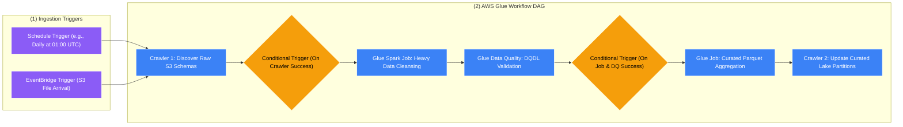

# 🛤️ AWS Glue Workflows

- **Category**: Analytics / Pipeline Orchestration
- **Language / ဘာသာစကား**: [English (Original)](/en/02-services/analytics-streaming/glue/glue-workflows) | **မြန်မာဘာသာ (Burmese)**
- **Primary Use Case**: dynamic parameter sharing ဖြင့် multi-step Glue Crawlers, Jobs နှင့် Triggers များကို native, serverless ပုံစံဖြင့် ချိတ်ဆက်စီမံခန့်ခွဲခြင်း (orchestration)။
- **Slide Reference**: Pages 331–364 in `[AWSCertifiedDataEngineerSlides.pdf](/docs/AWSCertifiedDataEngineerSlides.pdf)`
- **Hub Links**: `[[mm/index|index]]` | `[[mm/02-services/analytics-streaming/glue/glue|glue]]` | `[[mm/02-services/integration/step-functions/step-functions|step-functions]]` | `[[mm/02-services/integration/mwaa-airflow|mwaa-airflow]]`

---

## 1. High-Level Summary (အကျဉ်းချုပ် ခြုံငုံသုံးသပ်ချက်)

**AWS Glue Workflows** သည် **AWS Glue Crawlers, Jobs နှင့် Triggers** များဖြင့် ဖွဲ့စည်းထားသော အဆင့်များစွာပါဝင်သည့် extract, transform, and load (ETL) pipeline များကို ချိတ်ဆက်ညှိနှိုင်းရန်နှင့် စောင့်ကြည့်စစ်ဆေးရန် (coordinate and monitor) အထူးဖန်တီးထားသည့် fully managed orchestration service တစ်ခု ဖြစ်သည်။

AWS services အများအပြား (ဥပမာ AWS Lambda, Amazon EMR, Amazon ECS သို့မဟုတ် Amazon SNS စသည်တို့) ပါဝင်သော enterprise-wide workflows များကို များသောအားဖြင့် **[[mm/02-services/integration/step-functions/step-functions|step-functions]]** သို့မဟုတ် **[[mm/02-services/integration/mwaa-airflow|mwaa-airflow]]** ဖြင့် orchestrate လုပ်လေ့ရှိသော်လည်း **Glue Workflows** သည် AWS Glue ecosystem အတွက် သီးသန့်ရည်ရွယ်ထားသည့် ပေါ့ပါးပြီး zero-infrastructure ဖြစ်သော ဖြေရှင်းချက်တစ်ခုကို ပေးစွမ်းသည်။



---

## 2. Core Architectural Features (အဓိက ဗိသုကာဆိုင်ရာ လုပ်ဆောင်ချက်များ)

### 1. Trigger Types & Coordination Mechanics (Trigger အမျိုးအစားများနှင့် ပေါင်းစပ်ညှိနှိုင်းမှု စနစ်)

Workflows များသည် pipeline အဆင့်များတစ်လျှောက် လုပ်ဆောင်မှုများကို စတင်ရန်နှင့် synchronize ပြုလုပ်ရန် **Triggers** များကို အသုံးပြုသည်-

| Trigger Type | Firing Condition (စတင်မောင်းနှင်သည့် အခြေအနေ) | DEA-C01 Use Case |
| :--- | :--- | :--- |
| **Schedule-based** | Cron သို့မဟုတ် rate expression (ဥပမာ `cron(0 2 * * ? *)`)။ | ညစဉ် ပုံမှန် run သော recurring batch pipelines များ။ |
| **On-Demand** | AWS Console, AWS CLI သို့မဟုတ် SDK မှတစ်ဆင့် လူကိုယ်တိုင် (Manually) စတင်ခြင်း။ | Ad-hoc data backfills များနှင့် စမ်းသပ်စစ်ဆေးမှုများ။ |
| **Event-based** | **Amazon EventBridge event** တစ်ခု ဖြစ်ပေါ်သည့်အခါ (ဥပမာ S3 upload, API gateway) အလိုအလျောက် စတင်ခြင်း။ | Event-driven ဖြစ်သော near-real-time ingestion pipelines များ။ |
| **Conditional** | ရှေ့မှ run သည့် jobs/crawlers များ အားလုံး (**all**) သို့မဟုတ် တစ်ခုခု (**any**) သည် `SUCCEEDED`, `FAILED`, `STOPPED` သို့မဟုတ် `TIMEOUT` status ဖြင့် ပြီးဆုံးသည့်အခါ စတင်ခြင်း။ | Branching logic, failure handling နှင့် multi-job dependencies များ။ |

---

### 2. Workflow Run Properties (State Sharing Between Nodes / Node များအကြား State မျှဝေခြင်း)

Multi-stage pipeline တစ်ခုတွင် နောက်ပိုင်း အဆင့်ရှိ jobs များသည် upstream jobs များမှ ထွက်ပေါ်လာသော runtime context များကို မကြာခဏ လိုအပ်လေ့ရှိသည် (ဥပမာ Job 1 မှ တွက်ချက်ပေးလိုက်သော တိကျသည့် partition timestamp သို့မဟုတ် Crawler 1 မှ ရှာဖွေတွေ့ရှိသည့် S3 file count စသည်တို့)။

Glue Workflows သည် execution graph တစ်ခုလုံးတွင် ဆက်လက်တည်ရှိပြီး အသုံးပြုနိုင်သော **Workflow Run Properties** (key-value metadata pairs) များကို ထောက်ပံ့ပေးသည်-


#### Python (Boto3) Code Snippet for Workflow State Sharing:
```python
import boto3
import sys
from awsglue.utils import getResolvedOptions

# Glue Job arguments ထဲသို့ ပေးပို့ထားသော လက်ရှိ workflow run ID ကို ရယူခြင်း
args = getResolvedOptions(sys.argv, ['WORKFLOW_NAME', 'WORKFLOW_RUN_ID'])
workflow_name = args['WORKFLOW_NAME']
workflow_run_id = args['WORKFLOW_RUN_ID']

glue_client = boto3.client('glue')

# 1. Job A: dynamic runtime properties များကို workflow ထဲသို့ ထည့်သွင်းခြင်း
glue_client.put_workflow_run_properties(
    Name=workflow_name,
    RunId=workflow_run_id,
    RunProperties={'target_date': '2026-08-17', 'batch_id': 'B-90210'}
)

# 2. Job B: upstream jobs များမှ သတ်မှတ်ထားသော runtime properties များကို ပြန်လည်ရယူခြင်း
response = glue_client.get_workflow_run_properties(
    Name=workflow_name,
    RunId=workflow_run_id
)
current_date = response['RunProperties']['target_date']
print(f"Processing partition date: {current_date}")
```

---

### 3. Orchestration Tool Decision Matrix (Glue Workflows vs. Step Functions vs. MWAA)

မှန်ကန်သော orchestration tool ကို ရွေးချယ်ခြင်းသည် DEA-C01 စာမေးပွဲတွင် အများဆုံး မေးလေ့ရှိသော သဘောတရားများထဲမှ တစ်ခုဖြစ်သည်-

| Feature | AWS Glue Workflows | AWS Step Functions | Amazon MWAA (Apache Airflow) |
| :--- | :--- | :--- | :--- |
| **Primary Scope** | **AWS Glue components များ သီးသန့်သာ** (Crawlers, Jobs, Triggers)။ | **AWS Ecosystem တစ်ခုလုံး** (200+ services: Lambda, EMR, ECS, SNS, DynamoDB စသည်)။ | **Multi-Cloud & Hybrid Ecosystem** (Python DAGs, on-prem, multi-cloud)။ |
| **Complexity (ရှုပ်ထွေးမှု)** | ရိုးရှင်းပြီး linear ဖြစ်သော ETL pipelines များ။ | ရှုပ်ထွေးသော state machines များ၊ branching, loops, human-in-the-loop approvals များ။ | ရှုပ်ထွေးပြီး dynamic ဖြစ်သော data dependency graphs များ။ |
| **Infrastructure** | **Zero infrastructure** (Glue အတွင်း အသင့်ပါဝင်သည်)။ | **Serverless** (Pay per state transition)။ | **Managed Instances** (Airflow environments များကို provision လုပ်ရန် လိုအပ်သည်)။ |
| **Authoring (ရေးသားဖန်တီးပုံ)** | Visual console / JSON API။ | Amazon States Language (ASL) / Visual Studio။ | Pure Python Code (Airflow DAG files)။ |
| **Error Handling** | အခြေခံ conditional triggers များ (success/fail)။ | အဆင့်မြင့် `Retry` နှင့် `Catch` blocks များ (exponential backoff ပါဝင်သည်)။ | အဆင့်မြင့် task retries များ၊ custom failure callbacks များ။ |

---

## 3. DEA-C01 Exam Tips & Scenarios

> [!IMPORTANT]
> **Glue Workflows အတွက် အဓိက စာမေးပွဲ ဆုံးဖြတ်ချက် Triggers (Key Exam Decision Triggers)**:
>
> - **"Orchestrate a pipeline consisting solely of an S3 Glue Crawler followed by two Glue PySpark jobs without managing external infrastructure"** $\rightarrow$ **AWS Glue Workflows** ကို ရွေးချယ်ပါ။
> - **"Automatically trigger a Glue workflow when a new data manifest lands in S3"** $\rightarrow$ **Amazon S3 Event Notification $\rightarrow$ Amazon EventBridge $\rightarrow$ Glue Event Trigger** ကို အသုံးပြုပါ။
> - **"Pass dynamic partition dates generated in step 1 to downstream jobs in step 2"** $\rightarrow$ **AWS Glue Workflow Run Properties (`put_workflow_run_properties` / `get_workflow_run_properties`)** ကို အသုံးပြုပါ။
> - **"Orchestrate a pipeline that coordinates an AWS Batch job, an Amazon EMR cluster, an AWS Lambda function, and an Amazon SNS alert"** $\rightarrow$ *Glue Workflows ကို မသုံးပါနှင့်; **AWS Step Functions** ကို အသုံးပြုပါ*။
> - **"Data engineering team requires Python-based DAGs with hundreds of cross-cloud dependencies"** $\rightarrow$ **Amazon MWAA (Managed Apache Airflow)** ကို ရွေးချယ်ပါ။

---

## 📌 Related Notes (ဆက်စပ် မှတ်စုများ)
- `[[mm/02-services/analytics-streaming/glue/glue|glue]]` — AWS Glue Architecture Overview
- `[[mm/02-services/analytics-streaming/glue/glue-etl-jobs|glue-etl-jobs]]` — AWS Glue ETL Jobs & Transforms
- `[[mm/02-services/analytics-streaming/glue/glue-crawlers|glue-crawlers]]` — Automating Data Catalog Crawls
- `[[mm/02-services/integration/step-functions/step-functions|step-functions]]` — AWS Step Functions Enterprise Orchestration
- `[[mm/02-services/integration/mwaa-airflow|mwaa-airflow]]` — Amazon Managed Workflows for Apache Airflow
