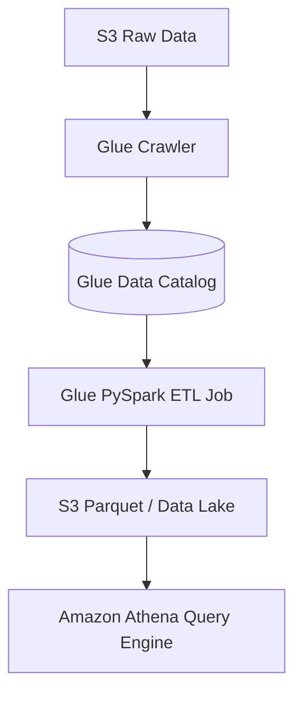

# 🧪 AWS Glue Overview (Serverless Data Integration & ETL)

- **Category**: Analytics / Data Pipelines
- **Language / ဘာသာစကား**: [English Version](/en/02-services/analytics-streaming/glue/glue) | **မြန်မာဘာသာ (Burmese)**
- **အဓိက အသုံးပြုမှု**: Serverless ETL၊ Data Cataloging၊ Schema Discovery နှင့် Data Quality စစ်ဆေးခြင်းများအတွက် အဓိက Data Pipeline ဝန်ဆောင်မှု။
- **Slide Reference**: Pages 331–364 in `[[AWSCertifiedDataEngineerSlides.pdf]]`
- **Hub Links**: `[[mm/index]]` | `[[en/index]]` | `[[domain-1-ingestion-and-processing]]`

---

## ၁။ အကျဉ်းချုပ် (High-Level Summary)

**AWS Glue** သည် Analytics, Machine Learning နှင့် Application Development များအတွက် ဒေတာများကို ပေါင်းစပ်ခြင်း၊ ပြင်ဆင်ခြင်းနှင့် ရှာဖွေခြင်းတို့ကို လွယ်ကူစွာ ပြုလုပ်နိုင်သော Serverless Data Integration ဝန်ဆောင်မှု ဖြစ်သည်။ ၎င်းတွင် အလိုအလျောက် Schema ရှာဖွေပေးသော Crawlers များနှင့် ဗဟို Apache Hive-compatible **Glue Data Catalog** ပါဝင်သည်။

Amazon EMR ကဲ့သို့ Infrastructure နှင့် Cluster များကို စီမံခန့်ခွဲရန် မလိုဘဲ Data Engineer များအနေဖြင့် Transformation Logic များ ရေးသားခြင်းကိုသာ အဓိကထား ဆောင်ရွက်နိုင်သည်။

---

## ၂။ အဓိက ပါဝင်သော အစိတ်အပိုင်းများ

AWS Glue တွင် DEA-C01 စာမေးပွဲအတွက် အရေးကြီးသော လုပ်ဆောင်ချက်များ ခွဲခြားထားပါသည်-

1. **[[glue-data-catalog]]**: S3, RDS စသည်တို့ရှိ ဒေတာများ၏ Metadata များကို ဗဟိုမှ သိမ်းဆည်းပေးပြီး Athena, EMR တို့နှင့် တိုက်ရိုက် ချိတ်ဆက်နိုင်သည်။
2. **[[glue-crawlers]]**: S3 သို့မဟုတ် Database များအတွင်းရှိ ဒေတာ Format, Schema နှင့် Partitions များကို အလိုအလျောက် ရှာဖွေဖော်ထုတ်ပေးသည်။
3. **[[glue-etl-jobs]]**: Apache Spark (PySpark/Scala) ကို အသုံးပြု၍ Serverless အနေဖြင့် ဒေတာပြောင်းလဲခြင်း (Transform) များကို လုပ်ဆောင်ပေးသည်။
4. **[[glue-data-quality]]**: PySpark Code ရေးစရာမလိုဘဲ DQDL rules များဖြင့် ဒေတာအရည်အသွေး (Data Quality) ကို အလိုအလျောက် စစ်ဆေးပေးသည်။
5. **[[glue-databrew]]**: Code ရေးစရာမလိုဘဲ Visual UI မှတစ်ဆင့် Data Preparation ကို လွယ်ကူစွာ ပြုလုပ်ပေးနိုင်သည်။

---

## ၃။ DEA-C01 စာမေးပွဲ အဓိက အချက်အလက်များ (Exam Tips)

> [!IMPORTANT]
> **Key Exam Trigger Keywords**:
> - **"Automatically discover new columns or schema drift in S3 datasets"** $\rightarrow$ **Glue Crawlers (`Update the table definition in the data catalog`)**.
> - **"Process only new or modified files in S3 without tracking them manually"** $\rightarrow$ **Glue Job Bookmarks**.
> - **"Empower data analysts to clean and normalize data visually without writing PySpark code"** $\rightarrow$ **AWS Glue DataBrew**.
> - **"Halt pipeline automatically if email completeness drops below 95%"** $\rightarrow$ **AWS Glue Data Quality (DQDL)**.

---

## 📌 ဆက်စပ် မှတ်စုများ (Related Notes)

- `[[glue-data-catalog]]` — Glue Data Catalog & Metastore
- `[[glue-crawlers]]` — Glue Crawlers & Schema Inference
- `[[glue-etl-jobs]]` — Glue ETL Jobs, DynamicFrames & Bookmarks
- `[[glue-data-quality]]` — AWS Glue Data Quality (DQDL)
- `[[glue-databrew]]` — AWS Glue DataBrew
- `[[athena]]` — Amazon Athena
- `[[emr]]` — Amazon EMR
