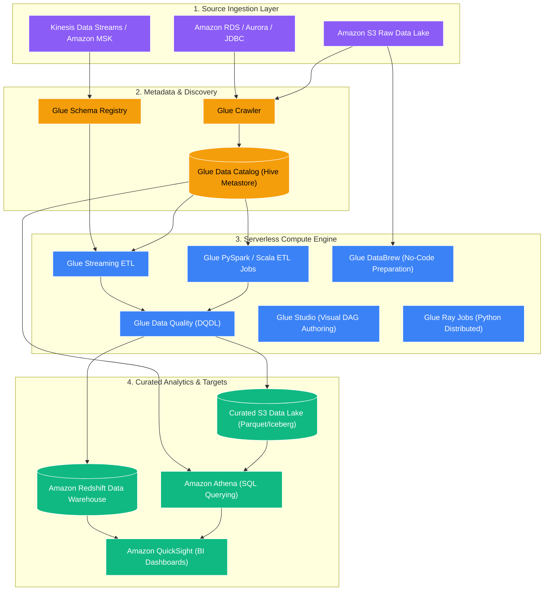
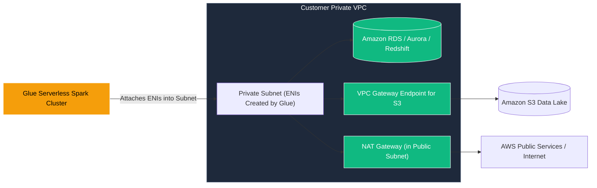

# 🧪 AWS Glue Overview (Serverless Data Integration & ETL)

- **Category**: Analytics / Data Pipelines
- **Language / ဘာသာစကား**: [English Version](/en/02-services/analytics-streaming/glue/glue) | **မြန်မာဘာသာ (Burmese)**
- **Primary Use Case / အဓိက အသုံးပြုမှု**: Serverless ETL၊ ဗဟိုချုပ်ကိုင်မှုရှိသော Metadata Management၊ အလိုအလျောက် Schema Discovery ပြုလုပ်ခြင်း၊ Data Quality Governance၊ Visual နှင့် Code အခြေပြု Data Preparation များ ဆောင်ရွက်ခြင်း။
- **Slide Reference**: Pages 331–364 in `[[AWSCertifiedDataEngineerSlides.pdf]]`
- **Hub Links**: `[[mm/index]]` | `[[service-catalog]]` | `[[domain-1-ingestion-and-processing]]` | `[[domain-3-data-processing]]`

---

## ၁။ အကျဉ်းချုပ် (High-Level Summary)

**AWS Glue** သည် Analytics၊ Machine Learning နှင့် Application Development တို့အတွက် ဒေတာများကို ရှာဖွေတွေ့ရှိခြင်း (discover)၊ ပြင်ဆင်ခြင်း (prepare)၊ အသွင်ပြောင်းလဲခြင်း (transform) နှင့် ပေါင်းစပ်ခြင်း (combine) တို့ကို လွယ်ကူချောမွေ့စွာ ပြုလုပ်နိုင်သော fully managed၊ event-driven ဖြစ်သည့် serverless data integration service တစ်ခုဖြစ်သည်။ ၎င်းသည် AWS Modern Data Architecture တစ်လျှောက်တွင် အခြေခံအကျဆုံး data pipeline engine အဖြစ် ဆောင်ရွက်ပေးသည်။

**[[emr]]** ကဲ့သို့ cluster-based framework များနှင့်မတူဘဲ AWS Glue သည် အောက်ခြေ compute infrastructure အားလုံးကို abstract လုပ်ထားပြီး စီမံခန့်ခွဲစရာမလိုအောင် ဖယ်ရှားပေးသည်။ ၎င်းသည် လိုအပ်သော compute resource များကို အလိုအလျောက် provision ပြုလုပ်ခြင်း၊ configure ချခြင်းနှင့် auto-scale လုပ်ဆောင်ခြင်းတို့ကို ဆောင်ရွက်ပေးပြီး၊ jobs များမှ အသုံးပြုသော **Data Processing Units (DPUs)** ပေါ်တွင်သာ တစ်စက္ကန့်ချင်းအလိုက် (per-second) တိကျစွာ ကုန်ကျစရိတ် ကောက်ခံပါသည် (1 DPU = 4 vCPUs နှင့် 16 GB memory)။

---

## ၂။ AWS Glue ဝန်ဆောင်မှု အမျိုးအစားခွဲခြားခြင်း (The AWS Glue Service Taxonomy)

AWS Glue သည် tool တစ်ခုတည်းသာ မဟုတ်ဘဲ ရည်ရွယ်ချက်အလိုက် သီးသန့်တည်ဆောက်ထားသော purpose-built services များစွာဖြင့် ဖွဲ့စည်းထားသည့် unified suite တစ်ခုဖြစ်သည်။ DEA-C01 စာမေးပွဲအတွက် အောက်ဖော်ပြပါ sub-features တစ်ခုချင်းစီကို ကျွမ်းကျင်စွာ သိရှိထားရန် လိုအပ်သည်-

| Component | Primary Function (အဓိက လုပ်ဆောင်ချက်) | Core Technology / Language | Detailed Note |
| :--- | :--- | :--- | :--- |
| **Glue Data Catalog** | Table definitions၊ partitions၊ schema versions များနှင့် connections များအတွက် ဗဟို Apache Hive-compatible metastore ဖြစ်သည်။ | Apache Hive Metastore API | `[[glue-data-catalog]]` |
| **Glue Crawlers** | Schema များကို တွက်ဆဖော်ထုတ်ရန်၊ partition များကို သိရှိရှာဖွေရန်နှင့် catalog ကို update လုပ်ရန် Data stores များ (S3, JDBC, DynamoDB) ကို အလိုအလျောက် scan ဖတ်ပေးသော scanner ဖြစ်သည်။ | Classifiers (Grok / Built-in) | `[[glue-crawlers]]` |
| **Glue ETL Jobs** | Built-in DynamicFrames နှင့် state management ပါဝင်သော Serverless batch နှင့် streaming data transformation engine ဖြစ်သည်။ | PySpark, Spark Scala, Python Shell | `[[glue-etl-jobs]]` |
| **Glue Data Quality** | Data health ကို တိုင်းတာရန်၊ job များကို fail ဖြစ်စေရန် သို့မဟုတ် မမှန်ကန်သော bad records များကို သီးခြားခွဲထုတ်ရန် (quarantine) DQDL rulesets များကို အသုံးပြုသည့် Declarative data validation framework ဖြစ်သည်။ | DQDL (Data Quality Definition Lang) | `[[glue-data-quality]]` |
| **Glue DataBrew** | Business analysts များနှင့် data scientists များအတွက် 250+ pre-built transformations များပါဝင်သော Visual, spreadsheet ပုံစံ data preparation tool ဖြစ်သည်။ | Visual UI / Recipe Engine | `[[glue-databrew]]` |
| **Glue Studio** | Code ရေးစရာမလိုဘဲ Spark ETL jobs များကို ရေးဆွဲခြင်း၊ run ခြင်း၊ စစ်ဆေးခြင်းနှင့် စောင့်ကြည့်ခြင်းတို့ ပြုလုပ်နိုင်သည့် Visual drag-and-drop DAG interface ဖြစ်သည်။ | Visual GUI / Auto-generated Spark | `[[glue-studio]]` |
| **Glue Flex Execution** | အချိန်နှင့် တပြေးညီ လုပ်ဆောင်ရန် မလိုအပ်သော (non-time-sensitive)၊ non-SLA batch jobs များအတွက် 35% အထိ ကုန်ကျစရိတ် သက်သာစေသော execution class ဖြစ်သည်။ | Spot-like compute capacity | `[[glue-flex]]` |
| **Glue Workflows** | အဆင့်ဆင့်ပါဝင်သော Glue pipelines များ (Triggers, Crawlers, and Jobs) ကို visual DAGs အနေဖြင့် စီမံခန့်ခွဲရန် သီးသန့်တည်ဆောက်ထားသော orchestration service ဖြစ်သည်။ | Native Glue Orchestration | `[[glue-workflows]]` |
| **Glue Schema Registry** | Real time တွင် message structure များကို validate လုပ်ပေးပြီး evolve ဖြစ်စေသည့် ဗဟိုချုပ်ကိုင်မှုရှိသော streaming schema governance ဖြစ်သည်။ | Apache Avro, JSON Schema, Protobuf | `[[glue-schema-registry]]` |

---

## ၃။ အရေးကြီးသော Architecture နှင့် စာမေးပွဲဆိုင်ရာ အသေးစိတ် လေ့လာချက်များ (Critical Architectural & Exam Deep Dives)

### 1. VPC Networking & Private Connectivity

Glue job သို့မဟုတ် crawler သည် private Amazon VPC အတွင်းရှိ resources များ (ဥပမာ- Amazon RDS, Amazon Redshift, Amazon MSK သို့မဟုတ် Direct Connect/VPN မှတစ်ဆင့် on-premises databases များ) ကို ဝင်ရောက်အသုံးပြုရန် လိုအပ်သည့်အခါ **AWS Glue Connection** တစ်ခုကို configure ပြုလုပ်ပေးရမည်-

#### DEA-C01 အတွက် အဓိက Networking စည်းမျဉ်းများ (Key Networking Rules):
1. **Self-Referencing Security Group**: Glue Connection တွင် တွဲဖက်ထားသော security group တွင် ၎င်းကိုယ်တိုင်ထံမှ TCP traffic အားလုံးကို ခွင့်ပြုသည့် **self-referencing inbound rule** (Source = Security Group ID) ပါဝင်ရပါမည်။ ၎င်းသည် shuffle နှင့် broadcast operations များ လုပ်ဆောင်နေစဉ်အတွင်း Glue Spark worker nodes အချင်းချင်း ဆက်သွယ်နိုင်ရန် မဖြစ်မနေ လိုအပ်ပါသည်။
2. **S3 Gateway VPC Endpoint**: Glue သည် internet access မရှိသော private VPC subnet အတွင်း run သည့်အခါ ထို subnet ၏ route table တွင် ချိတ်ဆက်ထားသော **Gateway VPC Endpoint for Amazon S3** မရှိပါက Amazon S3 နှင့် ဆက်သွယ်နိုင်မည် မဟုတ်ပါ။
3. **Public Internet Access**: VPC အတွင်း run နေစဉ်အတွင်း external APIs သို့မဟုတ် public endpoints များသို့ job က ချိတ်ဆက်ရန် လိုအပ်ပါက subnet route table သည် `0.0.0.0/0` traffic ကို public subnet တွင် ရှိသော **NAT Gateway** သို့ route လုပ်ပေးရပါမည်။
4. **Subnet IP Sizing**: Private subnet တွင် လုံလောက်သော private IP addresses များ ရှိစေရန် သေချာပါစေ။ အဘယ်ကြောင့်ဆိုသော် Glue worker တစ်ခုစီသည် Elastic Network Interface (ENI) တစ်ခုနှင့် IP address တစ်ခုကို အသုံးပြုသောကြောင့် ဖြစ်သည်။

---

### 2. Security Configurations & Data Protection

AWS Glue သည် ETL lifecycle တစ်ခုလုံးတွင် encryption စနစ်များကို သတ်မှတ်နိုင်ရန် **Security Configurations** ကို ပံ့ပိုးပေးထားသည်-

| Layer | Encryption Options | Scope |
| :--- | :--- | :--- |
| **S3 Data at Rest** | SSE-S3 သို့မဟုတ် SSE-KMS (Customer Managed Key) | Input data၊ transformed output data နှင့် temporary scratch buckets များ။ |
| **Glue Data Catalog Metadata** | AWS KMS Key | Catalog table definitions၊ column metadata နှင့် connection credentials များကို encrypt လုပ်ပေးသည်။ |
| **CloudWatch Logs** | AWS KMS Key | PySpark နှင့် Python Shell jobs များမှ ထွက်ရှိလာသော log streams များကို encrypt လုပ်ပေးသည်။ |
| **Job Bookmarks** | AWS KMS Key | S3 တွင် သိမ်းဆည်းထားသော incremental state files များကို encrypt လုပ်ပေးသည်။ |
| **Local Disk (Shuffle Storage)** | AWS KMS Key သို့မဟုတ် OS-level encryption | Worker nodes များရှိ local NVMe storage တွင် ယာယီရေးသားထားသော intermediate shuffle data များကို encrypt လုပ်ပေးသည်။ |
| **Data in Transit** | TLS 1.2+ | Node အချင်းချင်း Spark ဆက်သွယ်မှုများနှင့် API calls များကို encrypt လုပ်ပေးသည်။ |

---

### 3. Compute Service Decision Matrix (Glue vs. EMR vs. Athena vs. Batch)

| Feature | AWS Glue | Amazon EMR | Amazon Athena | AWS Batch |
| :--- | :--- | :--- | :--- | :--- |
| **Compute Model** | **Serverless Spark / Python** | **Managed Clusters (EC2 / EKS / Serverless)** | **Serverless Presto / Trino** | **Containerized Batch (EC2 / Fargate)** |
| **Primary Use Case** | Scheduled ETL၊ event-driven pipelines၊ streaming ETL၊ metadata management။ | Petabyte-scale big data၊ custom Spark/Hadoop/Presto/Flink clusters၊ ရေရှည် run ရသော persistent analytics။ | S3 data lakes ပေါ်တွင် တိုက်ရိုက် interactive ad-hoc SQL querying ပြုလုပ်ခြင်း။ | General-purpose batch computing၊ image processing၊ custom Docker containers။ |
| **Startup Latency** | မြန်ဆန်သည် (စက္ကန့်ပိုင်းမှ ~1 မိနစ်ခန့်၊ Athena Spark အတွက် 1 စက္ကန့်အောက်)။ | မိနစ်ပိုင်းကြာနိုင်သည် (EC2 provisioning အတွက်) သို့မဟုတ် စက္ကန့်ပိုင်း (EMR Serverless)။ | ချက်ချင်းရသည် (Instant - sub-second query initiation)။ | စက္ကန့်ပိုင်း (Fargate) မှ မိနစ်ပိုင်း (EC2 scale-out)။ |
| **Cost Model** | အသုံးပြုသော DPU-second အလိုက် ကုန်ကျစရိတ် ($0.44 per DPU-hour)။ | EC2 hourly + EMR management surcharge၊ Spot instance ဖြင့် 90% အထိ သက်သာနိုင်။ | Scan ဖတ်သော data တစ် TB လျှင် $5.00။ | ပုံမှန် အောက်ခြေ EC2 သို့မဟုတ် Fargate container စျေးနှုန်း။ |
| **Maintenance** | **လုံးဝ infrastructure maintenance လုပ်ရန်မလိုပါ (Zero maintenance)**၊ fully serverless ဖြစ်သည်။ | များသည် (Cluster sizing, instance types, OS tuning, autoscaling policies စသည်တို့ လိုအပ်)။ | **လုံးဝ infrastructure maintenance လုပ်ရန်မလိုပါ (Zero maintenance)**၊ fully serverless ဖြစ်သည်။ | နည်းမှ အလယ်အလတ် (Container image maintenance)။ |
| **State Tracking** | **Native Job Bookmarks** ပါရှိသည်။ | Custom application logic (DynamoDB / S3 manifests)။ | Stateless ဖြစ်သည်။ | Custom application logic လိုအပ်သည်။ |

---

## ၄။ DEA-C01 စာမေးပွဲ အဓိက အချက်အလက်များနှင့် ဆုံးဖြတ်ချက် လမ်းညွှန်များ (DEA-C01 Exam Tips & Decision Triggers)

> [!IMPORTANT]
> **Key Exam Decision Triggers for AWS Glue (AWS Glue ဆိုင်ရာ စာမေးပွဲ အဓိက သော့ချက်များ)**:
> - **"Serverless PySpark ETL without managing EC2 clusters"** $\rightarrow$ **AWS Glue ETL Jobs**.
> - **"Track incremental S3 file arrivals without custom database state tracking"** $\rightarrow$ **AWS Glue Job Bookmarks ကို ဖွင့်ပါ (Enable)**.
> - **"Automatically identify schema changes, data formats, and partitions in S3"** $\rightarrow$ **AWS Glue Crawlers**.
> - **"Centralized Apache Hive-compatible metastore across Athena, EMR, and Redshift Spectrum"** $\rightarrow$ **AWS Glue Data Catalog**.
> - **"Self-referencing security group required during setup"** $\rightarrow$ **Private VPC data access အတွက် Glue Connection**.
> - **"Validate incoming data against rules (completeness, uniqueness) and quarantine invalid rows"** $\rightarrow$ **AWS Glue Data Quality (DQDL)**.
> - **"Business analysts need to normalize and clean data visually with zero coding"** $\rightarrow$ **AWS Glue DataBrew**.
> - **"Save up to 35% on non-urgent, nightly batch backfills"** $\rightarrow$ **AWS Glue Flex Execution Class**.
> - **"Orchestrate a pipeline consisting exclusively of Glue Crawlers, Jobs, and Triggers"** $\rightarrow$ **AWS Glue Workflows**.
> - **"Validate streaming message schemas before writing to Amazon MSK or Kinesis"** $\rightarrow$ **AWS Glue Schema Registry**.

---

## 📌 ဆက်စပ် မှတ်စုများ (Related Notes)
- `[[glue-data-catalog]]` — Glue Data Catalog, Metastore & Partition Indexes
- `[[glue-crawlers]]` — Glue Crawlers, Classifiers & Schema Drift
- `[[glue-etl-jobs]]` — Glue ETL Jobs, DynamicFrames & Performance Tuning
- `[[glue-data-quality]]` — AWS Glue Data Quality & DQDL Rules
- `[[glue-databrew]]` — AWS Glue DataBrew for Visual Preparation
- `[[glue-studio]]` — AWS Glue Studio Visual ETL
- `[[glue-flex]]` — AWS Glue Flex Execution Class
- `[[glue-workflows]]` — AWS Glue Workflows Orchestration
- `[[glue-schema-registry]]` — AWS Glue Schema Registry for Streaming
- `[[athena]]` — Amazon Athena Integration
- `[[emr]]` — Amazon EMR vs. AWS Glue
- `[[lake-formation]]` — AWS Lake Formation Centralized Governance
