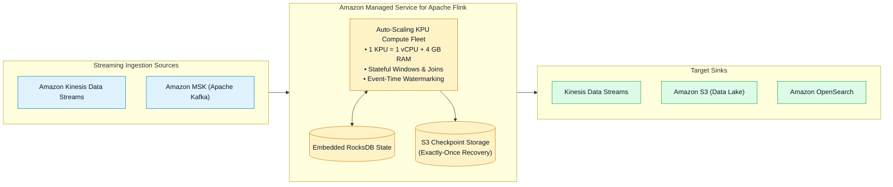
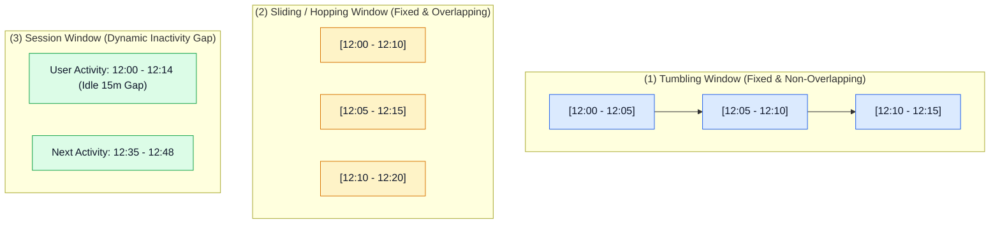
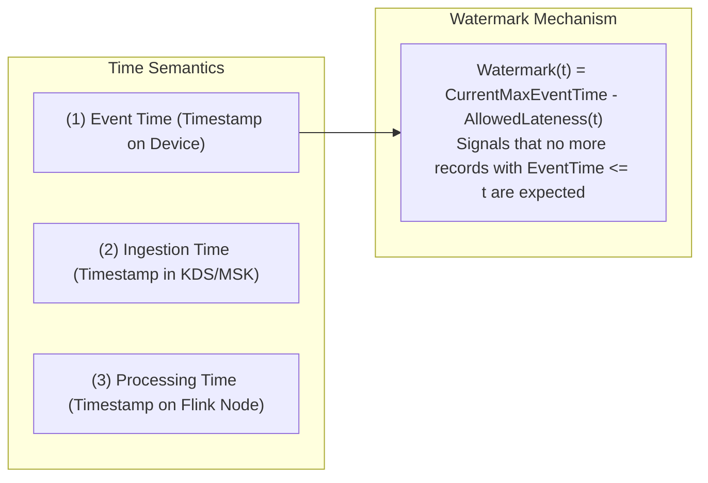
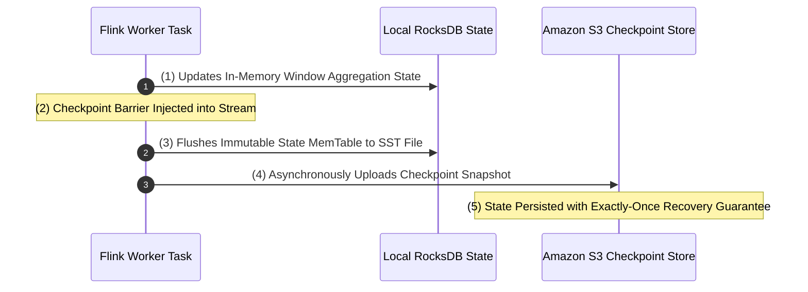

# ⚡ Amazon Managed Service for Apache Flink

- **Category**: Analytics / Stateful Real-Time Stream Processing
- **Language / ဘာသာစကား**: [English (Original)](/en/02-services/analytics-streaming/kinesis/kinesis-apache-flink) | **မြန်မာဘာသာ (Burmese)**
- **Primary Use Case / အဓိက အသုံးပြုမှု**: Sub-second၊ stateful stream processing၊ continuous anomaly detection၊ time-window aggregations (Tumbling၊ Sliding၊ Session) နှင့် exact-once delivery semantics များ လုပ်ဆောင်ရန်။
- **Slide Reference**: Pages 451–459 in `[AWSCertifiedDataEngineerSlides.pdf](/docs/AWSCertifiedDataEngineerSlides.pdf)`
- **Hub Links**: `[[mm/index|index]]` | `[[mm/02-services/analytics-streaming/kinesis/kinesis|kinesis]]` | `[[mm/02-services/analytics-streaming/kinesis/kinesis-data-streams|kinesis-data-streams]]` | `[[mm/02-services/storage/s3/s3|s3]]` | `[[domain-3-data-processing]]`

---

## 1. High-Level Summary (အကျဉ်းချုပ်)

**Amazon Managed Service for Apache Flink** (ယခင်အမည် *Amazon Kinesis Data Analytics*) သည် ရှုပ်ထွေးပြီး stateful ဖြစ်သော streaming application များကို တည်ဆောက်ရန် ရည်ရွယ်ထုတ်လုပ်ထားသည့် fully managed, serverless Apache Flink service တစ်ခု ဖြစ်သည်။

၎င်းသည် **Amazon Kinesis Data Streams**၊ **Amazon MSK (Apache Kafka)** သို့မဟုတ် custom source များထံမှ continuous real-time data များကို **sub-second latency** ဖြင့် process လုပ်ပေးပြီး SQL၊ Java၊ Scala နှင့် Python တို့ကို support ပေးသည်။

---

## 2. Compute Model & Kinesis Processing Units (KPUs) (Compute Model နှင့် KPUs များ)

Apache Flink application တစ်ခု၏ compute capacity ကို **Kinesis Processing Units (KPUs)** ဖြင့် တိုင်းတာပါသည်:

| Metric / Dimension | Specification | Architecture Detail |
| :--- | :--- | :--- |
| **1 KPU Resources** | **1 vCPU + 4 GB Memory + 50 GB Disk Storage** | Standardized compute block ဖြစ်သည်။ |
| **Auto-Scaling** | CPU နှင့် memory utilization ပေါ်မူတည်၍ dynamic scaling ပြုလုပ်ခြင်း | `MinKPUs` (default: 1) နှင့် `MaxKPUs` (default: 64) အကြား scale လုပ်ဆောင်ပေးသည်။ |
| **Parallelism** | Operator တစ်ခုချင်းအလိုက် သို့မဟုတ် application တစ်ခုလုံးအလိုက် configure ပြုလုပ်နိုင်ခြင်း | `Parallelism` သည် KPUs များပေါ်တွင် parallel task မည်မျှ execute လုပ်မည်ကို သတ်မှတ်ပေးသည်။ |
| **Parallelism per KPU** | 1 (default) | I/O bound ဖြစ်သော workloads များအတွက် KPU တစ်ခုလျှင် tasks ၈ ခုအထိ ထားရှိနိုင်သည်။ |

---

## 3. Streaming Window Types (Streaming Window အမျိုးအစားများ)

Windowing သည် continuous infinite stream များကို mathematical aggregation ပြုလုပ်ရန်အတွက် finite bucket (အပိုင်းအစ) များအဖြစ် partition ပိုင်းခြားပေးသည်:

### 1. Tumbling Window
- **Definition (အဓိပ္ပာယ်ဖွင့်ဆိုချက်)**: ထပ်ထပ်ချင်း မဖြစ်ပေါ်သော (zero overlap) သတ်မှတ်ထားသည့် fixed duration ဖြစ်သည်။ record တစ်ခုစီသည် window တစ်ခုတည်းတွင်သာ သီးသန့် ပါဝင်သည်။
- **Example (ဥပမာ)**: **၅ မိနစ်တိုင်း** ငွေကြေးဆိုင်ရာ transaction ပမာဏ စုစုပေါင်း (total financial transaction volume) ကို တွက်ချက်ခြင်း။

### 2. Sliding (Hopping) Window
- **Definition (အဓိပ္ပာယ်ဖွင့်ဆိုချက်)**: သေးငယ်သော sliding interval ဖြင့် ရှေ့သို့ ရွေ့လျားသွားသည့် fixed duration ဖြစ်ပြီး ထပ်နေသော (overlapping) result များကို ထုတ်ပေးသည်။
- **Example (ဥပမာ)**: **၁ မိနစ်တိုင်း** update ဖြစ်သော **၁၀ မိနစ်စာ moving average CPU load** ကို တွက်ချက်ခြင်း။

### 3. Session Window
- **Definition (အဓိပ္ပာယ်ဖွင့်ဆိုချက်)**: configure ပြုလုပ်ထားသော inactivity timeout gap (ဥပမာ - idle ဖြစ်နေသော အချိန် ၁၅ မိနစ်) ဖြင့် ခြားထားသည့် user activity ကာလများအလိုက် event များကို အုပ်စုဖွဲ့ပေးသော dynamic duration ဖြစ်သည်။
- **Example (ဥပမာ)**: user တစ်ဦးချင်းစီအလိုက် continuous web browsing session များကို track ပြုလုပ်ခြင်း။

---

## 4. Time Semantics & Event-Time Watermarking (Time Semantics နှင့် Event-Time Watermarking)

Out-of-order ဖြစ်ပေါ်ခြင်းနှင့် နောက်ကျရောက်ရှိလာသော record များကို ကိုင်တွယ်ဖြေရှင်းနိုင်ခြင်းသည် Apache Flink ၏ အဓိက အားသာချက်တစ်ခု ဖြစ်သည်:

1. **Event Time (Recommended)**: Source device ပေါ်တွင် event အမှန်တကယ် ဖြစ်ပွားခဲ့သည့် တိကျသော timestamp ဖြစ်သည် (ဥပမာ - sensor clock)။ Network latency နှင့် out-of-order ရောက်ရှိလာမှုများကို ခံနိုင်ရည်ရှိသည်။
2. **Watermarks**: Watermark `Watermark(t)` သည် time progress indicator အဖြစ် လုပ်ဆောင်ပြီး `EventTime <= t` ရှိသော record အားလုံး ရောက်ရှိပြီးဖြစ်ကြောင်း Flink engine အား အသိပေးကာ သက်ဆိုင်ရာ window ကို evaluate ပြုလုပ်ခြင်းနှင့် ပိတ်ခြင်းတို့ကို trigger လုပ်ပေးသည်။
3. **Allowed Lateness**: Window ပိတ်သွားပြီးနောက် နောက်ကျရောက်ရှိလာသော bounded late-arriving record များသည် window state ကို ဆက်လက် update လုပ်နိုင်ဆဲဖြစ်သည် သို့မဟုတ် audit ပြုလုပ်ရန်အတွက် **Side Output** သို့ လမ်းကြောင်းလွှဲပေးနိုင်သည်။

---

## 5. State Management & Fault Tolerance (Exactly-Once Semantics) (State စီမံခန့်ခွဲမှုနှင့် Fault Tolerance)

Flink သည် local state ကို SSD များပေါ်ရှိ embedded **RocksDB state backend** တွင် ထိန်းသိမ်းထားပြီး asynchronous checkpoint snapshot များကို **Amazon S3** သို့ ပုံမှန် အချိန်အပိုင်းအခြားအလိုက် ရေးသားသိမ်းဆည်းပါသည်:

- **Fault Tolerance**: EC2 host တစ်ခု crash ဖြစ်သွားပါက သို့မဟုတ် application အနေဖြင့် KPUs များကို scale out လုပ်ပါက Flink သည် operator များကို ပြန်လည်စတင်ပြီး နောက်ဆုံး အောင်မြင်ခဲ့သော **S3 Checkpoint** ထံမှ state ကို restore ပြန်လုပ်ပေးကာ **Exactly-Once Processing** ကို အာမခံပေးသည်။
- **Savepoints**: Application upgrades ပြုလုပ်ခြင်း၊ code refactoring ပြုလုပ်ခြင်း သို့မဟုတ် AWS Region migrations ပြုလုပ်ခြင်းများတွင် data loss လုံးဝမရှိစေရန် manually trigger ပြုလုပ်နိုင်သော state snapshots များ ဖြစ်သည်။

---

## 6. DEA-C01 Exam Tips & Scenarios (စာမေးပွဲအတွက် အကြံပြုချက်များနှင့် Scenario များ)

> [!IMPORTANT]
> **Managed Service for Apache Flink အတွက် အဓိက စာမေးပွဲ ဆုံးဖြတ်ချက် Triggers များ**:
>
> - **"Perform continuous 10-minute moving average calculations on IoT sensor data with sub-second latency"** $\rightarrow$ **Sliding Window** ဖြင့် **Amazon Managed Service for Apache Flink** ကို အသုံးပြုပါ။
> - **"Calculate financial metrics every 1 hour where late-arriving trade records up to 10 minutes must be included"** $\rightarrow$ **Event-Time Watermarks and Allowed Lateness** ဖြင့် **Apache Flink** ကို အသုံးပြုပါ။
> - **"Need an interactive Apache Zeppelin notebook to run streaming SQL queries against Kinesis Data Streams"** $\rightarrow$ **Amazon Managed Service for Apache Flink Studio** ကို အသုံးပြုပါ။
> - **"Compute requirements for scaling a stateful Flink application"** $\rightarrow$ **Kinesis Processing Units (KPUs)** ကို configure ပြုလုပ်ပါ (KPU တစ်ခုစီသည် 1 vCPU နှင့် 4 GB RAM ကို ပံ့ပိုးပေးသည်)။
> - **"Guarantee zero data loss and exactly-once processing across application restarts"** $\rightarrow$ **Amazon S3 သို့ Flink Checkpointing** ကို enable ပြုလုပ်ပါ။

---

## 📌 Related Notes (ဆက်စပ် မှတ်စုများ)
- `[[mm/02-services/analytics-streaming/kinesis/kinesis|kinesis]]` — Kinesis Streaming Ecosystem Overview Hub
- `[[mm/02-services/analytics-streaming/kinesis/kinesis-data-streams|kinesis-data-streams]]` — KDS Ingestion & Shards
- `[[mm/02-services/analytics-streaming/kinesis/kinesis-firehose|kinesis-firehose]]` — Micro-Batch Streaming Delivery
- `[[mm/02-services/storage/s3/s3|s3]]` — S3 Checkpoint and Sink Storage
