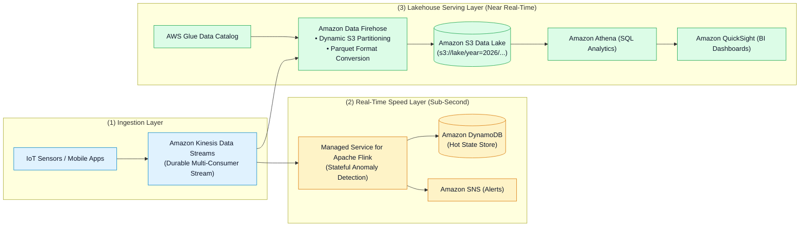
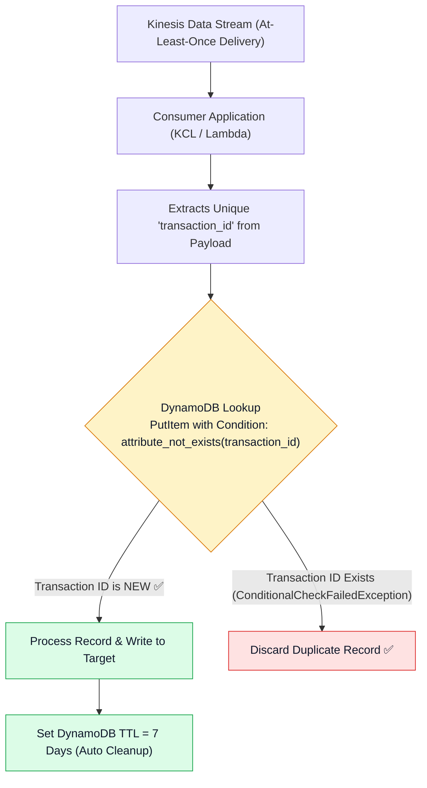
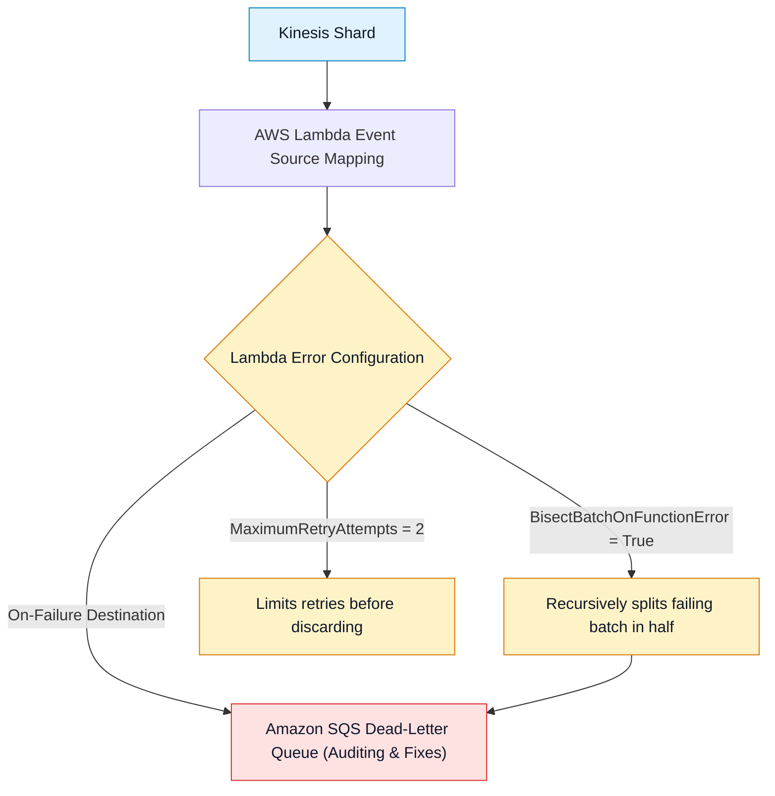

# 🏗️ Kinesis Streaming Architectures, Design Patterns & Decision Matrices

- **Category**: Analytics / Streaming Architecture & System Design
- **Language / ဘာသာစကား**: [English (Original)](/en/02-services/analytics-streaming/kinesis/kinesis-architecture-and-patterns) | **မြန်မာဘာသာ (Burmese)**
- **Primary Use Case**: End-to-end streaming data pipelines များ ဒီဇိုင်းဆွဲခြင်း၊ record deduplication ပြုလုပ်ခြင်း၊ poison pill များကို isolate လုပ်ခြင်း၊ နှင့် KDS, Firehose, MSK, SQS တို့အကြား ရွေးချယ်အသုံးပြုခြင်း။
- **Slide Reference**: `[[AWSCertifiedDataEngineerSlides.pdf]]` မှ Pages 414–459
- **Hub Links**: `[[mm/index]]` | `[[kinesis]]` | `[[kinesis-data-streams]]` | `[[kinesis-firehose]]` | `[[kinesis-apache-flink]]` | `[[msk-kafka]]`

---

## 1. High-Level Summary

AWS ပေါ်ရှိ real-time data engineering သည် မတူညီသော streaming workload နှစ်ခုဖြစ်သည့် **Low-Latency Stream Processing** (sub-second alerting, stateful anomaly detection) နှင့် **Continuous Managed Lakehouse Ingestion** (columnar Parquet micro-batch များကို S3 ထဲသို့ ပေးပို့ခြင်း) တို့ကို ဖြည့်ဆည်းပေးရန် service အများအပြားကို ပေါင်းစပ်အသုံးပြုထားပါသည်။

ဤလမ်းညွှန်သည် end-to-end enterprise reference architectures များ၊ deduplication strategies များ၊ နှင့် AWS streaming နှင့် messaging နယ်ပယ်တစ်ခုလုံးကို လွှမ်းခြုံထားသော multi-dimensional decision matrix တစ်ခုကို ဖော်ပြပေးထားပါသည်။

---

## 2. Comprehensive Streaming & Messaging Decision Matrix

| Dimension | Kinesis Data Streams (KDS) | Amazon Data Firehose (KDF) | Amazon MSK (Apache Kafka) | Amazon SQS | Amazon SNS |
| :--- | :--- | :--- | :--- | :--- | :--- |
| **Delivery Model** | Streaming partition log (pull / push via EFO)။ | Automated streaming delivery (micro-batch push)။ | Distributed publish-subscribe topic partitions။ | Point-to-point message queue။ | Publish-subscribe fan-out topic။ |
| **Target Latency** | **70 ms – 200 ms** (sub-second)။ | **60 s – 900 s** (near real-time)။ | **< 20 ms** (sub-second)။ | **Sub-second** (pull)။ | **Sub-second** (push)။ |
| **Data Retention & Replay** | **24 hours မှ 365 days အထိ** (full replay ရရှိနိုင်)။ | **မရှိပါ** (in-flight buffer သာဖြစ်သည်)။ | **Configurable** (hours မှ years အထိ သတ်မှတ်နိုင်)။ | **1 minute မှ 14 days အထိ** (ဖတ်ပြီးပါက delete လုပ်သည်)။ | **မရှိပါ** (message သိုလှောင်ခြင်းမရှိ)။ |
| **Message Ordering** | **Partition Key တစ်ခုစီအလိုက်** Strictly ordered ဖြစ်သည်။ | Micro-batched ဖြစ်ပြီး batch များအကြား order ကို အာမမခံပါ။ | **Partition တစ်ခုစီအလိုက်** Strictly ordered ဖြစ်သည်။ | **SQS FIFO** တွင်သာ ordered ဖြစ်ပြီး Standard တွင် unordered ဖြစ်သည်။ | **SNS FIFO** တွင်သာ ordered ဖြစ်သည်။ |
| **Max Payload Size** | **1 MB** | **1 MB** (သို့မဟုတ် Lambda ဖြင့် 10 MB) | **1 MB** (multi-MB အထိ configure လုပ်နိုင်သည်) | **256 KB** (S3 Extended Client ဖြင့် 2 GB) | **256 KB** |
| **Scaling Mechanism** | Shard scaling (Provisioned သို့မဟုတ် On-Demand)။ | Fully serverless (auto-scales)။ | Broker node instance types နှင့် storage တိုးချဲ့ခြင်း။ | Virtually unlimited automatic scaling။ | Virtually unlimited automatic scaling။ |
| **Primary Use Case** | Multi-consumer custom stream processing နှင့် replay ပြုလုပ်ခြင်း။ | Parquet format conversion ဖြင့် S3/Redshift သို့ direct ingestion ပြုလုပ်ခြင်း။ | Enterprise Kafka migration နှင့် custom Kafka Connect plugins များ အသုံးပြုခြင်း။ | Microservices များ decouple လုပ်ခြင်းနှင့် background worker queues များ။ | Event notifications များနှင့် SQS/Lambda/Email များသို့ fan-out ပြုလုပ်ခြင်း။ |

---

## 3. Data Deduplication in Streaming Pipelines

Kinesis သည် **At-Least-Once Delivery** အာမခံချက်ဖြင့် အလုပ်လုပ်သောကြောင့် producer များ၏ network retry ပြုလုပ်ခြင်း သို့မဟုတ် worker restarts များကြောင့် duplicate records များ ဝင်ရောက်လာနိုင်ပါသည်။

### Deduplication Strategies:
1. **Idempotent Destination Writes**: DynamoDB ရှိ primary key upserts (`PutItem`) သို့မဟုတ် Apache Iceberg / Delta Lake ရှိ `MERGE INTO` ကို အသုံးပြုပါ။
2. **DynamoDB State Tracker**: Process လုပ်ပြီးသား message UUID များကို သီးသန့် DynamoDB table တစ်ခုတွင် conditional writes (`attribute_not_exists(id)`) အသုံးပြု၍ ခြေရာခံပါ။ သက်တမ်းလွန်သွားသော historical keys များကို အလိုအလျောက် ရှင်းထုတ်ရန် 7 days သတ်မှတ်ထားသော **Time to Live (TTL)** ကို ထည့်သွင်းအသုံးပြုပါ။
3. **Apache Flink Stateful Deduplication**: Flink သည် duplicate များကို downstream သို့ မပို့မီ စစ်ထုတ်ရန် time window (ဥပမာ - 1 hour) ဖြင့် သတ်မှတ်ထားသော in-memory RocksDB state ကို ထိန်းသိမ်းထားပါသည်။

---

## 4. Isolating Poison Pills (Corrupted Records)

ပုံစံမမှန်သော သို့မဟုတ် parse လုပ်၍မရသော record ("poison pill") ကြောင့် stream pipeline တစ်ခုလုံး ရပ်တန့်သွားခြင်း (stall ဖြစ်ခြင်း) ကို လုံးဝခွင့်မပြုသင့်ပါ-

---

## 5. DEA-C01 Scenario Decision Guide

> [!IMPORTANT]
> **Streaming Architecture အတွက် စာမေးပွဲဆိုင်ရာ အဓိက Decision Triggers များ**:
>
> - **"Real-time sub-second anomaly detection နှင့် S3 Parquet data lake သို့ automated delivery ပြုလုပ်ခြင်း နှစ်မျိုးစလုံး လိုအပ်ခြင်း"** $\rightarrow$ **Kinesis Data Streams** ဖြင့် ingest လုပ်ပါ၊ real-time alerts များအတွက် **Managed Service for Apache Flink** ကို ချိတ်ဆက်ပါ၊ နှင့် S3 Parquet delivery အတွက် **Amazon Data Firehose** ကို တွဲဖက်အသုံးပြုပါ။
> - **"Streams များကို process လုပ်ရာတွင် duplicate records များကြောင့် accounting စာရင်းများ ထပ်မံမဖြစ်ပွားစေရန် ကာကွယ်ခြင်း"** $\rightarrow$ **Amazon DynamoDB conditional writes ဖြင့် Idempotency keys** များကို implement ပြုလုပ်ပါ။
> - **"လက်ရှိ infrastructure သည် Apache Kafka APIs များနှင့် custom Kafka Connect plugins များကို အသုံးပြုထားခြင်း"** $\rightarrow$ **Amazon MSK** သို့ migrate လုပ်ပါ။
> - **"Task တစ်ခုစီကို worker တစ်ခုတည်းကသာ တစ်ကြိမ် process လုပ်ပြီး delete လုပ်မည့် background web worker tasks များကို decouple လုပ်ခြင်း"** $\rightarrow$ **Amazon SQS** ကို အသုံးပြုပါ။
> - **"Single streaming event တစ်ခုတည်းကို မတူညီသော subscriber queues ၁၀ ခုသို့ တစ်ပြိုင်နက် fan-out ပြုလုပ်ခြင်း"** $\rightarrow$ **Amazon SQS queues** အများအပြား ချိတ်ဆက်ထားသော **Amazon SNS** သို့ publish ပြုလုပ်ပါ။

---

## 📌 Related Notes
- `[[kinesis]]` — Kinesis Streaming Ecosystem Overview Hub
- `[[kinesis-data-streams]]` — KDS Ingestion & Shards
- `[[kinesis-firehose]]` — Micro-Batch Streaming Delivery
- `[[kinesis-apache-flink]]` — Real-Time Stateful Stream Processing
- `[[msk-kafka]]` — Amazon Managed Streaming for Apache Kafka
- `[[dynamodb]]` — Deduplication State Storage
