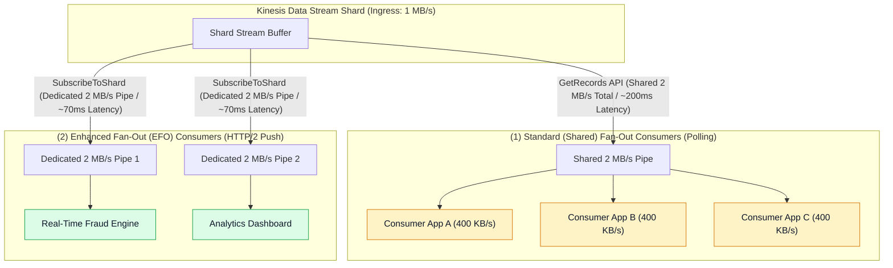
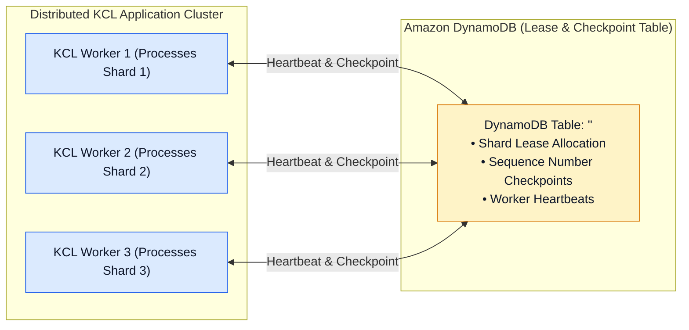
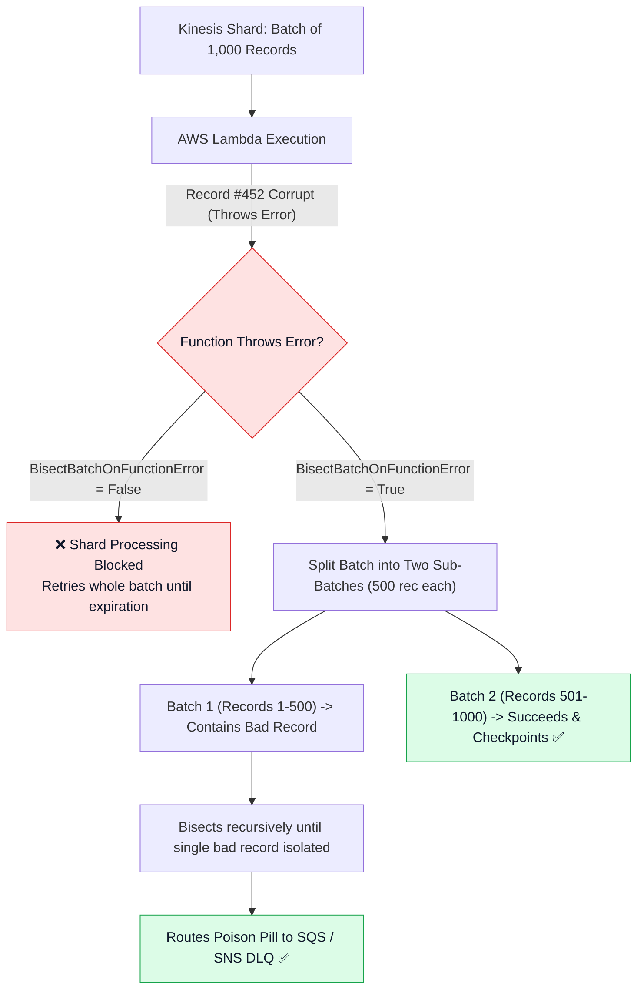
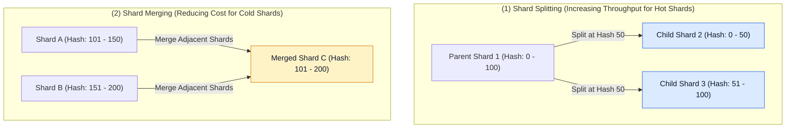

# 🚀 Kinesis Consumers, Enhanced Fan-Out & Scaling

- **Category**: Analytics / Stream Processing & Consumer Scaling
- **Language / ဘာသာစကား**: [English (Original)](/en/02-services/analytics-streaming/kinesis/kinesis-consumers-and-scaling) | **မြန်မာဘာသာ (Burmese)**
- **Primary Use Case**: High-throughput stream consumption, dedicated consumer fan-out, DynamoDB မှတစ်ဆင့် KCL state coordination ပြုလုပ်ခြင်း နှင့် automated Lambda error handling လုပ်ဆောင်ခြင်း။
- **Slide Reference**: `[AWSCertifiedDataEngineerSlides.pdf](/docs/AWSCertifiedDataEngineerSlides.pdf)` မှ Pages 425–445
- **Hub Links**: `[[mm/index]]` | `[[kinesis]]` | `[[kinesis-data-streams]]` | `[[dynamodb]]` | `[[lambda]]`

---

## 1. High-Level Summary (အကျဉ်းချုပ် ခြုံငုံသုံးသပ်ချက်)

Amazon Kinesis Data Streams မှ records များကို ထုတ်ယူဖတ်ရှုရာတွင် အသင့်တော်ဆုံး consumer architecture ကို ရွေးချယ်ရန် လိုအပ်ပါသည်။ AWS သည် အခြေခံ consumption model နှစ်မျိုးကို ထောက်ပံ့ပေးထားပါသည်- **Standard (Shared) Fan-Out** (`GetRecords` မှတစ်ဆင့် polling လုပ်ခြင်း) နှင့် **Enhanced Fan-Out (EFO)** (HTTP/2 `SubscribeToShard` မှတစ်ဆင့် push လုပ်ခြင်း) တို့ ဖြစ်ကြပါသည်။

လုပ်ငန်းသုံး (enterprise) stream processing အတွက် **Kinesis Client Library (KCL)** သည် distributed worker instance များကို ပေါင်းစပ်ညှိနှိုင်းပေးပြီး progress များကို **Amazon DynamoDB** တွင် checkpoint မှတ်သားပေးကာ **AWS Lambda Event Source Mappings** သည် built-in parallelization နှင့် error isolation စနစ်များကို ထောက်ပံ့ပေးပါသည်။

---

## 2. Standard Fan-Out vs. Enhanced Fan-Out (EFO)

| Feature (အသွင်အပြင်) | Standard (Shared) Fan-Out | Enhanced Fan-Out (EFO) |
| :--- | :--- | :--- |
| **API Mechanism** | HTTP `GetRecords` polling ကို အသုံးပြုသော Pull model ဖြစ်သည်။ | HTTP/2 `SubscribeToShard` ကို အသုံးပြုသော Push model ဖြစ်သည်။ |
| **Throughput per Shard** | **စုစုပေါင်း 2 MB / second** (standard consumers အားလုံး မျှဝေသုံးစွဲရသည်)။ | **Consumer တစ်ခုစီအတွက် သီးသန့် 2 MB / second** (dedicated per registered consumer)။ |
| **Latency** | ပုံမှန် propagation delay မှာ **~200 ms** ဝန်းကျင် ရှိသည်။ | Ultra-low propagation delay မှာ **~70 ms** ဝန်းကျင် ရှိသည်။ |
| **Max Consumers Limit** | Shard တစ်ခုလျှင် မျှဝေသုံးရသော 2 MB/s throughput နှင့် 5 `GetRecords` calls/sec limit ဖြင့် ကန့်သတ်ထားသည်။ | Stream တစ်ခုလျှင် **EFO consumers အခု ၂၀ (20 registered consumers)** အထိ ထားရှိနိုင်သည်။ |
| **Cost Model** | သီးခြား consumer fee ထပ်မံပေးဆောင်ရန် မလိုပါ (base shard hour တွင် ပါဝင်ပြီးဖြစ်သည်)။ | **Consumer-Shard-Hour** + **Data Retrieval (GB)** အလိုက် ကျသင့်ငွေ ကောက်ခံသည်။ |
| **Recommended Use Case** | Single consumer application များ၊ batch consumers များ သို့မဟုတ် latency-critical မဟုတ်သော pipelines များအတွက် သင့်လျော်သည်။ | တူညီသော stream ကို ပြိုင်တူဖတ်ရှုနေသည့် multiple concurrent applications များ သို့မဟုတ် တင်းကျပ်သော sub-100ms latency SLAs လိုအပ်ချက်များအတွက် သင့်လျော်သည်။ |

---

## 3. Kinesis Client Library (KCL) & DynamoDB Coordination (Kinesis Client Library (KCL) နှင့် DynamoDB ပေါင်းစပ်ညှိနှိုင်းမှု)

**Kinesis Client Library (KCL)** သည် scalable ဖြစ်သော distributed stream consumer application များကို လွယ်ကူစွာ တည်ဆောက်နိုင်စေရန် ကူညီပေးသည့် Java/Python framework တစ်ခုဖြစ်ပါသည်။

### Key KCL Operational Principles (အဓိက KCL လုပ်ဆောင်ချက် စည်းမျဉ်းများ):
1. **One-to-One Shard Mapping**: မည်သည့်အချိန်တွင်မဆို KCL fleet ထဲရှိ worker thread တစ်ခုသည် shard တစ်ခုမှ data ကိုသာ သီးသန့် process လုပ်ပါသည်။ အကယ်၍ သင့်တွင် shards ၁၀ ခု ရှိပါက parallel အဖြစ် worker instances ၁၀ ခုအထိ run နိုင်ပါသည်။
2. **DynamoDB State Table**: KCL သည် application အမည် (`applicationName`) ဖြင့် DynamoDB table တစ်ခုကို ဖန်တီးပါသည်။ ၎င်း table သည် မည်သည့် worker က မည်သည့် shard lease ကို ပိုင်ဆိုင်ထားသည်နှင့် အောင်မြင်စွာ checkpoint ပြုလုပ်ထားသော နောက်ဆုံး sequence number ကို ခြေရာခံမှတ်သားပေးပါသည်။
3. **DynamoDB Provisioning Caution**: အကယ်၍ DynamoDB table တွင် provisioned throughput throttling ဖြစ်ပေါ်ပါက KCL workers များသည် checkpoint မလုပ်နိုင်တော့ဘဲ processing ရပ်တန့်သွားခြင်း (stalls) သို့မဟုတ် duplicate message replays များ ဖြစ်ပေါ်စေနိုင်ပါသည်။ ထို့ကြောင့် DynamoDB table ကို **On-Demand Capacity** သို့မဟုတ် လုံလောက်သော provisioned RCU/WCU ထားရှိရန် သေချာပါစေ။
4. **KPL De-Aggregation**: Kinesis Producer Library (KPL) ဖြင့် ပေါင်းစည်းထားသော (bundled) records များကို KCL က အလိုအလျောက် ပွင့်လင်းမြင်သာစွာ de-aggregate (ပြန်လည်ခွဲထုတ်) ပေးပါသည်။

---

## 4. AWS Lambda as a Kinesis Consumer (Kinesis Consumer အဖြစ် AWS Lambda ကို အသုံးပြုခြင်း)

AWS Lambda ကို **Event Source Mapping** မှတစ်ဆင့် Kinesis Data Streams ထံမှ ဖတ်ရှုရန် configure လုပ်သောအခါ Lambda သည် stream shards များကို poll လုပ်ပြီး records batch များအလိုက် functions များကို execute လုပ်ပေးပါသည်။

### Critical Lambda Tuning Parameters for DEA-C01 (DEA-C01 အတွက် အရေးကြီးသော Lambda Tuning Parameters များ):
- **`BatchSize`**: Lambda invocation တစ်ခုအတွင်း ရယူမည့် အများဆုံး record အရေအတွက် (default: 100, max: 10,000)။
- **`MaximumBatchingWindowInSeconds`**: Function ကို invoke မလုပ်မီ Lambda က records များကို buffer လုပ်ထားမည့် အများဆုံးကြာချိန် (၀ မှ စက္ကန့် ၃၀၀ အထိ) ဖြစ်ပြီး traffic နည်းသော streams များအတွက် batch sizes ကို optimize လုပ်ပေးပါသည်။
- **`ParallelizationFactor` (1 to 10)**: **Shard တစ်ခုစီအတွက်** concurrent Lambda invocations ၁၀ ခုအထိ ခွင့်ပြုပေးပါသည်။ Lambda သည် သီးခြားစီဖြစ်သော partition key တစ်ခုချင်းစီအလိုက် strictly ordered processing ကို ထိန်းသိမ်းထားစဉ် မတူညီသော partition keys များကို concurrently process လုပ်ဆောင်ပေးပါသည်။
- **`BisectBatchOnFunctionError`**: Enable လုပ်ထားပါက batch တစ်ခု fail ဖြစ်သွားသည့်အခါ Lambda သည် batch ကို နှစ်ခြမ်းခွဲကာ တစ်ခြမ်းစီကို သီးခြားစီ retry လုပ်ပါသည်။ ၎င်းသည် ပျက်စီးနေသော single malformed record ("poison pill") ကို recursive နည်းဖြင့် သီးသန့်ခွဲထုတ်ပေးနိုင်ပြီး head-of-line blocking မဖြစ်အောင် ကာကွယ်ပေးပါသည်။
- **`On-Failure Destination`**: `MaximumRetryAttempts` သို့မဟုတ် `MaximumRecordAgeInSeconds` ပြည့်သွားပြီးနောက် လုံးဝ fail ဖြစ်သွားသော records ဆိုင်ရာ metadata များကို **Amazon SQS Dead-Letter Queue (DLQ)** သို့မဟုတ် **Amazon SNS topic** သို့ ပေးပို့ပေးပါသည်။

---

## 5. Stream Resharding: Splitting vs. Merging (Stream Resharding: Splitting နှင့် Merging နှိုင်းယှဉ်ချက်)

Resharding သည် လက်ရှိ run နေသော application များကို မထိခိုက်စေဘဲ Provisioned Kinesis stream တစ်ခု၏ total capacity ကို ချိန်ညှိပေးပါသည်။

### Resharding Rules (Resharding ပြုလုပ်ရာတွင် လိုက်နာရမည့် စည်းမျဉ်းများ):
1. **Parent Shards to Closed State**: Shard တစ်ခုကို split သို့မဟုတ် merge လုပ်လိုက်သည့်အခါ parent shard သည် `CLOSED` (သို့မဟုတ် `EXPIRED`) state သို့ ပြောင်းလဲသွားပါသည်။
2. **Order Preservation**: KCL နှင့် Lambda တို့သည် child shards များထံမှ မဖတ်ရှုမီ parent shard ထဲရှိ ကျန်ရှိနေသော records အားလုံးကို **အရင်ဆုံး** အပြီးဖတ်ရှုပြီး process လုပ်ပါသည်။ ၎င်းသည် end-to-end record ordering ကို အာမခံချက် ပေးပါသည်။
3. **Only Adjacent Shards Can Be Merged**: ကြားတွင် gap မရှိဘဲ ဆက်စပ်နေသော (contiguous) hash key ranges ရှိသည့် shards နှစ်ခုကိုသာ ပေါင်းစည်း (merge) နိုင်ပါသည်။

---

## 6. DEA-C01 Exam Tips & Scenarios (DEA-C01 စာမေးပွဲအတွက် အကြံပြုချက်များနှင့် မေးခွန်း Scenario များ)

> [!IMPORTANT]
> **Key Exam Decision Triggers for Kinesis Consumers (Kinesis Consumers အတွက် စာမေးပွဲ အဓိက သော့ချက် ဆုံးဖြတ်ချက်များ)**:
>
> - **"5 independent analytics applications are reading from the same Kinesis stream and experiencing `ReadProvisionedThroughputExceeded` errors"** $\rightarrow$ Application တစ်ခုစီအတွက် သီးသန့် 2 MB/sec HTTP/2 pipes ရရှိစေရန် **Enhanced Fan-Out (EFO)** ကို enable လုပ်ပါ။
> - **"A KCL application running on EC2 is repeatedly failing to checkpoint and causing duplicate record reads"** $\rightarrow$ Write throttling ဖြစ်နေခြင်း ရှိမရှိ စစ်ဆေးရန် **DynamoDB lease table** ကို ကြည့်ရှုပြီး provisioned WCU ကို တိုးမြှင့်ပါ သို့မဟုတ် On-Demand capacity ကို enable လုပ်ပါ။
> - **"A single corrupted record causes a Lambda Kinesis consumer to retry infinitely, blocking the entire shard"** $\rightarrow$ **`BisectBatchOnFunctionError = True`** ကို enable လုပ်ပြီး **On-Failure SQS DLQ destination** ကို configure လုပ်ပါ။
> - **"Need to scale up Lambda consumer concurrency on a high-throughput shard without losing in-order processing per partition key"** $\rightarrow$ **`ParallelizationFactor`** ကို တိုးမြှင့်ပါ (အများဆုံး ၁၀ အထိ)။
> - **"How does KCL maintain data ordering during stream resharding?"** $\rightarrow$ KCL သည် အသစ်ဖန်တီးထားသော **child shards** များထံမှ မဖတ်ရှုမီ **parent shard ကုန်ဆုံးသွားသည်အထိ (until exhaustion)** ရှိပြီးသား records အားလုံးကို အရင်ဖတ်ရှုပါသည်။

---

## 📌 Related Notes (ဆက်စပ် မှတ်စုများ)
- `[[kinesis]]` — Kinesis Streaming Ecosystem Overview Hub
- `[[kinesis-data-streams]]` — Shards, Partition Keys & Capacity Modes
- `[[dynamodb]]` — DynamoDB Capacity & KCL State Storage
- `[[lambda]]` — AWS Lambda Stream Processing Architecture
