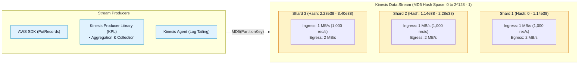
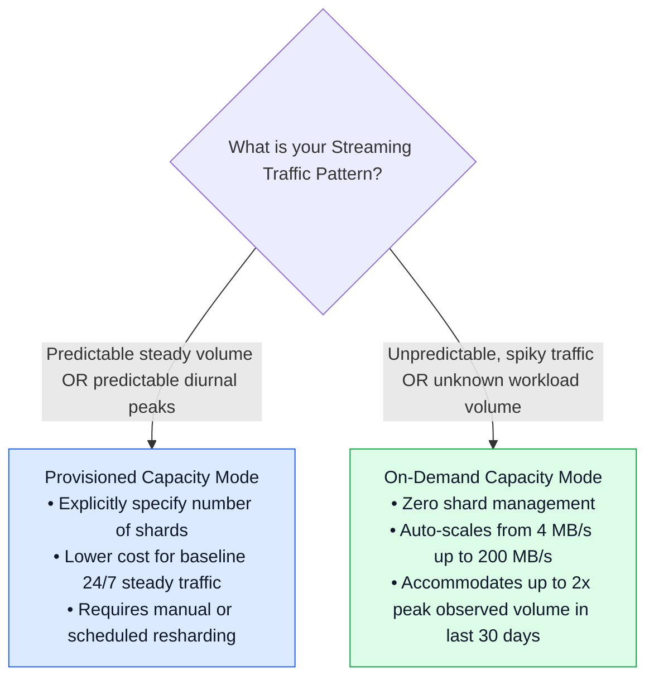
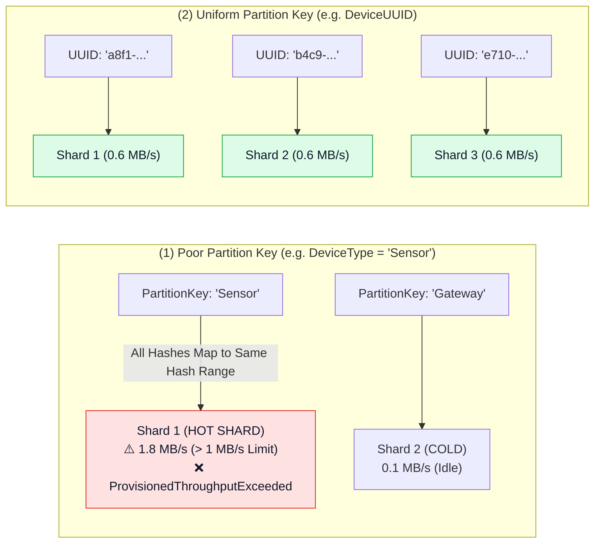
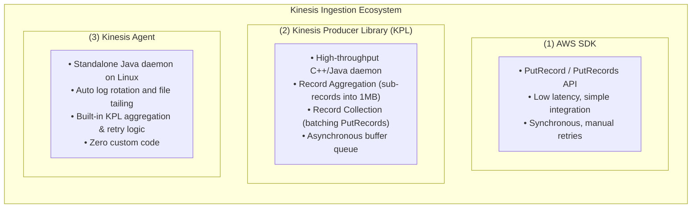

# ⚡ Amazon Kinesis Data Streams (KDS) Architecture & Ingestion

- **Category**: Analytics / Real-Time Data Streaming & Ingestion
- **Language / ဘာသာစကား**: [English (Original)](/en/02-services/analytics-streaming/kinesis/kinesis-data-streams) | **မြန်မာဘာသာ (Burmese)**
- **Primary Use Case**: Custom partition keys၊ sub-second latency၊ multi-consumer replay နှင့် flexible capacity scaling တို့ဖြင့် ကြီးမားကျယ်ပြန့်သော data streams များကို ingest ပြုလုပ်ခြင်း။
- **Slide Reference**: Pages 414–435 in `[AWSCertifiedDataEngineerSlides.pdf](/docs/AWSCertifiedDataEngineerSlides.pdf)`
- **Hub Links**: `[[mm/index]]` | `[[kinesis]]` | `[[kinesis-consumers-and-scaling]]` | `[[domain-1-ingestion-and-processing]]`

---

## 1. အကျဉ်းချုပ် (High-Level Summary)

**Amazon Kinesis Data Streams (KDS)** သည် အလွန်အမင်း scale လုပ်နိုင်ပြီး (massively scalable)၊ ခိုင်မာစိတ်ချရသော (durable) real-time data streaming service တစ်ခုဖြစ်သည်။ ဒေတာများကို stream ထဲသို့ ingest လုပ်ပြီး **Shards** များအဖြစ် ဖွဲ့စည်းထားသည်။ Stream တစ်ခုအတွင်းရှိ record တစ်ခုစီတွင် **Sequence Number**၊ **Partition Key** နှင့် အများဆုံး **1 MB** အထိရှိသော data payload (blob) တို့ ပါဝင်သည်။

Records များကို AWS Region တစ်ခုအတွင်းရှိ Availability Zones (AZs) ၃ ခုတွင် durably replicate ပြုလုပ်ထားပြီး သတ်မှတ်ထားသော ကာလတစ်ခုအထိ (default အားဖြင့် **24 hours** ဖြစ်ပြီး **365 days** အထိ တိုးမြှင့်နိုင်သည်) ထိန်းသိမ်းထားရှိကာ downstream applications အများအပြားမှ ဒေတာများကို သီးခြားစီ consume လုပ်ခြင်းနှင့် ပြန်လည်ဖတ်ရှုခြင်း (re-read) ပြုလုပ်နိုင်စေပါသည်။

---

## 2. Shard အခြေခံသဘောတရားများနှင့် Capacity Limits

**Shard** သည် Kinesis Data Stream တစ်ခု၏ အခြေခံ throughput unit ဖြစ်သည်။

| Shard Dimension | Shard တစ်ခုစီအတွက် Limit / Metric | မှတ်ချက်များနှင့် DEA-C01 ဆိုင်ရာ အချက်များ |
| :--- | :--- | :--- |
| **Write Throughput (Ingress)** | **1 MB / second** သို့မဟုတ် **1,000 records / second** | ကန့်သတ်ချက် တစ်ခုခုထက် ကျော်လွန်ပါက `ProvisionedThroughputExceededException` ဖြစ်ပေါ်စေသည်။ |
| **Read Throughput (Standard Egress)** | **2 MB / second** (consumers အားလုံး မျှဝေသုံးစွဲသည်) | Shard တစ်ခုလျှင် တစ်စက္ကန့်တွင် အများဆုံး 5 ကြိမ် `GetRecords` API calls ခေါ်ဆိုနိုင်သည်။ |
| **Enhanced Fan-Out (EFO Egress)** | **Registered consumer တစ်ခုစီအတွက် 2 MB / second** | သီးသန့် HTTP/2 push pipeline ဖြစ်သည် (shared 2 MB/s ကို အသုံးမပြုပါ)။ |
| **Maximum Record Size** | **1 MB** (partition key အပါအဝင်) | Base64 encoded payload ဖြစ်သည်။ ပိုကြီးသော payload များအတွက် S3 claim-check pattern ကို အသုံးပြုရမည်။ |
| **Data Retention Window** | **Default အားဖြင့် 24 hours** (**365 days / 8760 hours** အထိ) | Application failure ဖြစ်ချိန် သို့မဟုတ် backfill လုပ်ချိန်တွင် ယခင် data များကို ပြန်လည် replay လုပ်နိုင်စေသည်။ |

---

## 3. Capacity Modes: Provisioned vs. On-Demand

### 1. Provisioned Mode (Manual Capacity Planning)
- လိုအပ်သော Shard အရေအတွက် အတိအကျကို ကိုယ်တိုင် သတ်မှတ်ပေးရသည်။
- လိုအပ်သော Shards အရေအတွက်ကို တွက်ချက်ရန် Formula:
  $$\text{Required Shards} = \max\left(\left\lceil\frac{\text{Peak Write Data Rate (MB/sec)}}{1\text{ MB/sec}}\right\rceil, \left\lceil\frac{\text{Peak Records/sec}}{1000\text{ records/sec}}\right\rceil\right)$$
- Consumer ၏ read throughput သည် $2\text{ MB/sec}$ ထက် ကျော်လွန်ပါက Shards များ ထပ်ထည့်ရမည် သို့မဟုတ် Enhanced Fan-Out ကို ဖွင့်ရမည်။

### 2. On-Demand Mode (Automated Elastic Scaling)
- AWS မှ downtime မရှိဘဲ shard provisioning နှင့် scaling ကို အလိုအလျောက် စီမံခန့်ခွဲပေးသည်။
- Default baseline: **4 MB/sec** write (4,000 records/sec) နှင့် **8 MB/sec** read ဖြစ်သည်။
- Stream တစ်ခုလျှင် **200 MB/sec** write နှင့် **400 MB/sec** read အထိ dynamic အားဖြင့် auto-scale လုပ်ဆောင်ပေးသည်။
- ပြီးခဲ့သော ရက်ပေါင်း ၃၀ အတွင်း အမြင့်ဆုံး throughput (previous 30-day peak) ၏ **၂ ဆ (2x)** အထိ ဖြစ်ပေါ်လာသော traffic spikes များကို throttling မဖြစ်စေဘဲ ချက်ချင်း လက်ခံဆောင်ရွက်ပေးနိုင်သည်။

---

## 4. Partition Keys & The Hot Shard Problem

ဝင်ရောက်လာသော record တစ်ခုစီတွင် string **Partition Key** တစ်ခု (အများဆုံး 256 characters) ပါဝင်ရန် လိုအပ်သည်။ Kinesis သည် active shards များအကြား ခွဲဝေထားသော ordered 128-bit integer space ($0$ မှ $2^{128}-1$) ထဲသို့ partition key ကို map လုပ်ရန် **MD5 hash algorithm** ကို အသုံးပြုသည်။

### Hot Shard ဖြစ်ပွားရသည့် အကြောင်းရင်းများနှင့် ဖြေရှင်းနည်းများ:
1. **ဖြစ်ပွားရသည့် အကြောင်းရင်း (Cause)**: Low cardinality partition keys များ (ဥပမာ- status code၊ country code သို့မဟုတ် date string) သည် records အများစုကို shard တစ်ခုတည်းသို့သာ ဦးတည်ရောက်ရှိစေပြီး၊ stream တစ်ခုလုံး၏ total capacity ကို အပြည့်အဝ အသုံးမပြုရသေးသည့်တိုင် `ProvisionedThroughputExceededException` ကို ဖြစ်ပေါ်စေသည်။
2. **ဖြေရှင်းနည်း (Solution)**: High-cardinality keys များကို အသုံးပြုပါ (ဥပမာ- `user_id`၊ `device_id` သို့မဟုတ် `transaction_uuid`)။
3. **Random Suffixing (Salting)**: မညီမျှသော traffic ကို ဖြစ်ပေါ်စေသည့် entity တစ်ခုဖြင့် ဒေတာကို မဖြစ်မနေ partition ခွဲရမည်ဆိုပါက records များကို hash spaces တစ်လျှောက် ညီညီညာညာ ပျံ့နှံ့ရောက်ရှိစေရန် random integer suffix တစ်ခုကို နောက်ဆက်တွဲ ထည့်သွင်းပါ (ဥပမာ- `device_101#rand_04`)။

---

## 5. Ingestion Producers: SDK vs. KPL vs. Kinesis Agent

### 1. AWS SDK (`PutRecord` and `PutRecords`)
- တိုက်ရိုက် HTTP REST API calls များ ဖြစ်သည်။
- `PutRecords` သည် call တစ်ခုလျှင် **500 records** သို့မဟုတ် **5 MB** အထိ ထောက်ပံ့ပေးသည်။
- Synchronous ဖြစ်ပြီး၊ manual retry ပြုလုပ်ရန်အတွက် မအောင်မြင်သော သီးခြား records များကို ခွဲခြားသိရှိနိုင်ရန် record တစ်ခုချင်းအလိုက် status codes (`ErrorCode` နှင့် `ErrorMessage`) များကို ပြန်လည်ပေးပို့သည်။

### 2. Kinesis Producer Library (KPL)
- အမြင့်ဆုံး write throughput နှင့် ကုန်ကျစရိတ် သက်သာစေရန် (cost efficiency) အတွက် ဒီဇိုင်းထုတ်ထားသည်။
- **Aggregation**: Micro-records အများအပြားကို (ဥပမာ- 200-byte IoT records များ) 1 MB Kinesis record တစ်ခုတည်းအဖြစ် ပေါင်းစပ်ပေးသည်။
- **Collection**: Shard capacity ကို အပြည့်အဝ အသုံးချနိုင်ရန် Kinesis records အများအပြားကို `PutRecords` HTTP call တစ်ခုတည်းအဖြစ် batch ပြုလုပ်ပေးသည်။
- **Buffering**: `RecordMaxBufferedTime` (default 100ms) ဖြင့် configure ပြုလုပ်နိုင်သည်။
- **သတိပြုရန် (Caveat)**: Aggregated records များကို consumers များဘက်မှ **Kinesis Client Library (KCL)** သို့မဟုတ် KPL de-aggregation library ကို အသုံးပြု၍ de-aggregate (ပြန်လည်ခွဲထုတ်) ပြုလုပ်ပေးရမည်။

### 3. Kinesis Agent
- Linux servers (EC2 သို့မဟုတ် on-premises) အတွက် standalone background daemon ဖြစ်သည်။
- Log directories များကို အလိုအလျောက် စောင့်ကြည့်ခြင်း၊ multiline log parsing ကို ကိုင်တွယ်ခြင်းနှင့် built-in retry နှင့် aggregation mechanisms များဖြင့် ဒေတာများကို KDS သို့မဟုတ် Firehose သို့ ပေးပို့ထုတ်ဝေပေးသည်။

---

## 6. DEA-C01 စာမေးပွဲအတွက် Tips များနှင့် Scenarios များ

> [!IMPORTANT]
> **Kinesis Data Streams ဆိုင်ရာ စာမေးပွဲအတွက် အဓိက Decision Triggers များ**:
>
> - **"Stream သည် `ProvisionedThroughputExceededException` ကို လက်ခံရရှိသော်လည်း CloudWatch တွင် stream တစ်ခုလုံး၏ overall capacity သည် 30% သာ ရှိနေသည်"** $\rightarrow$ Low-cardinality partition key ကြောင့် ဖြစ်ပေါ်သော **Hot Shard** အဖြစ် သတ်မှတ်နိုင်သည်။ High-cardinality key (ဥပမာ- `device_id`) ကို ရွေးချယ်ခြင်း သို့မဟုတ် random salting အသုံးပြုခြင်းဖြင့် ဖြေရှင်းပါ။
> - **"Shard တစ်ခု၏ 1,000 records/sec ကန့်သတ်ချက်ကို မကျော်လွန်စေဘဲ သေးငယ်သော 100-byte IoT records သန်းပေါင်းများစွာကို ကုန်ကျစရိတ် သက်သာစွာဖြင့် KDS ထဲသို့ ingest ပြုလုပ်ရန် လိုအပ်သည်"** $\rightarrow$ **Record Aggregation** ကို အသုံးပြုနိုင်ရန် **Kinesis Producer Library (KPL)** ကို အသုံးပြုပါ။
> - **"Custom producer code ရေးသားစရာမလိုဘဲ Linux server ၏ system နှင့် application log files များကို Kinesis ထဲသို့ တိုက်ရိုက် stream လုပ်ရန် လိုအပ်သည်"** $\rightarrow$ **Amazon Kinesis Agent** ကို install လုပ်ပြီး configure ပြုလုပ်ပါ။
> - **"Machine learning model တစ်ခုကို train ပြုလုပ်ရန်အတွက် လွန်ခဲ့သော ရက်ပေါင်း ၃၀ က streaming transactions များကို ပြန်လည် replay လုပ်ရန် application မှ လိုအပ်သည်"** $\rightarrow$ KDS **Data Retention Period** ကို 24 hours မှ 30 days (အများဆုံး 365 days အထိ) တိုးမြှင့်သတ်မှတ်ပါ။
> - **"Manual shard management ကို မလုပ်ဆောင်နိုင်ဘဲ ရုတ်တရက် 10x traffic spikes များ ဖြစ်ပေါ်တတ်သည့် ခန့်မှန်းရခက်သော streaming traffic ရှိနေသည်"** $\rightarrow$ Stream capacity mode ကို **On-Demand Mode** သို့ ပြောင်းလဲပါ။

---

## 📌 ဆက်စပ် မှတ်စုများ (Related Notes)
- `[[kinesis]]` — Kinesis Streaming Ecosystem Overview Hub
- `[[kinesis-consumers-and-scaling]]` — Standard vs. Enhanced Fan-Out & KCL
- `[[kinesis-firehose]]` — Amazon Data Firehose Pipelines
- `[[kinesis-security-and-monitoring]]` — KMS Encryption & CloudWatch Metrics
