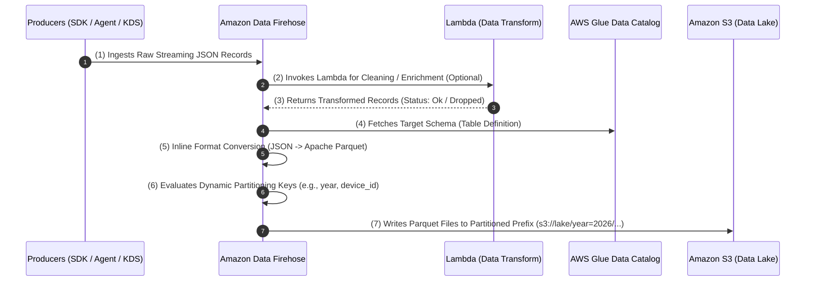
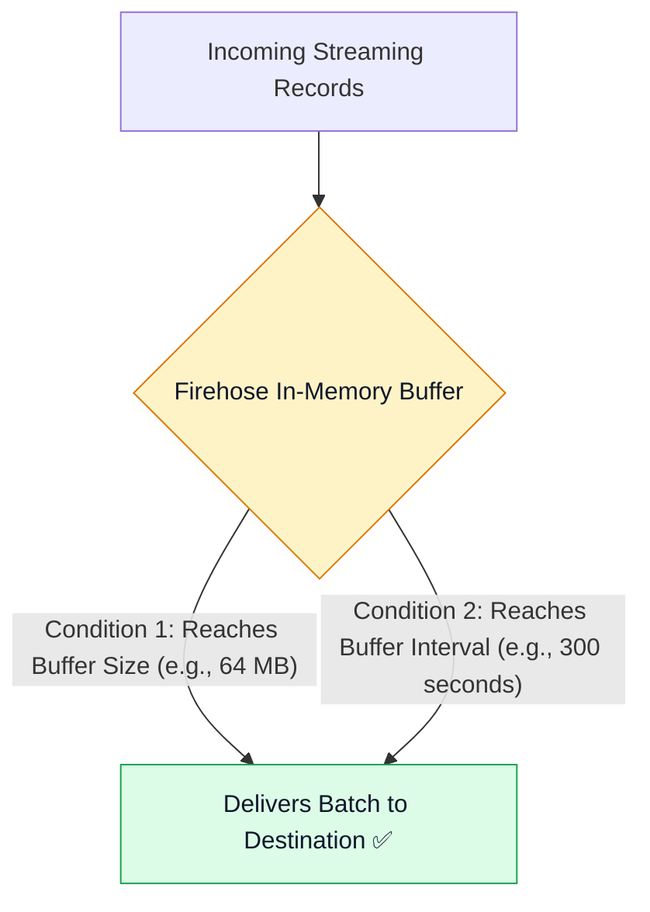
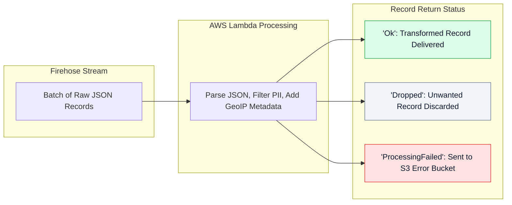
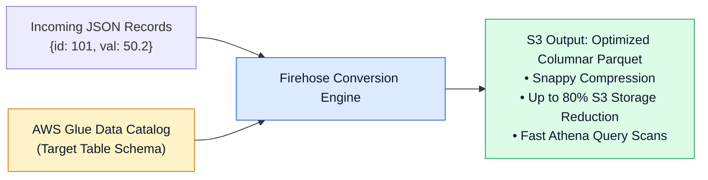
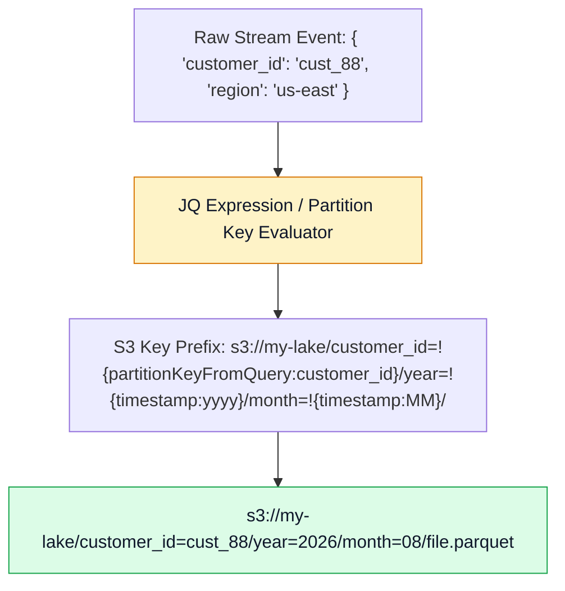

# 🚒 Amazon Data Firehose Streaming Delivery Pipelines

- **Category**: Analytics / Managed Streaming Delivery & ETL
- **Language / ဘာသာစကား**: [English (Original)](/en/02-services/analytics-streaming/kinesis/kinesis-firehose) | **မြန်မာဘာသာ (Burmese)**
- **Primary Use Case**: S3 data lakes, Redshift နှင့် OpenSearch များဆီသို့ native Parquet conversion နှင့် dynamic S3 partitioning တို့ဖြင့် serverless ဖြစ်ပြီး zero-maintenance streaming ingestion ပြုလုပ်ခြင်း။
- **Slide Reference**: `[AWSCertifiedDataEngineerSlides.pdf](/docs/AWSCertifiedDataEngineerSlides.pdf)` မှ Pages 436–450
- **Hub Links**: `[[mm/index|index]]` | `[[mm/02-services/analytics-streaming/kinesis/kinesis|kinesis]]` | `[[mm/02-services/storage/s3/s3|s3]]` | `[[mm/02-services/analytics-streaming/glue/glue-data-catalog|glue-data-catalog]]` | `[[mm/02-services/analytics-streaming/athena/athena|athena]]`

---

## 1. High-Level Summary

**Amazon Data Firehose** (ယခင်အမည် *Amazon Kinesis Data Firehose*) သည် streaming data များကို capture ပြုလုပ်ခြင်း၊ transform လုပ်ခြင်းနှင့် data lakes၊ data warehouses များနှင့် analytics tools များအတွင်းသို့ load လုပ်ပေးသည့် fully managed, serverless delivery service တစ်ခု ဖြစ်သည်။

Kinesis Data Streams နှင့်မတူဘဲ Firehose သည် **zero shard management** (shard များကို စီမံခန့်ခွဲရန် လုံးဝမလိုခြင်း) ဖြစ်ပြီး၊ ခန့်မှန်းရခက်သော data volume များအတွက် automatically scale ဖြစ်ကာ၊ သတ်မှတ်ထားသော **Buffer Size** နှင့် **Buffer Interval** threshold များအပေါ် အခြေခံ၍ records များကို near real-time micro-batches အနေဖြင့် deliver လုပ်ပေးသည်။

---

## 2. Supported Destinations & Integration Architecture

Firehose သည် streaming data များကို AWS destinations များနှင့် third-party analytic platforms များဆီသို့ native အနေဖြင့် deliver လုပ်ပေးနိုင်သည်:

| Destination Category | Supported Targets | Delivery Mechanism |
| :--- | :--- | :--- |
| **AWS Data Lake & Search** | **Amazon S3**, **Amazon OpenSearch Service** | S3 buckets များ သို့မဟုတ် OpenSearch indexing API အတွင်းသို့ တိုက်ရိုက် micro-batch PUT delivery ပြုလုပ်ခြင်း။ |
| **AWS Data Warehousing** | **Amazon Redshift** | ကြားခံ (intermediate) S3 bucket တစ်ခုတွင် micro-batches များကို stage လုပ်ပြီး Redshift `COPY` command ကို အလိုအလျောက် execute ပြုလုပ်ခြင်း။ |
| **Third-Party Analytic SaaS** | **Splunk**, **Datadog**, **Dynatrace**, **New Relic**, **Snowflake** | Authentication tokens များကို အသုံးပြု၍ HTTPS မှတစ်ဆင့် တိုက်ရိုက် delivery ပြုလုပ်ခြင်း။ |
| **Custom Endpoints** | **Generic HTTP / HTTPS Endpoints** | Configurable headers များနှင့် retry policies များဖြင့် JSON/raw payloads များကို deliver လုပ်ခြင်း။ |

---

## 3. Buffering Hints & Delivery Latency

Firehose သည် ဝင်ရောက်လာသော streaming records များကို destinations များသို့ မပို့ဆောင်မီ memory ထဲတွင် buffer လုပ်ထားသည်။ **မည်သည့်အခြေအနေက အရင်ပြည့်မီသည်ဖြစ်စေ** delivery ကို စတင် trigger လုပ်သည်:

- **Buffer Size**: **1 MB မှ 128 MB** အထိ configure ပြုလုပ်နိုင်သည် (default: 5 MB)။
- **Buffer Interval**: **60 seconds မှ 900 seconds (15 မိနစ်)** အထိ configure ပြုလုပ်နိုင်သည် (default: 300s)။
- **Near Real-Time သတ်မှတ်ချက် (Classification)**: Firehose ကို micro-batch delivery (**60s – 900s latency**) အတွက် ဒီဇိုင်းထုတ်ထားသည်။ သင့် application အတွက် sub-second processing latency လိုအပ်ပါက **Kinesis Data Streams (KDS)** ကို အစားထိုး အသုံးပြုရမည်။

---

## 4. In-Flight Lambda Transformations

Firehose သည် ဝင်ရောက်လာသော raw records များကို destinations များအတွင်းသို့ မထည့်သွင်းမီ transform ပြုလုပ်ရန် **AWS Lambda function** တစ်ခုကို invoke ခေါ်ယူနိုင်သည်:

- **Lambda Response Schema**: Batch ထဲရှိ record တိုင်းသည် အောက်ပါတို့ကို return ပြန်ပေးရမည်:
  - `recordId`: ဝင်ရောက်လာသော record identifier နှင့် ကိုက်ညီရမည်။
  - `result`: `"Ok"`, `"Dropped"` (ဥပမာ - debug logs များကို filter ထုတ်ပြီး ဖယ်ရှားခြင်း), သို့မဟုတ် `"ProcessingFailed"` ဖြစ်ရမည်။
  - `data`: Base64-encoded ပြုလုပ်ထားသော transformed data payload ဖြစ်ရမည်။
- **Lambda Invocation Timeout**: Batch တစ်ခုလျှင် အများဆုံး 5 မိနစ်အထိ ဖြစ်သည်။

---

## 5. Native Format Conversion: JSON to Apache Parquet / ORC

Firehose သည် ပြင်ပ Apache Spark သို့မဟုတ် AWS Glue ETL job များ မလိုအပ်ဘဲ raw streaming JSON များကို **Apache Parquet** သို့မဟုတ် **Apache ORC** အဖြစ် တိုက်ရိုက် convert လုပ်ပေးနိုင်သည်။

### Format Conversion Best Practices:
1. **Schema Reference**: Firehose သည် schema definitions (column names များနှင့် data types များ) ကို **AWS Glue Data Catalog table** မှ တိုက်ရိုက် ဖတ်ယူသည်။
2. **Buffer Sizing for Parquet**: ထိရောက်ပြီး ကြီးမားသော Parquet files များ ထွက်ရှိလာစေရန်နှင့် သေးငယ်သော small files ပေါင်း ထောင်ပေါင်းများစွာ ဖြစ်ပေါ်ခြင်းမှ ရှောင်ရှားရန် Firehose buffer size ကို **64 MB သို့မဟုတ် 128 MB** (maximum) အဖြစ် သတ်မှတ်ပါ။
3. **Downstream Benefits**: S3 API scan charges များကို သိသိသာသာ လျှော့ချပေးသည့်အပြင် **Amazon Athena**, **Amazon Redshift Spectrum** နှင့် **Amazon EMR** တို့တွင် query performance ကို အလိုအလျောက် optimize ဖြစ်စေသည်။

---

## 6. Dynamic Partitioning into Amazon S3

**Dynamic Partitioning** သည် streaming payloads များမှ record keys များကို တိုက်ရိုက် parse လုပ်ပြီး output records များကို partitioned S3 directory prefixes များအတွင်းသို့ real time အနေဖြင့် ရေးသားပေးသည်။

### Partitioning Key Configuration:
- ဝင်ရောက်လာသော JSON records များထဲမှ attributes များ (ဥပမာ - `customer_id`, `event_type`, `device_id`) ကို extract လုပ်ရန် **JQ Expressions** များကို အသုံးပြုသည်။
- Standard Hive-compatible partitions (`year=YYYY/month=MM/day=DD/`) များကို format ပြုလုပ်ပေးသည်။
- ညစဉ် run ရသော nightly ETL partition restructuring jobs များ run ရန် လိုအပ်မှုကို ဖယ်ရှားပေးသည်။

---

## 7. Source Record Backup & Error Handling

Firehose သည် data loss (ဒေတာဆုံးရှုံးမှု) မဖြစ်စေရန် S3 backup streams များကို ထောက်ပံ့ပေးသည်:
- **`BackupMode: FailedDataOnly`**: Lambda transformation၊ schema validation သို့မဟုတ် format conversion မအောင်မြင်သော records များကိုသာ S3 error prefix (ဥပမာ - `s3://backup-bucket/processing-failed/`) ထဲသို့ ရေးသားသိမ်းဆည်းသည်။
- **`BackupMode: AllData`**: မည်သည့် transformation သို့မဟုတ် conversion မျှ မပြုလုပ်မီ ဝင်ရောက်လာသော record တိုင်း၏ 100% ပြည့်စုံသော raw copy အားလုံးကို archive ပြုလုပ်သိမ်းဆည်းသည်။

---

## 8. DEA-C01 Exam Tips & Scenarios

> [!IMPORTANT]
> **Amazon Data Firehose အတွက် အဓိက စာမေးပွဲ Decision Triggers များ**:
>
> - **"Ingest streaming JSON logs into an S3 data lake in Apache Parquet format with zero server management"** $\rightarrow$ **AWS Glue Data Catalog** schema ကို reference လုပ်ထားသော **Record Format Conversion** ပါဝင်သည့် **Amazon Data Firehose** ကို အသုံးပြုပါ။
> - **"Organize streaming S3 output records dynamically by customer ID and year/month without post-processing ETL"** $\rightarrow$ JQ partition expressions များဖြင့် Firehose **Dynamic Partitioning** ကို enable လုပ်ပါ။
> - **"Need to stream IoT records into Amazon Redshift automatically"** $\rightarrow$ **Redshift destination ပါဝင်သော Amazon Data Firehose delivery stream** ကို configure လုပ်ပါ (Firehose သည် S3 တွင် data ကို အလိုအလျောက် stage လုပ်ပြီး `COPY` command ကို execute လုပ်ပေးသည်)။
> - **"Filter out PII fields or discard debug log records before streaming data to an OpenSearch cluster"** $\rightarrow$ Status `"Ok"` သို့မဟုတ် `"Dropped"` return ပြန်ပေးသော **AWS Lambda function** ကို အသုံးပြု၍ **In-Flight Data Transformation** ကို enable လုပ်ပါ။
> - **"Streaming data produces thousands of tiny 500 KB Parquet files in S3 causing slow Athena queries"** $\rightarrow$ Firehose **Buffer Size ကို 128 MB** နှင့် **Buffer Interval ကို 900 seconds** အထိ တိုးမြှင့်သတ်မှတ်ပါ။

---

## 📌 Related Notes
- `[[mm/02-services/analytics-streaming/kinesis/kinesis|kinesis]]` — Kinesis Streaming Ecosystem Overview Hub
- `[[mm/02-services/analytics-streaming/kinesis/kinesis-data-streams|kinesis-data-streams]]` — KDS Ingestion & Shard Architecture
- `[[mm/02-services/analytics-streaming/glue/glue-data-catalog|glue-data-catalog]]` — Firehose Schema Lookups အတွက် Glue Metastore
- `[[mm/02-services/analytics-streaming/athena/athena|athena]]` — Serverless SQL ဖြင့် Firehose Parquet Output ကို Query ပြုလုပ်ခြင်း
