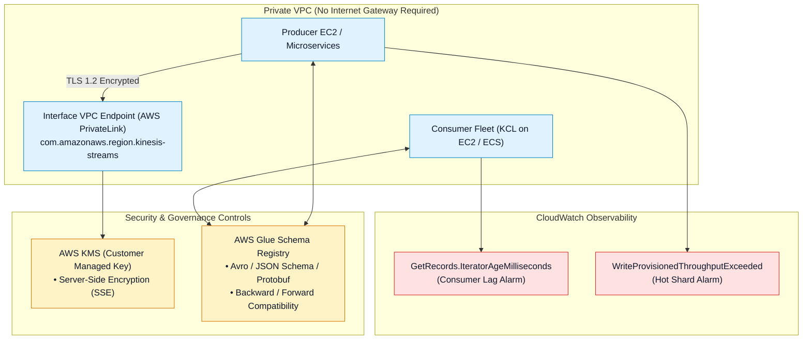
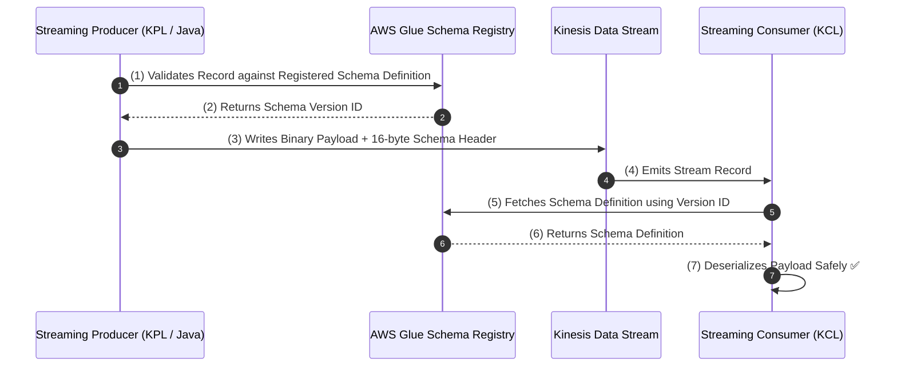
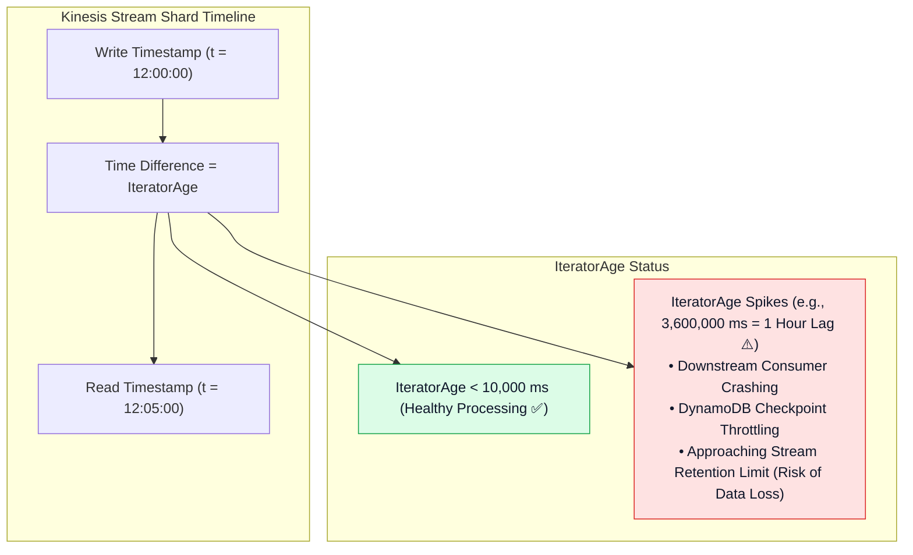

# 🛡️ Kinesis Security, Governance & CloudWatch Monitoring

- **Category**: Analytics / Stream Security, Network Isolation & Observability
- **Language / ဘာသာစကား**: [English (Original)](/en/02-services/analytics-streaming/kinesis/kinesis-security-and-monitoring) | **မြန်မာဘာသာ (Burmese)**
- **Primary Use Case**: Stream payloads များကို KMS နှင့် VPC PrivateLink ဖြင့် လုံခြုံအောင် ပြုလုပ်ခြင်း၊ Glue Schema Registry မှတစ်ဆင့် stream schemas များကို စစ်ဆေးအတည်ပြုခြင်း (validating) နှင့် `IteratorAgeMilliseconds` မှတစ်ဆင့် consumer lag ကို စောင့်ကြည့်ထောက်လှမ်းခြင်း။
- **Slide Reference**: Pages 446–459 in `[AWSCertifiedDataEngineerSlides.pdf](/docs/AWSCertifiedDataEngineerSlides.pdf)`
- **Hub Links**: `[[mm/index|index]]` | `[[mm/02-services/analytics-streaming/kinesis/kinesis|kinesis]]` | `[[mm/02-services/analytics-streaming/kinesis/kinesis-data-streams|kinesis-data-streams]]` | `[[mm/02-services/analytics-streaming/glue/glue-schema-registry|glue-schema-registry]]` | `[[security-and-compliance]]`

---

## 1. High-Level Summary

Enterprise အဆင့် production streaming workloads များကို လည်ပတ်ရာတွင် တိကျခိုင်မာသော **Security Controls** (at-rest KMS encryption၊ in-transit TLS နှင့် private VPC routing)၊ **Schema Governance** (AWS Glue Schema Registry မှတစ်ဆင့် contract သတ်မှတ်ထိန်းချုပ်ခြင်း) နှင့် **Real-Time Observability** (CloudWatch metrics၊ alarms နှင့် lag ခြေရာခံခြင်း) တို့ လိုအပ်ပါသည်။

Amazon Kinesis ecosystem တစ်ခုလုံးတွင် လုပ်ငန်းလည်ပတ်မှုဆိုင်ရာ အရေးအကြီးဆုံး metric မှာ **`GetRecords.IteratorAgeMilliseconds`** ဖြစ်ပြီး၊ ၎င်းသည် consumer ၏ data လုပ်ဆောင်မှုဆိုင်ရာ latency ကို တိုက်ရိုက်တိုင်းတာပေးကာ data ဆုံးရှုံးမှု မဖြစ်ပေါ်အောင် ကာကွယ်ပေးပါသည်။

---

## 2. Security & Network Isolation Architecture

### 1. Encryption at Rest & in Transit
- **Server-Side Encryption (SSE)**: Kinesis shards များအတွင်းရှိ data records များကို disk ပေါ်သို့ မရေးသားမီ at rest အနေအထားတွင် encrypt ပြုလုပ်ရန် **AWS KMS** ကို အသုံးပြုသည်။ AWS Managed Keys (`aws/kinesis`) နှင့် Customer Managed Keys (CMKs) နှစ်မျိုးလုံးကို ထောက်ပံ့ပေးသည်။
- **In-Transit Encryption**: API ဆက်သွယ်မှုများအားလုံး (`PutRecord`၊ `PutRecords`၊ `GetRecords` နှင့် `SubscribeToShard`) သည် **TLS 1.2 / HTTPS** ကို မဖြစ်မနေ အသုံးပြုရမည် (enforce) ဖြစ်သည်။

### 2. AWS PrivateLink (VPC Endpoints) မှတစ်ဆင့် Network Isolation ပြုလုပ်ခြင်း
- မိမိ၏ private subnets များအတွင်း **Interface VPC Endpoints** (`com.amazonaws.<region>.kinesis-streams` နှင့် `com.amazonaws.<region>.kinesis-firehose`) များကို configure ပြုလုပ်ပါ။
- Internet Gateway သို့မဟုတ် NAT Gateway မလိုအပ်ဘဲ EC2 instances၊ Lambda functions နှင့် containerized workloads များသည် private AWS network backbones ပေါ်မှတစ်ဆင့် streaming records များကို လုံခြုံစိတ်ချစွာ publish နှင့် consume ပြုလုပ်နိုင်စေသည်။

### 3. IAM Least-Privilege Policies
- Producers များအတွက် `kinesis:PutRecord` နှင့် `kinesis:PutRecords` permissions လိုအပ်သည်။
- Standard consumers များအတွက် `kinesis:GetRecords`၊ `kinesis:GetShardIterator` နှင့် `kinesis:DescribeStream` permissions လိုအပ်သည်။
- Enhanced Fan-Out consumers များအတွက် `kinesis:SubscribeToShard` permission လိုအပ်သည်။

---

## 3. Real-Time Schema Governance: AWS Glue Schema Registry

**AWS Glue Schema Registry** သည် real-time streams များအတွက် တိကျသော data quality နှင့် schema evolution rules များကို သေချာစေသည် (**Apache Avro**၊ **JSON Schema** နှင့် **Protocol Buffers (Protobuf)** တို့ကို ထောက်ပံ့ပေးသည်)။

### Schema Evolution Compatibility Modes:
- **`BACKWARD` / `BACKWARD_ALL`**: Schema အသစ်သည် ရှေး schema အဟောင်းများဖြင့် ရေးသားထားသော data များကို ဖတ်ရှုနိုင်သည် (optional fields များကို delete လုပ်ခြင်း သို့မဟုတ် default values ပါသော fields များကို အသစ်ထည့်သွင်းခြင်း ပြုလုပ်နိုင်သည်)။
- **`FORWARD` / `FORWARD_ALL`**: Consumer အဟောင်းများသည် schema အသစ်များဖြင့် ရေးသားထားသော data များကို ဖတ်ရှုနိုင်သည်။
- **`FULL` / `FULL_ALL`**: Backward နှင့် forward နှစ်ဖက်လုံးအတွက် အပြန်အလှန် (bidirectional) compatibility ကို အာမခံပေးသည်။
- **`NONE`**: Compatibility validation စစ်ဆေးမှုများကို ပိတ်ထားသည်။

---

## 4. CloudWatch Metrics & Monitoring `IteratorAgeMilliseconds`

### DEA-C01 အတွက် အဓိက CloudWatch Metrics များ:

| Metric Name | Source / Focus | Meaning & Alarm Recommendation |
| :--- | :--- | :--- |
| **`GetRecords.IteratorAgeMilliseconds`** | Consumer | **Consumer Lag**။ Shard တစ်ခုမှ ဖတ်ရှုသော သက်တမ်းအရင့်ဆုံး record ၏ အချိန် (age) ကို တိုင်းတာသည်။ ဤ metric အဆက်မပြတ် မြင့်တက်လာပါက alarm သတ်မှတ်ထားသင့်သည်။ |
| **`WriteProvisionedThroughputExceeded`** | Producer | **Write Throttling**။ Ingress throughput သည် shard တစ်ခုလျှင် 1 MB/s သို့မဟုတ် 1,000 records/s ထက်ကျော်လွန်နေခြင်း သို့မဟုတ် **Hot Shard** တစ်ခု ဖြစ်ပေါ်နေခြင်းကို ဖော်ပြသည်။ |
| **`ReadProvisionedThroughputExceeded`** | Consumer | **Read Throttling**။ Standard consumer ၏ ဖတ်ရှုမှုနှုန်းသည် shard တစ်ခုလျှင် 2 MB/s သို့မဟုတ် `GetRecords` calls 5 ကြိမ်/s ထက်ကျော်လွန်နေခြင်းကို ဖော်ပြသည်။ |
| **`IncomingBytes` / `IncomingRecords`** | Stream | Real-time write volume။ Provisioned mode တွင် auto-scaling triggers အဖြစ် အသုံးပြုသည်။ |
| **`DeliveryToS3.Success`** (Firehose) | Firehose | S3 သို့ အောင်မြင်စွာ micro-batch ပေးပို့နိုင်မှု ရာခိုင်နှုန်း (100% ဖြစ်သင့်သည်)။ |
| **`ExecuteProcessing.Success`** (Firehose) | Firehose | Inline AWS Lambda data transformations များ၏ အောင်မြင်မှုနှုန်း (success rate)။ |

---

## 5. DEA-C01 Exam Tips & Scenarios

> [!IMPORTANT]
> **Kinesis Security & Monitoring အတွက် Key Exam Decision Triggers များ**:
>
> - **"Downstream consumer တစ်ခုသည် Kinesis stream ထက် နောက်ကျကျန်နေကြောင်း (falling behind) မည်သည့် CloudWatch metric က ဖော်ပြသနည်း?"** $\rightarrow$ **`GetRecords.IteratorAgeMilliseconds`**။
> - **"Kinesis Data Streams အတွင်းရှိ sensitive streaming data records များကို at rest အနေအထားတွင် encrypt ပြုလုပ်ရန် မည်သို့ဆောင်ရွက်ရမည်နည်း?"** $\rightarrow$ **AWS KMS ဖြင့် Server-Side Encryption (SSE)** ကို enable ပြုလုပ်ပါ။
> - **"Internet access မရှိသော private subnet အတွင်းရှိ EC2 instances များသည် KDS ထဲသို့ records များကို stream ပြုလုပ်ရမည်"** $\rightarrow$ Kinesis အတွက် **Interface VPC Endpoint (AWS PrivateLink)** တစ်ခုကို ဖန်တီးပါ။
> - **"Data contracts များကို enforce လုပ်ပြီး malformed data payloads များ streaming pipeline သို့ ရောက်ရှိမလာစေရန် တားဆီးရန်"** $\rightarrow$ `BACKWARD` သို့မဟုတ် `FULL` compatibility rules ဖြင့် **AWS Glue Schema Registry** နှင့် ချိတ်ဆက်ပေါင်းစပ်ပါ။
> - **"CloudWatch တွင် `WriteProvisionedThroughputExceeded` alerts များ ပြသနေသော်လည်း total incoming stream volume မှာ provisioned capacity ၏ 40% သာရှိသည်"** $\rightarrow$ **Hot Shard** ဖြစ်ပေါ်နေမှုကို ရှင်းလင်းရန် **Partition Key distribution** ကို စစ်ဆေးစုံစမ်းပါ။

---

## 📌 Related Notes
- `[[mm/02-services/analytics-streaming/kinesis/kinesis|kinesis]]` — Kinesis Streaming Ecosystem Overview Hub
- `[[mm/02-services/analytics-streaming/kinesis/kinesis-data-streams|kinesis-data-streams]]` — KDS Ingestion & Shard Architecture
- `[[mm/02-services/analytics-streaming/kinesis/kinesis-consumers-and-scaling|kinesis-consumers-and-scaling]]` — KCL & Enhanced Fan-Out
- `[[mm/02-services/analytics-streaming/glue/glue-schema-registry|glue-schema-registry]]` — AWS Glue Schema Registry Deep Dive
- `[[security-and-compliance]]` — Cloud Security & Encryption Governance
