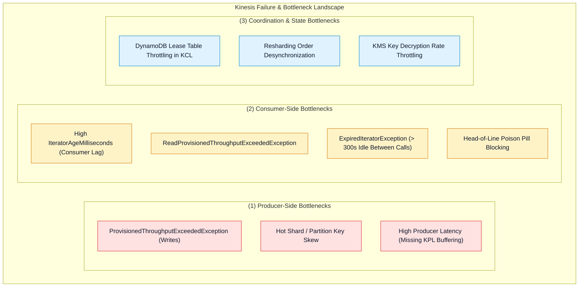
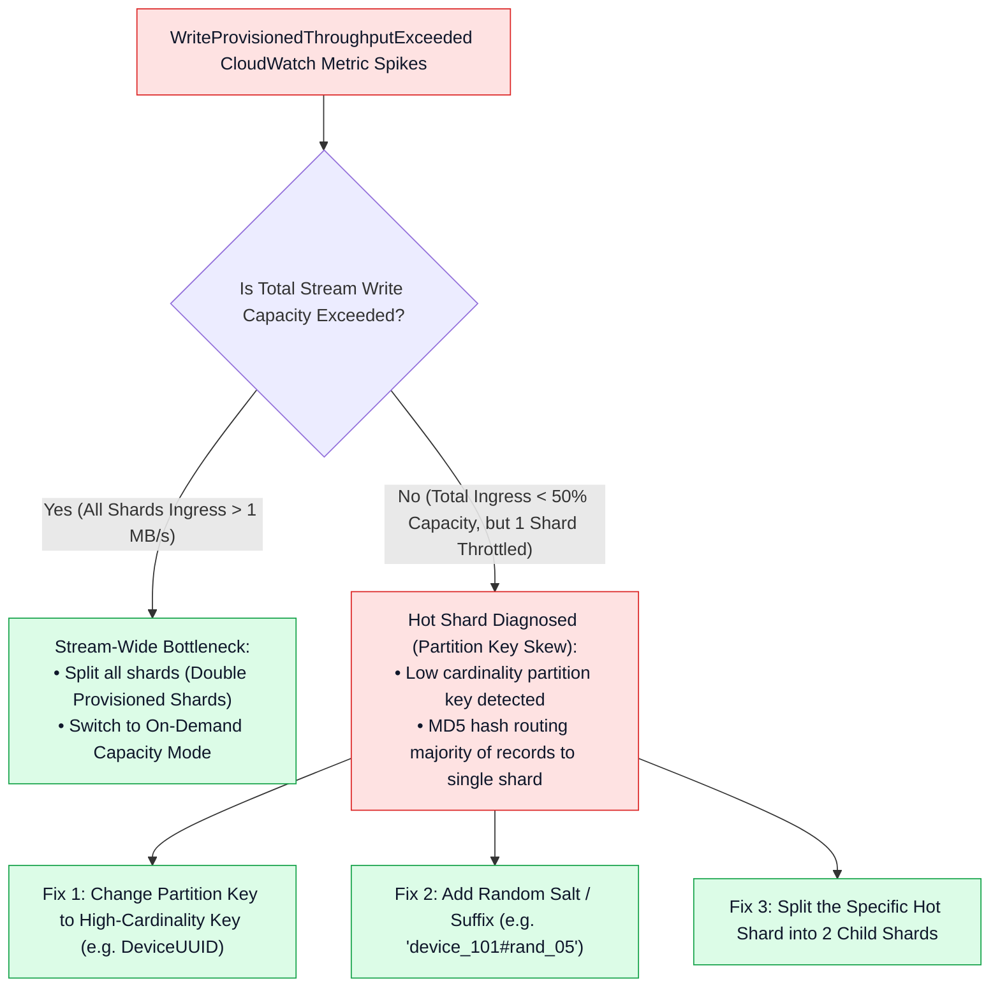
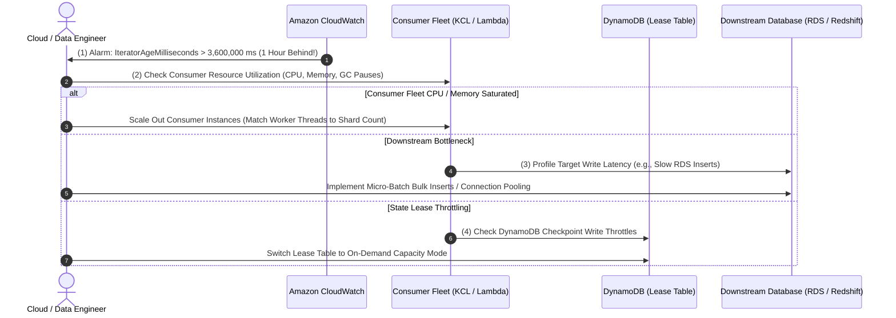
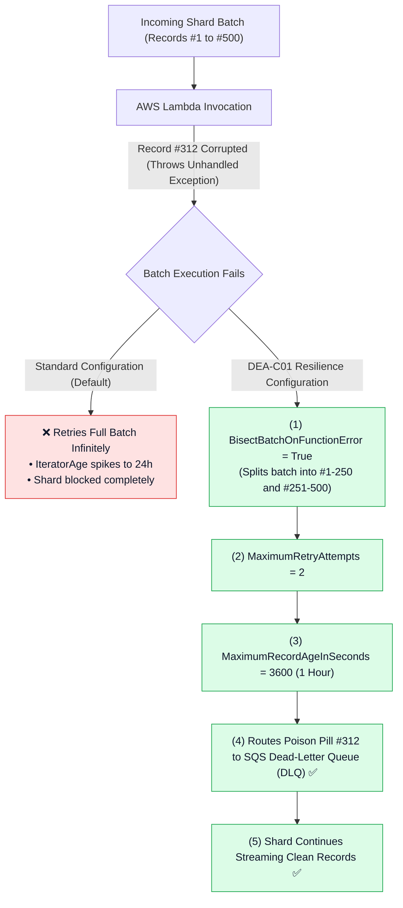
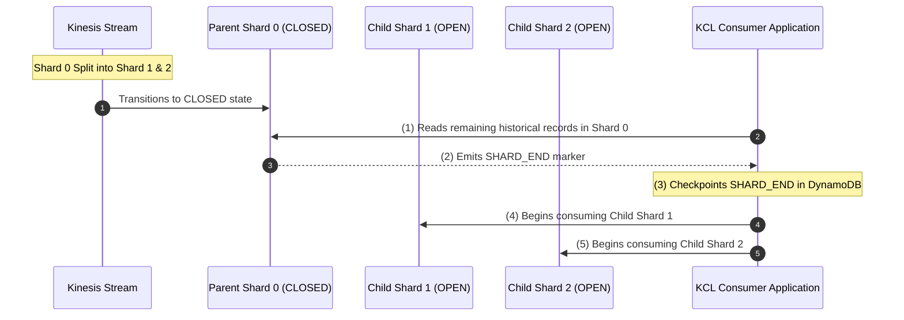

# 🔧 Kinesis Data Streams Troubleshooting & Performance Tuning

- **Category**: Analytics / Production Troubleshooting, Performance Optimization & Resilience
- **Language / ဘာသာစကား**: [English (Original)](/en/02-services/analytics-streaming/kinesis/kinesis-troubleshooting-and-tuning) | **မြန်မာဘာသာ (Burmese)**
- **Primary Use Case**: Producer/consumer throttling များကို ရှာဖွေဖော်ထုတ်ခြင်း၊ consumer lag (`IteratorAgeMilliseconds`) ကို စုံစမ်းစစ်ဆေးခြင်း၊ KCL/DynamoDB lease performance ကို tune ပြုလုပ်ခြင်း နှင့် poison pill blocking ပြဿနာများကို ဖြေရှင်းခြင်း။
- **Slide Reference**: `[[AWSCertifiedDataEngineerSlides.pdf]]` မှ Pages 420–459
- **Hub Links**: `[[mm/index]]` | `[[kinesis]]` | `[[kinesis-data-streams]]` | `[[kinesis-consumers-and-scaling]]` | `[[kinesis-security-and-monitoring]]`

---

## 1. High-Level Summary (အကျဉ်းချုပ် ခြုံငုံသုံးသပ်ချက်)

Amazon Kinesis Data Streams ကို high throughput ဖြင့် လည်ပတ်အသုံးပြုရာတွင် **Producers** (write throttling, hot shards, buffering timeouts)၊ **Stream Infrastructure** (hash-key space fragmentation, capacity limits) နှင့် **Consumers** (read throttling, `IteratorAgeMilliseconds` processing lag, KCL DynamoDB checkpoint stalls နှင့် poison pill head-of-line blocking) စသည့် အဆင့်တိုင်းတွင် စနစ်တကျ troubleshooting ပြုလုပ်ရန် လိုအပ်ပါသည်။

ဤတိကျသော failure modes များနှင့် tuning mechanisms များကို ကျွမ်းကျင်စွာ နားလည်သဘောပေါက်ထားခြင်းသည် **AWS Certified Data Engineer - Associate (DEA-C01)** စာမေးပွဲတွင် အမေးအများဆုံး domain areas များထဲမှ တစ်ခုဖြစ်ပါသည်။

---

## 2. Producer Troubleshooting: Throttling & Hot Shards

### 1. Diagnosing `ProvisionedThroughputExceededException` (Writes)
Producer တစ်ခုမှ Kinesis Data Streams သို့ data ရေးသားသောအခါ AWS သည် shard တစ်ခုစီအတွက် အောက်ပါ hard limits နှစ်ခုကို ကန့်သတ်သတ်မှတ်ထားပါသည်-
- **1 MB / second** data ingress
- **1,000 records / second** write transactions

### 2. Producer Performance Tuning Best Practices
- **Exponential Backoff with Full Jitter**: Raw AWS SDK implementations များတွင် "thundering herd" retry storms မဖြစ်ပေါ်စေရန် randomized jitter ပါဝင်သော exponential backoff ဖြင့် retries များကို အမြဲတမ်း configure လုပ်ထားသင့်ပါသည်။
- **Kinesis Producer Library (KPL) Aggregation**: Micro-record payloads များ (ဥပမာ- 200-byte IoT telemetry) အတွက် KPL record aggregation ကို enable ပြုလုပ်ပါ။ Aggregation သည် user records ရာပေါင်းများစွာကို 1 MB ပမာဏရှိ Kinesis protocol buffer record တစ်ခုတည်းအဖြစ် ပေါင်းစည်းပေးပြီး shard တစ်ခုလျှင် 1,000 records/sec ကန့်သတ်ချက်ကို bypass လုပ်ကျော်လွှားပေးနိုင်ပါသည်။
- **Tune `RecordMaxBufferedTime`**: KPL buffer timeout ကို လိုအပ်သလို ချိန်ညှိပါ (default: 100ms)။ ၎င်းကို 250ms–500ms သို့ တိုးမြှင့်ပေးခြင်းဖြင့် high throughput အတွက် batching စွမ်းဆောင်ရည်ကို ကောင်းမွန်စေပြီး၊ လျှော့ချပေးပါက real-time systems များအတွက် latency ကို လျော့နည်းစေပါသည်။

---

## 3. Consumer Troubleshooting: Read Limits & `IteratorAge` Lag

### 1. Resolving `ReadProvisionedThroughputExceededException`
- **Cause (အကြောင်းရင်း)**: Standard consumers များသည် shard တစ်ခုစီအတွက် **2 MB / second** read throughput နှင့် အများဆုံး **5 `GetRecords` transactions/second** ကို အတူတကွ မျှဝေ (share) သုံးစွဲကြရပါသည်။ အကယ်၍ သီးခြား application ၃ ခု သို့မဟုတ် ထို့ထက်ပိုသော application များသည် standard fan-out ကို အသုံးပြု၍ တူညီသော shard ကို တစ်ပြိုင်နက် poll လုပ်ပါက တစ်ခုနှင့်တစ်ခု throttle ဖြစ်စေမည် ဖြစ်ပါသည်။
- **Solution (ဖြေရှင်းနည်း)**:
  - High-priority သို့မဟုတ် latency-sensitive ဖြစ်သော consumers များကို **Enhanced Fan-Out (EFO)** သို့ ပြောင်းရွှေ့ (migrate) ပါ။ EFO သည် registered consumer တစ်ခုစီအတွက် သီးသန့် **2 MB/second HTTP/2 push pipeline** (`SubscribeToShard`) ကို သတ်မှတ်ပေးသောကြောင့် standard read limits များကို လုံးဝ bypass လုပ်ကျော်လွှားနိုင်ပါသည်။

---

### 2. Deep Dive: `GetRecords.IteratorAgeMilliseconds` Troubleshooting Workflow

`IteratorAgeMilliseconds` metric သည် stream ထဲသို့ data ရေးသားခဲ့သည့် timestamp နှင့် နှိုင်းယှဉ်၍ consumer မှ နောက်ဆုံးဖတ်ရှုခဲ့သော record ၏ သက်တမ်း (age) ကို တိုင်းတာပေးပါသည်။ အကယ်၍ ဤ metric သည် တောက်လျှောက် မြင့်တက်နေပါက consumer သည် real-time stream ingestion ထက် နောက်ကျကျန်ရစ်နေခြင်း (falling behind) ဖြစ်ပါသည်။

### Common Root Causes of Consumer Lag & Solutions (Consumer Lag ဖြစ်ရသည့် အဖြစ်များသော အကြောင်းရင်းများနှင့် ဖြေရှင်းနည်းများ):

| Root Cause (အဓိက အကြောင်းရင်း) | Diagnostic Indicator (ရှာဖွေတွေ့ရှိချက် အညွှန်း) | Solution / Remediation (ဖြေရှင်းချက် / ကုစားမှု) |
| :--- | :--- | :--- |
| **Worker Under-Provisioning** | KCL worker threads အရေအတွက် < Stream shards အရေအတွက် ဖြစ်နေခြင်း။ | `Worker Instances = Shard Count` ဖြစ်သည်အထိ (1:1 ratio အထိ) consumer instances များကို scale out ပြုလုပ်ပါ။ |
| **Slow Processing Loop** | Consumer သည် record တစ်ခုစီကို synchronously process လုပ်ရာတွင် 500ms+ ကြာမြင့်နေခြင်း။ | Asynchronous processing၊ in-memory worker pools သို့မဟုတ် bulk micro-batching များကို အကောင်အထည်ဖော်ပါ။ |
| **Downstream Target Latency** | Target database (RDS / Redshift / DynamoDB) ပေါ်တွင် queries နှေးကွေးခြင်း / write lock contention ဖြစ်ပွားခြင်း။ | Bulk `COPY` / `BatchWriteItem` ကို အသုံးပြုပါ၊ connection pooling ကို enable လုပ်ပါ သို့မဟုတ် S3 မှတစ်ဆင့် အရင် buffer လုပ်ပါ။ |
| **DynamoDB Lease Throttling** | KCL DynamoDB checkpoint table ပေါ်တွင် `ProvisionedThroughputExceededException` ဖြစ်ပေါ်ခြင်း။ | DynamoDB Write Capacity Units (WCU) ကို တိုးမြှင့်ပါ သို့မဟုတ် DynamoDB table ကို **On-Demand Mode** သို့ ပြောင်းလဲပါ။ |
| **Garbage Collection Pauses** | Java KCL applications များတွင် JVM "Stop the World" pauses မကြာခဏ ဖြစ်ပေါ်ခြင်း။ | JVM heap flags များကို optimize ပြုလုပ်ပါ (`-XX:+UseG1GC`, `-Xms` / `-Xmx`)၊ container RAM ကို တိုးမြှင့်ပေးပါ။ |

---

### 3. Fixing `ExpiredIteratorException`
- **Cause (အကြောင်းရင်း)**: Shard iterators များကို အသုံးမပြုပါက **စက္ကန့် ၃၀၀ (၅ မိနစ်)** အကြာတွင် သက်တမ်းကုန်ဆုံး (expire) သွားပါသည်။ ၎င်းသည် consumer တစ်ခုမှ `GetRecords` ကို နောက်တစ်ကြိမ် ထပ်မံမခေါ်ယူမီ batch တစ်ခုကို process လုပ်ရန် ၅ မိနစ်ထက် ပိုမိုကြာမြင့်နေချိန်တွင် သို့မဟုတ် processing ရပ်တန့် (stall) သွားချိန်တွင် ဖြစ်ပွားပါသည်။
- **Solution (ဖြေရှင်းနည်း)**: `ExpiredIteratorException` ကို catch လုပ်ပြီး နောက်ဆုံး commit လုပ်ထားသော checkpoint ကို ညွှန်ပြသည့် `AFTER_SEQUENCE_NUMBER` ဖြင့် `GetShardIterator` ကို ခေါ်ယူကာ iterator အသစ်တစ်ခု တောင်းဆိုပါ၊ ထို့အပြင် consumer batch sizes (`BatchSize` / `MaxRecords`) များကို လျှော့ချပေးပါ။

---

## 4. Lambda Stream Consumer Tuning & Poison Pill Isolation

AWS Lambda သည် Event Source Mapping မှတစ်ဆင့် Kinesis records များကို process လုပ်သောအခါ ပုံစံမမှန်သော payload (malformed payload) တစ်ခုတည်းကြောင့်ပင် အဆုံးမရှိ retry ခေါ်ယူမှုများ ဖြစ်ပေါ်စေပြီး shard တစ်ခုလုံးကို ပိတ်ဆို့သွားစေနိုင်ပါသည် (**Head-of-Line Blocking**).

### Lambda Kinesis Performance Knobs:
1. **`ParallelizationFactor` (1 မှ 10 အထိ)**:
   - **Shard တစ်ခုစီအတွက်** concurrency ကို scale ပြုလုပ်ပေးပါသည်။ ပုံမှန်အားဖြင့် Lambda သည် shard တစ်ခုလျှင် batch တစ်ခုကိုသာ concurrent process လုပ်ပါသည်။
   - `ParallelizationFactor` ကို 5 သို့ တိုးမြှင့်လိုက်ပါက Lambda သည် shard တစ်ခုတည်းပေါ်တွင် သီးခြား partition key subsets ၅ ခုကို တစ်ပြိုင်နက် process လုပ်ခွင့်ရရှိစေပြီး partition key အလိုက် sequential processing ဖြစ်မှုကို အာမခံချက်ပေးကာ throughput ကို 5 ဆအထိ တိုးတက်စေပါသည်။
2. **`BisectBatchOnFunctionError: true`**:
   - Error ဖြစ်စေသော record တစ်ခုချင်းစီကို တိကျစွာ မဖော်ထုတ်နိုင်မချင်း မအောင်မြင်သော batch ကို ထက်ဝက်စီ အဆင့်ဆင့်ခွဲထုတ်ပြီး bad records များကို အလိုအလျောက် သီးခြားခွဲထုတ် (isolate) ပေးပါသည်။
3. **`On-Failure Destination` (Dead-Letter Queue)**:
   - Retry သို့မဟုတ် age limits ကျော်လွန်သွားသဖြင့် စွန့်ပစ်လိုက်သော records များအတွက် Amazon SQS queue သို့မဟုတ် Amazon SNS topic destination ကို configure ပြုလုပ်ပေးပါသည်။

---

## 5. Resharding Performance & Ordering Guarantees

### Key Resharding Rules for the Exam (စာမေးပွဲအတွက် အဓိက Resharding စည်းမျဉ်းများ):
1. **Preserving Order Across Shard Splits & Merges**: Parent shard အတွင်းရှိ records အားလုံးကို `SHARD_END` အထိ အပြည့်အဝ ဖတ်ရှုပြီးခြင်း မရှိသေးသရွေ့ KCL သည် child shards များထံမှ record များကို **ဘယ်တော့မှ** ဖတ်မည် မဟုတ်ပါ။
2. **Resharding API Limits**:
   - Stream သည် `UPDATING` state တွင် ရှိနေပါက shard ကို split သို့မဟုတ် merge ပြုလုပ်၍ မရပါ။
   - Stream တစ်ခုလျှင် တစ်ပြိုင်နက်တည်း အများဆုံး **5 active resharding operations** အထိသာ reshard ပြုလုပ်နိုင်ပါသည်။

---

## 6. Master Troubleshooting & Resolution Matrix

| Symptom / Error Message (လက္ခဏာ / Error သတင်းစကား) | Root Cause (အဓိက အကြောင်းရင်း) | Immediate Remediation (ချက်ချင်း ကုစားဖြေရှင်းနည်း) | Architectural Long-Term Fix (ရေရှည် ဗိသုကာဆိုင်ရာ ပြင်ဆင်ချက်) |
| :--- | :--- | :--- | :--- |
| `PutRecord` တွင် `ProvisionedThroughputExceededException` ဖြစ်ပေါ်ခြင်း | Shard တစ်ခုအတွက် Write rate > 1 MB/s သို့မဟုတ် > 1,000 records/s ဖြစ်နေခြင်း။ | Producer SDK တွင် jitter ပါဝင်သော exponential backoff ကို အကောင်အထည်ဖော်ပါ။ | Partition keys များတွင် random salt ထည့်သွင်းပါ သို့မဟုတ် **On-Demand Mode** သို့ ပြောင်းလဲပါ။ |
| `GetRecords` တွင် `ProvisionedThroughputExceededException` ဖြစ်ပေါ်ခြင်း | Standard consumers အားလုံးပေါင်း၏ Read rate > 2 MB/s သို့မဟုတ် > 5 transactions/s ဖြစ်နေခြင်း။ | `GetRecords` polling frequency ကို လျှော့ချပါ။ | Consumers များကို **Enhanced Fan-Out (EFO)** သို့ upgrade ပြုလုပ်ပါ။ |
| `GetRecords.IteratorAgeMilliseconds` တဖြည်းဖြည်း မြင့်တက်လာခြင်း | Consumer ၏ processing rate သည် stream write rate ထက် ပိုမိုနှေးကွေးနေခြင်း။ | Total shard count အထိ consumer instances များကို scale out ပြုလုပ်ပါ။ | Lambda `ParallelizationFactor` ကို တိုးမြှင့်ပါ သို့မဟုတ် downstream database writes များကို tune ပြုလုပ်ပါ။ |
| `ExpiredIteratorException` | Consumer သည် `GetRecords` calls ကြားတွင် စက္ကန့် ၃၀၀ ထက် ပိုမိုကြာမြင့်နေခြင်း။ | Exception ကို catch လုပ်ပြီး နောက်ဆုံး checkpoint မှ iterator အသစ်ကို fetch လုပ်ပါ။ | Consumer `BatchSize` ကို လျှော့ချပါ သို့မဟုတ် processing loop ကို ပိုမိုမြန်ဆန်အောင် ပြုလုပ်ပါ။ |
| ပျက်စီးနေသော record တစ်ခုတည်းကြောင့် Shard processing ပိတ်ဆို့သွားခြင်း | Lambda consumer တွင် poison pill unhandled exception ဖြစ်ပေါ်ခြင်း။ | `BisectBatchOnFunctionError = true` ကို enable ပြုလုပ်ပါ။ | Amazon SQS DLQ သို့ `On-Failure Destination` ကို configure ပြုလုပ်ပါ။ |
| KCL workers များမှ lease / checkpoint exceptions များ ထုတ်ပြန်ခြင်း | DynamoDB lease table တွင် write throttling ဖြစ်ပေါ်နေခြင်း။ | DynamoDB lease table တွင် provisioned WCU ကို တိုးမြှင့်ပါ။ | DynamoDB lease table ကို **On-Demand Capacity Mode** သို့ ပြောင်းလဲပါ။ |
| Producer network latency နှင့် ကုန်ကျစရိတ် မြင့်မားနေခြင်း | Batch မလုပ်ထားသော သေးငယ်သည့် micro-records ထောင်ပေါင်းများစွာကို ပေးပို့နေခြင်း။ | KPL **Record Aggregation** နှင့် **Record Collection** ကို enable ပြုလုပ်ပါ။ | Kinesis Agent သို့မဟုတ် `RecordMaxBufferedTime` ကို tune လုပ်ထားသော KPL ကို အသုံးပြုပါ။ |

---

## 7. DEA-C01 Exam Tips & Scenarios

> [!IMPORTANT]
> **Kinesis Troubleshooting & Tuning ဆိုင်ရာ စာမေးပွဲအတွက် အဓိက ဆုံးဖြတ်ချက်လမ်းညွှန်များ (Key Exam Decision Triggers)**:
>
> - **"Stream တစ်ခုလုံး၏ ingress သည် capacity ၏ 40% အောက်တွင်သာ ရှိနေသော်လည်း IoT devices အုပ်စုတစ်ခုသည် `ProvisionedThroughputExceededException` ကို လက်ခံရရှိနေသည်"** $\rightarrow$ ၎င်းကို **Hot Shard** အဖြစ် သတ်မှတ်ဖော်ထုတ်နိုင်ပါသည်။ ဖြေရှင်းရန်အတွက် **partition key ကို random integers များဖြင့် salt ပြုလုပ်ပါ** သို့မဟုတ် partition key ကို `device_id` သို့ ပြောင်းလဲပါ။
> - **"Kinesis မှ data ဖတ်ရှုနေသော Lambda function တစ်ခုသည် ပုံစံမမှန်သော malformed records များကြောင့် head-of-line blocking ဖြစ်ပေါ်နေသည်"** $\rightarrow$ **`BisectBatchOnFunctionError: true`** ကို configure ပြုလုပ်ပါ၊ **`MaximumRetryAttempts`** ကို ကန့်သတ်ပါ၊ မအောင်မြင်သော records များကို **Amazon SQS Dead-Letter Queue (DLQ)** သို့ လမ်းကြောင်းလွှဲပေးပါ။
> - **"မတူညီကွဲပြားသော partition keys များရှိသည့် high-throughput shard တစ်ခုပေါ်တွင် Consumer lag (`IteratorAgeMilliseconds`) မြင့်မားနေသည်"** $\rightarrow$ AWS Lambda **`ParallelizationFactor`** ကို တိုးမြှင့်ပေးပါ (shard တစ်ခုလျှင် concurrent invocations ၁၀ ခုအထိ)။
> - **"တူညီသော Kinesis shard တစ်ခုတည်းမှ ဖတ်ရှုနေသည့် microservice applications အများအပြားသည် တစ်ခုနှင့်တစ်ခု throttle ဖြစ်စေနေသည်"** $\rightarrow$ Consumers အားလုံးကို သီးသန့် 2 MB/s HTTP/2 push connections ပါဝင်သော **Enhanced Fan-Out (EFO)** သို့ ပြောင်းရွှေ့ (migrate) ပါ။
> - **"Checkpointing ပြုလုပ်ချိန်တွင် KCL consumer application သည် crash ဖြစ်ပြီး DynamoDB throughput errors များကို log ထုတ်ပြနေသည်"** $\rightarrow$ KCL state tracking table ကို **DynamoDB On-Demand Capacity Mode** သို့ ပြောင်းလဲသတ်မှတ်ပါ။
> - **"Batch processing ပြုလုပ်နေစဉ် Consumer သည် `ExpiredIteratorException` ကို လက်ခံရရှိသည်"** $\rightarrow$ Processing loop သည် **စက္ကန့် ၃၀၀ iterator timeout** ကို ကျော်လွန်သွားခြင်း ဖြစ်ပါသည်။ Exception ကို catch လုပ်ပါ၊ `AFTER_SEQUENCE_NUMBER` ဖြင့် iterator အသစ်တစ်ခုကို ရယူပါ၊ batch sizes များကို လျှော့ချပါ။

---

## 📌 Related Notes
- `[[kinesis]]` — Kinesis Streaming Ecosystem Overview Hub
- `[[kinesis-data-streams]]` — KDS Ingestion & Shard Architecture
- `[[kinesis-consumers-and-scaling]]` — Standard vs. Enhanced Fan-Out & KCL
- `[[kinesis-security-and-monitoring]]` — KMS SSE & CloudWatch Metrics
- `[[dynamodb]]` — DynamoDB On-Demand & Lease Coordination
