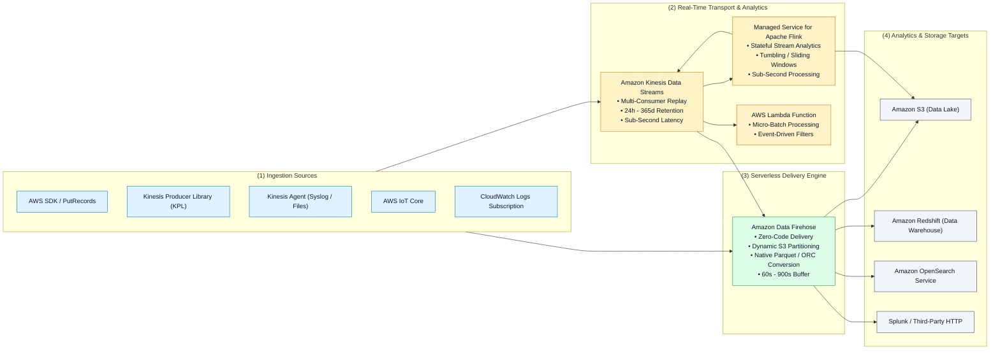
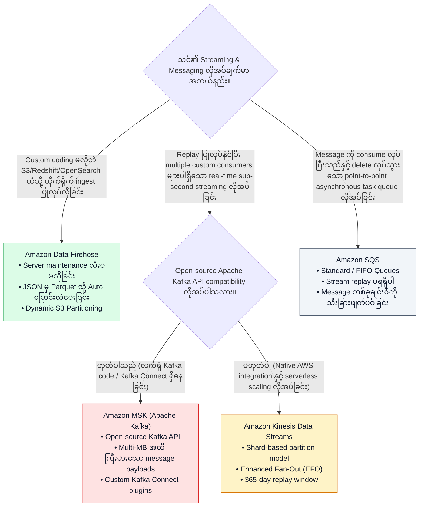

# 🌊 Amazon Kinesis Streaming Ecosystem

- **Category**: Analytics / Real-Time Data Streaming & Ingestion
- **Language / ဘာသာစကား**: [English (Original)](/en/02-services/analytics-streaming/kinesis/kinesis) | **မြန်မာဘာသာ (Burmese)**
- **Primary Use Case**: ကြီးမားသော real-time stream ingestion ပြုလုပ်ခြင်း၊ sub-second analytics များဆောင်ရွက်ခြင်း၊ data lake များဆီသို့ managed micro-batch delivery ပေးပို့ခြင်းနှင့် စဉ်ဆက်မပြတ် stream transformations ပြုလုပ်ခြင်း။
- **Slide Reference**: `[AWSCertifiedDataEngineerSlides.pdf](/docs/AWSCertifiedDataEngineerSlides.pdf)` ရှိ စာမျက်နှာ 414–459
- **Hub Links**: `[[mm/index|index]]` | `[[mm/01-domains/domain-1-ingestion-and-processing|domain-1-ingestion-and-processing]]` | `[[domain-3-data-processing]]` | `[[mm/02-services/storage/s3/s3|s3]]`

---

## 1. High-Level Summary (အကျဉ်းချုပ် ခြုံငုံသုံးသပ်ချက်)

**Amazon Kinesis** platform သည် real-time အချိန်နှင့်တစ်ပြေးညီ စဉ်ဆက်မပြတ် စီးဆင်းလာသော data စီးကြောင်းများ (ဥပမာ- IoT telemetry၊ website clickstreams၊ financial transactions များနှင့် application logs များ) ကို ဖမ်းယူ (capture)၊ စီမံတွက်ချက် (process) နှင့် ခွဲခြမ်းစိတ်ဖြာ (analyze) ရန် ရည်ရွယ်ထုတ်လုပ်ထားသော cloud-native streaming services အစုံအလင်ကို ထောက်ပံ့ပေးပါသည်။

**Kinesis Data Streams (KDS)**၊ **Amazon Data Firehose (KDF)** နှင့် **Amazon Managed Service for Apache Flink** တို့အကြား architectural ကွဲပြားချက်များ၊ latency သဘောသဘာဝများ၊ နှင့် လုပ်ငန်းဆောင်ရွက်မှု အကန့်အသတ်/နယ်နိမိတ်များ (operational boundaries) ကို နားလည်သဘောပေါက်ခြင်းသည် **AWS Certified Data Engineer - Associate (DEA-C01)** certification ၏ အဓိကမဏ္ဍိုင်တစ်ခု ဖြစ်ပါသည်။

---

## 2. The Four Pillars of the Kinesis Family (Kinesis Family ၏ အဓိက မဏ္ဍိုင် ၄ ရပ်)

| Service Name | Primary Architectural Role | Latency | Retention Period | Compute / Scaling Model |
| :--- | :--- | :--- | :--- | :--- |
| **Amazon Kinesis Data Streams (KDS)** | Durable ဖြစ်ပြီး multi-consumer fan-out နှင့် replay စွမ်းရည်ပါရှိသော real-time message stream ဖြစ်သည်။ | **Sub-second (70ms – 200ms)** | 24 hours (default) မှ **365 days** အထိ | **Shards** (Provisioned သို့မဟုတ် On-Demand modes)။ |
| **Amazon Data Firehose (KDF)** | Data lakes၊ warehouses နှင့် search engines များဆီသို့ serverless ဖြင့် အလိုအလျောက် ပေးပို့သော delivery stream ဖြစ်သည်။ | **Near real-time (60s – 900s)** | Retention မရှိပါ (ယာယီ in-flight buffer အဖြစ်သာ ထိန်းသိမ်းသည်) | **Fully Serverless** (infrastructure စီမံခန့်ခွဲမှုမလိုဘဲ အလိုအလျောက် scale လုပ်သည်)။ |
| **Amazon Managed Service for Apache Flink** | ရှုပ်ထွေးသော stateful stream processing၊ time-window aggregations နှင့် anomaly detection များ ပြုလုပ်ခြင်း။ | **Sub-second (< 100ms)** | Application state checkpoints များကို RocksDB / S3 တွင် သိမ်းဆည်းသည် | **Kinesis Processing Units (KPUs)** (KPU တစ်ခုလျှင် 1 vCPU + 4 GB RAM)။ |
| **Amazon Kinesis Video Streams (KVS)** | Video၊ audio နှင့် thermal camera feeds များအတွက် လုံခြုံစိတ်ချရသော media ingestion နှင့် playback ပြုလုပ်ခြင်း။ | **Real-time (< 1s)** | စိတ်ကြိုက်သတ်မှတ်နိုင်သည် (နာရီပိုင်းမှ ရက်ပိုင်းအထိ) | Fully managed media storage နှင့် indexing။ |

---

## 3. Streaming Technologies Decision Matrix (KDS vs. Firehose vs. MSK vs. SQS)

---

## 4. Modular Kinesis Topic Deep Dives (Kinesis ဆိုင်ရာ အသေးစိတ် လေ့လာရန် ခေါင်းစဉ်ခွဲများ)

DEA-C01 စာမေးပွဲရှိ scenario မေးခွန်းအားလုံးအတွက် ပြည့်စုံစွာ ပြင်ဆင်နိုင်ရန် အောက်ဖော်ပြပါ သီးသန့် sub-topic module များကို လေ့လာပါ-

1. `[[mm/02-services/analytics-streaming/kinesis/kinesis-data-streams|kinesis-data-streams]]` — **KDS Shards, Provisioned vs. On-Demand Modes, Partition Keys & Producers (SDK, KPL, Agent)**
2. `[[mm/02-services/analytics-streaming/kinesis/kinesis-consumers-and-scaling|kinesis-consumers-and-scaling]]` — **Standard vs. Enhanced Fan-Out (EFO), KCL DynamoDB Lease Coordination, Lambda Triggers & Resharding**
3. `[[mm/02-services/analytics-streaming/kinesis/kinesis-firehose|kinesis-firehose]]` — **Destinations, Buffering Rules, Inline Lambda Transforms, Native Parquet Conversion & Dynamic Partitioning**
4. `[[mm/02-services/analytics-streaming/kinesis/kinesis-apache-flink|kinesis-apache-flink]]` — **KPU Sizing, Tumbling / Sliding / Session Windows, Event-Time Watermarks & RocksDB Checkpoints**
5. `[[mm/02-services/analytics-streaming/kinesis/kinesis-security-and-monitoring|kinesis-security-and-monitoring]]` — **KMS SSE, VPC PrivateLink, Glue Schema Registry Integration & `IteratorAgeMilliseconds` Alerting**
6. `[[mm/02-services/analytics-streaming/kinesis/kinesis-architecture-and-patterns|kinesis-architecture-and-patterns]]` — **End-to-End Real-Time Pipelines, Hot Shard Mitigation, Deduplication & Comparison Matrices**
7. `[[mm/02-services/analytics-streaming/kinesis/kinesis-troubleshooting-and-tuning|kinesis-troubleshooting-and-tuning]]` — **Production Troubleshooting, Hot Shards, Consumer Lag (IteratorAge) နှင့် Poison Pill Isolation**

---

## 5. DEA-C01 Exam Essentials (DEA-C01 စာမေးပွဲအတွက် မဖြစ်မနေသိထားရမည့် အချက်များ)

> [!IMPORTANT]
> **Amazon Kinesis အတွက် အဓိက စာမေးပွဲ စည်းမျဉ်းများ**:
>
> - **KDS vs. Firehose**: အကယ်၍ မေးခွန်းတွင် **sub-second latency**၊ **custom consumer applications (KCL / Spark)** နှင့် **historical records များကို replay ပြန်လုပ်ခြင်း** စသည်တို့ တောင်းဆိုလာပါက **Kinesis Data Streams** ကို ရွေးချယ်ပါ။ အကယ်၍ compute ကို manage လုပ်စရာမလိုဘဲ **streaming logs များကို S3 ထဲသို့ Parquet format ဖြင့် တိုက်ရိုက် ထည့်သွင်းပေးပို့လိုပါက** **Amazon Data Firehose** ကို ရွေးချယ်ပါ။
> - **Consumer Lag Metric**: Kinesis consumer များ၏ အခြေအနေ (health) ကို စောင့်ကြည့်ရန် အရေးကြီးဆုံး CloudWatch metric မှာ **`GetRecords.IteratorAgeMilliseconds`** ဖြစ်သည်။ ဤတန်ဖိုး မြင့်တက်လာခြင်းသည် consumer များသည် real-time stream ingestion နောက်သို့ မမီဘဲ နောက်ကျကျန်နေသည် (falling behind) ကို ဆိုလိုသည်။
> - **Hot Shard Resolution**: စုစုပေါင်း throughput သည် cluster limit အောက်တွင် ရှိနေသော်လည်း stream တွင် `ProvisionedThroughputExceededException` ဖြစ်ပေါ်နေပါက အကြောင်းရင်းမှာ **partition key မညီမျှမှုကြောင့် Hot Shard ဖြစ်ပေါ်ခြင်း** ဖြစ်သည်။ ၎င်းကို ဖြေရှင်းရန် random salt / hash suffix ပေါင်းထည့်ခြင်း သို့မဟုတ် hot shard ကို split လုပ်ခြင်း ပြုလုပ်ပါ။
> - **Kafka vs. Kinesis**: Kafka APIs၊ topics၊ consumer groups သို့မဟုတ် Kafka Connect စသည့် legacy စနစ်များနှင့် တွဲဖက်အသုံးပြုရန် (compatibility) အတိအလင်း သတ်မှတ်ထားမှသာ **Amazon MSK** ကို ရွေးချယ်ပါ။ အသင့်သုံးနိုင်သော (turnkey) serverless AWS integration များအတွက် **KDS** ကို ရွေးချယ်ပါ။

---

## 📌 Related Notes (ဆက်စပ် မှတ်စုများ)
- `[[mm/02-services/analytics-streaming/kinesis/kinesis-data-streams|kinesis-data-streams]]` — Kinesis Data Streams Core Architecture
- `[[mm/02-services/analytics-streaming/kinesis/kinesis-consumers-and-scaling|kinesis-consumers-and-scaling]]` — Standard vs. Enhanced Fan-Out & KCL
- `[[mm/02-services/analytics-streaming/kinesis/kinesis-troubleshooting-and-tuning|kinesis-troubleshooting-and-tuning]]` — Troubleshooting & Performance Tuning
- `[[mm/02-services/analytics-streaming/kinesis/kinesis-firehose|kinesis-firehose]]` — Amazon Data Firehose Delivery Pipelines
- `[[mm/02-services/analytics-streaming/kinesis/kinesis-apache-flink|kinesis-apache-flink]]` — Real-Time Stateful Stream Processing
- `[[mm/02-services/analytics-streaming/msk/msk|msk]]` — Amazon Managed Streaming for Apache Kafka
- `[[mm/02-services/compute-containers/lambda|lambda]]` — Serverless Stream Consumers
- `[[mm/02-services/storage/s3/s3|s3]]` — S3 Data Lake Storage Architecture
