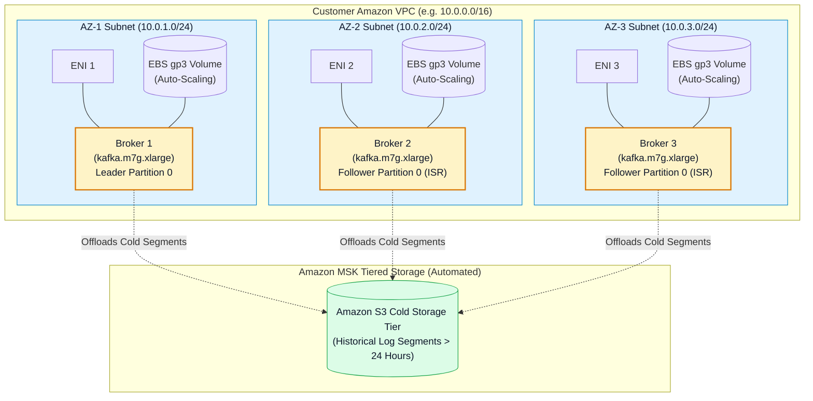
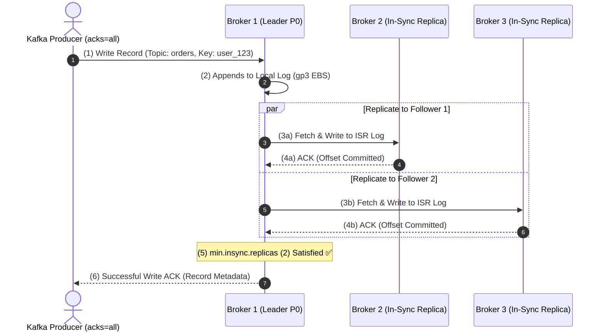
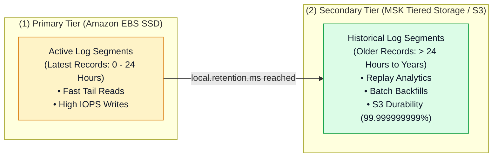

# 🏛️ Amazon MSK Cluster Architecture, Storage & High Availability (မြန်မာဘာသာ)

- **Category**: Analytics / Distributed Streaming Infrastructure
- **Language / ဘာသာစကား**: [English (Original)](/en/02-services/analytics-streaming/msk/msk-cluster-architecture) | **မြန်မာဘာသာ (Burmese)**
- **Primary Use Case**: Fault-tolerant ဖြစ်သော multi-AZ MSK broker topologies များကို design ပြုလုပ်ရန်၊ EBS storage auto-scaling ကို configure ပြုလုပ်ရန်၊ S3 နှင့် တွဲဖက်ထားသော MSK Tiered Storage ကို အသုံးချရန်နှင့် KRaft metadata mode ကို နားလည်သဘောပေါက်ရန်။
- **Slide Reference**: `[AWSCertifiedDataEngineerSlides.pdf](/docs/AWSCertifiedDataEngineerSlides.pdf)` ရှိ စာမျက်နှာ 450–459
- **Hub Links**: `[[mm/index|index]]` | `[[mm/02-services/analytics-streaming/msk/msk|msk]]` | `[[mm/02-services/analytics-streaming/msk/msk-serverless|msk-serverless]]` | `[[mm/02-services/analytics-streaming/msk/msk-security-and-monitoring|msk-security-and-monitoring]]` | `[[mm/02-services/analytics-streaming/kinesis/kinesis-data-streams|kinesis-data-streams]]`

---

## 1. High-Level Summary

Amazon MSK cluster တစ်ခုသည် VPC အတွင်းရှိ Availability Zones အများအပြားတွင် ဖြန့်ကျက်ချထားသော (deployed) Apache Kafka **Broker Nodes** များဖြင့် ဖွဲ့စည်းထားပါသည်။ MSK သည် အောက်ခံ EC2 instances များ၊ broker storage၊ broker replacement နှင့် cluster metadata quorum (ZooKeeper သို့မဟုတ် KRaft mode မှတစ်ဆင့်) များကို အလိုအလျောက် စီမံခန့်ခွဲပေးပါသည်။

**DEA-C01** စာမေးပွဲအတွက် MSK broker sizing၊ replication guarantees (`replication.factor`၊ `min.insync.replicas`၊ `acks=all`)၊ EBS storage auto-scaling လုပ်ဆောင်ပုံများ (mechanisms) နှင့် Amazon S3 ပေါ်ရှိ **MSK Tiered Storage** တို့ကို ကျွမ်းကျင်စွာ နားလည်ထားရပါမည်။



---

## 2. Broker Topologies & KRaft Mode

### 1. Broker Placement & Networking
- **Multi-AZ Distribution**: Amazon MSK သည် brokers များကို **Availability Zones ၂ ခု သို့မဟုတ် ၃ ခု** အတွင်း ညီတူညီမျှ အလိုအလျောက် provision ပြုလုပ်ပေးပါသည် (production high availability အတွက် 3 AZs ကို recommend လုပ်ပါသည်)။
- **VPC Elastic Network Interfaces (ENIs)**: MSK broker တစ်ခုစီကို သင့် VPC private subnet အတွင်းရှိ dedicated ENI တစ်ခုနှင့် ချိတ်ဆက်ထားပြီး producer နှင့် consumer applications များနှင့် private IP communication ပြုလုပ်နိုင်ရန် ထောက်ပံ့ပေးပါသည်။

### 2. ZooKeeper vs. KRaft Metadata Mode
ယခင်က Apache Kafka သည် cluster state နှင့် leader election အတွက် သီးသန့် Apache ZooKeeper ensemble ပေါ်တွင် မှီခိုခဲ့ရပါသည်။ Amazon MSK သည် architectures နှစ်မျိုးစလုံးကို support ပြုလုပ်ပေးပါသည်:
- **ZooKeeper-based Clusters**: MSK သည် သီးသန့် ZooKeeper nodes ၃ ခုကို background တွင် အပိုကုန်ကျစရိတ်မရှိဘဲ (at no extra charge) provision လုပ်ပြီး စီမံခန့်ခွဲပေးပါသည်။
- **KRaft-based Clusters (Kafka 3.7+)**: Broker ecosystem အတွင်း တိုက်ရိုက် run သည့် **Kafka Raft (KRaft) metadata quorum** protocol ကို အသုံးပြုထားပြီး သီးခြား ZooKeeper nodes များထားရှိရန် မလိုတော့ဘဲ၊ partition failovers များကို ပိုမိုမြန်ဆန်စေကာ cluster တစ်ခုတည်းတွင် partitions ပေါင်း သန်းနှင့်ချီသည်အထိ scale လုပ်နိုင်စေပါသည်။

---

## 3. High Availability & Zero Data Loss Guarantees

Single-broker သို့မဟုတ် တစ်ခုလုံးသော AZ outages များအပေါ် enterprise-grade resilience ရရှိစေရန်အတွက် MSK clusters များသည် အဓိက critical Kafka parameters ၃ ခုပေါ်တွင် မူတည်လုပ်ဆောင်ပါသည်:



### Data Resilience အတွက် အဓိကမဏ္ဍိုင်ကြီး ၃ ရပ် (The Three Critical Data Resilience Pillars):
1. **`replication.factor = 3`**: Topic partition တိုင်းတွင် သီးခြား Availability Zones ၃ ခု၌ ဖြန့်ကျက်ထားသော Leader copy ၁ ခုနှင့် Follower copies ၂ ခု ရှိပါသည်။
2. **`min.insync.replicas = 2`**: Leader အနေဖြင့် write operation ကို အောင်မြင်သည်ဟု မသတ်မှတ်မီ write ကို အတည်ပြု (acknowledge) ရမည့် အနည်းဆုံး in-sync replicas (ISR) အရေအတွက်ကို သတ်မှတ်ပေးပါသည်။ အကယ်၍ ရရှိနိုင်သော replicas အရေအတွက်သည် ၂ ခုအောက် လျော့နည်းသွားပါက broker သည် writes များကို `NotEnoughReplicasException` ဖြင့် ပယ်ချ (reject) မည် ဖြစ်ပါသည်။
3. **Producer `acks=all` (သို့မဟုတ် `acks=-1`)**: Producer client သည် ဆက်လက်မလုပ်ဆောင်မီ in-sync replicas အားလုံးက record ကို commit လုပ်ပြီးသည်အထိ စောင့်ဆိုင်းပေးသောကြောင့် leader broker ရုတ်တရက် crash ဖြစ်သွားသည့်တိုင် zero data loss ဖြစ်စေရန် အာမခံချက် ပေးပါသည်။

---

## 4. Storage Architecture: EBS Auto-Scaling & Tiered Storage

Amazon MSK သည် two-tiered architecture မှတစ်ဆင့် compute နှင့် storage ကို သီးခြားစီ ခွဲထုတ် (decouples) ထားပါသည်:

| Storage Dimension | Primary Tier (Amazon EBS gp3 / io2) | Secondary Tier (Amazon MSK Tiered Storage) |
| :--- | :--- | :--- |
| **Underlying Media** | Brokers များတွင် ချိတ်ဆက်ထားသော High-performance EBS SSDs များ။ | MSK မှ transparently စီမံခန့်ခွဲပေးသော Amazon S3။ |
| **Data Target** | Active ဖြစ်သော hot data များ (tail reads၊ latest offsets၊ active partition logs)။ | Historical ဖြစ်သော cold data များ (local retention threshold ထက် ပိုမိုဟောင်းနွမ်းသော log segments များ)။ |
| **Latency** | **Single-digit milliseconds** (sub-10ms)။ | Tens of milliseconds (read-through cache)။ |
| **Cost Profile** | GB/month အလိုက် standard EBS volume pricing။ | ကုန်ကျစရိတ် သက်သာသော S3 standard storage pricing (EBS ကုန်ကျစရိတ်၏ အစိတ်အပိုင်းမျှသာ)။ |
| **Max Retention** | EBS volume size ဖြင့် ကန့်သတ်ထားသည် (broker တစ်ခုလျှင် 16 TiB အထိ)။ | **Virtually unlimited** (လပေါင်းများစွာ သို့မဟုတ် နှစ်ပေါင်းများစွာ ထိန်းသိမ်းနိုင်သည်)။ |



### 1. Amazon EBS Storage Auto-Scaling
- Amazon MSK သည် broker disk utilization သည် သတ်မှတ်ထားသော target threshold (ဥပမာ 85%) ကျော်လွန်သွားသည့်အခါ EBS volume storage ကို အလိုအလျောက် တိုးမြှင့်ပေးရန် **AWS Application Auto Scaling** နှင့် ချိတ်ဆက်အလုပ်လုပ်ပါသည်။
- **Rule**: EBS storage volumes များကို **scale up** သာ ပြုလုပ်နိုင်ပြီး၊ မည်သည့်အခါမျှ scale down ပြုလုပ်၍ မရပါ။

### 2. Enabling MSK Tiered Storage
Topic တစ်ခုပေါ်တွင် Tiered Storage ကို enable ပြုလုပ်ရန် အောက်ပါ topic-level properties များကို configure ပြုလုပ်ပါ:
```bash
# Enable tiered storage on topic 'events-stream'
kafka-topics.sh --bootstrap-server $BS \
  --alter --topic events-stream \
  --config remote.storage.enable=true \
  --config local.retention.ms=86400000 \
  --config retention.ms=31536000000
```
- `remote.storage.enable=true`: အဆိုပါ topic အတွက် tiered storage ကို activate ပြုလုပ်ပေးပါသည်။
- `local.retention.ms=86400000`: ကုန်ကျစရိတ်များသော broker EBS SSDs များပေါ်တွင် data ကို **၁ ရက် (၂၄ နာရီ)** ထိန်းသိမ်းထားရှိပါသည်။
- `retention.ms=31536000000`: Historical data များကို Amazon S3 တွင် **၁ နှစ် (၃၆၅ ရက်)** ထိန်းသိမ်းထားရှိပါသည်။

---

## 5. DEA-C01 Exam Essentials

> [!IMPORTANT]
> **Amazon MSK အတွက် အဓိက Architecture ဆုံးဖြတ်ချက်များ (Key Architecture Decisions)**:
>
> - **Cost-Effective Long-Term Retention**: Streaming data များကို Kafka တွင် EBS disks များကို ပြန်လည် resize လုပ်ရန်မလိုဘဲ ကုန်ကျစရိတ်အနည်းဆုံးဖြင့် ကာလရှည် (လပေါင်းများစွာ/နှစ်ပေါင်းများစွာ) သိမ်းဆည်းထားရန် **MSK Tiered Storage** ကို enable လုပ်ပါ။
> - **Preventing Data Loss**: `replication.factor=3`၊ `min.insync.replicas=2` နှင့် producer `acks=all` တို့ကို အမြဲတမ်း တွဲဖက်အသုံးပြုပါ။
> - **Storage Expansion**: Broker storage ကို **Application Auto Scaling policies** အသုံးပြု၍ auto-scale ပြုလုပ်နိုင်သော်လည်း disk capacity ကို တစ်ကြိမ် တိုးမြှင့်ပြီးပါက ပြန်လည် လျှော့ချ (shrink) ၍ မရနိုင်ပါ။
> - **Metadata Architecture**: သီးခြား ZooKeeper nodes များ မလိုအပ်ဘဲ cluster တစ်ခုလျှင် ပိုမိုများပြားသော partition အရေအတွက်ကို support လုပ်နိုင်စေရန် modern MSK clusters (Kafka 3.7+) များအတွက် **KRaft mode** ကို ရွေးချယ်ပါ။

---

## 📌 Related Notes
- `[[mm/02-services/analytics-streaming/msk/msk|msk]]` — Amazon MSK Ecosystem Overview
- `[[mm/02-services/analytics-streaming/msk/msk-serverless|msk-serverless]]` — Serverless On-Demand MSK Scaling
- `[[mm/02-services/analytics-streaming/msk/msk-security-and-monitoring|msk-security-and-monitoring]]` — IAM Auth & Offset Lag Monitoring
- `[[mm/02-services/storage/ebs-and-instance-store|ebs-and-instance-store]]` — EBS gp3 Volumes & IOPS
- `[[mm/02-services/analytics-streaming/kinesis/kinesis-data-streams|kinesis-data-streams]]` — KDS Shard Architecture Comparison
