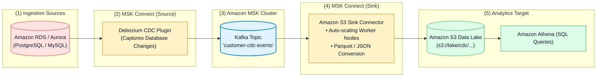
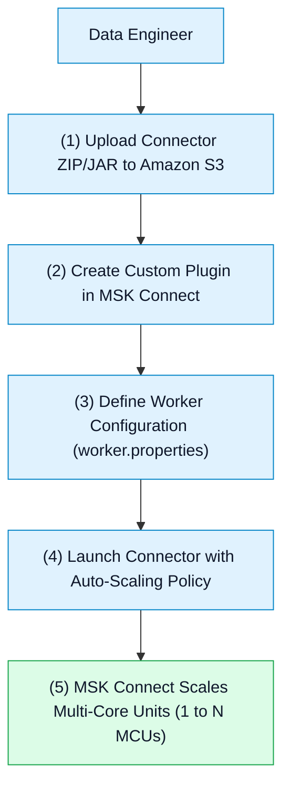

# 🔌 Amazon MSK Connect, Custom Plugins & Serverless Connectors

- **Category**: Analytics / Managed Stream Integration & Data Delivery
- **Language / ဘာသာစကား**: [English (Original)](/en/02-services/analytics-streaming/msk/msk-connect) | **မြန်မာဘာသာ (Burmese)**
- **Primary Use Case**: Worker servers များကို manage လုပ်ရန်မလိုဘဲ CDC streams များကို ingest လုပ်ရန်နှင့် Kafka data များကို Amazon S3, OpenSearch, Redshift နှင့် Snowflake များဆီသို့ တိုက်ရိုက် deliver လုပ်ရန် serverless Apache Kafka Connect source နှင့် sink connectors များကို run ခြင်း။
- **Slide Reference**: `[AWSCertifiedDataEngineerSlides.pdf](/docs/AWSCertifiedDataEngineerSlides.pdf)` မှ Pages 450–459
- **Hub Links**: `[[mm/index|index]]` | `[[mm/02-services/analytics-streaming/msk/msk|msk]]` | `[[mm/02-services/analytics-streaming/kinesis/kinesis-firehose|kinesis-firehose]]` | `[[mm/02-services/storage/s3/s3|s3]]` | `[[mm/02-services/analytics-streaming/opensearch/opensearch|opensearch]]`

---

## 1. High-Level Summary

**Amazon MSK Connect** သည် **Apache Kafka Connect** connectors များကို လွယ်ကူစွာ run ခြင်း၊ monitor လုပ်ခြင်းနှင့် auto-scale လုပ်ဆောင်ပေးနိုင်သည့် Amazon MSK ၏ fully managed, serverless feature တစ်ခု ဖြစ်သည်။

Kafka Connect သည် standard **Source Connectors** (ပြင်ပ database များ သို့မဟုတ် message queue များမှ data များကို Kafka ထဲသို့ ingest လုပ်ခြင်း) နှင့် **Sink Connectors** (Kafka topics များမှ data များကို Amazon S3, Amazon OpenSearch, သို့မဟုတ် Snowflake ကဲ့သို့သော downstream analytics systems များဆီသို့ export လုပ်ခြင်း) များကို အသုံးပြုသည်။ MSK Connect သည် underlying worker infrastructure ကို အလိုအလျောက် provision ပြုလုပ်ခြင်း၊ maintain လုပ်ခြင်းနှင့် auto-scale ပြုလုပ်ပေးခြင်းတို့ကို ဆောင်ရွက်ပေးသည်။

---

## 2. Key Components of MSK Connect

1. **Custom Plugins**: Amazon S3 bucket အတွင်း `.zip` သို့မဟုတ် `.jar` files အနေဖြင့် package ပြုလုပ်ထားသော open-source သို့မဟုတ် commercial Kafka Connect plugins များ (ဥပမာ- Confluent S3 Sink, Debezium MySQL Source, Snowflake Sink) ကို upload ပြုလုပ်ခြင်း။
2. **Worker Configurations**: Internal connector settings များ၊ converter classes များ (ဥပမာ- `org.apache.kafka.connect.json.JsonConverter` သို့မဟုတ် Avro converter) နှင့် offset commit intervals များအတွက် key-value property sets များ ဖြစ်သည်။
3. **Auto-Scaling Workers (MCUs)**: MSK Connect သည် capacity ကို **MSK Multi-Core Units (MCUs)** ဖြင့် တိုင်းတာတွက်ချက်သည်။
   - **1 MCU = 1 vCPU + 4 GB RAM** ဖြစ်သည်။
   - အနည်းဆုံး (minimum) နှင့် အများဆုံး (maximum) MCUs အရေအတွက်ကို သတ်မှတ်ပေးရသည်။ MSK Connect သည် CPU utilization အပေါ် မူတည်၍ (default trigger: 70%) MCUs များကို အလိုအလျောက် အတိုး/အလျော့ (add or remove) ပြုလုပ်ပေးသည်။

---

## 3. Top Sink & Source Connectors for DEA-C01

| Connector အမည် | Type | အသုံးများသော Architecture / Target | Exam အတွက် အရေးပါပုံ |
| :--- | :--- | :--- | :--- |
| **Amazon S3 Sink Connector** | Sink | Micro-batching နှင့် file rotation တို့ဖြင့် Kafka topic records များကို S3 data lakes များဆီသို့ stream ပြုလုပ်ပေးခြင်း။ | Kafka data များကို S3 ထဲသို့ load ပြုလုပ်ရန် custom Lambda consumers များ အသုံးပြုခြင်းနေရာတွင် အစားထိုးသည်။ |
| **Debezium CDC Source** | Source | MySQL / PostgreSQL / SQL Server များမှ row-level database inserts, updates, နှင့် deletes များကို capture လုပ်ခြင်း။ | MSK topics များအတွင်းသို့ real-time database CDC ingestion ပြုလုပ်ခြင်း။ |
| **Amazon OpenSearch Sink** | Sink | Streaming log messages များနှင့် text payloads များကို OpenSearch clusters များအတွင်းသို့ index ပြုလုပ်ခြင်း။ | Real-time log analytics နှင့် search indexing ပြုလုပ်ခြင်း။ |
| **Snowflake / Redshift Sink** | Sink | Analytical records များကို data warehouses များအတွင်းသို့ တိုက်ရိုက် continuously stream ပြုလုပ်ခြင်း။ | Near real-time data warehouse ingestion ပြုလုပ်ခြင်း။ |

---

## 4. MSK Connect vs. Amazon Data Firehose

Exam တွင် မကြာခဏတွေ့ရလေ့ရှိသော architectural decision တစ်ခုမှာ **MSK Connect** နှင့် **Amazon Data Firehose** အကြား ရွေးချယ်ခြင်း ဖြစ်သည်:

| Feature / လုပ်ဆောင်ချက် | Amazon MSK Connect | Amazon Data Firehose |
| :--- | :--- | :--- |
| **Primary Stream Ingestion** | **Amazon MSK** / Apache Kafka clusters များ။ | **Kinesis Data Streams**, Direct SDK, CloudWatch Logs, IoT။ |
| **Connector Ecosystem** | Open-source Apache Kafka Connect plugins များ (ရာနှင့်ချီသော community connectors များ)။ | AWS-managed pre-built destinations များ (S3, Redshift, OpenSearch, Splunk)။ |
| **Custom Plugins** | S3 မှတစ်ဆင့် upload ပြုလုပ်ထားသော custom third-party `.jar` plugins များကို support လုပ်ခြင်း။ | AWS-managed destinations များကိုသာ support လုပ်ခြင်း (HTTP/Lambda မှတစ်ဆင့် custom endpoints များသို့ ပို့နိုင်သည်)။ |
| **Scaling & Management** | Serverless MCU auto-scaling (1–N MCUs)။ | Fully serverless (capacity knobs များ သတ်မှတ်ရန် မလိုခြင်း)။ |
| **Best For (အသင့်တော်ဆုံး အခြေအနေ)** | **Apache Kafka** clusters များမှ/သို့ data များကို export/import ပြုလုပ်ခြင်း။ | Kafka မပါဘဲ S3/Redshift ဆီသို့ turnkey automated streaming delivery ပြုလုပ်ခြင်း။ |

---

## 5. DEA-C01 Exam Essentials

> [!IMPORTANT]
> **MSK Connect အတွက် အဓိက Exam Decision Triggers များ**:
>
> - **"Server maintenance လုံးဝမလိုဘဲ Amazon MSK cluster မှ data များကို Amazon S3 data lake အတွင်းသို့ တိုက်ရိုက် stream ပြုလုပ်ရန်"** $\rightarrow$ **Amazon MSK Connect ပေါ်တွင် Amazon S3 Sink Connector** ကို deploy ပြုလုပ်ပါ။
> - **"EC2 Kafka Connect workers များကို manage လုပ်ရန်မလိုဘဲ on-premises database မှ Change Data Capture (CDC) ကို MSK အတွင်းသို့ capture ပြုလုပ်ရန်"** $\rightarrow$ **Debezium connector ကို Amazon S3 တွင် Custom Plugin အနေဖြင့် package လုပ်ပြီး** **MSK Connect** ပေါ်တွင် deploy ပြုလုပ်ပါ။
> - **"Capacity Scaling"** $\rightarrow$ MSK Connect သည် CPU utilization thresholds အပေါ် အခြေခံ၍ **MSK Multi-Core Units (MCUs)** ကို အသုံးပြုကာ compute capacity ကို အလိုအလျောက် scale လုပ်ပေးသည်။

---

## 📌 Related Notes
- `[[mm/02-services/analytics-streaming/msk/msk|msk]]` — Amazon MSK Master Hub
- `[[mm/02-services/analytics-streaming/msk/msk-cluster-architecture|msk-cluster-architecture]]` — MSK Provisioned Brokers
- `[[mm/02-services/analytics-streaming/kinesis/kinesis-firehose|kinesis-firehose]]` — Serverless Micro-Batch Delivery
- `[[mm/02-services/storage/s3/s3|s3]]` — S3 Data Lake Storage Architecture
- `[[mm/02-services/analytics-streaming/opensearch/opensearch|opensearch]]` — OpenSearch Analytics & Indexing
