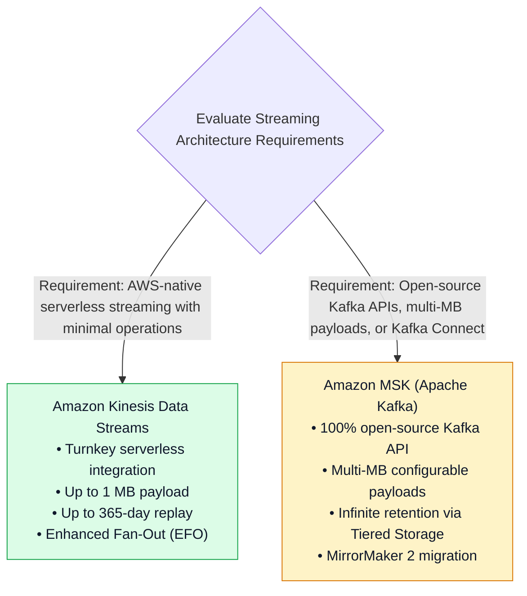
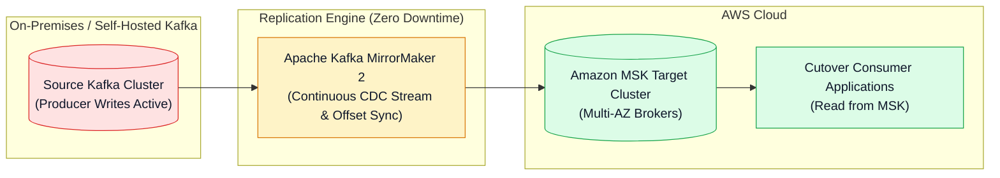
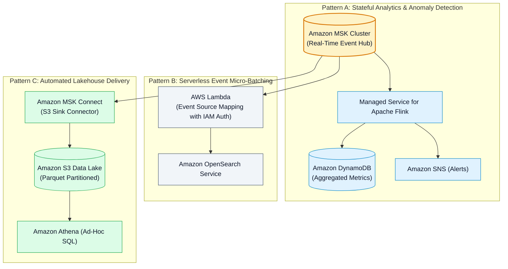

# ⚖️ Amazon MSK vs. Kinesis Comparison, Migration & Streaming Patterns

- **Category**: Analytics / System Design, Technology Evaluation & Architecture Patterns
- **Language / ဘာသာစကား**: [English (Original)](/en/02-services/analytics-streaming/msk/msk-kinesis-comparison-and-patterns) | **မြန်မာဘာသာ (Burmese)**
- **Primary Use Case**: Amazon MSK နှင့် Amazon Kinesis Data Streams တို့အကြား trade-offs များကို အကဲဖြတ်ခြင်း၊ MirrorMaker 2 ကို အသုံးပြု၍ Kafka-to-MSK migration များ ပြုလုပ်ခြင်း၊ နှင့် multi-service streaming architectures များကို ဒီဇိုင်းရေးဆွဲခြင်း။
- **Slide Reference**: Pages 414–459 in `[[AWSCertifiedDataEngineerSlides.pdf]]`
- **Hub Links**: `[[mm/index]]` | `[[mm/msk]]` | `[[mm/kinesis]]` | `[[mm/kinesis-data-streams]]` | `[[mm/kinesis-firehose]]`

---

## 1. High-Level Summary

**Amazon Kinesis Data Streams (KDS)** နှင့် **Amazon Managed Streaming for Apache Kafka (Amazon MSK)** တို့အကြား ရွေးချယ်ခြင်းသည် **AWS Certified Data Engineer - Associate (DEA-C01)** စာမေးပွဲတွင် ကျယ်ကျယ်ပြန့်ပြန့် စစ်ဆေးလေ့ရှိသော အဓိက architectural decision တစ်ခုဖြစ်သည်။

ဝန်ဆောင်မှုနှစ်ခုစလုံးသည် partition-based ordering ဖြင့် durable ဖြစ်ပြီး distributed ဖြစ်သော real-time message streaming ကို ထောက်ပံ့ပေးသော်လည်း၊ ၎င်းတို့သည် ecosystem compatibility, operational complexity, scaling primitives, retention boundaries, နှင့် payload size limits တို့တွင် အခြေခံအားဖြင့် ကွဲပြားကြသည်။

---

## 2. Definitive Kinesis Data Streams vs. Amazon MSK Comparison Matrix

| Evaluation Dimension | Amazon Kinesis Data Streams (KDS) | Amazon MSK (Apache Kafka) |
| :--- | :--- | :--- |
| **API & Ecosystem** | AWS proprietary API & AWS SDKs. | 100% open-source **Apache Kafka APIs**, Kafka Streams, နှင့် Kafka Connect. |
| **Scaling Primitive** | **Shards** (shard တစ်ခုလျှင် 1 MB/s IN, 2 MB/s OUT). | **Broker Instances & Topic Partitions**. |
| **Capacity Modes** | **Provisioned** (manual shard count) သို့မဟုတ် **On-Demand** (automatic scaling). | **Provisioned** (custom broker sizing) သို့မဟုတ် **Serverless** (auto-scaling throughput). |
| **Max Payload Size** | **1 MB strict limit** (ပိုကြီးသော payload များအတွက် S3 claim-check pattern လိုအပ်သည်)။ | `message.max.bytes` property ဖြင့် **Configurable (multi-MB)** ပြုလုပ်နိုင်သည် (default မှာ 1 MB)။ |
| **Data Retention** | **24 နာရီ မှ 365 ရက်အထိ** (အများဆုံး ၁ နှစ်)။ | Amazon S3 ပေါ်ရှိ **MSK Tiered Storage** ကို အသုံးပြု၍ **Virtually Unlimited** ရရှိနိုင်သည်။ |
| **Consumer Egress Model** | Standard Polling (shared 2 MB/s) သို့မဟုတ် **Enhanced Fan-Out (EFO)** (consumer တစ်ခုစီအတွက် dedicated 2 MB/s HTTP/2 push)။ | `__consumer_offsets` တွင် offset tracking ပြုလုပ်သည့် Standard Kafka Consumer Groups။ |
| **Managed Connectors** | **Amazon Data Firehose** နှင့် တိုက်ရိုက်ချိတ်ဆက်နိုင်ခြင်း (Direct integration)။ | Open-source Kafka Connect plugins များအတွက် **Amazon MSK Connect**။ |
| **Security & Auth** | AWS IAM Policies & KMS SSE natively. | **AWS IAM Auth**, SASL/SCRAM, TLS Mutual Auth (mTLS), နှင့် Kafka ACLs. |
| **Target Workload** | လျင်မြန်သော serverless development, တင်းကျပ်သော AWS service integrations (Lambda, DynamoDB, Firehose)။ | Enterprise Kafka migration, hybrid-cloud pipelines, custom Kafka Connect ecosystems။ |

---

## 3. Migration: Self-Hosted Kafka to Amazon MSK via MirrorMaker 2

လက်ရှိ on-premises သို့မဟုတ် EC2-hosted Apache Kafka cluster တစ်ခုကို Amazon MSK သို့ downtime လုံးဝမရှိဘဲ (zero downtime) migrate ပြုလုပ်ရန် **Apache Kafka MirrorMaker 2 (MM2)** ကို အသုံးပြုပါ:

### Zero-Downtime Migration Steps:
1. **Deploy Target MSK Cluster**: Target VPC အတွင်း ကိုက်ညီသော topic configurations များဖြင့် multi-AZ Amazon MSK cluster တစ်ခုကို provision ပြုလုပ်ပါ။
2. **Deploy MirrorMaker 2**: Consumer group offsets များကို synchronize လုပ်နေစဉ် source cluster မှ သမိုင်းဝင် (historical) နှင့် live streaming records များကို MSK သို့ replicate လုပ်ရန် MM2 (EC2, ECS, သို့မဟုတ် MSK Connect ပေါ်တွင်) ကို run ပါ။
3. **Switch Consumers**: Target MSK cluster မှ ဖတ်ရှုရန် consumer applications များကို update ပြုလုပ်ပါ။
4. **Switch Producers**: Upstream producer writes များကို MSK cluster သို့ ပြောင်းလဲချိတ်ဆက်ပြီး (redirect) ယခင် self-hosted cluster အဟောင်းကို decommission ပြုလုပ်ပါ။

---

## 4. Real-Time Streaming Architecture Patterns

---

## 5. DEA-C01 Master Streaming Decision Guide

> [!IMPORTANT]
> **Kinesis vs. MSK vs. Firehose အတွက် အဓိက Exam Decision Triggers များ**:
>
> - **"Company wants to migrate existing Kafka producer and consumer applications to AWS with minimal code changes"** $\rightarrow$ **Amazon MSK** သို့ migrate လုပ်ပါ။
> - **"Need to replicate an on-premises Kafka cluster to AWS with zero downtime"** $\rightarrow$ **Apache Kafka MirrorMaker 2 (MM2)** ကို အသုံးပြုပါ။
> - **"Stream 10 MB payload messages without building a custom claim-check pattern with S3"** $\rightarrow$ **Amazon MSK** ကို အသုံးပြုပါ (`message.max.bytes` ကို configure လုပ်ပါ)။
> - **"Load streaming logs into S3 in Parquet format with zero server operations or coding"** $\rightarrow$ **Amazon Data Firehose** ကို အသုံးပြုပါ။
> - **"Real-time sub-second streaming with dedicated 2 MB/s push pipelines to 15 different downstream applications"** $\rightarrow$ **Enhanced Fan-Out (EFO)** ပါရှိသော **Kinesis Data Streams** ကို အသုံးပြုပါ။

---

## 📌 Related Notes
- `[[mm/msk]]` — Amazon MSK Master Hub
- `[[mm/msk-cluster-architecture]]` — MSK Broker Architecture & Tiered Storage
- `[[mm/msk-connect]]` — Serverless S3 Sink Connectors
- `[[mm/kinesis]]` — Amazon Kinesis Ecosystem Hub
- `[[mm/kinesis-data-streams]]` — KDS Ingestion & Shards
- `[[mm/kinesis-firehose]]` — Serverless Micro-Batch Delivery
- `[[mm/kinesis-apache-flink]]` — Real-Time Stateful Stream Processing
