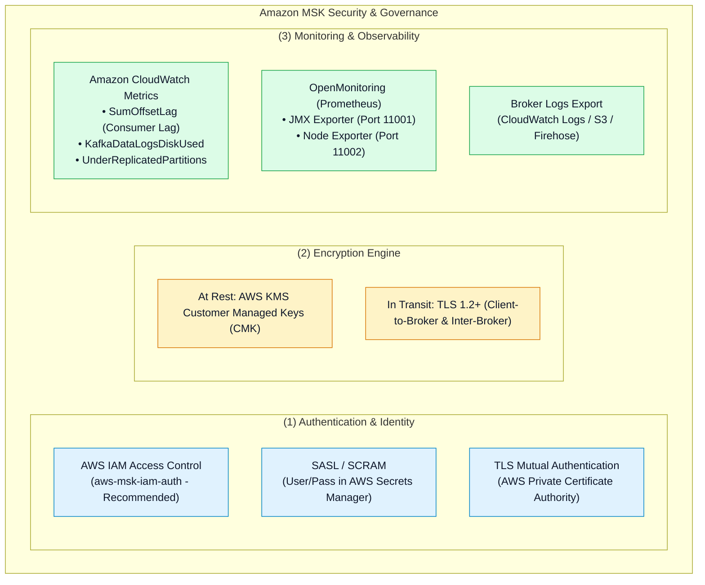
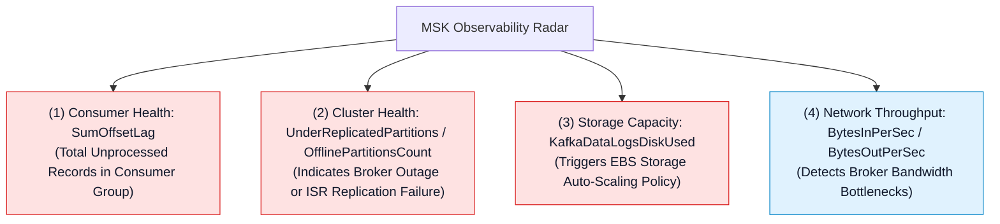

# 🛡️ Amazon MSK Security, Access Control & Observability

- **Category**: Analytics / Governance, Identity & Stream Observability
- **Language / ဘာသာစကား**: [English (Original)](/en/02-services/analytics-streaming/msk/msk-security-and-monitoring) | **မြန်မာဘာသာ (Burmese)**
- **Primary Use Case**: IAM authentication ဖြင့် Kafka clusters များကို လုံခြုံအောင် ပြုလုပ်ခြင်း၊ TLS encryption ကို configure ပြုလုပ်ခြင်း၊ consumer group lag (`SumOffsetLag`) ကို စောင့်ကြည့်ထောက်လှမ်းခြင်း နှင့် Prometheus OpenMonitoring နှင့် ချိတ်ဆက်ပေါင်းစပ်ခြင်း။
- **Slide Reference**: Pages 450–459 in `[[AWSCertifiedDataEngineerSlides.pdf]]`
- **Hub Links**: `[[mm/index]]` | `[[msk]]` | `[[msk-cluster-architecture]]` | `[[glue-schema-registry]]`

---

## 1. High-Level Summary

AWS ပေါ်တွင် production Apache Kafka clusters များကို လည်ပတ်အသုံးပြုရာတွင် **Encryption** (at rest အတွက် KMS၊ in transit အတွက် TLS)၊ **Authentication** (IAM Access Control၊ SASL/SCRAM၊ mTLS) နှင့် **Fine-Grained Authorization** (Kafka ACLs) တို့ပါဝင်သော ခိုင်မာအားကောင်းသည့် security framework တစ်ခု လိုအပ်ပါသည်။

စောင့်ကြည့်ထောက်လှမ်းခြင်း (Monitoring) အတွက် Amazon MSK သည် native **Amazon CloudWatch** metrics နှင့် **Prometheus OpenMonitoring** (JMX နှင့် Node Exporter metrics) နှစ်မျိုးလုံးကို ထုတ်ပေးထားပြီး consumer lag (`SumOffsetLag`) နှင့် broker disk အသုံးပြုမှု (`KafkaDataLogsDiskUsed`) တို့အပေါ် real-time alerting ပြုလုပ်နိုင်စေပါသည်။

---

## 2. Authentication & Authorization Comparison

| Authentication Mode | Credential Source | Best Use Case | DEA-C01 Exam Context |
| :--- | :--- | :--- | :--- |
| **AWS IAM Access Control** | AWS IAM Roles / IAM Policies (`aws-msk-iam-auth`)။ | AWS-native applications များ (Lambda, ECS, EMR, EC2)။ | **Default Recommended Option**။ Secret rotation နှင့် hardcoded credentials ပြုလုပ်ရခြင်းများကို ဖယ်ရှားပေးသည်။ |
| **SASL / SCRAM** | **AWS Secrets Manager** တွင် သိမ်းဆည်းထားသော Usernames & Passwords။ | VPC သို့မဟုတ် internet မှတစ်ဆင့် ချိတ်ဆက်သည့် External / Non-AWS legacy clients များ။ | Secrets Manager KMS encryption keys များကို MSK cluster နှင့် ချိတ်ဆက်တွဲဖက်ပေးရန် လိုအပ်သည်။ |
| **TLS Mutual Auth (mTLS)** | **AWS Private CA** မှ ထုတ်ပေးသော X.509 client certificates။ | တင်းကျပ်သော enterprise PKI နှင့် certificate-based zero-trust environments များ။ | Certificate ထုတ်ပေးခြင်းနှင့် lifecycle renewal အတွက် operational overhead မြင့်မားသည်။ |
| **Unauthenticated / Plaintext** | မရှိပါ (Anonymous access)။ | Local dev/test environments များအတွက်သာ။ | Production workloads များအတွက် **လုံးဝ အကြံမပြုပါ**။ |

---

## 3. Critical CloudWatch & OpenMonitoring Metrics

### Essential Metrics Cheat Sheet:
1. **`SumOffsetLag` (CloudWatch / JMX)**:
   - Topic တစ်ခုသို့ ရေးသားထားသော နောက်ဆုံး offset နှင့် consumer group တစ်ခုမှ process လုပ်ပြီးစီးထားသော လက်ရှိ offset အကြား စုစုပေါင်း ကွာခြားချက် (total difference) ကို တိုင်းတာသည်။
   - `SumOffsetLag` ဆက်တိုက် မြင့်တက်နေခြင်းသည် consumer applications များတွင် compute resources မလုံလောက်ခြင်း (under-provisioned)၊ application crashes ဖြစ်ပေါ်နေခြင်း သို့မဟုတ် နှေးကွေးသော downstream targets များကြောင့် ပိတ်ဆို့နေခြင်း (blocked) တို့ကို ညွှန်ပြသည်။
2. **`UnderReplicatedPartitions`**:
   - အမြဲတမ်း **`0`** နှင့် ညီမျှရပါမည်။ တန်ဖိုးသည် 0 ထက် ကြီးနေပါက follower replicas တစ်ခု သို့မဟုတ် တစ်ခုထက်ပို၍ leader broker နှင့် sync မဖြစ်တော့ကြောင်း (out of sync ဖြစ်နေခြင်းဖြစ်ပြီး network ကျဆင်းခြင်း သို့မဟုတ် broker node failure ဖြစ်ပွားခြင်းကို ညွှန်ပြသည်) ကို ဆိုလိုသည်။
3. **`KafkaDataLogsDiskUsed`**:
   - Broker တစ်ခုချင်းစီတွင် အသုံးပြုထားသော EBS disk capacity ရာခိုင်နှုန်း ဖြစ်သည်။ Storage တိုးချဲ့ရန်အတွက် CloudWatch Alarms များကို configure ပြုလုပ်ရာတွင် အသုံးပြုသည်။

---

## 4. OpenMonitoring with Prometheus & Managed Grafana

Amazon MSK သည် broker nodes များမှ standardized Prometheus metrics endpoints များကို တိုက်ရိုက်ထုတ်ပေးနိုင်သော **OpenMonitoring** built-in support ကို ထောက်ပံ့ပေးထားပါသည်:
- **JMX Exporter (Port 11001)**: အသေးစိတ် Apache Kafka JVM နှင့် internal broker metrics များကို ထုတ်ပေးသည်။
- **Node Exporter (Port 11002)**: OS-level hardware metrics များ (CPU၊ disk I/O၊ network sockets) ကို ထုတ်ပေးသည်။

အဆိုပါ metrics များကို brokers များပေါ်တွင် third-party agent daemons များ ထည့်သွင်းတပ်ဆင်ရန် မလိုဘဲ **Amazon Managed Service for Prometheus (AMP)** ဖြင့် အလွယ်တကူ scrape လုပ်ယူနိုင်ပြီး **Amazon Managed Grafana** dashboards များတွင် visual ဖော်ပြကြည့်ရှုနိုင်ပါသည်။

---

## 5. DEA-C01 Exam Essentials

> [!IMPORTANT]
> **MSK Security & Monitoring ဆိုင်ရာ Key Exam Decision Triggers များ**:
>
> - **"Passwords များကို စီမံခန့်ခွဲရန် မလိုဘဲ MSK Authentication ကို လုံခြုံစေရန် ဆောင်ရွက်ခြင်း"** $\rightarrow$ **AWS IAM Access Control (`aws-msk-iam-auth`)** ကို configure ပြုလုပ်ပါ။
> - **"Consumer Application ၏ Processing Lag ကို စောင့်ကြည့်ထောက်လှမ်းခြင်း"** $\rightarrow$ **`SumOffsetLag`** metric ပေါ်တွင် CloudWatch Alarms သတ်မှတ်ပါ (Kinesis ၏ `IteratorAgeMilliseconds` နှင့် ဆင်တူသည်)။
> - **"Enterprise Prometheus Monitoring"** $\rightarrow$ Amazon Managed Service for Prometheus မှတစ်ဆင့် JMX metrics များကို scrape လုပ်ရန် **MSK OpenMonitoring** ကို ဖွင့်ပါ (enable ပြုလုပ်ပါ)။
> - **"SASL/SCRAM အတွက် User Credentials များကို သိမ်းဆည်းခြင်း"** $\rightarrow$ AWS KMS customer managed key (CMK) ဖြင့် encrypt ပြုလုပ်ထားသော **AWS Secrets Manager** ကို အသုံးပြုပါ။

---

## 📌 Related Notes
- `[[msk]]` — Amazon MSK Master Hub
- `[[msk-cluster-architecture]]` — MSK Replication & Storage
- `[[msk-troubleshooting-and-tuning]]` — Diagnosing Lag & Timeout Errors
- `[[glue-schema-registry]]` — Data Governance & Schema Evolution
- `[[kinesis-security-and-monitoring]]` — Kinesis CloudWatch & KMS Comparison
