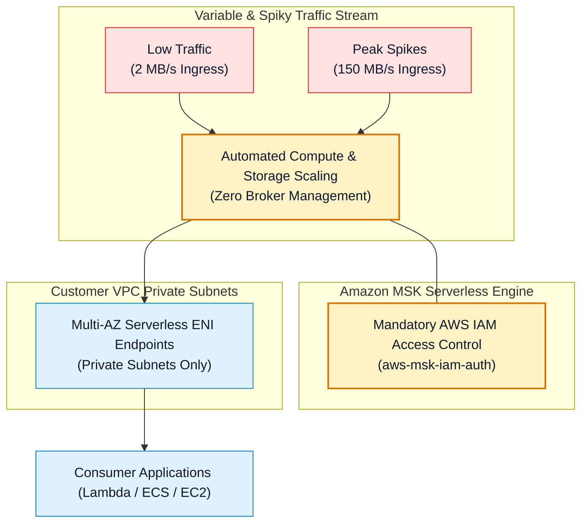
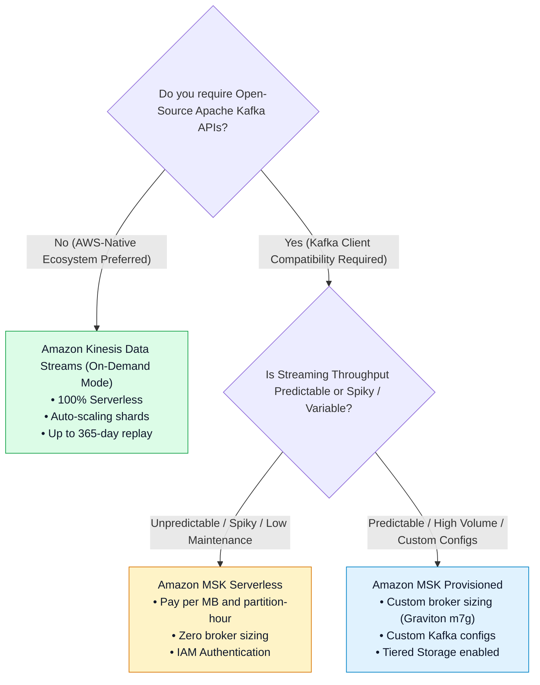

# ⚡ Amazon MSK Serverless Architecture, Capacity & Limits (မြန်မာဘာသာ)

- **Category**: Analytics / Serverless Streaming Architecture
- **Language / ဘာသာစကား**: [English (Original)](/en/02-services/analytics-streaming/msk/msk-serverless) | **မြန်မာဘာသာ (Burmese)**
- **Primary Use Case**: အခြေခံအဆောက်အအုံ စီမံခန့်ခွဲမှု (infrastructure management) ပြုလုပ်ရန် လုံးဝမလိုဘဲ Apache Kafka workload များကို run နိုင်ခြင်း၊ အတက်အကျရှိသော traffic များအတွက် automatic scaling ပြုလုပ်ပေးခြင်းနှင့် throughput ပေါ်မူတည်၍ ကျသင့်ငွေပေးချေရသော (pay-for-throughput) စနစ် ဖြစ်ခြင်း။
- **Slide Reference**: `[[AWSCertifiedDataEngineerSlides.pdf]]` ရှိ စာမျက်နှာ 450–459
- **Hub Links**: `[[mm/index]]` | `[[msk]]` | `[[msk-cluster-architecture]]` | `[[kinesis-data-streams]]`

---

## 1. High-Level Summary (အကျဉ်းချုပ် ခြုံငုံသုံးသပ်ချက်)

**Amazon MSK Serverless** သည် streaming throughput ပေါ်မူတည်၍ compute နှင့် storage resource များကို အလိုအလျောက် provision ပြုလုပ်ပေးပြီး scale လုပ်ပေးသည့် Amazon Managed Streaming for Apache Kafka အတွက် serverless cluster အမျိုးအစားတစ်ခု ဖြစ်ပါသည်။

MSK Serverless ဖြင့် data engineer များအနေဖြင့် broker instance အရွယ်အစားများကို သတ်မှတ်ခြင်း (sizing ပြုလုပ်ခြင်း)၊ EBS volume auto-scaling ကို configure ပြုလုပ်ခြင်း သို့မဟုတ် broker node များအကြား partition များကို manual rebalance ပြုလုပ်ခြင်းများ ပြုလုပ်ရန် မလိုအပ်တော့ပါ။

---

## 2. Technical Capabilities & Quota Limits (နည်းပညာပိုင်းဆိုင်ရာ စွမ်းဆောင်ရည်များနှင့် Quota ကန့်သတ်ချက်များ)

MSK Serverless ၏ လုပ်ငန်းဆောင်ရွက်မှုဆိုင်ရာ ကန့်သတ်ချက်များ (operational limits) ကို နားလည်ထားခြင်းသည် DEA-C01 စာမေးပွဲတွင် architectural validation ပြုလုပ်ရန်အတွက် မရှိမဖြစ် အရေးကြီးပါသည်:

| Operational Metric (လုပ်ငန်းဆောင်ရွက်မှုဆိုင်ရာ အတိုင်းအတာ) | Amazon MSK Serverless Limits (ကန့်သတ်ချက်များ) |
| :--- | :--- |
| **Max Write Throughput (Ingress)** | Cluster တစ်ခုလျှင် **200 MB / second အထိ** (partition တစ်ခုလျှင် 5 MB/s အထိ)။ |
| **Max Read Throughput (Egress)** | Cluster တစ်ခုလျှင် **400 MB / second အထိ** (partition တစ်ခုလျှင် 10 MB/s အထိ)။ |
| **Max Partitions per Cluster** | Cluster တစ်ခုလျှင် **partition ပေါင်း 2,400 အထိ**။ |
| **Max Message Payload Size** | Default အားဖြင့် **1 MB** (client-side compression ဖြင့် 8 MB အထိ)။ |
| **Data Retention** | Default အားဖြင့် **၁ ရက် (၂၄ နာရီ / 24 hours)** အထိ ဖြစ်ပြီး၊ **ရက် ၃၀ (30 days)** အထိ configure ပြုလုပ်နိုင်ပါသည်။ |
| **Authentication Requirement** | **AWS IAM Access Control သာလျှင် ရရှိနိုင်ပါသည် (ONLY)** (`aws-msk-iam-auth`)။ SASL/SCRAM နှင့် mTLS များကို အသုံးပြု၍ မရနိုင်ပါ (unsupported)။ |
| **Network Access** | **Private VPC subnets သာလျှင် ရရှိနိုင်ပါသည် (ONLY)**။ Public endpoints များကို ထောက်ပံ့မပေးပါ (not supported)။ |

---

## 3. MSK Serverless vs. MSK Provisioned vs. Kinesis On-Demand

---

## 4. Cost Model & Billing Dimensions (ကုန်ကျစရိတ် ပုံစံနှင့် ကျသင့်ငွေ တွက်ချက်မှု အတိုင်းအတာများ)

Amazon MSK Serverless သည် ပုံသေ EC2 broker ကုန်ကျစရိတ်များကို ဖယ်ရှားပေးပြီး သီးခြား dimension ၄ ခုပေါ်တွင် အမှန်တကယ် အသုံးပြုသော resource ပမာဏအပေါ် အခြေခံ၍ ကျသင့်ငွေ ကောက်ခံပါသည်:
1. **Cluster Base Hours**: Serverless cluster abstraction ကို run ထားခြင်းအတွက် ပုံသေ သတ်မှတ်ထားသော နာရီအလိုက် ကုန်ကျစရိတ် (Fixed hourly charge)။
2. **Partition Hours**: အသုံးပြုနေသော (active ဖြစ်နေသော) partition တစ်ခုချင်းစီအတွက် နာရီအလိုက် ကုန်ကျစရိတ်။
3. **Data Ingress & Egress**: Cluster သို့ data ရေးသားခြင်း (write) နှင့် cluster မှ data ဖတ်ရှုခြင်း (read) တို့အတွက် Per-GB ကျသင့်ငွေနှုန်းထား။
4. **Storage GB-Hours**: Topic retention window ကာလအတွင်း သိမ်းဆည်းထားသော data များအတွက် Per-GB သိုလှောင်မှု ကုန်ကျစရိတ် (storage fees)။

---

## 5. DEA-C01 Exam Essentials (စာမေးပွဲအတွက် မဖြစ်မနေ သိထားရမည့် အချက်များ)

> [!IMPORTANT]
> **MSK Serverless အတွက် အဓိက စာမေးပွဲ Decision Trigger များ (Key Exam Decision Triggers)**:
>
> - **"Spiky Kafka Workloads with No Operational Overhead"** (Operational overhead လုံးဝမရှိဘဲ အတက်အကျကြမ်းသော Kafka workload များ) $\rightarrow$ **Amazon MSK Serverless** ကို ရွေးချယ်ပါ (Choose)။
> - **"Mandatory Security Configuration for MSK Serverless"** (MSK Serverless အတွက် မဖြစ်မနေ လိုအပ်သော လုံခြုံရေးဆိုင်ရာ Configuration) $\rightarrow$ Producer နှင့် consumer client များသည် **AWS IAM Access Control** (`software.amazon.msk.auth.iam.IAMLoginModule`) ကို အသုံးပြု၍ authenticate ပြုလုပ်ရပါမည်။
> - **"Public Access Required"** (Public access လိုအပ်ခြင်း) $\rightarrow$ MSK Serverless သည် **public endpoints များကို ထောက်ပံ့မပေးပါ (does not support public endpoints)**။ အကယ်၍ internet client များမှ တိုက်ရိုက် ချိတ်ဆက်ရန် လိုအပ်ပါက public brokers ပါဝင်သော **MSK Provisioned** ကို အသုံးပြုပါ သို့မဟုတ် cluster ၏ ရှေ့တွင် API Gateway / Network Load Balancer ကို ထားရှိ ချိတ်ဆက်ပေးပါ။

---

## 📌 ဆက်စပ် မှတ်စုများ (Related Notes)
- `[[msk]]` — Amazon MSK Master Hub
- `[[msk-cluster-architecture]]` — MSK Provisioned Clusters & Brokers
- `[[msk-security-and-monitoring]]` — IAM Authentication & Kafka ACLs
- `[[kinesis-data-streams]]` — Kinesis On-Demand Mode Comparison
