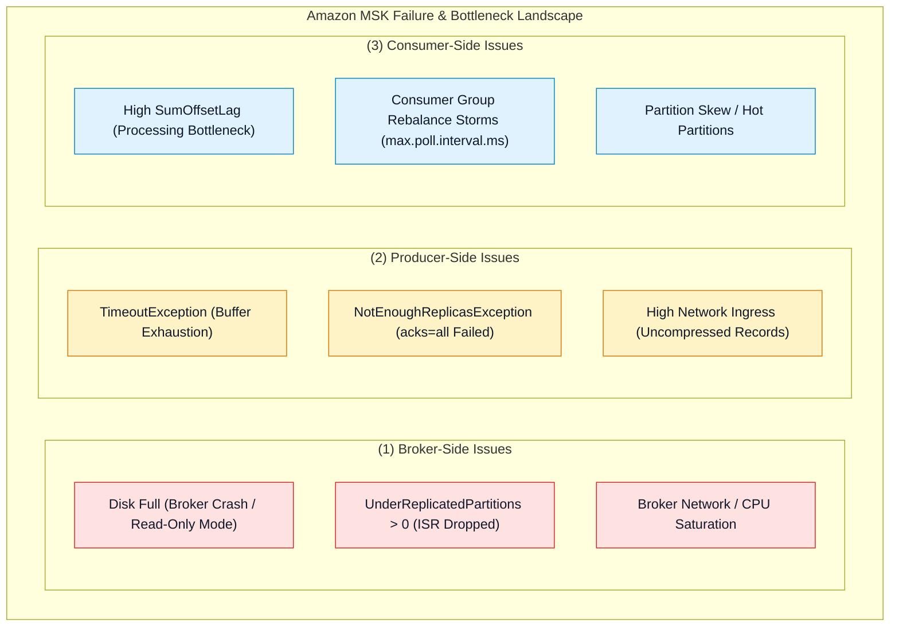
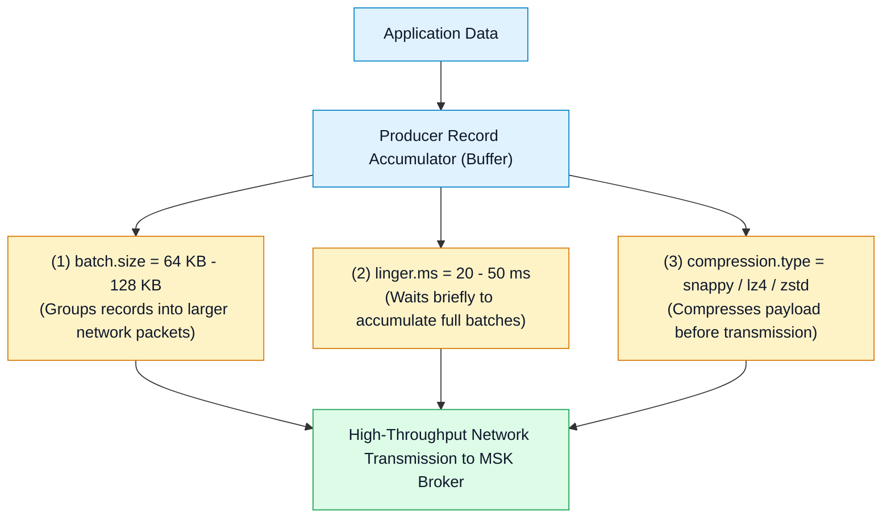
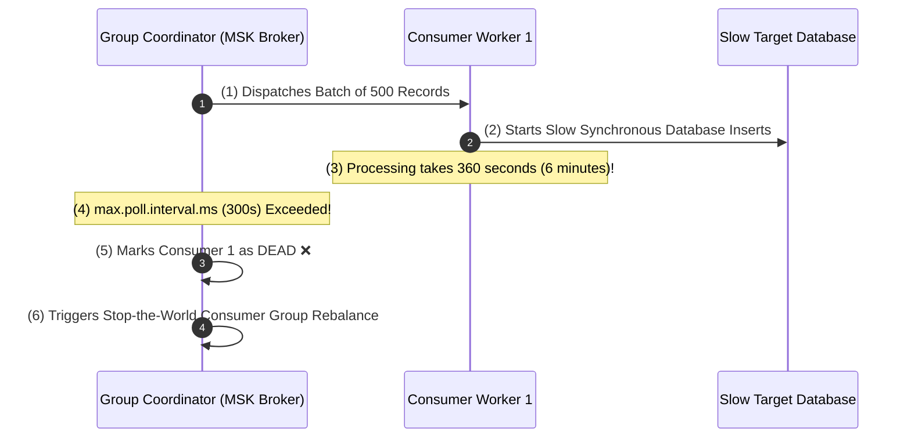

# 🔧 Amazon MSK Troubleshooting & Performance Tuning

- **Category**: Analytics / Production Troubleshooting & Cluster Optimization
- **Language / ဘာသာစကား**: [English (Original)](/en/02-services/analytics-streaming/msk/msk-troubleshooting-and-tuning) | **မြန်မာဘာသာ (Burmese)**
- **Primary Use Case**: Broker disk full failures များကို ရှာဖွေဖော်ထုတ်ခြင်း၊ producer `TimeoutException` များကို ဖြေရှင်းခြင်း၊ consumer rebalance storms များကို ဖယ်ရှားရှင်းလင်းခြင်း၊ producer batching ကို tune ပြုလုပ်ခြင်း နှင့် partition skew များကို ပြန်လည် ချိန်ညှိ (rebalance) ခြင်း။
- **Slide Reference**: `[[AWSCertifiedDataEngineerSlides.pdf]]` မှ Pages 450–459
- **Hub Links**: `[[mm/index]]` | `[[msk]]` | `[[msk-cluster-architecture]]` | `[[msk-security-and-monitoring]]` | `[[kinesis-troubleshooting-and-tuning]]`

---

## 1. High-Level Summary (အကျဉ်းချုပ် ခြုံငုံသုံးသပ်ချက်)

Amazon MSK တွင် ပြဿနာများကို စုံစမ်းစစ်ဆေးဖြေရှင်း (troubleshooting ပြုလုပ်) ရာတွင် **Brokers** (disk ပြည့်လျှံသွားခြင်း၊ broker crashes ဖြစ်ခြင်း၊ ISR replica drops ဖြစ်ခြင်း)၊ **Producers** (`TimeoutException`၊ `NotEnoughReplicasException`၊ uncompressed payloads များ) နှင့် **Consumers** (မြင့်မားသော `SumOffsetLag`၊ `max.poll.interval.ms` timeouts ကြောင့် ဖြစ်ပေါ်လာသော consumer group rebalance storms များ) စသည့် အစိတ်အပိုင်းအားလုံးရှိ failure modes များကို ရှာဖွေဖော်ထုတ်နိုင်ရန် လိုအပ်ပါသည်။

ဤအဖြစ်များသော failure patterns များနှင့် performance tuning knobs များကို ကျွမ်းကျင်စွာ နားလည်သဘောပေါက်ထားခြင်းသည် **DEA-C01** စာမေးပွဲတွင် အမှတ်ကောင်းကောင်းရရှိစေရန် မရှိမဖြစ် လိုအပ်ပါသည်။

---

## 2. Broker Troubleshooting: Disk Full & ISR Replication Failures (Broker ပြဿနာများ စစ်ဆေးဖြေရှင်းခြင်း - Disk ပြည့်ခြင်း နှင့် ISR Replication ချို့ယွင်းမှုများ)

### 1. Recovering from Broker Disk Full Disasters (Broker Disk ပြည့်လျှံသွားသော ပြဿနာမှ ပြန်လည်ကုစားခြင်း)
အကယ်၍ broker ၏ EBS storage volume သည် 100% capacity သို့ ရောက်ရှိသွားပါက Kafka သည် partition logs များသို့ data ဆက်လက်ရေးသား (append) နိုင်တော့မည် မဟုတ်သဖြင့် broker process crash ဖြစ်ခြင်း သို့မဟုတ် read-only mode သို့ ရောက်ရှိသွားစေပါသည်။
- **Immediate Remediation (ချက်ချင်း ကုစားဖြေရှင်းနည်း)**:
  1. AWS MSK Console သို့မဟုတ် CLI (`update-broker-storage`) မှတစ်ဆင့် broker storage volume size ကို တိုးမြှင့်ပေးပါ။ Disk capacity ကို တိုးမြှင့် (expand) သာ ပြုလုပ်နိုင်ပြီး၊ ပြန်လည်လျှော့ချ (shrink) ၍ မရနိုင်ကြောင်း သတိပြုပါ။
  2. Kafka log cleaners များမှ သက်တမ်းလွန် historical segments များကို ရှင်းလင်းဖျက်ထုတ်နိုင်ရန်အတွက် topic retention periods (`retention.ms` သို့မဟုတ် `retention.bytes`) ကို လျှော့ချပေးပါ။
- **Long-Term Prevention (ရေရှည် ကာကွယ်မှု နည်းလမ်းများ)**:
  - **EBS Storage Auto-Scaling** (Application Auto Scaling policy) ကို configure ပြုလုပ်ထားပါ။
  - ၂၄ နာရီထက် ပိုမိုသက်တမ်းကြာသော local segments များကို Amazon S3 သို့ အလိုအလျောက် ရွှေ့ပြောင်း (offload) ပေးနိုင်ရန် **Amazon MSK Tiered Storage** ကို enable ပြုလုပ်ထားပါ။

---

### 2. Resolving `NotEnoughReplicasException` (`NotEnoughReplicasException` ကို ဖြေရှင်းခြင်း)
- **Root Cause (အဓိက အကြောင်းရင်း)**: `acks=all` ဖြင့် configure ပြုလုပ်ထားသော producer တစ်ခုသည် topic သို့ data ရေးသားချိန်တွင် လက်ရှိ active ဖြစ်နေသော In-Sync Replica (ISR) အရေအတွက်သည် topic ၏ `min.insync.replicas` setting အောက်သို့ ကျဆင်းသွားသောအခါ (ဥပမာ- broker ၃ ခုအနက် ၁ ခု down ဖြစ်သွားခြင်း သို့မဟုတ် network partitioned ဖြစ်သွားခြင်း) ဤ exception ဖြစ်ပေါ်ပါသည်။
- **Remediation (ကုစားဖြေရှင်းနည်း)**: CloudWatch metric ဖြစ်သော `UnderReplicatedPartitions` ကို စစ်ဆေးပါ။ Unhealthy ဖြစ်နေသော broker nodes များကို အစားထိုးပါ သို့မဟုတ် disaster recovery ပြုလုပ်နေစဉ်အတွင်း `min.insync.replicas` ကို ယာယီချိန်ညှိပေးပါ။

---

## 3. Producer Troubleshooting & Performance Tuning (Producer ပြဿနာများ စစ်ဆေးဖြေရှင်းခြင်း နှင့် Performance Tuning)

### Producer Tuning Knobs for Maximum Throughput (Throughput အမြင့်ဆုံးရရှိစေရန် Producer Tuning Knobs များ):
1. **`linger.ms` & `batch.size`**:
   - ပုံမှန် default အားဖြင့် Kafka producers များသည် records များကို ချက်ချင်း ပေးပို့ကြပါသည် (`linger.ms=0`)။
   - `linger.ms = 20` မှ `50` milliseconds အဖြစ် သတ်မှတ်ပေးခြင်းဖြင့် producer အား သတ်မှတ်ထားသော `batch.size` (ဥပမာ- 64 KB သို့မဟုတ် 128 KB) အထိ micro-records များကို စုစည်း (batch) ပေးပို့ရန် အချိန်အနည်းငယ် စောင့်ဆိုင်းစေမည် ဖြစ်ပြီး၊ CPU နှင့် network request overhead များကို လျှော့ချပေးကာ throughput ကို ၅ ဆ အထိ မြှင့်တင်ပေးနိုင်ပါသည်။
2. **`compression.type`**:
   - CPU overhead အလွန်နည်းပါးပြီး high-throughput stream ingestion ရရှိစေရန် `snappy` သို့မဟုတ် `lz4` ကို enable ပြုလုပ်ပါ။ အမြင့်ဆုံး compression ratio ရရှိစေရန်အတွက် `zstd` ကို အသုံးပြုပါ။
3. **`retries` & `max.in.flight.requests.per.connection`**:
   - Retries ကို enable ပြုလုပ်ထားချိန်တွင် in-order delivery အစီအစဉ်အတိုင်း ရောက်ရှိမှုကို အာမခံချက်ပေးနိုင်ရန် `enable.idempotence = true` ကို configure ပြုလုပ်ပါ (၎င်းသည် `max.in.flight.requests.per.connection <= 5` အဖြစ် အလိုအလျောက် သတ်မှတ်ပေးပါသည်)။

---

## 4. Consumer Troubleshooting: Lag & Rebalance Storms (Consumer ပြဿနာများ စစ်ဆေးဖြေရှင်းခြင်း - Lag နှင့် Rebalance Storms)

### 1. Eliminating Consumer Group Rebalance Storms (Consumer Group Rebalance Storms များကို ဖယ်ရှားရှင်းလင်းခြင်း)
**Consumer Group Rebalance** ဖြစ်ပေါ်ပါက active consumer instances များအကြား partitions များကို ပြန်လည်ခွဲဝေနေရာချထားစဉ်အတွင်း message consumption လုပ်ငန်းစဉ်တစ်ခုလုံး ရပ်တန့်သွားပါသည်။

### How to Fix Rebalance Storms (Rebalance Storms များကို မည်သို့ ဖြေရှင်းမည်နည်း):
1. **Tune `max.poll.interval.ms`**: Downstream batch writes များသည် ပြီးစီးရန် အမှန်တကယ် အချိန်ပိုမိုကြာမြင့်ပါက ဤတန်ဖိုးကို တိုးမြှင့်ပေးပါ (ဥပမာ- 600,000 ms / 10 မိနစ်)။
2. **Reduce `max.poll.records`**: Consumer သည် `max.poll.interval.ms` အချိန်အပိုင်းအခြားအတွင်း processing အဆင်ပြေပြေ ပြီးစီးနိုင်စေရန် batch size ကို လျှော့ချပေးပါ (ဥပမာ- records 500 မှ 100 သို့)။
3. **Static Group Membership (`group.instance.id`)**: ပုံမှန် rolling deployments ပြုလုပ်စဉ်အတွင်း မလိုလားအပ်သော rebalances များ မဖြစ်ပေါ်စေရန် containerized consumers (ECS/Kubernetes) များတွင် သီးသန့် static instance IDs များကို သတ်မှတ်ပေးပါ။

---

## 5. Master Troubleshooting Cheat Sheet (အဓိက ပြဿနာဖြေရှင်းခြင်းဆိုင်ရာ အကျဉ်းချုပ် ဇယား)

| Error / Symptom (Error / လက္ခဏာ) | Root Cause (အဓိက အကြောင်းရင်း) | Immediate Action (ချက်ချင်း လုပ်ဆောင်ရမည့် အဆင့်) | Long-Term Architectural Remedy (ရေရှည် ဗိသုကာဆိုင်ရာ ကုစားမှု) |
| :--- | :--- | :--- | :--- |
| `KafkaDataLogsDiskUsed` သည် 100% သို့ ရောက်ရှိသွားခြင်း | Topic log retention သည် broker EBS storage ထက် ကျော်လွန်သွားခြင်း။ | AWS Console/CLI မှတစ်ဆင့် EBS storage size ကို တိုးမြှင့်ပါ။ | **Storage Auto-Scaling** နှင့် **MSK Tiered Storage** ကို enable ပြုလုပ်ပါ။ |
| `org.apache.kafka.common.errors.TimeoutException` | Network saturation သို့မဟုတ် dead leader ကြောင့် Producer buffer ကုန်ဆုံးသွားခြင်း။ | Broker connectivity ကို စစ်ဆေးပြီး producer buffer memory ကို scale ပြုလုပ်ပါ။ | Producer ၏ `batch.size`၊ `linger.ms` တို့ကို optimize ပြုလုပ်ပြီး compression ကို enable လုပ်ပါ။ |
| `NotEnoughReplicasException` | Active ISR count < `min.insync.replicas` ဖြစ်နေခြင်း။ | `UnderReplicatedPartitions` ဖြင့် broker health ကို စစ်ဆေးအတည်ပြုပါ။ | Brokers များကို `replication.factor=3` ဖြင့် 3 AZs အနှံ့ ဖြန့်ကြက်ထားရှိကြောင်း သေချာပါစေ။ |
| `SumOffsetLag` လျင်မြန်စွာ မြင့်တက်လာခြင်း | Consumer application throughput သည် write rate ထက် ပိုမိုနှေးကွေးနေခြင်း။ | Topic partitions စုစုပေါင်း အရေအတွက်အထိ consumer instances များကို scale out ပြုလုပ်ပါ။ | Consumer concurrency ကို တိုးမြှင့်ပါ၊ downstream writes များကို optimize လုပ်ပါ သို့မဟုတ် AWS Lambda triggers များကို အသုံးပြုပါ။ |
| Consumer rebalances ခဏခဏ ဖြစ်ပေါ်နေခြင်း | Processing loop ကြာချိန် > `max.poll.interval.ms` ဖြစ်နေခြင်း။ | `max.poll.records` ကို လျှော့ချပါ သို့မဟုတ် `max.poll.interval.ms` ကို တိုးမြှင့်ပါ။ | Consumers များတွင် static membership (`group.instance.id`) ကို enable ပြုလုပ်ပါ။ |
| Partition traffic သည် broker တစ်ခုတည်းသို့ အလွန်အမင်း စုပြုံရောက်ရှိနေခြင်း (Skewed) | Message key ဖြန့်ကြက်မှု အားနည်းခြင်း (Low cardinality ဖြစ်နေခြင်း)။ | Producer ၏ partition key hashing ကို စစ်ဆေးအတည်ပြုပါ။ | Partition keys များတွင် random salt ထည့်သွင်းပါ သို့မဟုတ် custom partitioner တစ်ခုကို implement လုပ်ပါ။ |

---

## 6. DEA-C01 Exam Essentials (စာမေးပွဲအတွက် မဖြစ်မနေ သိထားရမည့် အချက်များ)

> [!IMPORTANT]
> **MSK Troubleshooting & Tuning ဆိုင်ရာ စာမေးပွဲအတွက် အဓိက ဆုံးဖြတ်ချက်လမ်းညွှန်များ (Key Exam Decision Triggers)**:
>
> - **"High-volume historical logging ကြောင့် Broker disks များ လျင်မြန်စွာ ပြည့်လျှံလာသည်"** $\rightarrow$ Cold log segments များကို Amazon S3 သို့ offload ပြုလုပ်နိုင်ရန် **MSK Tiered Storage** ကို enable ပြုလုပ်ပါ။
> - **"Heavy batch processing ပြုလုပ်နေစဉ် Consumer application သည် consumer group မှ ခဏခဏ drop ထွက်သွားသည်"** $\rightarrow$ Processing loop သည် **`max.poll.interval.ms`** ထက် ကျော်လွန်ကြာမြင့်နေခြင်း ဖြစ်ပါသည်။ **`max.poll.records`** ကို လျှော့ချခြင်း သို့မဟုတ် timeout ကို တိုးမြှင့်ခြင်းဖြင့် ဖြေရှင်းပါ။
> - **"Producers များသည် ဖိသိပ်ထားခြင်းမရှိသော (uncompressed) tiny messages သန်းပေါင်းများစွာကို ပေးပို့နေသောကြောင့် network costs မြင့်မားပြီး throughput နည်းပါးနေသည်"** $\rightarrow$ Producer တွင် **`linger.ms=20`** configure ပြုလုပ်ပါ၊ **`batch.size`** ကို တိုးမြှင့်ပါ၊ **`compression.type=snappy`** ကို enable ပြုလုပ်ပါ။
> - **"Producer သည် `NotEnoughReplicasException` ကို လက်ခံရရှိသည်"** $\rightarrow$ လက်ရှိရရှိနိုင်သော In-Sync Replicas (ISR) အရေအတွက်သည် **`min.insync.replicas`** ထက် နည်းပါးနေခြင်း ဖြစ်ပါသည်။

---

## 📌 Related Notes (ဆက်စပ် မှတ်စုများ)
- `[[msk]]` — Amazon MSK Master Hub
- `[[msk-cluster-architecture]]` — Broker Topologies & Tiered Storage
- `[[msk-security-and-monitoring]]` — CloudWatch Metrics & `SumOffsetLag`
- `[[kinesis-troubleshooting-and-tuning]]` — Kinesis Data Streams Troubleshooting Comparison
