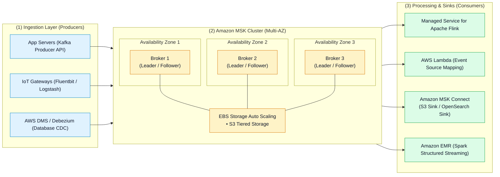
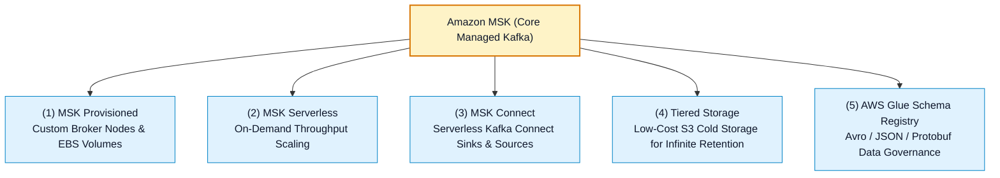

# ☕ Amazon MSK (Managed Streaming for Apache Kafka) Hub

- **Category**: Analytics / Distributed Streaming & Real-Time Data Ingestion
- **Language / ဘာသာစကား**: [English (Original)](/en/02-services/analytics-streaming/msk/msk) | **မြန်မာဘာသာ (Burmese)**
- **Primary Use Case / အဓိက အသုံးပြုမှု**: Real-time streaming၊ event-driven microservices၊ open-source ecosystem compatibility နှင့် high-throughput low-latency pub/sub pipelines များအတွက် fully managed ဖြစ်ပြီး highly available ဖြစ်သော Apache Kafka cluster များကို ထောက်ပံ့ပေးခြင်း။
- **Slide Reference**: `[AWSCertifiedDataEngineerSlides.pdf](/docs/AWSCertifiedDataEngineerSlides.pdf)` ရှိ စာမျက်နှာ 450–459
- **Hub Links**: `[[mm/index|index]]` | `[[mm/00-hub/service-catalog|service-catalog]]` | `[[mm/02-services/analytics-streaming/kinesis/kinesis|kinesis]]` | `[[mm/02-services/analytics-streaming/glue/glue-schema-registry|glue-schema-registry]]` | `[[mm/02-services/compute-containers/lambda|lambda]]`

---

## 1. High-Level Summary (အကျဉ်းချုပ် ခြုံငုံသုံးသပ်ချက်)

**Amazon MSK (Amazon Managed Streaming for Apache Kafka)** သည် open-source **Apache Kafka** ကို အသုံးပြု၍ real-time data များကို အလွယ်တကူ ingest ပြုလုပ်ခြင်း၊ သိမ်းဆည်းခြင်း (store) နှင့် stream ပြုလုပ်ခြင်းတို့ကို ဆောင်ရွက်ပေးနိုင်သော fully managed AWS service တစ်ခု ဖြစ်ပါသည်။

Amazon MSK သည် control plane၊ broker node များ provision ပြုလုပ်ခြင်း၊ ZooKeeper / KRaft metadata စီမံခန့်ခွဲမှု၊ multi-AZ high availability၊ storage volume auto-scaling နှင့် patch maintenance တို့ကို အလိုအလျောက် စီမံပေးသောကြောင့် data engineer များအနေဖြင့် infrastructure operational overhead မရှိဘဲ native Apache Kafka client libraries၊ Kafka Connect plugins များနှင့် Kafka Streams များကို အသုံးပြု၍ distributed streaming applications များကို တည်ဆောက်နိုင်စေပါသည်။

---

## 2. Amazon MSK Deployment Modes (ဖြန့်ကြက်အသုံးပြုမှု ပုံစံများ)

Amazon MSK သည် throughput ခန့်မှန်းရလွယ်ကူမှု (throughput predictability) နှင့် operational လိုအပ်ချက်များအပေါ် မူတည်၍ deployment model နှစ်မျိုးကို ထောက်ပံ့ပေးထားပါသည်:

| Dimension (ရှုထောင့်) | Amazon MSK Provisioned | Amazon MSK Serverless |
| :--- | :--- | :--- |
| **Capacity Management** | Explicit broker instance types (`kafka.m5.large`, `kafka.t3.small` စသည်) နှင့် AZ တစ်ခုစီအလိုက် broker အရေအတွက်ကို သတ်မှတ်ပေးရသည်။ | Instance sizing ပြုလုပ်ရန်မလိုဘဲ အလိုအလျောက် အပြည့်အဝ scale လုပ်ဆောင်ပေးသော serverless capacity management ဖြစ်သည်။ |
| **Storage Architecture** | Broker တစ်ခုစီအတွက် သီးသန့် Amazon EBS storage volumes + စိတ်ကြိုက်ရွေးချယ်နိုင်သော **Amazon MSK Tiered Storage** (S3)။ | အတိုးအလျှော့ အလိုအလျောက် ချောမွေ့စွာ ပြုလုပ်ပေးသော automated managed storage။ |
| **Kafka Version & Metadata** | ZooKeeper သို့မဟုတ် KRaft metadata management (Kafka 3.7+)။ | အပြည့်အဝ စီမံခန့်ခွဲပေးထားသော metadata (KRaft-based)။ |
| **Maximum Message Size** | Broker properties မှတစ်ဆင့် configure လုပ်နိုင်သည် (`message.max.bytes` ကို multi-MB အထိ သတ်မှတ်နိုင်သည်)။ | Default အားဖြင့် **1 MB** ဖြစ်သည် (client compression ဖြင့် 8 MB အထိ ရရှိနိုင်သည်)။ |
| **Network & Access** | Publicly accessible endpoints (ရွေးချယ်နိုင်သည်) သို့မဟုတ် VPC Private Subnets။ | VPC Private Subnets များတွင်သာ ရရှိနိုင်သည် (IAM Authentication မဖြစ်မနေ လိုအပ်သည်)။ |
| **Best For** | ခန့်မှန်းရလွယ်ကူပြီး စဉ်ဆက်မပြတ် မြင့်မားသော data volume ရှိသည့် enterprise pipelines များ၊ custom broker configurations များနှင့် multi-terabyte data lakes များအတွက် အသင့်တော်ဆုံးဖြစ်သည်။ | Server စီမံခန့်ခွဲမှု လုံးဝမလိုဘဲ ခန့်မှန်းရခက်ခဲသော၊ ရုတ်တရက် တက်လာတတ်သော (spiky) သို့မဟုတ် low-volume streaming workloads များအတွက် အသင့်တော်ဆုံးဖြစ်သည်။ |

---

## 3. The Core Ecosystem of Amazon MSK (အဓိက ဂေဟစနစ်)

1. **Amazon MSK Provisioned**: သီးသန့် Kafka broker များကို AWS Graviton (`kafka.m7g`) သို့မဟုတ် x86 instances များပေါ်တွင် run နိုင်ပြီး အသေးစိတ် JVM tuning၊ custom broker configurations နှင့် storage auto-scaling များကို ဆောင်ရွက်နိုင်သည်။
2. **Amazon MSK Serverless**: Partitions များ၊ broker capacity နှင့် throughput scaling တို့ကို pay-per-use စနစ်ဖြင့် အလိုအလျောက် စီမံခန့်ခွဲပေးသည်။
3. **Amazon MSK Connect**: Worker EC2 cluster များကို စီမံခန့်ခွဲရန် မလိုဘဲ Apache Kafka Connect connectors များ (ဥပမာ- Debezium CDC၊ Snowflake Sink၊ Amazon S3 Sink) အတွက် serverless runtime တစ်ခု ဖြစ်သည်။
4. **MSK Tiered Storage**: သမိုင်းဝင် log segments များကို ဈေးကြီးသော broker EBS storage မှ Amazon S3 သို့ offload ပြုလုပ်ပေးသည့် ကုန်ကျစရိတ်သက်သာသော storage tier ဖြစ်ပြီး topic retention ကို အကန့်အသတ်မရှိနီးပါး ထားရှိနိုင်စေသည်။
5. **AWS Glue Schema Registry**: MSK producers နှင့် consumers များအကြား schema compatibility (Avro, Protobuf, JSON) ကို စစ်ဆေးအတည်ပြုပြီး ထိန်းကျောင်းပေးသော အခမဲ့ integration တစ်ခု ဖြစ်သည်။

---

## 4. Modular MSK Deep-Dive Topics (အသေးစိတ် လေ့လာရန် အကြောင်းအရာများ)

**AWS Certified Data Engineer - Associate (DEA-C01)** စာမေးပွဲအတွက် Amazon MSK ကို ကျွမ်းကျင်စွာ တတ်မြောက်စေရန် အောက်ပါ modular sub-topics များကို လေ့လာပါ:

1. `[[mm/02-services/analytics-streaming/msk/msk-cluster-architecture|msk-cluster-architecture]]` — **Brokers, Multi-AZ Replication Factor, Storage Auto-Scaling, Tiered Storage & KRaft Mode**
2. `[[mm/02-services/analytics-streaming/msk/msk-serverless|msk-serverless]]` — **Serverless Architecture, Throughput Capacity Units, Partition Limits & Cost Model**
3. `[[mm/02-services/analytics-streaming/msk/msk-connect|msk-connect]]` — **Kafka Connect Sinks & Sources, S3 Sink Connector, Custom Plugins & Worker Configurations**
4. `[[mm/02-services/analytics-streaming/msk/msk-security-and-monitoring|msk-security-and-monitoring]]` — **IAM Auth, SASL/SCRAM, TLS Mutual Auth, Kafka ACLs, OpenMonitoring & CloudWatch Lag Metrics**
5. `[[mm/02-services/analytics-streaming/msk/msk-troubleshooting-and-tuning|msk-troubleshooting-and-tuning]]` — **Broker Disk Full Recovery, Producer Timeout Exceptions, Consumer Rebalances & Partition Skew**
6. `[[mm/02-services/analytics-streaming/msk/msk-kinesis-comparison-and-patterns|msk-kinesis-comparison-and-patterns]]` — **Comprehensive KDS vs. MSK Decision Matrix, Self-Hosted Migration & Streaming Patterns**

---

## 5. DEA-C01 Exam Essentials (စာမေးပွဲအတွက် မဖြစ်မနေ သိထားရမည့် အချက်များ)

> [!IMPORTANT]
> **Key Exam Rules for Amazon MSK**:
>
> - **Kafka Compatibility Mandate**: အကယ်၍ စာမေးပွဲမေးခွန်းတွင် **open-source Apache Kafka APIs**၊ **လက်ရှိ Kafka Connect plugins များ**၊ သို့မဟုတ် **external S3 pointers မပါဘဲ payload size 1 MB ထက်ကျော်လွန်သော data များ** ကို မဖြစ်မနေ အသုံးပြုရန် တောင်းဆိုလာပါက Kinesis Data Streams အစား **Amazon MSK** ကို ရွေးချယ်ပါ။
> - **Storage Tiering**: Historical Kafka topic data များကို ကြီးမားသော EBS volume ကုန်ကျစရိတ်များ မကုန်ဘဲ လပေါင်းများစွာ သို့မဟုတ် နှစ်ပေါင်းများစွာ သိမ်းဆည်းထားလိုပါက **MSK Tiered Storage** ကို enable လုပ်ပါ (၎င်းသည် historical log segments များကို Amazon S3 သို့ transparently offload လုပ်ပေးပါသည်)။
> - **Authentication Standard**: AWS ပေါ်ရှိ MSK အတွက် အကြံပြုထားပြီး အလုံခြုံဆုံးဖြစ်သော authentication နည်းလမ်းမှာ **IAM Access Control (`aws-msk-iam-auth`)** ဖြစ်ပြီး၊ database passwords သို့မဟုတ် client certificates များကို စီမံခန့်ခွဲရန် လိုအပ်မှုကို ဖယ်ရှားပေးသည်။
> - **Consumer Lag Metric**: Consumer groups များသည် နောက်ဆုံး partition offset ထက် မက်ဆေ့ခ်ျမည်မျှ နောက်ကျကျန်နေသည် (lagging) ကို စောင့်ကြည့်ရန် Amazon CloudWatch သို့မဟုတ် Prometheus OpenMonitoring ရှိ **`SumOffsetLag`** ကို monitor လုပ်ပါ။

---

## 📌 Related Notes (ဆက်စပ် မှတ်စုများ)
- `[[mm/02-services/analytics-streaming/msk/msk-cluster-architecture|msk-cluster-architecture]]` — Broker Architecture & Storage Sizing
- `[[mm/02-services/analytics-streaming/msk/msk-connect|msk-connect]]` — Serverless Connectors to S3 and OpenSearch
- `[[mm/02-services/analytics-streaming/msk/msk-kinesis-comparison-and-patterns|msk-kinesis-comparison-and-patterns]]` — MSK vs Kinesis Architecture Comparison
- `[[mm/02-services/analytics-streaming/kinesis/kinesis|kinesis]]` — Amazon Kinesis Streaming Ecosystem
- `[[mm/02-services/analytics-streaming/glue/glue-schema-registry|glue-schema-registry]]` — Schema Evolution for MSK and KDS
- `[[mm/02-services/compute-containers/lambda|lambda]]` — Serverless Stream Consumers with MSK Triggers
