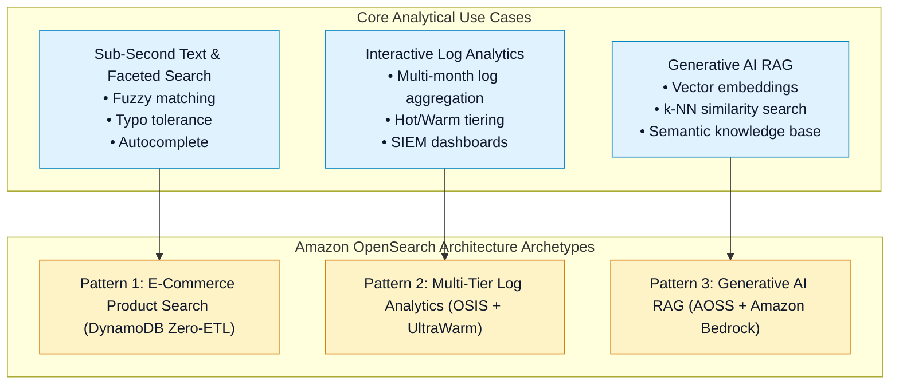
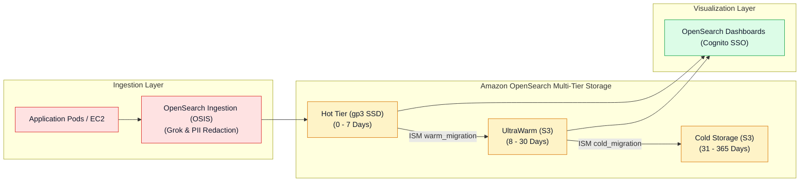
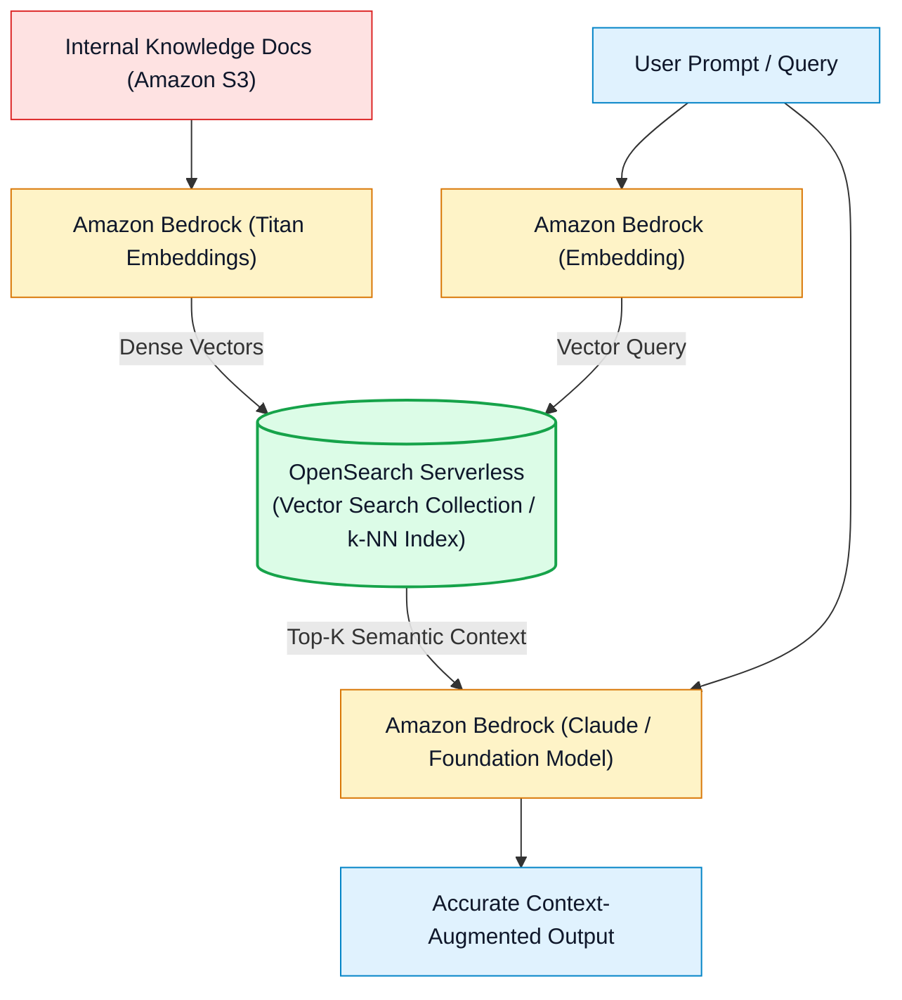

# 📐 Amazon OpenSearch Architecture Patterns & Exam Decision Matrix

- **Category**: Analytics / System Design, End-to-End Pipelines & Technology Selection
- **Language / ဘာသာစကား**: [English (Original)](/en/02-services/analytics-streaming/opensearch/opensearch-architecture-and-patterns) | **မြန်မာဘာသာ (Burmese)**
- **Primary Use Case**: Enterprise log analytics pipelines များ ဒီဇိုင်းဆွဲခြင်း၊ Amazon Bedrock ဖြင့် Generative AI RAG vector search အကောင်အထည်ဖော်ခြင်း၊ နှင့် OpenSearch ကို Athena, Redshift, CloudWatch Logs Insights တို့နှင့် နှိုင်းယှဉ်သုံးသပ်ခြင်း။
- **Slide Reference**: `[AWSCertifiedDataEngineerSlides.pdf](/docs/AWSCertifiedDataEngineerSlides.pdf)` မှ Pages 460–478
- **Hub Links**: `[[mm/index]]` | `[[opensearch]]` | `[[athena]]` | `[[redshift]]` | `[[cloudwatch-and-eventbridge]]`

---

## 1. High-Level Summary

Amazon OpenSearch Service သည် AWS modern data architecture အတွင်း ထူးခြား၍ စွမ်းဆောင်ရည်မြင့်မားသော အခန်းကဏ္ဍတွင် ပါဝင်ပါသည်: **sub-second search queries**၊ **interactive log analytics**၊ နှင့် **vector similarity search** တို့ ဖြစ်ကြသည်။

**DEA-C01** စာမေးပွဲအတွက် relational databases၊ SQL query engines (Athena)၊ နှင့် data warehouses (Redshift) တို့ထက် OpenSearch ကို မည်သည့်အချိန်တွင် ရွေးချယ်အသုံးပြုရမည်ကို သိရှိနားလည်ထားရမည်ဖြစ်ပြီး end-to-end streaming နှင့် vector RAG pipelines များကို မည်သို့ architect လုပ်ရမည်ကို သဘောပေါက်ထားရပါမည်။

---

## 2. Production Architecture Patterns

### Pattern 1: Enterprise Multi-Tier Log Analytics & Observability Pipeline

---

### Pattern 2: Generative AI Retrieval-Augmented Generation (RAG) Pipeline

---

## 3. Definitive AWS Analytics Service Decision Matrix

DEA-C01 စာမေးပွဲတွင် အဓိကစစ်ဆေးလေ့ရှိသော အချက်တစ်ခုမှာ OpenSearch၊ Athena၊ Redshift၊ နှင့် CloudWatch Logs Insights တို့အကြား သင့်လျော်ရာကို ရွေးချယ်နိုင်စွမ်း ဖြစ်သည်:

| Service | Primary Strength | Query Latency | Data Structure | Billing Model | Best Exam Scenario |
| :--- | :--- | :--- | :--- | :--- | :--- |
| **Amazon OpenSearch Service** | **Full-text search, fuzzy matching, real-time log aggregation & vector search** | **Sub-second** ($< 1\text{ s}$) | Semi-structured **JSON documents** (Inverted Index) | တစ်နာရီလျှင် node/OCU capacity + storage ဖြင့် ကောက်ခံခြင်း (Hourly node/OCU capacity + storage) | Search catalogs, SIEM log monitoring, နှင့် vector RAG |
| **Amazon Athena** | **S3 data lakes ပေါ်တွင် တိုက်ရိုက် run နိုင်သော Serverless ad-hoc SQL queries** | Seconds မှ minutes အထိ ($5\text{ s} - 60\text{ s}$) | Structured / Tabular (Parquet, ORC, CSV, Iceberg) | **Scan လုပ်သည့် TB အလိုက် ပေးချေရခြင်း (Pay per TB scanned)** ($5/TB) | သီးသန့် compute provision လုပ်ရန်မလိုဘဲ S3 data lake files များပေါ်တွင် ad-hoc analytics ပြုလုပ်ခြင်း |
| **Amazon Redshift** | **Petabyte-scale enterprise relational data warehousing & OLAP BI reporting** | Sub-second မှ seconds အထိ ($< 5\text{ s}$) | Structured Relational (Columnar storage) | Node hours (Provisioned) သို့မဟုတ် RPU-hours (Serverless) | ရှုပ်ထွေးသော multi-table SQL joins များ၊ dimensional modeling၊ နှင့် corporate BI များ |
| **CloudWatch Logs Insights** | **CloudWatch အတွင်း တိုက်ရိုက်အသုံးပြုနိုင်သော Ad-hoc interactive log querying** | Seconds ($2\text{ s} - 15\text{ s}$) | CloudWatch Log Streams | **Scan လုပ်သည့် GB အလိုက် ပေးချေရခြင်း (Pay per GB scanned)** ($0.005/GB) | သီးသန့် search cluster တစ်ခု provision လုပ်ရန်မလိုဘဲ မြန်ဆန်သော ad-hoc developer troubleshooting များ ပြုလုပ်ခြင်း |

---

## 4. DEA-C01 Master Search & Analytics Decision Guide

> [!IMPORTANT]
> **OpenSearch နှင့် အခြား Services များအကြား ရွေးချယ်ရန် အဓိက Exam Decision Triggers များ**:
>
> - **"E-commerce catalog ပေါ်တွင် application သည် fuzzy keyword search, faceted filters, နှင့် autocomplete တို့ လိုအပ်သည်"** $\rightarrow$ **Amazon OpenSearch Service** ကို ရွေးချယ်ပါ။
> - **"Data analyst တစ်ဦးသည် servers များကို manage လုပ်ရန်မလိုဘဲ သို့မဟုတ် hourly cluster fees ပေးရန်မလိုဘဲ S3 ရှိ historical Parquet files များပေါ်တွင် ad-hoc SQL queries run ရန် လိုအပ်သည်"** $\rightarrow$ **Amazon Athena** ကို ရွေးချယ်ပါ။
> - **"Enterprise BI team သည် sub-second dashboard performance ဖြင့် ဘီလီယံချီသော historical sales records များတစ်လျှောက် complex joins များ run ရန် လိုအပ်သည်"** $\rightarrow$ **Amazon Redshift** ကို ရွေးချယ်ပါ။
> - **"Security team သည် multi-terabyte infrastructure logs များတစ်လျှောက် real-time log search နှင့် SIEM anomaly dashboards များ လိုအပ်သည်"** $\rightarrow$ Logs များကို **OpenSearch Ingestion (OSIS)** မှတစ်ဆင့် **UltraWarm Storage** ပါဝင်သော **Amazon OpenSearch Service** ထဲသို့ ပေးပို့ (route) ပါ။
> - **"Generative AI အတွက် semantic search knowledge base တစ်ခု တည်ဆောက်ရန်"** $\rightarrow$ Vector embeddings များကို **Amazon OpenSearch Serverless (Vector search collection)** တွင် သိမ်းဆည်းပါ။

---

## 📌 Related Notes
- `[[opensearch]]` — OpenSearch Master Hub
- `[[opensearch-serverless]]` — Vector Search & Serverless Collections
- `[[opensearch-storage-tiers-and-ism]]` — UltraWarm & Index State Management
- `[[athena]]` — S3 Serverless SQL Engine
- `[[redshift]]` — Enterprise Data Warehousing
- `[[cloudwatch-and-eventbridge]]` — CloudWatch Logs & Subscription Filters
