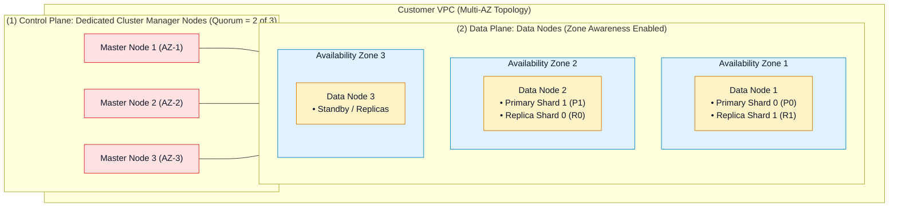
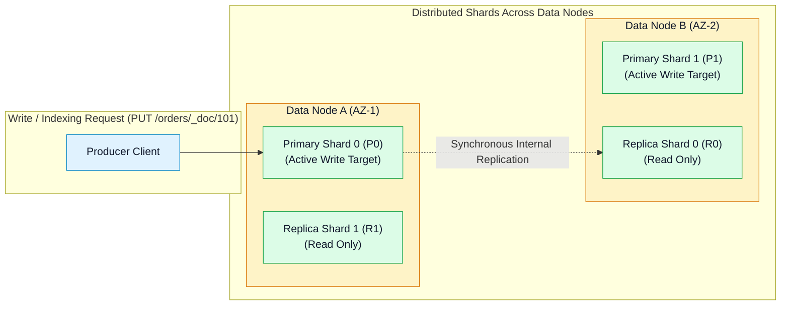

# 🏛️ Amazon OpenSearch Cluster Architecture, Sharding & Node Sizing

- **Category**: Analytics / Search Engine Architecture & Infrastructure Design
- **Language / ဘာသာစကား**: [English (Original)](/en/02-services/analytics-streaming/opensearch/opensearch-cluster-architecture) | **မြန်မာဘာသာ (Burmese)**
- **Primary Use Case**: ကြံ့ခိုင်မှုရှိသော multi-AZ OpenSearch cluster များကို ဒီဇိုင်းထုတ်ခြင်း၊ dedicated cluster manager node များကို ချိန်ညှိသတ်မှတ်ခြင်း၊ နှင့် AWS best practices များအရ primary နှင့် replica shard များကို အရွယ်အစားတွက်ချက်သတ်မှတ်ခြင်း (sizing)။
- **Slide Reference**: `[AWSCertifiedDataEngineerSlides.pdf](/docs/AWSCertifiedDataEngineerSlides.pdf)` မှ စာမျက်နှာ 460–478
- **Hub Links**: `[[mm/index]]` | `[[opensearch]]` | `[[opensearch-storage-tiers-and-ism]]` | `[[opensearch-troubleshooting-and-tuning]]`

---

## 1. High-Level Summary

Amazon OpenSearch Service managed cluster တစ်ခုတွင် Virtual Private Cloud (VPC) အတွင်းရှိ Availability Zone အများအပြားတစ်လျှောက် ဖြန့်ကျက်ထားသော အထူးပြု node အမျိုးအစားများ (specialized node types) ပါဝင်သည်။

**DEA-C01** စာမေးပွဲအတွက် **Dedicated Cluster Manager Nodes** နှင့် **Data Nodes** အကြား တာဝန်ခွဲဝေမှုများ၊ data များကို **Primary နှင့် Replica Shards** များတစ်လျှောက် မည်သို့ခွဲခြမ်းထားသည် (partitioned)၊ နှင့် JVM memory ပြည့်လျှံကုန်ခန်းမှု မဖြစ်စေရန် shard sizing ဆိုင်ရာ သင်္ချာနည်းကျ လက်တွေ့အသုံးချစည်းမျဉ်းများ (mathematical rules of thumb) ကို သင် သေချာစွာ တတ်ကျွမ်းနားလည်ထားရပါမည်။

---

## 2. Cluster Node Roles & Topology

| Node Role | Responsibility | Sizing & Resiliency Rule |
| :--- | :--- | :--- |
| **Dedicated Cluster Manager (Master) Nodes** | Cluster state ကို စီမံခန့်ခွဲခြင်း၊ index ဖန်တီးမှုများကို လမ်းကြောင်းသတ်မှတ်ခြင်း (route လုပ်ခြင်း)၊ health check များ ပြုလုပ်ခြင်း၊ node များ အသစ်ဝင်ရောက်လာခြင်း/ထွက်ခွာသွားခြင်းကို စောင့်ကြည့်မှတ်သားခြင်း၊ နှင့် shard များကို နေရာပြန်လည်ချထားခြင်း (reallocation) တို့ကို ညှိနှိုင်းဆောင်ရွက်ပေးသည်။ Index data များကို သိမ်းဆည်းခြင်း သို့မဟုတ် search query များကို run ပေးခြင်း မပြုလုပ်ပါ။ | Production multi-AZ setup များတွင် **Dedicated master node ၃ ခုကို အမြဲတမ်း deploy လုပ်ပါ**။ **Split-brain** အခြေအနေများကို ကာကွယ်ရန်အတွက် `(N/2) + 1 = 2` nodes ရှိသော quorum တစ်ခု လိုအပ်ပါသည်။ |
| **Data Nodes** | Lucene index များကို ထိန်းသိမ်းထားရှိပြီး write indexing operation များကို ဆောင်ရွက်ခြင်း၊ ဖြန့်ကြက်ထားသော search နှင့် aggregation query များကို execute လုပ်ခြင်းတို့ကို ဆောင်ရွက်သည်။ | **Zone Awareness** ကို enable လုပ်ထားပြီး **Availability Zone ၂ ခု သို့မဟုတ် ၃ ခု** တစ်လျှောက် deploy လုပ်ရမည်။ Storage, memory, နှင့် CPU လိုအပ်ချက်များအပေါ် အခြေခံ၍ အရွယ်အစားသတ်မှတ်သည် (memory အသုံးများသော search များအတွက် `r6g.search` ကို အကြံပြုထားပါသည်)။ |
| **UltraWarm Nodes** | Warm index များကို အပြန်အလှန် query လုပ်နိုင်ရန်အတွက် S3-backed data များကို memory/local storage တွင် cache လုပ်ထားပေးသော high-density read-only node များ ဖြစ်သည်။ | စုစုပေါင်း warm storage ပမာဏအပေါ် အခြေခံ၍ အရွယ်အစားသတ်မှတ်သည် (cluster တစ်ခုလျှင် 3 PB အထိ)။ |
| **Cold Storage** | ချိတ်ဆက်ထားသော compute instance များမပါဝင်ဘဲ လုံးဝသီးခြား decoupled ဖြစ်နေသော S3 storage ဖြစ်သည်။ | အမြဲတမ်းလည်ပတ်နေသော persistent node များ မလိုအပ်ပါ၊ လိုအပ်ချိန်တွင်သာ mount လုပ်သည်။ |

---

## 3. Sharding Architecture: Primaries vs. Replicas

OpenSearch ရှိ Data များကို **Indices** (SQL table များနှင့် သဘောတရားတူညီသည်) အဖြစ် ဖွဲ့စည်းထားပြီး ၎င်းတို့ကို **Shards** (အောက်ခံ Apache Lucene instance များ) အဖြစ် ပိုင်းခြားသတ်မှတ်ထားသည်:

### Primary vs. Replica Rules:
1. **Primary Shards**:
   - Document ID ကို hash ပြုလုပ်ခြင်းဖြင့် သတ်မှတ်ထားသော primary shard ဆီသို့ write operation တိုင်းကို တိုက်ရိုက်ပို့ဆောင်ပေးသည်: `shard = hash(doc_id) % number_of_primary_shards`။
   - **အရေးကြီးသော စည်းမျဉ်း (Crucial Rule)**: Primary shard အရေအတွက်ကို **index ဖန်တီးချိန်တွင် သတ်မှတ်ပြီး ပုံသေဖြစ်သည် (fixed)**၊ index အသစ်တစ်ခု ဖန်တီးပြီး **Reindex API** operation မသုံးဘဲ ပြောင်းလဲ၍ မရပါ။
2. **Replica Shards**:
   - **အခြား data node တစ်ခု** (နှင့် အခြား AZ) ပေါ်တွင် တည်ရှိသော primary shard ၏ တိကျသော မိတ္တူပွား (exact copy) ဖြစ်သည်။
   - Search query များကို ဖြေကြားပေးပြီး (read throughput ကို ချဲ့ထွင်နိုင်သည်) primary shard ၏ node ပျက်စီးသွားပါက အလိုအလျောက် failover စနစ်ကို ထောက်ပံ့ပေးသည်။
   - **အရေးကြီးသော စည်းမျဉ်း (Crucial Rule)**: Replica shard အရေအတွက်ကို Index Settings API အသုံးပြု၍ **runtime တွင် အချိန်မရွေး တိုးမြှင့်ခြင်း သို့မဟုတ် လျှော့ချခြင်း (dynamically increased or decreased)** ပြုလုပ်နိုင်သည်။

---

## 4. Shard Sizing Best Practices & Rules of Thumb

DEA-C01 စာမေးပွဲတွင် တွေ့ရလေ့ရှိသော OpenSearch cluster ပျက်စီးရခြင်း၏ အဓိကအကြောင်းရင်းတစ်ခုမှာ **over-sharding** (သေးငယ်သော shard ပေါင်းထောင်ပေါင်းများစွာကို ဖန်တီးမိခြင်းကြောင့် JVM heap memory ကို ကုန်ခန်းသွားစေခြင်း) ဖြစ်သည်။

| Use Case | Target Shard Size Range | Sizing Rationale |
| :--- | :--- | :--- |
| **Search / E-Commerce** | **10 GiB – 30 GiB** | ပိုမိုသေးငယ်သော shard များသည် query latency ကို ပိုမိုမြန်ဆန်စေပြီး Lucene segment search ပြုလုပ်ခြင်းကို လျင်မြန်စေသည်။ |
| **Log Analytics / Time-Series** | **30 GiB – 50 GiB** | ပိုမိုကြီးမားသော shard များသည် throughput ကို အကောင်းဆုံးဖြစ်စေပြီး multi-terabyte log stream များအတွက် metadata overhead ကို လျှော့ချပေးသည်။ |

### The Golden Sizing Rules:
- **Maximum Shard Size**: တစ်ခုချင်းစီသော shard များ၏ အရွယ်အစားကို **50 GiB** ထက် မကျော်လွန်စေရပါ (ကျော်လွန်ပါက recovery နှေးကွေးခြင်း၊ garbage collection ခေတ္တရပ်တန့်ခြင်း (pauses)၊ နှင့် failover timeouts များ ဖြစ်ပေါ်စေနိုင်သည်)။
- **Shards-per-JVM-Heap Ratio**: Data node တစ်ခုအတွက် သတ်မှတ်ပေးထားသော **JVM heap memory 1 GB လျှင် active shard အရေအတွက် အများဆုံး ၂၀ မှ ၂၅ ခုထက် မပိုသော အချိုး** ကို ထိန်းသိမ်းထားရမည်။
  - *ဥပမာ*: 32 GB JVM heap ရှိသော node တစ်ခုသည် အများဆုံး **shard ၆၄၀ မှ ၈၀၀ အထိ** သာ ထိန်းသိမ်းထားရှိသင့်သည်။
- **Primary Shard Calculation**:
  $$\text{Primary Shards} = \frac{\text{Expected Daily Ingestion (GB)}}{\text{Target Shard Size (e.g. 40 GB)}}$$

---

## 5. DEA-C01 Exam Essentials

> [!IMPORTANT]
> **Key Architecture Decision Triggers for OpenSearch**:
>
> - **"Prevent Split-Brain In A Multi-AZ Cluster"** $\rightarrow$ AZ ၃ ခုတစ်လျှောက် **Dedicated Cluster Manager node ၃ ခု** ကို provision လုပ်ပါ။
> - **"High Read Query Throughput Required"** $\rightarrow$ **Replica shard အရေအတွက်** (`number_of_replicas`) ကို dynamically တိုးမြှင့်ပါ။
> - **"JVM Memory Pressure Is Spiking Due to Excessive Small Shards"** $\rightarrow$ Cluster သည် **over-sharding** ပြဿနာ ကြုံတွေ့နေရခြင်းဖြစ်သည်။ သေးငယ်သော နေ့စဉ်/နာရီအလိုက် index များကို ပိုမိုကြီးမားသော index များအဖြစ် ပေါင်းစည်းပါ (merge လုပ်ပါ) သို့မဟုတ် **Shrink API** သို့မဟုတ် **Index State Management (ISM)** ကို အသုံးပြု၍ shard များကို consolidate လုပ်ပါ။
> - **"Zone Awareness"** $\rightarrow$ Primary နှင့် replica shard များသည် တူညီသော Availability Zone ထဲတွင် ဘယ်သောအခါမှ အတူမရှိစေရန်အတွက် Multi-AZ with Zone Awareness ကို enable လုပ်ပါ။

---

## 📌 Related Notes
- `[[opensearch]]` — OpenSearch Service Master Hub
- `[[opensearch-storage-tiers-and-ism]]` — UltraWarm & Index State Management
- `[[opensearch-troubleshooting-and-tuning]]` — Cluster Yellow/Red State များကို စစ်ဆေးရှာဖွေခြင်း (Diagnosing)
- `[[ec2-and-graviton]]` — OpenSearch Node များအတွက် Graviton Silicon
