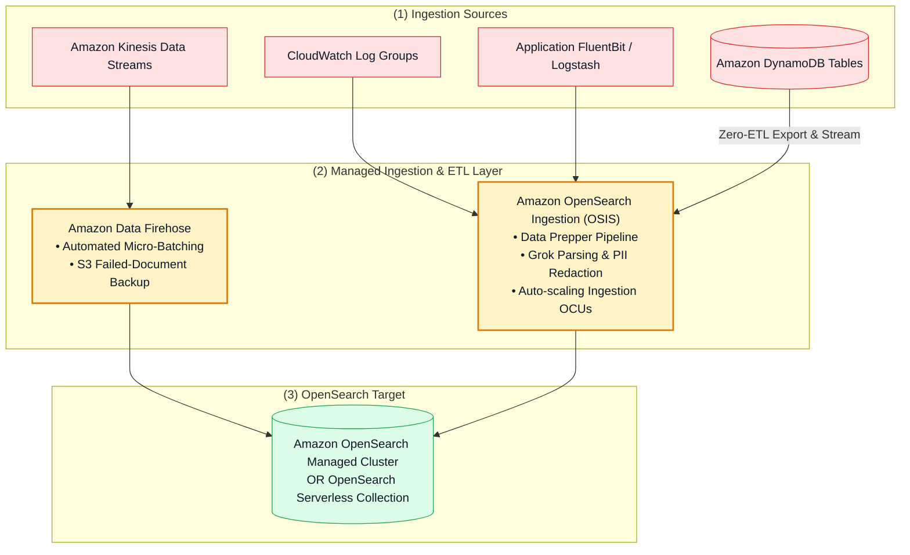
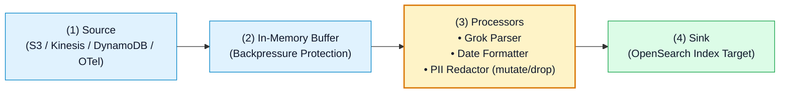

# 🚀 Amazon OpenSearch Ingestion (OSIS), Data Prepper & Integration Pipelines

- **Category**: Analytics / Real-Time Data Ingestion & Stream Processing
- **Language / ဘာသာစကား**: [English (Original)](/en/02-services/analytics-streaming/opensearch/opensearch-ingestion-and-pipelines) | **မြန်မာဘာသာ (Burmese)**
- **Primary Use Case**: Serverless OpenSearch Ingestion (OSIS)၊ Amazon Data Firehose၊ CloudWatch subscription filters နှင့် Amazon DynamoDB Zero-ETL တို့ကို အသုံးပြု၍ high-throughput streaming logs များကို OpenSearch ထဲသို့ ingest ပြုလုပ်ခြင်း။
- **Slide Reference**: `[[AWSCertifiedDataEngineerSlides.pdf]]` ရှိ စာမျက်နှာ 460–478
- **Hub Links**: `[[mm/index]]` | `[[opensearch]]` | `[[kinesis-firehose]]` | `[[dynamodb]]` | `[[cloudwatch-and-eventbridge]]`

---

## 1. အကျဉ်းချုပ် (High-Level Summary)

Amazon OpenSearch Service ထဲသို့ data များ load ပြုလုပ်ရာတွင် index မလုပ်မီ unstructured logs များကို parse လုပ်ခြင်း၊ filter လုပ်ခြင်း၊ enrich လုပ်ခြင်းနှင့် redact ပြုလုပ်ပေးနိုင်သော resilient ဖြစ်ပြီး scalable ဖြစ်သည့် ingestion mechanisms များ လိုအပ်ပါသည်။

AWS သည် OpenSearch အတွက် native ingestion options အများအပြားကို ထောက်ပံ့ပေးထားပြီး အဓိကအားဖြင့် **Amazon OpenSearch Ingestion (OSIS)** (serverless Data Prepper pipeline engine)၊ **Amazon Data Firehose** နှင့် **Amazon DynamoDB Zero-ETL integration with OpenSearch Service** တို့ ဖြစ်ကြပါသည်။



---

## 2. Ingestion Pipeline နည်းပညာများ နှိုင်းယှဉ်ချက် (Ingestion Pipeline Technologies Compared)

| Ingestion Method | Server Management | Transformations & Filtering | Best Use Case | DEA-C01 အရေးပါပုံ (Significance) |
| :--- | :--- | :--- | :--- | :--- |
| **Amazon OpenSearch Ingestion (OSIS)** | Fully Serverless (Ingestion OCUs ဖြင့် scale ပြုလုပ်သည်)။ | **Data Prepper** မှတစ်ဆင့် အဆင့်မြင့် transformations ပြုလုပ်နိုင်ခြင်း (Grok, date parsing, PII redaction, field dropping)။ | Real-time log aggregation၊ OpenTelemetry traces နှင့် **DynamoDB Zero-ETL**။ | ရှုပ်ထွေးသော log parsing နှင့် PII masking အတွက် **အကြံပြုထားသော native pipeline** ဖြစ်သည်။ |
| **Amazon Data Firehose** | Fully Serverless။ | Micro-batching၊ Lambda မှတစ်ဆင့် JSON-to-JSON inline transformations ပြုလုပ်နိုင်ခြင်း။ | Kinesis / CloudWatch မှ OpenSearch သို့ high-throughput streaming delivery ပြုလုပ်ခြင်း။ | မအောင်မြင်သော document များအတွက် **S3 Backup** နှင့် daily index rotation (`orders-YYYY-MM-DD`) ပါဝင်သည်။ |
| **DynamoDB Zero-ETL Integration** | Fully Serverless (OSIS မှ မောင်းနှင်သည်)။ | Automated change stream replication။ | DynamoDB table attributes များပေါ်တွင် full-text search နှင့် fuzzy matching ပြုလုပ်ခြင်း။ | စိတ်ကြိုက် Lambda + DynamoDB Streams ETL glue code ရေးသားရခြင်းကို ဖယ်ရှားပေးသည်။ |
| **CloudWatch Subscription Filter** | Serverless (Lambda / Firehose / OSIS သို့ တိုက်ရိုက် push လုပ်သည်)။ | အခြေခံ string pattern matching။ | AWS service logs များကို OpenSearch သို့ near real-time ဖြင့် forward လုပ်ခြင်း။ | CloudWatch logs များကို OpenSearch ထဲသို့ stream လုပ်ရန် အလွယ်ကူဆုံးနည်းလမ်း ဖြစ်သည်။ |

---

## 3. အသေးစိတ် လေ့လာခြင်း: Amazon OpenSearch Ingestion (OSIS) (Deep Dive)

**Amazon OpenSearch Ingestion (OSIS)** သည် **Ingestion OCUs** ($1\text{ Ingestion OCU} = 8\text{ GiB RAM} + 2\text{ vCPUs}$) ကို အသုံးပြု၍ compute resources များကို scale လုပ်ပေးသော managed **Data Prepper** pipelines များကို run ပေးပါသည်။



### OSIS Pipeline Configuration နမူနာ (Example):
```yaml
version: "2"
log-pipeline:
  source:
    http:
      path: "/log/ingest"
  processor:
    - grok:
        match:
          log: ["%{TIMESTAMP_ISO8601:timestamp} %{LOGLEVEL:level} %{GREEDYDATA:message}"]
    - mutate:
        delete_entries:
          with_keys: ["credit_card_number", "ssn"]
  sink:
    - opensearch:
        hosts: ["https://search-my-domain.us-east-1.es.amazonaws.com"]
        index: "application-logs-%{yyyy.MM.dd}"
        aws:
          region: "us-east-1"
          sts_role_arn: "arn:aws:iam::123456789012:role/OSISPipelineRole"
```

---

## 4. Amazon DynamoDB Zero-ETL Integration with OpenSearch

Zero-ETL မပေါ်မီအချိန်က DynamoDB data များကို OpenSearch သို့ replicate ပြုလုပ်ရန် DynamoDB Streams ကို enable လုပ်ခြင်း၊ custom AWS Lambda consumer function ရေးသားခြင်းနှင့် dead-letter queues များကို စီမံခန့်ခွဲခြင်းတို့ လိုအပ်ခဲ့ပါသည်။

**DynamoDB Zero-ETL** ဖြင့်:
1. OpenSearch Ingestion (OSIS) သည် DynamoDB table သို့ တိုက်ရိုက် ချိတ်ဆက်ပါသည်။
2. OSIS သည် OpenSearch index ကို seed လုပ်ရန် Amazon S3 သို့ one-time point-in-time snapshot export ကို လုပ်ဆောင်ပါသည်။
3. OSIS သည် code ရေးရန်မလိုဘဲ OpenSearch search indices များကို စဉ်ဆက်မပြတ် sync ဖြစ်နေစေရန် DynamoDB continuous point-in-time change events များကို အလိုအလျောက် subscribe လုပ်ဆောင်ပေးပါသည်။

---

## 5. DEA-C01 စာမေးပွဲအတွက် မဖြစ်မနေသိသင့်သည်များ (DEA-C01 Exam Essentials)

> [!IMPORTANT]
> **OpenSearch Ingestion အတွက် အဓိက စာမေးပွဲ ဆုံးဖြတ်ချက် အချက်များ (Key Exam Decision Triggers)**:
>
> - **"Code ရေးသားမှု အနည်းဆုံးနှင့် zero maintenance ဖြင့် DynamoDB items များပေါ်တွင် full-text search ပြုလုပ်လိုလျှင်"** $\rightarrow$ **Amazon DynamoDB Zero-ETL integration with Amazon OpenSearch Service** ကို configure လုပ်ပါ။
> - **"Unformatted logs များကို parse လုပ်ရန်၊ sensitive PII credit card နံပါတ်များကို ဖျောက်ဖျက် (redact) ရန်နှင့် OpenSearch ထဲသို့ load လုပ်လိုလျှင်"** $\rightarrow$ Data Prepper `grok` နှင့် `mutate` pipeline ပါဝင်သော **Amazon OpenSearch Ingestion (OSIS)** ကို အသုံးပြုပါ။
> - **"Unindexable ဖြစ်သော documents များအတွက် automated fallback ပါဝင်သည့် log stream များကို OpenSearch သို့ ပို့လိုလျှင်"** $\rightarrow$ **Amazon S3 Backup for Failed Documents** ပါဝင်သော **Amazon Data Firehose** ကို အသုံးပြုပါ။
> - **"OSIS အတွက် Capacity Scaling"** $\rightarrow$ OpenSearch Ingestion pipelines များသည် compute ကို **Ingestion OCUs** ဖြင့် အလိုအလျောက် scale ပြုလုပ်ပေးပါသည်။

---

## 📌 ဆက်စပ် မှတ်စုများ (Related Notes)
- `[[opensearch]]` — OpenSearch Master Hub
- `[[kinesis-firehose]]` — Firehose Buffering & Destinations
- `[[dynamodb]]` — DynamoDB Architecture & Streams
- `[[cloudwatch-and-eventbridge]]` — CloudWatch Log Subscriptions
