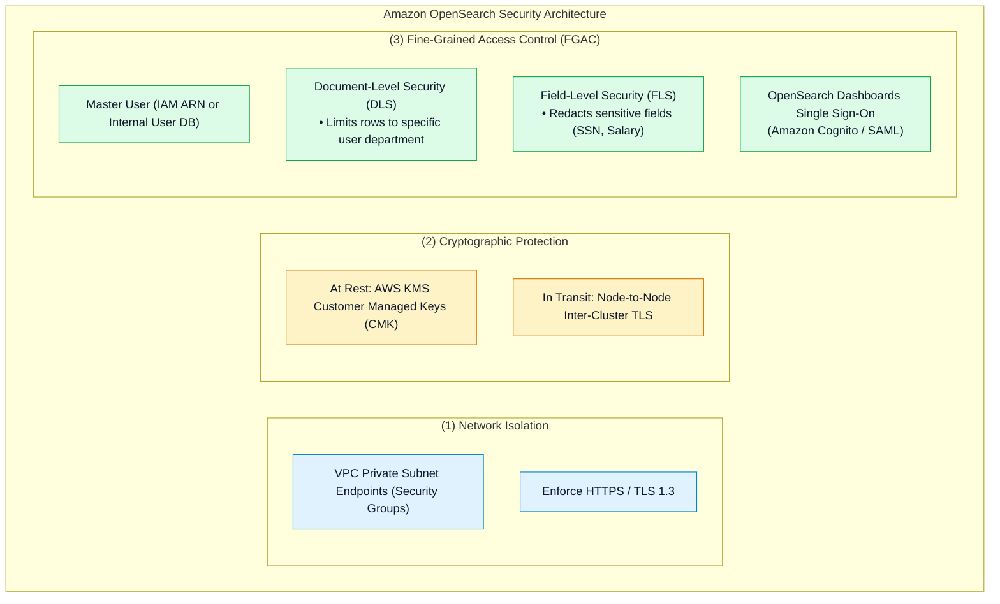
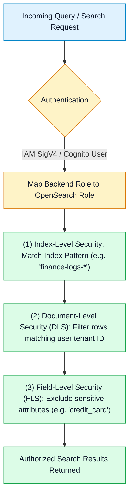

# 🛡️ Amazon OpenSearch Security, Fine-Grained Access Control & Monitoring

- **Category**: Analytics / Governance, Identity & Cluster Observability
- **Language / ဘာသာစကား**: [English (Original)](/en/02-services/analytics-streaming/opensearch/opensearch-security-and-monitoring) | **မြန်မာဘာသာ (Burmese)**
- **Primary Use Case**: Fine-Grained Access Control (FGAC) ကို configure ပြုလုပ်ခြင်း၊ Document နှင့် Field-Level Security ကို implement ပြုလုပ်ခြင်း၊ Amazon Cognito ဖြင့် OpenSearch Dashboards ကို လုံခြုံအောင် ပြုလုပ်ခြင်း နှင့် အရေးကြီးသော cluster health metrics များကို စောင့်ကြည့်ထောက်လှမ်းခြင်း (monitoring)။
- **Slide Reference**: Pages 460–478 in `[[AWSCertifiedDataEngineerSlides.pdf]]`
- **Hub Links**: `[[mm/index]]` | `[[opensearch]]` | `[[opensearch-cluster-architecture]]` | `[[opensearch-troubleshooting-and-tuning]]`

---

## 1. High-Level Summary

Amazon OpenSearch Service cluster တစ်ခုကို လုံခြုံအောင် ပြုလုပ်ရာတွင် **Network Isolation** (VPC private subnets)၊ **Data Encryption** (at rest အတွက် AWS KMS၊ in transit အတွက် node-to-node TLS) နှင့် **Fine-Grained Access Control (FGAC)** တို့ ပါဝင်သော multi-layered defense model တစ်ခု လိုအပ်ပါသည်။

FGAC သည် data access ကို document တစ်ခုချင်းစီအထိ ကန့်သတ်ခြင်း (**Document-Level Security**) နှင့် ထိခိုက်လွယ်သော data columns များကို ဖျောက်ထားခြင်း (**Field-Level Security**) တို့ဖြင့် data engineers များအား enterprise compliance လိုအပ်ချက်များကို implement ပြုလုပ်နိုင်စေပါသည်။



---

## 2. Fine-Grained Access Control (FGAC) Deep Dive

OpenSearch domain ပေါ်တွင် Fine-Grained Access Control ကို enable ပြုလုပ်ထားသောအခါ ၎င်းသည် မတူညီသော layer ၃ ခုတစ်လျှောက် granular authentication နှင့် authorization ကို enforce ပြုလုပ်ပါသည်:



### 1. Document-Level Security (DLS)
Lucene query string သို့မဟုတ် DSL pattern ပေါ် အခြေခံ၍ သတ်မှတ်ထားသော role တစ်ခုမှ index အတွင်း မည်သည့် documents များကို ကြည့်ရှုခွင့်ရှိသည်ကို ကန့်သတ်ပေးပါသည်:
```json
{
  "term": {
    "account_manager_id": "${attr.internal.user_id}"
  }
}
```
*Result*: အသုံးပြုသူ (user) များသည် `account_manager_id` နှင့် မိမိတို့၏ သတ်မှတ်ထားသော user ID တိုက်ဆိုင်သည့် documents များကိုသာ တွေ့မြင်နိုင်မည် ဖြစ်သည်။

### 2. Field-Level Security (FLS)
Search query responses များတွင် မည်သည့် specific fields များကို မြင်တွေ့ခွင့်ပြုမည်ကို ထိန်းချုပ်ပေးပါသည်။ ထိခိုက်လွယ်သော fields များ (ဥပမာ- `tax_id`, `customer_ssn`, `raw_payload`) ကို blacklist ပြုလုပ်ထားနိုင်သောကြောင့် ခွင့်ပြုချက်မရှိသော users များသည် API မှတစ်ဆင့် ၎င်းတို့ကို မည်သည့်အခါမျှ လက်ခံရရှိမည် မဟုတ်ပါ။

---

## 3. OpenSearch Dashboards (Kibana) Authentication

AWS IAM credentials များကို ဖြန့်ဝေပေးရန် မလိုဘဲ Data Analysts များနှင့် Security teams များအား OpenSearch Dashboards သို့ log in ဝင်ရောက်ခွင့်ပြုရန်:
1. **Amazon Cognito Integration**:
   - **Cognito User Pool**: User directory၊ passwords နှင့် Multi-Factor Authentication (MFA) များကို စီမံခန့်ခွဲပေးသည်။
   - **Cognito Identity Pool**: IAM role တစ်ခုကို assume လုပ်ပြီး OpenSearch Dashboards ထဲသို့ users များကို authenticate ပြုလုပ်ပေးသည်။
2. **SAML 2.0 Identity Provider**:
   - လုပ်ငန်းသုံး Single Sign-On (SSO) အတွက် enterprise identity providers များ (ဥပမာ- Okta, Azure Active Directory / Entra ID, PingFederate) နှင့် တိုက်ရိုက် ချိတ်ဆက်ပေါင်းစပ်သည်။

---

## 4. Critical CloudWatch Monitoring Metrics

| CloudWatch Metric | Normal Baseline | Critical Alarm Trigger | Root Cause & Action Required |
| :--- | :--- | :--- | :--- |
| **`ClusterStatus.red`** | **0** | $> 0$ for $\ge 1$ min | **အနည်းဆုံး primary shard တစ်ခု unassigned ဖြစ်နေခြင်း**။ Data ဆုံးရှုံးနိုင်သည့် ချက်ချင်းအန္တရာယ်ရှိသည်။ |
| **`ClusterStatus.yellow`** | **0** | $> 0$ for $\ge 10$ min | Primary shards အားလုံး allocate ဖြစ်နေသော်လည်း **replica shards တစ်ခု သို့မဟုတ် တစ်ခုထက်ပို၍ unassigned ဖြစ်နေခြင်း**။ Node outage ဖြစ်ခြင်း သို့မဟုတ် disk space နည်းပါးနေခြင်း။ |
| **`JVMMemoryPressure`** | $< 70\%$ | **$\ge 75\%$ (Warning)**<br/>**$\ge 92\%$ (Critical)** | JVM garbage collection bottleneck ဖြစ်နေခြင်း။ 92% သို့ ရောက်ရှိပါက OpenSearch သည် **circuit breakers** ကို စတင်အသုံးပြုပြီး incoming writes များကို HTTP 429 ဖြင့် ပယ်ချ (reject) ပါသည်။ |
| **`FreeStorageSpace`** | $> 25\%$ | $\le 15\%$ | Storage watermarks သို့ ချဉ်းကပ်လာခြင်း။ Free space သည် 5% အောက် ကျဆင်းသွားပါက cluster read-only mode ကို စတင်စေသည်။ |
| **`CPUUtilization`** | $< 60\%$ | $\ge 80\%$ | အလွန်အမင်း heavy ဖြစ်သော aggregations များ သို့မဟုတ် မြင့်မားသော search concurrency ကြောင့် ဖြစ်သည်။ Data nodes ပိုမို ထပ်ဖြည့်ပေးရန် လိုအပ်သည်။ |

---

## 5. DEA-C01 Exam Essentials

> [!IMPORTANT]
> **OpenSearch Security & Monitoring ဆိုင်ရာ Key Exam Decision Triggers များ**:
>
> - **"Social security numbers များကို redact ပြုလုပ်ထားပြီး analysts များအား ၎င်းတို့၏ department နှင့် သက်ဆိုင်သော documents များကိုသာ query ပြုလုပ်နိုင်ရန် ကန့်သတ်ခြင်း"** $\rightarrow$ **Document-Level Security (DLS)** နှင့် **Field-Level Security (FLS)** ပါဝင်သော **Fine-Grained Access Control (FGAC)** ကို Enable ပြုလုပ်ပါ။
> - **"IAM access keys များ မပါဘဲ OpenSearch Dashboards အတွက် Single Sign-On ကို လုံခြုံစွာ ပြုလုပ်ခြင်း"** $\rightarrow$ **Amazon Cognito User Pools and Identity Pools** သို့မဟုတ် **SAML 2.0 SSO** နှင့် ချိတ်ဆက်ပေါင်းစပ်ပါ။
> - **"Cluster status သည် RED ဖြစ်နေခြင်း"** $\rightarrow$ **Primary shards** တစ်ခု သို့မဟုတ် တစ်ခုထက်ပို၍ unassigned ဖြစ်နေသည်။
> - **"Cluster status သည် YELLOW ဖြစ်နေခြင်း"** $\rightarrow$ Primary shards အားလုံး active ဖြစ်နေသော်လည်း **replica shards** တစ်ခု သို့မဟုတ် တစ်ခုထက်ပို၍ allocate မလုပ်နိုင်ခြင်း (ဥပမာ- ဒုတိယ AZ တွင် available nodes မလုံလောက်ခြင်း)။
> - **"Incoming writes များသည် HTTP 429 Too Many Requests ဖြင့် fail ဖြစ်နေခြင်း"** $\rightarrow$ **`JVMMemoryPressure` သည် 92% ကျော်လွန်သွားခြင်း** ဖြစ်ပြီး parent circuit breakers များကို activate လုပ်စေသည်။

---

## 📌 Related Notes
- `[[opensearch]]` — OpenSearch Master Hub
- `[[opensearch-cluster-architecture]]` — Master & Data Node Topologies
- `[[opensearch-troubleshooting-and-tuning]]` — Diagnosing Red/Yellow Status & Watermarks
- `[[cloudwatch-and-eventbridge]]` — CloudWatch Metrics & Alarms
