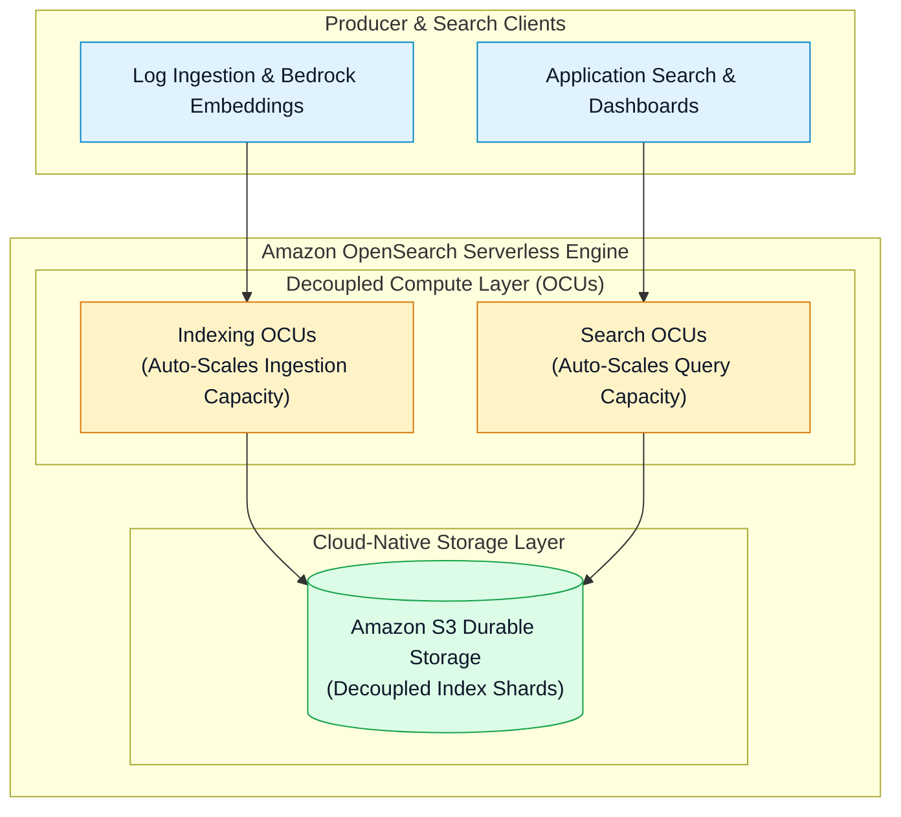
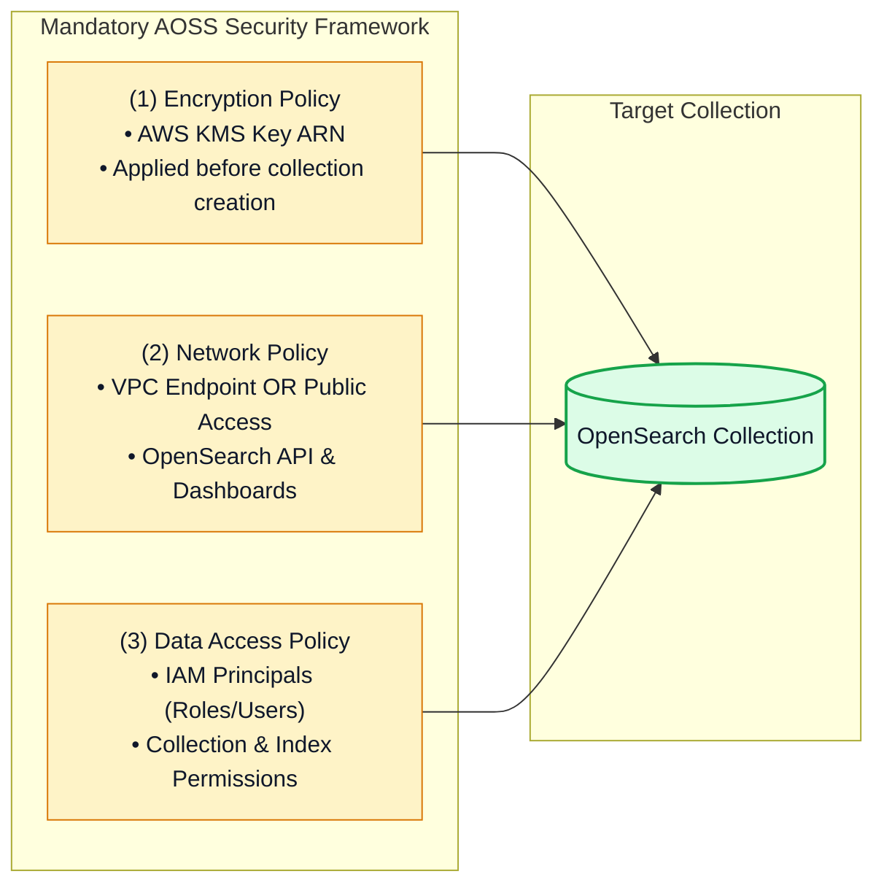

# ⚡ Amazon OpenSearch Serverless (AOSS) Architecture & Collections

- **Category**: Analytics / Serverless Search, Observability & Vector Search
- **Language / ဘာသာစကား**: [English (Original)](/en/02-services/analytics-streaming/opensearch/opensearch-serverless) | **မြန်မာဘာသာ (Burmese)**
- **Primary Use Case**: Cluster instances စီမံခန့်ခွဲခြင်း၊ node sizing၊ shard အရေအတွက် သို့မဟုတ် storage scaling တို့ကို ပြုလုပ်စရာမလိုဘဲ full-text search၊ time-series log analytics နှင့် ML vector search တို့ကို run လုပ်ဆောင်ခြင်း။
- **Slide Reference**: Pages 460–478 in `[[AWSCertifiedDataEngineerSlides.pdf]]`
- **Hub Links**: `[[mm/index]]` | `[[opensearch]]` | `[[opensearch-storage-tiers-and-ism]]` | `[[s3]]`

---

## 1. High-Level Summary

**Amazon OpenSearch Serverless (AOSS)** သည် Amazon OpenSearch Service အတွက် on-demand serverless configuration ဖြစ်ပြီး **compute** (indexing နှင့် search) ကို **storage** (Amazon S3) မှ သီးခြားစီ ခွဲထုတ်ထား (decouples) ပါသည်။

OpenSearch Serverless တွင် data engineer များသည် physical EC2 instance များကို provision ပြုလုပ်မည့်အစား **Collections** ဟုခေါ်သော logical grouping များကို ဖန်တီးကြသည်။ Dynamic ဖြစ်သော indexing throughput နှင့် query rate များနှင့် ကိုက်ညီစေရန် compute resource များကို **OpenSearch Compute Units (OCUs)** ဟုခေါ်သော unit များဖြင့် အလိုအလျောက် scale လုပ်ဆောင်ပေးပါသည်။

---

## 2. OpenSearch Compute Units (OCUs)

OpenSearch Serverless တွင် capacity ကို **OpenSearch Compute Units (OCUs)** ဖြင့် တိုင်းတာပါသည်:
- **1 OCU = 6 GiB RAM + သက်ဆိုင်ရာ virtual CPU (vCPU)**။
- Compute ကို သီးခြားလွတ်လပ်သော OCU pool နှစ်ခုအဖြစ် ခွဲထုတ်ထားပါသည်:
  1. **Indexing OCUs**: Ingestion rate၊ parsing နှင့် Lucene segment တည်ဆောက်မှုအပေါ် မူတည်ပြီး dynamic စွာ scale လုပ်ဆောင်သည်။
  2. **Search OCUs**: Query volume၊ ရှုပ်ထွေးသော aggregation များနှင့် vector similarity တွက်ချက်မှုများအပေါ် မူတည်ပြီး သီးခြားလွတ်လပ်စွာ scale လုပ်ဆောင်သည်။
- **Auto-Scaling**: AOSS သည် traffic မြင့်တက်လာချိန်တွင် OCUs များကို အလိုအလျောက် provision ပြုလုပ်ပေးပြီး traffic ကျဆင်းသွားချိန်တွင် ပြန်လည် scale down လုပ်ဆောင်ပေးသည်။ Operational cost များကို ထိန်းချုပ်ရန် minimum နှင့် maximum OCU limit များကို သတ်မှတ်နိုင်သည်။

---

## 3. Collection Types

**Collection** သည် OpenSearch Serverless ရှိ အခြေခံကျသော logical container ဖြစ်သည်။ Collection တစ်ခုကို ဖန်တီးရာတွင် အောက်ပါ သီးသန့် workload type သုံးခုအနက် တစ်ခုကို ရွေးချယ်ရပါသည်:

| Collection Type | Optimized Workload | Index Behavior & Caching | Common Use Cases |
| :--- | :--- | :--- | :--- |
| **Search** | Full-text keyword search နှင့် enterprise search application များ။ | Interactive ဖြစ်ပြီး ထပ်ခါတလဲလဲ ပြုလုပ်သော query များအတွက် Search OCUs ပေါ်တွင် မြန်ဆန်သော local SSD caching။ | E-commerce product catalogs၊ website search၊ documentation portals။ |
| **Time-series** | High-volume append-only timestamped event များ။ | High-throughput write များနှင့် time-bounded range query (`@timestamp`) များအတွက် အထူးသင့်လျော်အောင် ပြုလုပ်ထားသည်။ | Operational log analytics၊ application APM၊ security SIEM။ |
| **Vector search** | Approximate k-Nearest Neighbor (k-NN) vector embeddings များ။ | Memory အတွင်း မြန်နှုန်းမြင့် vector index graph များ။ | Generative AI Retrieval-Augmented Generation (RAG)၊ **Amazon Bedrock** ဖြင့် semantic search။ |

---

## 4. The Three Mandatory AOSS Security Policies

OpenSearch Serverless collection တစ်ခုကို လုံခြုံမှုရှိစေရန်အတွက် AWS သည် သီးခြား security policy သုံးခုကို သတ်မှတ်ရန် လိုအပ်သည်:

1. **Encryption Policy**: Amazon S3 တွင် သိမ်းဆည်းထားသော collection data အားလုံးကို at rest encrypt ပြုလုပ်ရန် အသုံးပြုသည့် AWS KMS customer managed key (CMK) သို့မဟုတ် AWS-managed key ကို သတ်မှတ်ပေးသည်။
2. **Network Policy**: Collection နှင့် OpenSearch Dashboards များကို **VPC Endpoints (AWS PrivateLink)** မှတစ်ဆင့်ဖြစ်စေ သို့မဟုတ် public internet endpoint များမှတစ်ဆင့်ဖြစ်စေ ဝင်ရောက်အသုံးပြုနိုင်ခြင်း ရှိ/မရှိကို ထိန်းချုပ်သည်။
3. **Data Access Policy**: သတ်မှတ်ထားသော collection index များသို့ ဖတ်ရှု/ရေးသားခွင့် (`aoss:CreateCollectionItems`, `aoss:UpdateCollectionItems`, `aoss:DescribeIndex`) ရှိသည့် **AWS IAM roles သို့မဟုတ် users** များကို သတ်မှတ်ပေးသည်။

---

## 5. Managed Provisioned Cluster vs. OpenSearch Serverless

| Feature | OpenSearch Provisioned Cluster | OpenSearch Serverless (AOSS) |
| :--- | :--- | :--- |
| **Capacity Management** | Manual instance ရွေးချယ်မှု (`m6g`, `r6g`)၊ master nodes နှင့် disk sizing ပြုလုပ်ရခြင်း။ | **Instance စီမံခန့်ခွဲရန် မလိုပါ (Zero instance management)**။ **OCUs** မှတစ်ဆင့် auto-scaled ဖြစ်သည်။ |
| **Storage Architecture** | Node တစ်ခုစီအတွက် Dedicated EBS volumes + ရွေးချယ်နိုင်သော UltraWarm/Cold S3။ | Native အားဖြင့် သီးခြားခွဲထုတ်ထားသော **Amazon S3 storage (Fully decoupled)**။ |
| **Sharding Configuration** | Primary နှင့် replica shard planning ကို ကိုယ်တိုင် manual ပြုလုပ်ရန် လိုအပ်သည်။ | Sharding ကို **အပြည့်အဝ automated** ပြုလုပ်ပေးပြီး abstract လုပ်ထားသည်။ |
| **Cost Model** | သတ်မှတ်ထားသော hourly node pricing (24/7 provisioned cost)။ | OCU-hour နှင့် S3 storage GB-month အလိုက် ပေးချေရခြင်း။ |
| **Best For** | Custom JVM tuning ပြုလုပ်ရန် လိုအပ်ပြီး ခန့်မှန်းရလွယ်ကူကာ ပုံမှန်ရှိနေသော massive log pipeline များအတွက်။ | ခန့်မှန်းရခက်ခဲသော၊ ရံဖန်ရံခါသာရှိသော သို့မဟုတ် ရုတ်တရက် traffic များပြားတတ်သော search၊ vector RAG နှင့် low-maintenance workload များအတွက်။ |

---

## 6. DEA-C01 Exam Essentials

> [!IMPORTANT]
> **Key Exam Decision Triggers for OpenSearch Serverless**:
>
> - **"Build a search application or log platform with zero server management and automatic capacity scaling"** $\rightarrow$ **Amazon OpenSearch Serverless (AOSS)** ကို ရွေးချယ်ပါ။
> - **"Semantic Search / Generative AI RAG pipeline with Amazon Bedrock"** $\rightarrow$ **OpenSearch Serverless Vector search collection** ကို ရွေးချယ်ပါ။
> - **"AOSS Capacity Unit"** $\rightarrow$ Capacity ကို **OpenSearch Compute Units (OCUs)** (1 OCU = 6 GiB RAM + vCPU) ဖြင့် scale လုပ်ဆောင်သည်။
> - **"Mandatory Security Configuration"** $\rightarrow$ AOSS collection တစ်ခုကို ဖန်တီးရန် **Encryption Policy**၊ **Network Policy** နှင့် **Data Access Policy** တို့ လိုအပ်သည်။

---

## 📌 Related Notes
- `[[opensearch]]` — OpenSearch Master Hub
- `[[opensearch-cluster-architecture]]` — Provisioned Cluster Topologies
- `[[opensearch-ingestion-and-pipelines]]` — Ingesting into OpenSearch
- `[[s3]]` — S3 Persistent Storage Layer
