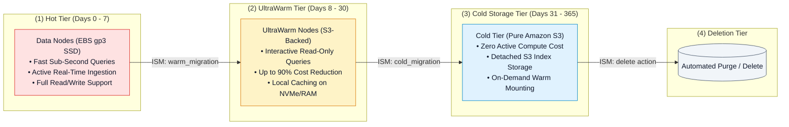
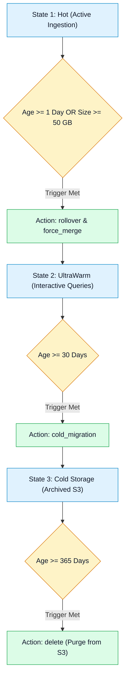

# 📦 Amazon OpenSearch Storage Tiers & Index State Management (ISM)

- **Category**: Analytics / Storage Optimization & Lifecycle Automation
- **Language / ဘာသာစကား**: [English (Original)](/en/02-services/analytics-streaming/opensearch/opensearch-storage-tiers-and-ism) | **မြန်မာဘာသာ (Burmese)**
- **Primary Use Case**: Hot, UltraWarm နှင့် Cold storage tier များအကြား ကုန်ကျစရိတ်သက်သာစွာဖြင့် log retention ပြုလုပ်ခြင်း၊ အလိုအလျောက် index rollover များ ဆောင်ရွက်ခြင်း နှင့် Index State Management (ISM) lifecycle policy များကို သတ်မှတ်ခြင်း။
- **Slide Reference**: Pages 460–478 in `[[AWSCertifiedDataEngineerSlides.pdf]]`
- **Hub Links**: `[[mm/index]]` | `[[opensearch]]` | `[[opensearch-cluster-architecture]]` | `[[s3]]`

---

## 1. အကျဉ်းချုပ် ခြုံငုံသုံးသပ်ချက် (High-Level Summary)

Amazon OpenSearch Service တွင် ကြီးမားလှသော time-series log data များကို စီမံခန့်ခွဲရာ၌ **sub-second query performance** (စက္ကန့်ပိုင်းအတွင်း query အမြန်နှုန်း ရရှိခြင်း) နှင့် **storage cost efficiency** (storage ကုန်ကျစရိတ် သက်သာမှု) တို့အကြား မျှတမှုရှိစေရန် စီမံဆောင်ရွက်ရန် လိုအပ်ပါသည်။

Amazon OpenSearch သည် storage ကို အဓိက tier (၃) ခုအဖြစ် ခွဲခြားပေးထားပါသည် - **Hot**၊ **UltraWarm** (warm node caching ပါဝင်သော Amazon S3 အခြေပြု) နှင့် **Cold Storage** (compute နှင့် သီးခြားစီထားသော detached S3 data) တို့ ဖြစ်ကြသည်။ **Index State Management (ISM)** သည် manual script များ ရေးသားစီမံရန် မလိုဘဲ ဤ tier များအကြား index များ အလိုအလျောက် ကူးပြောင်းခြင်း (transitions) ကို ဆောင်ရွက်ပေးပါသည်။



---

## 2. Storage Tier နှိုင်းယှဉ်ချက် ဇယား (Storage Tier Comparison Matrix)

| Storage Tier | Underlying Media | Read/Write Access | Query Latency | Cost Profile |
| :--- | :--- | :--- | :--- | :--- |
| **Hot Storage** | စွမ်းဆောင်ရည်မြင့် EBS SSDs (`gp3`, `io2`) သို့မဟုတ် NVMe instance stores များ။ | **Read & Write** (တက်ကြွစွာ indexing ပြုလုပ်နေသော target)။ | **Single-digit milliseconds** ($< 10\text{ ms}$)။ | ကုန်ကျစရိတ် မြင့်မားသည် (standard EBS storage + data node instance နာရီများ)။ |
| **UltraWarm Storage** | သီးသန့် UltraWarm compute node များမှတစ်ဆင့် query ပြုလုပ်သော Amazon S3 storage။ | **Read-Only** (Migration မပြုလုပ်မီ index များကို read-only အဖြစ် သတ်မှတ်ပေးရမည်)။ | Hot tier နီးပါး မြန်ဆန်သော latency (smart caching မှတစ်ဆင့် စက္ကန့်ပိုင်းအတွင်း သို့မဟုတ် စက္ကန့်အနည်းငယ်)။ | Hot EBS storage ထက် **၉၀% အထိ ပိုမိုသက်သာသည်**။ |
| **Cold Storage** | Compute နှင့် လုံးဝ သီးခြားခွဲထုတ်ထားသော Amazon S3 managed indices များ။ | **Read-Only** (Query မပြုလုပ်မီ mounting/warming လုပ်ဆောင်ရန် လိုအပ်သည်)။ | မိနစ်ပိုင်းကြာနိုင်သည် (Query ပြုလုပ်ရန် index အား UltraWarm node များသို့ mount လုပ်ပေးရမည်)။ | **ကုန်ကျစရိတ် အသက်သာဆုံး** (S3 storage ကုန်ကျစရိတ် သီးသန့်သာ ကျသင့်ပြီး compute overhead လုံးဝမရှိပါ)။ |

---

## 3. Index State Management (ISM) မူဝါဒများ (Policies)

**Index State Management (ISM)** သည် document ၏ သက်တမ်း (age)၊ index အရွယ်အစား (size) သို့မဟုတ် document အရေအတွက် (count) အပေါ် အခြေခံ၍ index lifecycle များကို စီမံခန့်ခွဲပေးသော OpenSearch တွင် တပါတည်းပါဝင်သည့် automated policy engine ဖြစ်ပါသည်။



### DEA-C01 စာမေးပွဲအတွက် အဓိက ISM Action များ:
1. **`rollover`**: သတ်မှတ်ထားသော target size (ဥပမာ - 50 GB) သို့မဟုတ် age (ဥပမာ - 1 day) ပြည့်သွားသောအခါ လက်ရှိ active index ကို ပိတ်ပြီး index အသစ်တစ်ခုကို ဖန်တီးပေးသည်။
2. **`force_merge`**: Warm storage သို့ မရွှေ့ပြောင်းမီ deleted document space များကို ပြန်လည်ရယူရန်နှင့် search performance ကို မြှင့်တင်ရန်အတွက် အောက်ခံ Lucene segment များကို ပေါင်းစည်းပေးသည် (`max_num_segments: 1`)။
3. **`read_only`**: ထပ်မံ write လုပ်၍ မရအောင် index ကို lock ချပေးသည် (UltraWarm သို့ မပြောင်းမီ မဖြစ်မနေ လုပ်ဆောင်ရမည့် အဆင့်ဖြစ်သည်)။
4. **`warm_migration`**: Index ကို EBS hot data node များမှ S3 အခြေပြု UltraWarm storage သို့ ပြောင်းရွှေ့ပေးသည်။
5. **`cold_migration`**: UltraWarm node resource များကို ပြန်လွှတ်ပေးရန် warm index များကို Cold storage သို့ ပြောင်းရွှေ့ပေးသည်။
6. **`delete`**: သက်တမ်းကုန်ဆုံးသွားသော index များကို S3 မှ အပြီးတိုင် ဖျက်ပစ် (purge) သည်။

---

## 4. Production ISM Policy ဥပမာ (Production ISM Policy Example)

အောက်တွင် ဖော်ပြထားသည်မှာ နေ့စဉ် log များအတွက် hot မှ warm ထိုမှတဆင့် cold သို့ ပြောင်းရွှေ့ပေးသော production-grade ISM JSON policy ဥပမာ ဖြစ်ပါသည်:

```json
{
  "policy": {
    "description": "Lifecycle policy for production application logs",
    "default_state": "hot",
    "states": [
      {
        "name": "hot",
        "actions": [
          {
            "rollover": {
              "min_index_age": "1d",
              "min_primary_shard_size": "45gb"
            }
          }
        ],
        "transitions": [
          {
            "state_name": "warm",
            "conditions": {
              "min_index_age": "7d"
            }
          }
        ]
      },
      {
        "name": "warm",
        "actions": [
          {
            "replica_count": {
              "number_of_replicas": 0
            }
          },
          {
            "warm_migration": {}
          }
        ],
        "transitions": [
          {
            "state_name": "cold",
            "conditions": {
              "min_index_age": "30d"
            }
          }
        ]
      },
      {
        "name": "cold",
        "actions": [
          {
            "cold_migration": {
              "timestamp_field": "@timestamp"
            }
          }
        ],
        "transitions": [
          {
            "state_name": "delete",
            "conditions": {
              "min_index_age": "365d"
            }
          }
        ]
      },
      {
        "name": "delete",
        "actions": [
          {
            "delete": {}
          }
        ],
        "transitions": []
      }
    ]
  }
}
```

---

## 5. DEA-C01 စာမေးပွဲအတွက် မဖြစ်မနေသိထားသင့်သည်များ (Exam Essentials)

> [!IMPORTANT]
> **OpenSearch Storage & ISM အတွက် အဓိက စာမေးပွဲ Decision Trigger များ**:
>
> - **"OpenSearch တွင် ၆ လကြာ သက်တမ်းရှိသော historical log data များကို ကုန်ကျစရိတ်သက်သာစွာဖြင့် interactive querying ပြုလုပ်လိုခြင်း"** $\rightarrow$ Index များကို **UltraWarm Storage** သို့ ပြောင်းရွှေ့ပါ။
> - **"Index များကို မဖျက်ဘဲ ၁ နှစ်ကြာ compliance log data များကို အနည်းဆုံးကုန်ကျစရိတ်ဖြင့် သိမ်းဆည်းလိုခြင်း (Archive)"** $\rightarrow$ Index များကို **Cold Storage** သို့ ပြောင်းရွှေ့ပါ။
> - **"Custom Python/Lambda script များ အသုံးမပြုဘဲ shard rollover နှင့် tier migration များကို အလိုအလျောက် ဆောင်ရွက်လိုခြင်း"** $\rightarrow$ **Index State Management (ISM)** policy တစ်ခုကို သတ်မှတ်ပါ။
> - **"UltraWarm သို့ မပြောင်းမီ query speed နှင့် storage ကို အကောင်းဆုံးဖြစ်အောင် ပြုလုပ်လိုခြင်း (Optimize)"** $\rightarrow$ Lucene segment များကို single segment တစ်ခုတည်းအဖြစ် ပေါင်းစည်းရန် **`force_merge`** action ကို လုပ်ဆောင်ပါ။

---

## 📌 ဆက်စပ်မှတ်စုများ (Related Notes)
- `[[opensearch]]` — OpenSearch Service Master Hub
- `[[opensearch-cluster-architecture]]` — Primary & Replica Shards
- `[[opensearch-troubleshooting-and-tuning]]` — Disk Watermarks & Heap Pressures
- `[[s3]]` — S3 Data Lake Durability & Lifecycle
