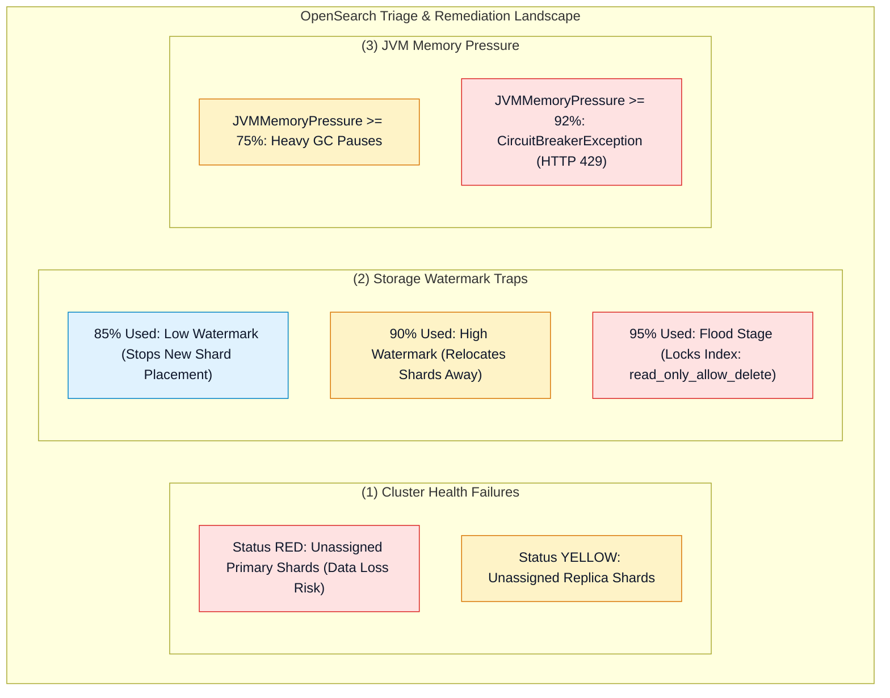
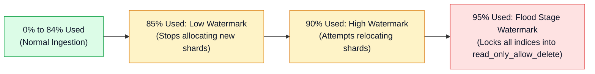

# 🔧 Amazon OpenSearch Troubleshooting & Performance Tuning

- **Category**: Analytics / Production Troubleshooting & Cluster Optimization
- **Language / ဘာသာစကား**: [English (Original)](/en/02-services/analytics-streaming/opensearch/opensearch-troubleshooting-and-tuning) | **မြန်မာဘာသာ (Burmese)**
- **Primary Use Case**: Red နှင့် Yellow cluster health များကို ရောဂါရှာဖွေစစ်ဆေးခြင်း (diagnosing)၊ disk watermark write blocks (`read_only_allow_delete`) များကို ဖြေရှင်းခြင်း၊ JVM memory pressure ရှင်းလင်းခြင်း နှင့် bulk indexing throughput ကို optimize ပြုလုပ်ခြင်း။
- **Slide Reference**: Pages 460–478 in `[AWSCertifiedDataEngineerSlides.pdf](/docs/AWSCertifiedDataEngineerSlides.pdf)`
- **Hub Links**: `[[mm/index]]` | `[[opensearch]]` | `[[opensearch-cluster-architecture]]` | `[[opensearch-security-and-monitoring]]`

---

## 1. High-Level Summary

Amazon OpenSearch Service ကို ပြဿနာရှာဖွေဖြေရှင်းခြင်း (Troubleshooting) ပြုလုပ်ရာတွင် **Cluster Health States** (Green, Yellow, Red)၊ **Storage Watermark Thresholds** (Low 85%, High 90%, Flood Stage 95%) နှင့် **JVM Memory Pressures** (Heap limits, Fielddata cache, Circuit Breakers) တို့တစ်လျှောက် စနစ်တကျ ရောဂါရှာဖွေစစ်ဆေးရန် လိုအပ်ပါသည်။

ဤ troubleshooting နည်းလမ်းများနှင့် bulk indexing optimization များကို ကျွမ်းကျင်စွာ နားလည်ထားခြင်းသည် **DEA-C01** စာမေးပွဲအတွက် မဖြစ်မနေ လိုအပ်ပါသည်။



---

## 2. Cluster Health Status: Red vs. Yellow Triage

| Cluster Status | Technical Definition | Common Root Causes | Immediate Diagnostic & Remediation Steps |
| :--- | :--- | :--- | :--- |
| **GREEN** | Primary နှင့် replica shard များအားလုံးကို active node များတစ်လျှောက် အောင်မြင်စွာ allocate လုပ်ထားပါသည်။ | ပုံမှန် ကောင်းမွန်သော operating state ဖြစ်သည်။ | မရှိပါ။ (None) |
| **YELLOW** | **Primary shards** အားလုံးကို allocate လုပ်ထားသော်လည်း **replica shard တစ်ခု သို့မဟုတ် တစ်ခုထက်ပို၍** assign မလုပ်နိုင်ပါ။ | 1. AZ တစ်ခုအတွင်းရှိ data node တစ်ခု crash ဖြစ်သွားခြင်း။<br/>2. Replicas အရေအတွက်သည် ရရှိနိုင်သော data node အရေအတွက်ထက် ကျော်လွန်နေခြင်း။<br/>3. Target node များသည် disk watermarks သို့ ရောက်ရှိသွားခြင်း။ | ပိတ်ဆို့နေရသည့် အကြောင်းရင်း (blocking reason) ကို ဖော်ထုတ်ရန် `GET /_cluster/allocation/explain` ကို run ပါ။ Data nodes များကို ထပ်ထည့်ပါ သို့မဟုတ် `number_of_replicas` ကို လျှော့ချပါ။ |
| **RED** | အနည်းဆုံး **primary shard** တစ်ခုသည် လုံးဝ assign မလုပ်နိုင်ဘဲ offline ဖြစ်နေပါသည်။ | 1. Nodes အများအပြား တစ်ပြိုင်နက် failure ဖြစ်သွားခြင်း။<br/>2. Disk hardware ပျက်စီးချို့ယွင်းခြင်း (corruption)။<br/>3. Heavy write burst ဖြစ်စဉ်အတွင်း ပြန်လည်မရရှိနိုင်သော index ပျက်စီးမှု ဖြစ်ပေါ်ခြင်း။ | **အရေးပေါ် (Urgent)**။ Snapshot Restore API (`POST /_snapshot/cs-automated/...`) ကို အသုံးပြု၍ နောက်ဆုံးရရှိထားသော automated S3 snapshot မှ ပျက်စီးသွားသော index ကို ပြန်လည် restore လုပ်ပါ။ |

---

## 3. Storage Watermarks & The `read_only_allow_delete` Block

OpenSearch သည် data node တိုင်းပေါ်တွင် တဖြည်းဖြည်းချင်း တိုးလာသော disk storage watermark ၃ ခုကို သတ်မှတ်ကျင့်သုံးပါသည်:



### Flood Stage Lock မှ မည်သို့ ပြန်လည်ရယူမလဲ (How to Recover from a Flood Stage Lock):
Disk space သည် 95% သို့ ရောက်ရှိပါက OpenSearch သည် indices အားလုံးပေါ်တွင် `index.blocks.read_only_allow_delete: true` ကို သတ်မှတ်လိုက်ပြီး new document write လုပ်သမျှကို `ClusterBlockException` ဖြင့် ပယ်ချ (reject) ပါသည်။

**Recovery Workflow**:
1. **Free Disk Space (Disk နေရာ ရှင်းလင်းခြင်း)**: သက်တမ်းကုန်ဆုံးသွားသော (expired) indices များကို ဖျက်ပါ သို့မဟုတ် AWS Console တွင် node တစ်ခုချင်းစီအတွက် EBS volume storage ကို တိုးမြှင့်ပါ။
2. **Remove the Read-Only Lock (Read-Only Lock ကို ဖယ်ရှားခြင်း)**:
   ```json
   PUT /*/_settings
   {
     "index.blocks.read_only_allow_delete": null
   }
   ```

---

## 4. Resolving JVM Memory Pressure & Circuit Breakers

CloudWatch metric **`JVMMemoryPressure`** သည် **92%** ထက် ကျော်လွန်သွားသောအခါ OpenSearch သည် ၎င်း၏ **Parent Circuit Breaker** ကို အလုပ်လုပ်စေပြီး (trips) memory-intensive ဖြစ်သော operations များကို ချက်ချင်း ရပ်တန့်ကာ writes များကို **`HTTP 429 (Too Many Requests)`** ဖြင့် ပယ်ချပါသည် (rejects)။

### အဓိက အကြောင်းရင်းများနှင့် ဖြေရှင်းနည်းများ (Root Causes & Remediation):
1. **Analyzed `text` Fields ပေါ်တွင် Aggregating ပြုလုပ်ခြင်း**:
   - `text` fields များပေါ်တွင် aggregation လုပ်ခြင်းသည် ကြီးမားသော string dictionaries များကို uncompressed ဖြစ်သည့် **Fielddata heap cache** ထဲသို့ ထည့်သွင်းစေပါသည်။
   - *Fix*: Aggregated fields များသည် (JVM heap အစား disk-backed **Doc Values** ကို အသုံးပြုသည့်) **`keyword`** data type ကို အသုံးပြုရန် index mappings ကို ပြောင်းလဲပါ။
2. **Deep Pagination**:
   - မြင့်မားသော `from + size` (ဥပမာ `from: 50000`) ကို အသုံးပြုခြင်းသည် nodes များကို documents သန်းပေါင်းများစွာအား JVM memory အတွင်း sort လုပ်ရန် တွန်းအားပေးပါသည်။
   - *Fix*: Deep pagination အတွက် **`search_after`** parameter သို့မဟုတ် **Point in Time (PIT)** Scroll API ကို အသုံးပြုပါ။
3. **Over-Sharding (Shard အရေအတွက် များလွန်းခြင်း)**:
   - သေးငယ်သော shards ထောင်ပေါင်းများစွာသည် cluster metadata နှင့် Lucene segment heap ကို ဖြုန်းတီးကုန်စေပါသည်။
   - *Fix*: JVM heap 1 GB လျှင် $\le 20$ shards သာ ရှိစေရန် shards များကို consolidate ပြုလုပ်ပါ။

---

## 5. Bulk Indexing Performance Optimization

Historical data loads သို့မဟုတ် batch ingestion ပြုလုပ်နေစဉ် အမြင့်ဆုံး write throughput ရရှိစေရန်:

| Tuning Parameter | Bulk Load Setting | Rationale |
| :--- | :--- | :--- |
| **`refresh_interval`** | **`-1`** (သို့မဟုတ် `60s`) | အလိုအလျောက် ၁ စက္ကန့်တိုင်း Lucene segment flush လုပ်ခြင်းကို ပိတ်ထားပြီး I/O နှင့် merge overhead ကို 40% အထိ လျှော့ချပေးပါသည်။ (Load ပြီးပါက `1s` သို့ ပြန်လည်သတ်မှတ်ပါ)။ |
| **`number_of_replicas`** | **`0`** | စတင် ingestion လုပ်စဉ်အတွင်း synchronous multi-AZ network replication ကို ရှောင်ရှားပါသည်။ (Bulk load ပြီးစီးပါက `1` သို့ ပြန်တိုးပါ)။ |
| **Batch Payload Size** | `_bulk` call တစ်ခုလျှင် **5 MB – 15 MB** | Network latency နှင့် JVM buffer allocations တို့အကြား မျှတမှုရှိသော အကောင်းဆုံး HTTP payload size ဖြစ်သည်။ |
| **Auto-Generated IDs** | OpenSearch-generated IDs ကို အသုံးပြုပါ | Custom document IDs ပေးခြင်းသည် duplicate ဖြစ်ခြင်းကို ကာကွယ်ရန် OpenSearch အား write မလုပ်မီ primary key lookup ကို ပြုလုပ်စေပြီး write speed ကို ကျဆင်းစေပါသည်။ |

---

## 6. Master Troubleshooting Cheat Sheet

| Issue / Error Code | Root Cause | Immediate Action | Architectural Solution |
| :--- | :--- | :--- | :--- |
| `ClusterBlockException` (`read_only_allow_delete`) | Data node သည် **95% disk usage** သို့ ရောက်ရှိသွားခြင်း။ | အသုံးမပြုသော indices များကို ဖျက်ပါ; `read_only_allow_delete: null` သို့ ပြန်လည် reset လုပ်ပါ။ | EBS storage ကို scale up လုပ်ပါ သို့မဟုတ် data များကို UltraWarm သို့ ရွှေ့ရန် **Index State Management (ISM)** ကို enable လုပ်ပါ။ |
| `ClusterStatus.red > 0` | Primary shard ပျောက်ဆုံးနေခြင်း/ပျက်စီးနေခြင်း။ | `GET /_cluster/allocation/explain` ကို စစ်ဆေးပါ။ | Automated S3 snapshot မှ ပျက်စီးသွားသော index ကို restore လုပ်ပါ။ |
| `ClusterStatus.yellow > 0` | Replica shard သည် unassigned ဖြစ်နေခြင်း။ | AZs တစ်လျှောက် data node ပျံ့နှံ့တည်ရှိမှုကို စစ်ဆေးပါ။ | Availability Zone တစ်ခုချင်းစီတွင် လုံလောက်သော data nodes များ ရှိစေရန် သေချာပါစေ။ |
| `CircuitBreakingException` / `HTTP 429` | `JVMMemoryPressure >= 92%` ဖြစ်နေခြင်း။ | ကြီးမားလေးလံသော search queries များကို ဖျက်သိမ်းပါ; producer bulk streams များကို ခေတ္တရပ်ထားပါ။ | Text aggregations များကို `keyword` (Doc Values) သို့ ပြောင်းပါ; memory-optimized nodes (`r6g`) သို့ scale up လုပ်ပါ။ |
| Bulk loading လုပ်စဉ် Ingestion timeouts ဖြစ်ခြင်း | `refresh_interval` ကို default 1s သတ်မှတ်ထားခြင်း။ | `refresh_interval: -1` နှင့် `number_of_replicas: 0` သတ်မှတ်ပါ။ | Request တစ်ခုလျှင် bulk batch size ကို 5–15 MB သို့ optimize လုပ်ပါ။ |

---

## 7. DEA-C01 Exam Essentials

> [!IMPORTANT]
> **OpenSearch Troubleshooting & Tuning အတွက် အဓိက စာမေးပွဲ ဆုံးဖြတ်ချက်ဆိုင်ရာ အချက်များ (Key Exam Decision Triggers)**:
>
> - **"Availability Zone disruption ဖြစ်ပြီးနောက် Cluster status သည် YELLOW သို့ ပြောင်းသွားသည်"** $\rightarrow$ **Primary shards** အားလုံး ပုံမှန်အလုပ်လုပ်နေသော်လည်း ကျန်ရှိသော AZ များတွင် **replica shards** များကို နေရာမချနိုင်ပါ။
> - **"Index သည် `read_only_allow_delete` mode သို့ ရောက်ရှိသွားသောကြောင့် Writes များ မအောင်မြင်တော့ပါ"** $\rightarrow$ Data node သည် **95% Flood Stage Watermark** ကို ကျော်လွန်သွားခြင်း ဖြစ်သည်။ Disk storage ကို တိုးချဲ့ခြင်းနှင့် `index.blocks.read_only_allow_delete: null` သတ်မှတ်ခြင်းဖြင့် ဖြေရှင်းပါ။
> - **"ကြီးမားသော 10 TB one-time historical dataset load အတွက် cluster ကို optimize ပြုလုပ်ပါ"** $\rightarrow$ Data load မလုပ်မီ **`refresh_interval: -1`** နှင့် **`number_of_replicas: 0`** သတ်မှတ်ပြီး ပြီးစီးပါက ပြန်လည် enable လုပ်ပါ။
> - **"Aggregations များကြောင့် ဖြစ်ပေါ်လာသော High JVM Memory Pressure"** $\rightarrow$ Disk-based **Doc Values** ကို အသုံးပြုရန် aggregations များကို `text` fields မှ **`keyword` fields** သို့ migrate လုပ်ပါ။

---

## 📌 Related Notes
- `[[opensearch]]` — OpenSearch Master Hub
- `[[opensearch-cluster-architecture]]` — Primary & Replica Shards
- `[[opensearch-storage-tiers-and-ism]]` — UltraWarm & Cold Lifecycle
- `[[opensearch-security-and-monitoring]]` — CloudWatch Metrics & Alarms
