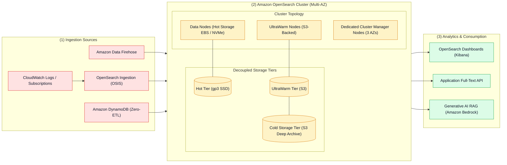
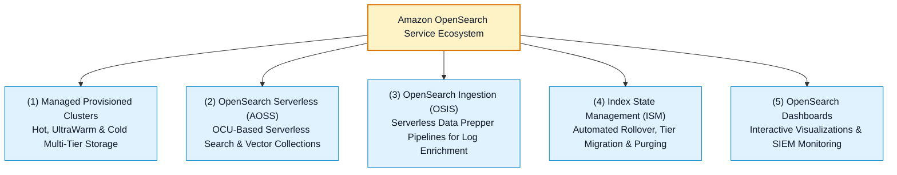

# 🔍 Amazon OpenSearch Service Hub

- **Category**: Analytics / Distributed Search, Log Analytics & Vector Search
- **Language / ဘာသာစကား**: [English (Original)](/en/02-services/analytics-streaming/opensearch/opensearch) | **မြန်မာဘာသာ (Burmese)**
- **Primary Use Case**: Real-time application monitoring, operational log analytics, interactive full-text search, နှင့် AI/ML vector similarity search တို့အတွက် အသုံးပြုသော Managed distributed Lucene search engine ဖြစ်ပါသည်။
- **Slide Reference**: Pages 460–478 in `[AWSCertifiedDataEngineerSlides.pdf](/docs/AWSCertifiedDataEngineerSlides.pdf)`
- **Hub Links**: `[[mm/index]]` | `[[service-catalog]]` | `[[domain-2-data-store-management]]` | `[[kinesis-firehose]]` | `[[cloudwatch-and-eventbridge]]`

---

## 1. High-Level Summary (အကျဉ်းချုပ်)

**Amazon OpenSearch Service** (Amazon Elasticsearch Service ၏ open-source မျိုးဆက်) သည် Apache Lucene ကို အခြေခံထားသော fully managed search နှင့် analytics suite တစ်ခုဖြစ်ပါသည်။ ၎င်းသည် လုပ်ငန်းအဖွဲ့အစည်းများအတွက် real-time search, interactive log analytics, infrastructure observability, security information and event management (SIEM), နှင့် generative AI applications များအတွက် vector search များကို လုပ်ဆောင်နိုင်စေပါသည်။

Amazon OpenSearch Service သည် node provisioning, hardware maintenance, software patching, cluster failovers, နှင့် index lifecycle backups စသည့် administrative complexity (စီမံခန့်ခွဲမှုဆိုင်ရာ ရှုပ်ထွေးမှုများ) ကို ဖယ်ရှားပေးပါသည်။

---

## 2. Amazon OpenSearch Deployment Models (တပ်ဆင်အသုံးပြုမှု ပုံစံများ)

Amazon OpenSearch သည် လုပ်ငန်းလည်ပတ်မှုဆိုင်ရာ လိုအပ်ချက်များ (operational requirements) နှင့် workload ခန့်မှန်းရလွယ်ကူမှု (predictability) အပေါ် မူတည်၍ deployment model (၂) မျိုးကို ပေးဆောင်ထားပါသည်-

| Dimension | Amazon OpenSearch Managed Cluster | Amazon OpenSearch Serverless (AOSS) |
| :--- | :--- | :--- |
| **Capacity Management** | သတ်မှတ်ထားသော node instance type များ (`m6g.xlarge.search`, `r6g.2xlarge.search`)၊ dedicated manager များ နှင့် data node အရေအတွက်ကို တိကျစွာ သတ်မှတ်ပေးရသည်။ | Instance sizing သတ်မှတ်ရန် မလိုပါ။ **OpenSearch Compute Units (OCUs)** ကို အလိုအလျောက် provision နှင့် scale လုပ်ဆောင်ပေးသည်။ |
| **Storage Architecture** | Multi-tier: **Hot Tier** (EBS/NVMe), **UltraWarm** (S3), နှင့် **Cold Storage** (archived S3)။ | Amazon S3 သို့ တိုက်ရိုက်ဖတ်/ရေး (read/write) ပြုလုပ်သော Cloud-native decoupled architecture ဖြစ်သည်။ |
| **Use Cases** | 24/7 အဆက်မပြတ် log မှတ်တမ်းတင်ခြင်း (heavy logging)၊ JVM configurations များကို အသေးစိတ် ချိန်ညှိလိုခြင်း၊ တင်းကျပ်သော index state management (ISM) policies များ အသုံးပြုခြင်း နှင့် legacy Elasticsearch မှ ပြောင်းရွှေ့ခြင်း (migrations)။ | ခန့်မှန်းရခက်ခဲသော၊ ရုတ်တရက်တက်လာတတ်သော (spiky) သို့မဟုတ် ကြိုကြားကြိုကြားဖြစ်ပေါ်သော search workloads များ၊ time-series logging နှင့် serverless vector search။ |
| **Minimum Footprint** | Provision လုပ်ထားသော EC2 node များနှင့် EBS volume များအတွက် ပုံသေ အချိန်အလိုက် ကုန်ကျစရိတ် (fixed hourly cost) ရှိသည်။ | 0 သို့မဟုတ် fractional OCUs အထိ scale လုပ်ဆောင်နိုင်သည် (active collection တစ်ခုစီအတွက် အနိမ့်ဆုံး baseline billing သတ်မှတ်ချက် ရှိသည်)။ |
| **Access Control** | Fine-Grained Access Control (FGAC), internal user database, SAML, Cognito, IAM။ | AWS IAM မှတဆင့် Data access policies, network policies နှင့် encryption policies များကို စီမံသည်။ |

---

## 3. The Core OpenSearch Ecosystem (အဓိက OpenSearch ဂေဟစနစ်)

---

## 4. Modular OpenSearch Deep-Dive Topics (အသေးစိတ် လေ့လာရန် ခေါင်းစဉ်များ)

**AWS Certified Data Engineer - Associate (DEA-C01)** စာမေးပွဲအတွက် Amazon OpenSearch ကို ကျွမ်းကျင်စွာ နားလည်နိုင်ရန် အောက်ပါ modular notes များကို လေ့လာပါ-

1. `[[opensearch-cluster-architecture]]` — **Cluster Manager Nodes, Data Nodes, Indices, Primary & Replica Shards, နှင့် Sizing Rules**
2. `[[opensearch-storage-tiers-and-ism]]` — **Hot, UltraWarm, Cold, Frozen Storage & Index State Management (ISM) Policies**
3. `[[opensearch-serverless]]` — **OpenSearch Serverless (AOSS), OCUs, Collection Types (Search, Time-Series, Vector) & Security Policies**
4. `[[opensearch-ingestion-and-pipelines]]` — **OpenSearch Ingestion (OSIS), Data Prepper, Firehose Direct Delivery & DynamoDB Zero-ETL**
5. `[[opensearch-security-and-monitoring]]` — **Fine-Grained Access Control (FGAC), Document/Field-Level Security, Cognito Dashboards, KMS & TLS**
6. `[[opensearch-troubleshooting-and-tuning]]` — **Red/Yellow/Green Cluster Health, Disk Watermarks, JVM Memory Pressure, Circuit Breakers & Bulk Load Tuning**
7. `[[opensearch-architecture-and-patterns]]` — **End-to-End Log Analytics, Vector Search / RAG, နှင့် OpenSearch vs. Athena vs. CloudWatch Insights Decision Matrix**

---

## 5. DEA-C01 Exam Essentials (စာမေးပွဲအတွက် မဖြစ်မနေ သိထားရမည့် အချက်များ)

> [!IMPORTANT]
> **Amazon OpenSearch Service အတွက် အဓိက စာမေးပွဲ စည်းမျဉ်းများ (Key Exam Rules)**:
>
> - **Primary Analytical Role**: OpenSearch သည် **sub-second keyword text search**၊ **log aggregation** နှင့် **vector similarity search** တို့အတွက် အဓိက AWS service ဖြစ်ပါသည်။ (S3 data lakes ပေါ်ရှိ ad-hoc SQL အတွက် **Amazon Athena** ကို ရွေးချယ်ပါ၊ multi-terabyte data warehousing အတွက် **Amazon Redshift** ကို ရွေးချယ်ပါ)။
> - **Cost-Effective Historical Logs**: OpenSearch တွင် လပေါင်းများစွာ ကြာမြင့်သော logs များကို interactive query စွမ်းရည်များ ထိန်းသိမ်းထားရင်း သိမ်းဆည်းလိုပါက **Index State Management (ISM)** ကို အသုံးပြု၍ သက်တမ်းရင့် indices များကို S3-backed ဖြစ်သော **UltraWarm Storage** သို့ ပြောင်းရွှေ့သိမ်းဆည်းပါ။
> - **Cluster Resilience**: Split-brain risk မဖြစ်စေဘဲ high availability ကို အာမခံနိုင်ရန်အတွက် Availability Zones (၃) ခုပေါ်တွင် **3 Dedicated Cluster Manager nodes** ဖြန့်ကျက်ထားပြီး primary shard တစ်ခုစီအတွက် **1 replica shard** ကို အမြဲတမ်း configure လုပ်ပါ။
> - **Serverless Ingestion**: OpenSearch အတွင်းသို့ data များကို index မလုပ်မီ sensitive PII field များကို filter ပြုလုပ်ခြင်း၊ aggregate ပြုလုပ်ခြင်း နှင့် redact (ဖုံးကွယ်/ဖယ်ထုတ်) ခြင်းတို့အတွက် **OpenSearch Ingestion (OSIS)** ကို အသုံးပြုပါ။

---

## 📌 Related Notes
- `[[opensearch-cluster-architecture]]` — Sharding, Node Sizing & Resilience
- `[[opensearch-storage-tiers-and-ism]]` — UltraWarm & Index State Management
- `[[opensearch-serverless]]` — Serverless Collections & OCUs
- `[[kinesis-firehose]]` — Streaming Delivery to OpenSearch Destination
- `[[cloudwatch-and-eventbridge]]` — CloudWatch Subscription Filters
