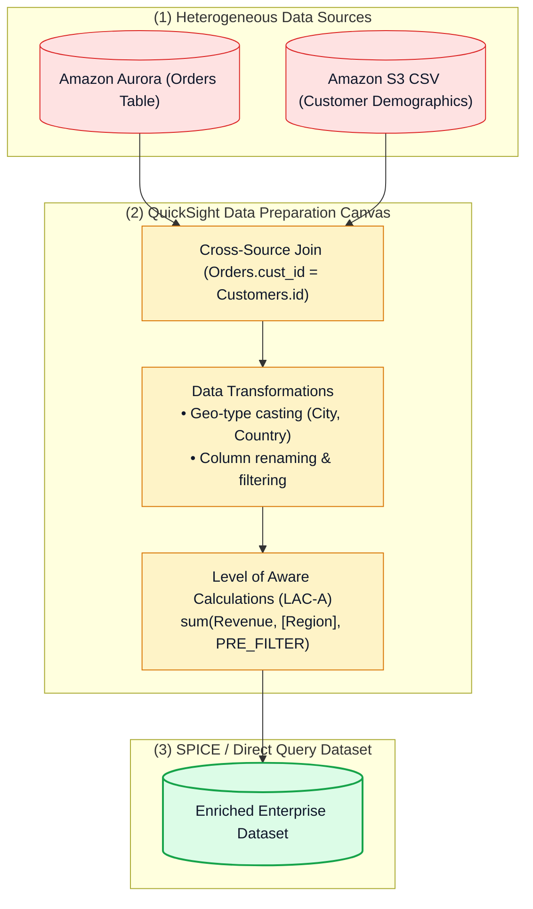
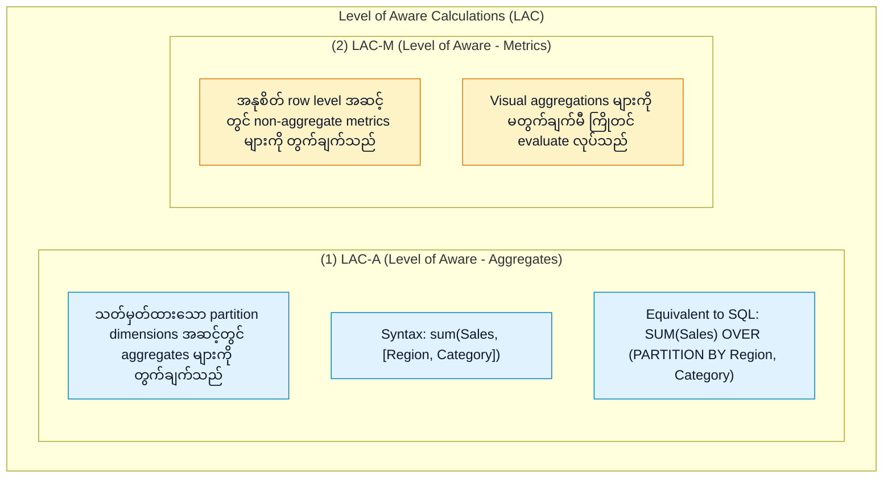
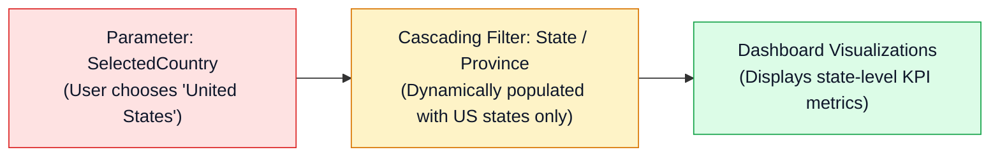

# 📐 Amazon QuickSight Data Preparation, Modeling & Level of Aware Calculations (LAC)

- **Category**: Analytics / Semantic Data Modeling & Advanced Business Calculations
- **Language / ဘာသာစကား**: [English (Original)](/en/02-services/analytics-streaming/quicksight/quicksight-data-preparation-and-modeling) | **မြန်မာဘာသာ (Burmese)**
- **Primary Use Case**: Cross-source dataset များကို ပေါင်းစည်းခြင်း (Combining cross-source datasets)၊ Custom SQL query များ ဖန်တီးခြင်း၊ အဆင့်မြင့် Level of Aware Calculations (LAC-A / LAC-M) တည်ဆောက်ခြင်းနှင့် dynamic cascading filter များ configure ပြုလုပ်ခြင်း။
- **Slide Reference**: Pages 479–498 in `[AWSCertifiedDataEngineerSlides.pdf](/docs/AWSCertifiedDataEngineerSlides.pdf)`
- **Hub Links**: `[[mm/index]]` | `[[quicksight]]` | `[[quicksight-spice-engine]]` | `[[athena]]` | `[[rds-and-aurora]]`

---

## 1. High-Level Summary (အကျဉ်းချုပ် ခြုံငုံသုံးသပ်ချက်)

Amazon QuickSight ရှိ Data Preparation သည် data engineer များအနေဖြင့် ကွဲပြားခြားနားသော operational နှင့် analytical source များမှ raw data များကို clean ပြုလုပ်ခြင်း၊ transform ပြုလုပ်ခြင်း၊ join တွဲဆက်ခြင်းနှင့် လုပ်ငန်းသုံးရန် အသင့်ဖြစ်စေသော **Datasets** များအဖြစ် enrich (ပိုမိုပြည့်စုံအောင်) ပြုလုပ်ခြင်းတို့ကို ဆောင်ရွက်နိုင်စေပါသည်။

**DEA-C01** စာမေးပွဲအတွက် **cross-data-source joins**၊ data type casting၊ parameter-driven dynamic controls များနှင့် visual canvas ပေါ်ရှိ granularity အဆင့်များနှင့် သီးခြားလွတ်လပ်စွာ တွက်ချက်မှုများ လုပ်ဆောင်နိုင်သည့် **Level of Aware Calculations (LAC-A and LAC-M)** (SQL window functions များနှင့် အလားသဏ္ဌာန်တူသည်) တို့ကို ကျွမ်းကျင်စွာ နားလည်ထားရပါမည်။

---

## 2. Multi-Table & Cross-Source Joins (ဇယားများစွာနှင့် အရင်းအမြစ် ကွဲပြားသော Joins များ)

Amazon QuickSight သည် database တစ်ခုတည်းအတွင်းရှိ ဇယားများကို join တွဲဆက်ခြင်းအပြင် **Cross-Data-Source Joins** (ဥပမာ- Amazon S3 CSV manifest ဖိုင်တစ်ခုနှင့် Amazon Redshift ဇယားတစ်ခုကို join တွဲဆက်ခြင်း) ကိုလည်း ထောက်ပံ့ပေးသည်-

| Join Type | လုပ်ဆောင်ချက် (Behavior) | အသုံးများသော Data Engineering Use Case |
| :--- | :--- | :--- |
| **Inner Join** | Table နှစ်ခုစလုံးတွင် ကိုက်ညီသော key များ ရှိသည့်အခါမှသာ row များကို return ပြန်ပေးသည်။ | အတည်ပြုပြီးသား active customer များထံမှသာ ဖြစ်သော order များကို filter လုပ်၍ ရယူခြင်း။ |
| **Left Outer Join** (Default) | Primary table မှ row အားလုံးနှင့် secondary table မှ ကိုက်ညီသော row များကို return ပြန်ပေးသည်။ | လတ်တလော အရောင်းမရှိသေးသော product များအပါအဝင် product အားလုံးကို ဖော်ပြခြင်း။ |
| **Right Outer Join** | Secondary table မှ row အားလုံးနှင့် primary table မှ ကိုက်ညီသော row များကို return ပြန်ပေးသည်။ | ဒေသတွင်း ဝန်ထမ်းမရှိသော region များအပါအဝင် ဒေသအလိုက် သတ်မှတ် target များကို report ထုတ်ခြင်း။ |
| **Full Outer Join** | Table နှစ်ခုစလုံးမှ row အားလုံးကို return ပြန်ပေးပြီး မကိုက်ညီသော နေရာများတွင် NULL များကို ဖြည့်သွင်းပေးသည်။ | ပေါင်းစည်းတော့မည့် လုပ်ငန်းသုံး enterprise system နှစ်ခုအကြား စုစည်းထားသော audit report ထုတ်ခြင်း။ |

> [!TIP]
> **Cross-Source Join Optimization**: Cross-data-source join များကို **SPICE engine** အတွင်း၌ လုပ်ဆောင်ပါသည်။ Table နှစ်ခုစလုံးကို SPICE memory ထဲသို့ ingest လုပ်ယူပြီး join operation ကို high parallelism ဖြင့် တွက်ချက်လုပ်ဆောင်ပါသည်။

---

## 3. Level of Aware Calculations (LAC) Deep Dive (အသေးစိတ် လေ့လာခြင်း)

ပုံမှန် BI tool များတွင် တွက်ချက်မှု (calculations) များသည် visual ထဲတွင် ဖော်ပြထားသော dimensions များနှင့် တိုက်ရိုက် ချိတ်ဆက်နေပါသည်။ QuickSight သည် ရှုပ်ထွေးသော multi-level aggregation များကို **Level of Aware Calculations (LAC)** ဖြင့် ဖြေရှင်းပေးပါသည်-

### Calculation Evaluation Stages (တွက်ချက်မှု အဆင့်ဆင့် ဆန်းစစ်ခြင်း):
1. **`PRE_FILTER`**:
   - Visual filter များကို မလုပ်ဆောင်မီ aggregate တန်ဖိုးကို **ကြိုတင် (before)** တွက်ချက်သည်။
   - *ဥပမာ*: အသုံးပြုသူက မည်သည့် country filter ကို ရွေးချယ်ထားစေကာမူ ကုမ္ပဏီတစ်ခုလုံး၏ စုစုပေါင်းရောင်းအားအပေါ် အဆိုပါ item ၏ ရာခိုင်နှုန်းကို တွက်ချက်ခြင်း:
     $$\text{Percent of Global Sales} = \frac{\text{sum(Sales)}}{\text{sum(Sales, [], PRE\_FILTER)}}$$
2. **`PRE_AGG`**:
   - Dataset filter များကို ဖြတ်သန်းပြီးဖြစ်သော်လည်း visual-level groupings များကို မလုပ်ဆောင်မီ aggregate တန်ဖိုးကို **ကြိုတင် (before)** တွက်ချက်သည်။
   - *ဥပမာ*: Chart တစ်ခုတွင် product category အလိုက် အုပ်စုမဖွဲ့မီ သုံးစွဲသူတစ်ဦးချင်းစီ၏ စုစုပေါင်း သုံးစွဲငွေ (total customer lifetime spend) ကို ရှာဖွေခြင်း:
     $$\text{Customer Lifetime Spend} = \text{sum(Sales, [CustomerId], PRE\_AGG)}$$
3. **`POST_AGG`** (Default):
   - Visual aggregations များနှင့် visual filter များ အားလုံး အလုပ်လုပ်ပြီးနောက်မှ တွက်ချက်သည်။

---

## 4. Parameters, Controls & Cascading Filters (ပါရာမီတာများ၊ ထိန်းချုပ်ခလုတ်များနှင့် အဆင့်ဆင့်စစ်ထုတ်မှုများ)

1. **Parameters**: Single value၊ multiple values သို့မဟုတ် user login ပေါ်မူတည်၍ dynamic defaults များကို သိမ်းဆည်းနိုင်သော အမည်ပေးထားသည့် variables များ ဖြစ်သည်။ Parameters များကို **Controls** (dropdown lists, sliders, text boxes) များနှင့် ချိတ်ဆက်နိုင်ပြီး calculated fields များထဲတွင် ထည့်သွင်း အသုံးပြုနိုင်ပါသည်။
2. **Cascading Filters**: Parent filter တွင် တန်ဖိုးတစ်ခု ရွေးချယ်လိုက်ခြင်း (ဥပမာ `Country = Canada`) က child filter များတွင် ရွေးချယ်နိုင်သည့် option များကို အလိုအလျောက် ကန့်သတ်ပေးနိုင်ရန် filter dependencies များကို configure ပြုလုပ်ခြင်း ဖြစ်သည် (ဥပမာ `Province = Ontario, Quebec, BC`)။

---

## 5. DEA-C01 Exam Essentials (စာမေးပွဲအတွက် အရေးကြီးသော အချက်များ)

> [!IMPORTANT]
> **Data Preparation & Modeling အတွက် စာမေးပွဲ အဓိက ဆုံးဖြတ်ချက် လမ်းညွှန်များ (Key Decision Triggers)**:
>
> - **"အသုံးပြုသူများက သီးခြား product line များအပေါ် visual filter များ ပြုလုပ်ထားသော်လည်း တိကျမှန်ကန်နေသည့် Market Share percentage ကို တွက်ချက်လိုခြင်း"** $\rightarrow$ **`PRE_FILTER` ပါရှိသော LAC-A** ကို အသုံးပြုပါ (ဥပမာ `sum(Sales) / sum(Sales, [], PRE_FILTER)`).
> - **"RDS ရှိ transactional customer data နှင့် S3 ရှိ demographic survey file များကို ပေါင်းစပ်လိုခြင်း"** $\rightarrow$ **SPICE** ဖြင့် အထောက်အပံ့ပေးထားသော QuickSight Dataset preparation တွင် **Cross-Data-Source Left Outer Join** ကို တည်ဆောက်ပါ။
> - **"ယခင် dropdown ရွေးချယ်မှုအပေါ် မူတည်၍ dropdown filter option များကို dynamic ပြောင်းလဲစေလိုခြင်း"** $\rightarrow$ Analysis Controls panel တွင် **Cascading Filters** ကို configure ပြုလုပ်ပါ။
> - **"SQL Window Function Equivalence"** $\rightarrow$ စာမေးပွဲ မေးခွန်းတစ်ခုတွင် QuickSight အတွင်း `SUM() OVER (PARTITION BY ...)` လုပ်ဆောင်ချက် လိုအပ်လာပါက **Level of Aware Calculations (LAC-A)** ကို ရွေးချယ်ပါ။

---

## 📌 ဆက်စပ် မှတ်စုများ (Related Notes)
- `[[quicksight]]` — QuickSight Master Hub
- `[[quicksight-spice-engine]]` — SPICE In-Memory Engine
- `[[athena]]` — Querying S3 Datasets
- `[[rds-and-aurora]]` — Relational Sources for QuickSight
