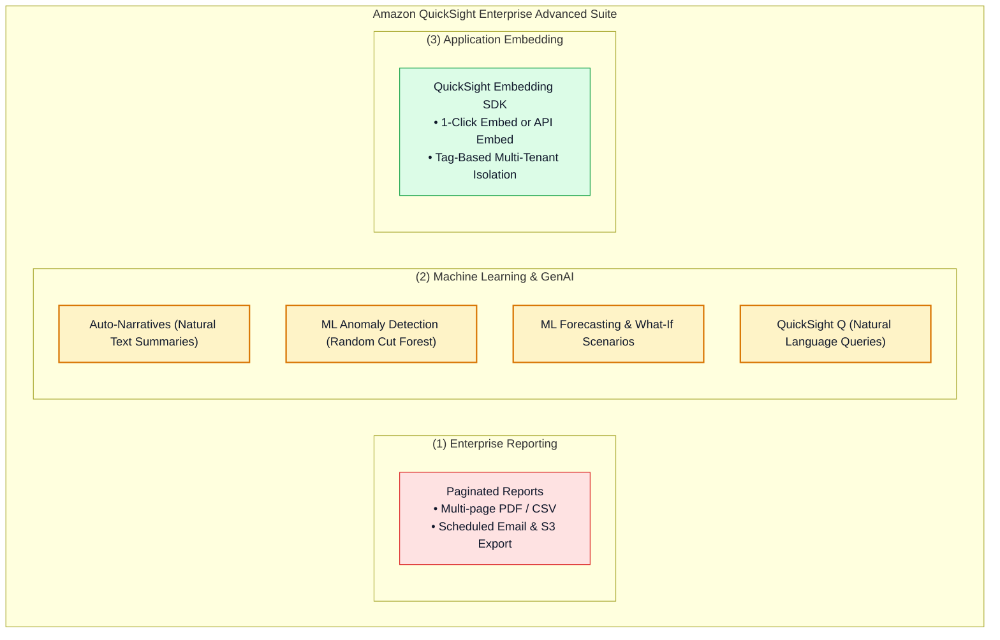
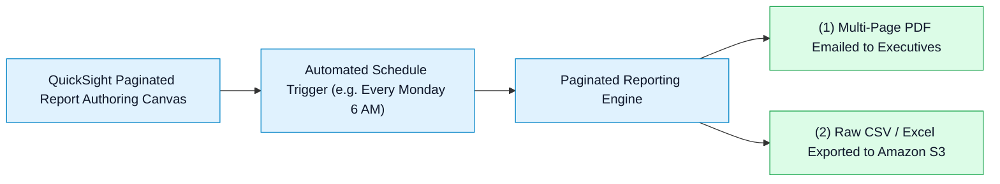
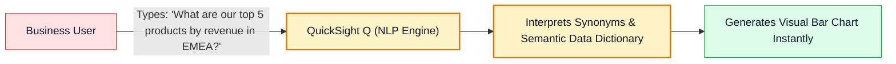
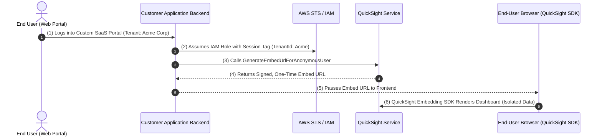

# 🚀 Amazon QuickSight Paginated Reports, ML Insights, Generative Q & Embedded Analytics

- **Category**: Analytics / Automated Reporting, Machine Learning & Embedded BI
- **Language / ဘာသာစကား**: [English (Original)](/en/02-services/analytics-streaming/quicksight/quicksight-reporting-ml-and-embedding) | **မြန်မာဘာသာ (Burmese)**
- **Primary Use Case**: သတ်မှတ်ထားသော အချိန်ဇယားအတိုင်း multi-page executive PDF report များကို generate ပြုလုပ်ခြင်း၊ ML-powered anomaly detection နှင့် forecasting တို့ကို အသုံးချခြင်း၊ QuickSight Q ဖြင့် natural language အသုံးပြု query ပြုလုပ်ခြင်း၊ နှင့် dashboard များကို custom web application များထဲသို့ embed ပြုလုပ်ထည့်သွင်းခြင်း။
- **Slide Reference**: Pages 479–498 in `[AWSCertifiedDataEngineerSlides.pdf](/docs/AWSCertifiedDataEngineerSlides.pdf)`
- **Hub Links**: `[[mm/index|index]]` | `[[mm/02-services/analytics-streaming/quicksight/quicksight|quicksight]]` | `[[mm/02-services/analytics-streaming/quicksight/quicksight-security-rls-and-governance|quicksight-security-rls-and-governance]]` | `[[mm/02-services/storage/s3/s3|s3]]`

---

## 1. High-Level Summary

Interactive visual dashboard များ ဖန်တီးနိုင်သည့်အပြင်၊ Amazon QuickSight သည် **Pixel-Perfect Paginated Reporting**၊ **Automated ML Insights** (Anomaly Detection နှင့် Forecasting)၊ **Generative Natural Language BI (QuickSight Q)** နှင့် **Embedded Analytics** စသည့် enterprise-grade စွမ်းဆောင်ရည်များကို ထောက်ပံ့ပေးထားပါသည်။

**DEA-C01** စာမေးပွဲအတွက် အဆိုပါ capabilities များကို မည်သို့ configure ပြုလုပ်ရသည်၊ data science ကျွမ်းကျင်မှုမလိုဘဲ ML model များမှ time-series data အတွင်းရှိ anomaly များကို မည်သို့ရှာဖွေဖော်ထုတ်သည်၊ နှင့် dashboard များကို ပြင်ပ portal များအတွင်းသို့ လုံခြုံစွာ မည်သို့ embed ပြုလုပ်ရသည်တို့ကို နားလည်ထားရပါမည်။

---

## 2. Paginated Reports

Standard dashboard များသည် single screen ပေါ်တွင် interactive browser exploration ပြုလုပ်ရန်အတွက် optimize ပြုလုပ်ထားသော်လည်း၊ **Paginated Reports** သည် print ထုတ်ယူနိုင်သော multi-page formatted document များအတွက် အထူးရည်ရွယ်ထုတ်လုပ်ထားပါသည်:

### Key Capabilities:
- **Pixel-Perfect Formatting**: စာမျက်နှာအများအပြားကို သပ်ရပ်စွာ ဖြတ်သန်းပြသနိုင်သော custom page header များ၊ footer များ၊ page break များနှင့် repeatable table row များကို သတ်မှတ် configure ပြုလုပ်နိုင်ခြင်း။
- **Automated Distribution**: သတ်မှတ်ထားသော အချိန်ဇယားအတိုင်း scheduled PDF report များကို email မှတစ်ဆင့် လက်ခံသူ ထောင်ပေါင်းများစွာထံ (QuickSight account မရှိသော user များအပါအဝင်) ပေးပို့ဖြန့်ဝေနိုင်ခြင်း၊ သို့မဟုတ် compliance archiving အတွက် ဖိုင်များကို Amazon S3 bucket ထဲသို့ တိုက်ရိုက် export ပြုလုပ်ထုတ်ယူနိုင်ခြင်း။

---

## 3. ML Insights & Anomaly Detection

Amazon QuickSight တွင် Amazon SageMaker သို့မဟုတ် သီးသန့် custom machine learning pipeline များ မလိုအပ်ဘဲ သင်၏ SPICE dataset များပေါ်တွင် တိုက်ရိုက် run နိုင်သော built-in machine learning capabilities များ ပါဝင်ပါသည်:

| ML Insight Feature | Underlying Technology | Business / Data Engineering Use Case |
| :--- | :--- | :--- |
| **Auto-Narratives** | Natural Language Generation (NLG). | Visual metric များအတွက် dynamic text ရှင်းလင်းချက်များကို ထုတ်ပေးခြင်း (ဥပမာ- *"Revenue grew by 14% week-over-week driven by Enterprise deals"*). |
| **ML Anomaly Detection** | Random Cut Forest (RCF) algorithm. | Sales, server latency သို့မဟုတ် web traffic များအတွင်း မမျှော်လင့်ထားသော spike များ၊ dip များ သို့မဟုတ် outlier များကို ရှာဖွေဖော်ထုတ်ရန် metric/dimension သန်းပေါင်းများစွာအထိ continuously scan ဖတ်ခြင်း။ |
| **ML Forecasting** | Random Cut Forest & time-series models. | ရာသီအလိုက်ဖြစ်ပေါ်သော seasonal anomaly များကို ဖယ်ထုတ်ပြီး ရွေးချယ်နိုင်သော confidence interval များ ($90\%, 95\%$) ဖြင့် အနာဂတ် metric trajectory များကို ကြိုတင်ခန့်မှန်းတွက်ချက်ခြင်း။ |
| **What-If Analysis** | Scenario modeling. | ဖြစ်နိုင်ချေရှိသော စီးပွားရေးအခြေအနေများကို အပြန်အလှန် simulation ပြုလုပ်ခြင်း (ဥပမာ- *"What if logistics costs drop by 8% in Q4?"*)။ |

---

## 4. Generative BI: Amazon QuickSight Q

**Amazon QuickSight Q** သည် machine learning စွမ်းအားသုံး natural language query engine တစ်ခုဖြစ်ပြီး business user များအနေဖြင့် ၎င်းတို့၏ data နှင့်ပတ်သက်၍ သာမန် English မေးခွန်းများ မေးမြန်းနိုင်ကာ ချက်ချင်း interactive chart များကို ရရှိစေပါသည်:

- **Q Topics**: Data engineer များသည် dataset များမှ structured **Topics** များကို တည်ဆောက်ပြီး business synonym များကို configure ပြုလုပ်ပေးရပါသည် (ဥပမာ- *"revenue"*, *"sales"* နှင့် *"turnover"* တို့ကို `gross_revenue` column သို့ map ပြုလုပ်ခြင်း)။
- နေ့စဉ်ကြုံတွေ့ရသော ad-hoc business မေးခွန်းများအတွက် BI team များအနေဖြင့် သီးသန့် custom visual report ရာပေါင်းများစွာ တည်ဆောက်ပေးရသည့် လိုအပ်ချက်ကို ဖယ်ရှားပေးပါသည်။

---

## 5. Embedded Analytics in Custom Applications

Amazon QuickSight သည် developer များအား interactive dashboard များ၊ individual visual chart များ သို့မဟုတ် QuickSight Q natural language search bar တို့ကို custom web application များထဲသို့ တိုက်ရိုက် embed ပြုလုပ်ထည့်သွင်းနိုင်စေပါသည်:

---

## 6. DEA-C01 Exam Essentials

> [!IMPORTANT]
> **Key Exam Decision Triggers for Reporting, ML & Embedding**:
>
> - **"Send weekly scheduled multi-page PDF financial summaries to corporate executives via email"** $\rightarrow$ **QuickSight Paginated Reports** ကို configure ပြုလုပ်ပါ။
> - **"Automatically detect unexpected revenue dips across thousands of products without writing Python machine learning models"** $\rightarrow$ **QuickSight ML Anomaly Detection** ကို enable ပြုလုပ်ပါ။
> - **"Allow non-technical business users to ask ad-hoc questions like 'Show total sales in Asia last quarter' and receive instant visuals"** $\rightarrow$ **Amazon QuickSight Q** ကို deploy ပြုလုပ်ပါ။
> - **"Embed dashboards into an external multi-tenant portal where anonymous users only see their own company data"** $\rightarrow$ `GenerateEmbedUrlForAnonymousUser` နှင့် **Tag-Based Row-Level Security (RLS)** ပါဝင်သော **QuickSight Embedding SDK** ကို အသုံးပြုပါ။

---

## 📌 Related Notes
- `[[mm/02-services/analytics-streaming/quicksight/quicksight|quicksight]]` — QuickSight Master Hub
- `[[mm/02-services/analytics-streaming/quicksight/quicksight-spice-engine|quicksight-spice-engine]]` — SPICE In-Memory Acceleration
- `[[mm/02-services/analytics-streaming/quicksight/quicksight-security-rls-and-governance|quicksight-security-rls-and-governance]]` — Tag-Based RLS for Multi-Tenant Embedding
- `[[mm/02-services/storage/s3/s3|s3]]` — S3 Export Target for Paginated Reports
