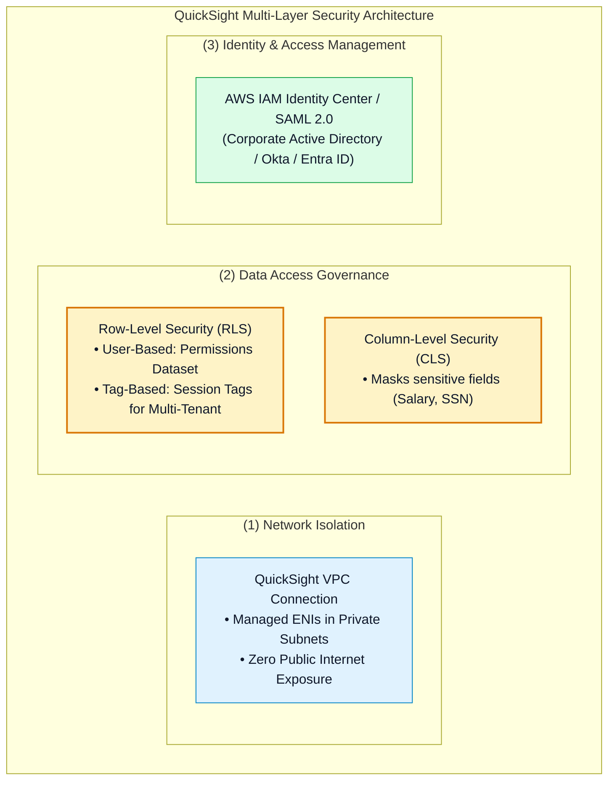
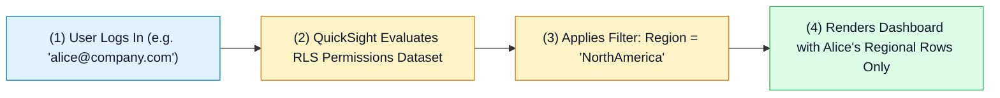
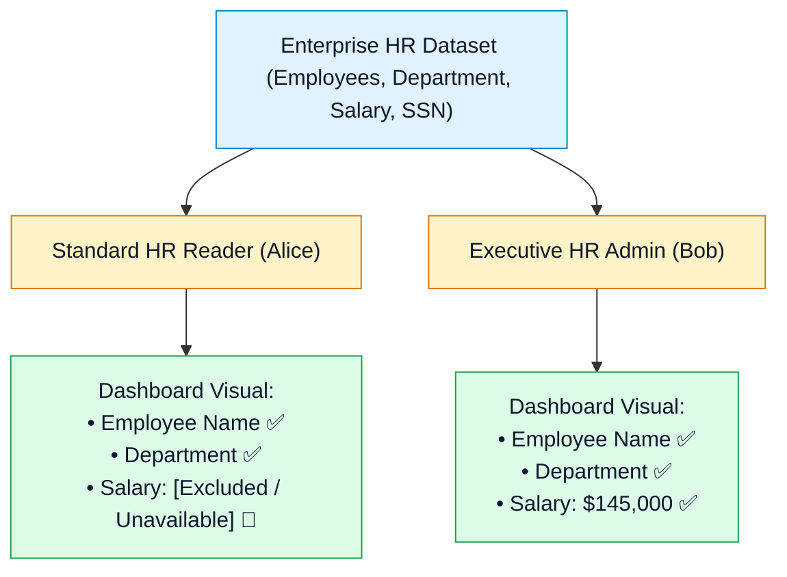
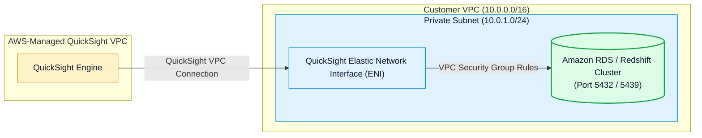

# 🛡️ Amazon QuickSight Security, Row/Column-Level Security (RLS/CLS) & VPC Governance

- **Category**: Analytics / Governance, Multi-Tenant Security & Network Isolation
- **Language / ဘာသာစကား**: [English (Original)](/en/02-services/analytics-streaming/quicksight/quicksight-security-rls-and-governance) | **မြန်မာဘာသာ (Burmese)**
- **Primary Use Case**: User identity ပေါ် အခြေခံ၍ dashboard row များနှင့် column များကို ကန့်သတ်ခြင်း (RLS & CLS)၊ QuickSight VPC connection များမှတစ်ဆင့် private database များကို ချိတ်ဆက်ခြင်း၊ နှင့် IAM Identity Center ဖြင့် enterprise SSO ကို စီမံခန့်ခွဲခြင်း။
- **Slide Reference**: Pages 479–498 in `[AWSCertifiedDataEngineerSlides.pdf](/docs/AWSCertifiedDataEngineerSlides.pdf)`
- **Hub Links**: `[[mm/index]]` | `[[quicksight]]` | `[[redshift]]` | `[[rds-and-aurora]]` | `[[domain-3-data-operations-and-support]]`

---

## 1. High-Level Summary (အကျဉ်းချုပ်)

Enterprise business intelligence လုပ်ငန်းစဉ်များတွင် user များသည် မိမိတို့ role အတွက် ခွင့်ပြုထားသော သီးသန့် record များနှင့် attribute များကိုသာ ကြည့်ရှုအသုံးပြုနိုင်စေရန် တင်းကျပ်သော data governance လိုအပ်ပါသည်။

Amazon QuickSight သည် **User-Based Row-Level Security (RLS)**၊ **Tag-Based RLS for Multi-Tenant Embedding**၊ PII များကို mask လုပ်ရန် **Column-Level Security (CLS)**၊ နှင့် internet ပေါ်သို့ expose မဖြစ်စေဘဲ private database များကို query ပြုလုပ်နိုင်ရန် **Amazon QuickSight VPC Connections** တို့မှတစ်ဆင့် multi-layered governance ကို ထောက်ပံ့ပေးပါသည်။

---

## 2. Row-Level Security (RLS) Deep Dive

Row-Level Security သည် analysis သို့မဟုတ် dashboard တစ်ခုကို ကြည့်ရှုသည့်အခါ user သို့မဟုတ် group တစ်ခု မြင်တွေ့နိုင်သော data ၏ row များကို ကန့်သတ်ပေးသည်-

### 1. User-Based RLS (Permissions Dataset)
Data filter column များနှင့်အတူ `UserName` သို့မဟုတ် `GroupName` column များပါဝင်သော သီးသန့် permissions dataset တစ်ခုကို သင် ဖန်တီးရမည်-

| UserName | GroupName | Region | Segment |
| :--- | :--- | :--- | :--- |
| `alice` | | `NorthAmerica` | `Enterprise` |
| `bob` | | `EMEA` | |
| | `SalesLeadership` | | |

- **Alice**: `Region = 'NorthAmerica'` AND `Segment = 'Enterprise'` ဖြစ်သော record များကိုသာ မြင်တွေ့ရမည်။
- **Bob**: `Region = 'EMEA'` အတွက် segment အားလုံးကို မြင်တွေ့ရမည် (`Segment` ကို အလွတ်ထားခြင်းသည် segment အားလုံးနှင့် ကိုက်ညီသည်)။
- **SalesLeadership Group**: Region အားလုံးနှင့် segment အားလုံးကို မြင်တွေ့ရမည် (unrestricted access)။

---

### 2. Tag-Based RLS (for Multi-Tenant Embedded Analytics)
Dashboard များကို customer-facing SaaS application များအတွင်း embed လုပ်သည့်အခါ-
- QuickSight user account ထောင်ပေါင်းများစွာကို တစ်ဦးချင်း ဖန်တီးခြင်းမှ ရှောင်ရှားနိုင်သည်။
- `GenerateEmbedUrlForRegisteredUser` သို့မဟုတ် `GenerateEmbedUrlForAnonymousUser` API call များ ပြုလုပ်စဉ် pass လုပ်ပေးလိုက်သော **AWS STS Session Tags** များ (ဥပမာ `TenantId: Customer_A`) ကို အသုံးပြုနိုင်သည်။
- QuickSight သည် session tag နှင့် ကိုက်ညီသော dataset row များကို dynamically filter ပြုလုပ်ပေးသည်။

---

## 3. Column-Level Security (CLS)

**Column-Level Security (CLS)** သည် dataset တစ်ခုအတွင်းရှိ သီးခြား sensitive column များသို့ access ရရှိမှုကို ကန့်သတ်ပေးသည်-

- Dataset edit screen ပေါ်တွင် sensitive field များ (ဥပမာ `Salary`, `SocialSecurityNumber`) ကို ရွေးချယ်ပြီး ၎င်းတို့ကို ခွင့်ပြုချက်ရရှိထားသော IAM / QuickSight group (`ExecutiveLeadership`) ထံ assign ပြုလုပ်ခြင်းဖြင့် CLS ကို configure လုပ်နိုင်သည်။
- ခွင့်ပြုချက်မရှိသော user များသည် dashboard ကို ကြည့်ရှုနိုင်ဆဲဖြစ်သော်လည်း dashboard rendering မပျက်စီးစေဘဲ protected column များကို query များနှင့် visual calculation များမှ ချန်လှပ်ထားမည်ဖြစ်သည်။

---

## 4. Private VPC Connections for Database Ingestion

ပုံမှန်အားဖြင့် Amazon QuickSight သည် AWS-managed service VPC အတွင်း run သည်။ အကယ်၍ သင်၏ Amazon RDS, Aurora, သို့မဟုတ် Redshift cluster များသည် **public internet access မရှိသော private subnet များ** တွင် တည်ရှိနေပါက QuickSight သည် public IP များမှတစ်ဆင့် မချိတ်ဆက်နိုင်ပါ။

### Configuration Steps:
1. VPC ID, Subnet IDs, နှင့် Security Group တို့ကို သတ်မှတ်ပြီး **QuickSight VPC Connection** တစ်ခုကို ဖန်တီးပါ။
2. QuickSight သည် သင်၏ private subnet များအတွင်း သီးသန့် **Elastic Network Interfaces (ENIs)** များကို provision လုပ်ပေးမည်။
3. Database port ပေါ်တွင် QuickSight Security Group မှ inbound traffic ကို ခွင့်ပြုရန် database Security Group ကို configure လုပ်ပါ။

---

## 5. DEA-C01 Exam Essentials

> [!IMPORTANT]
> **QuickSight Security အတွက် အဓိက Exam Decision Triggers များ**:
>
> - **"Ensure sales managers can only view sales data for their specific region on a shared enterprise dashboard"** (Shared enterprise dashboard တစ်ခုတွင် sales manager များသည် မိမိတို့၏ သက်ဆိုင်ရာ region အတွက် sales data ကိုသာ ကြည့်ရှုနိုင်စေရန် သေချာစေခြင်း) $\rightarrow$ Permissions dataset ဖြင့် **User-Based Row-Level Security (RLS)** ကို configure လုပ်ပါ။
> - **"Embed dashboards into a multi-tenant SaaS portal where external tenants must only see their own company data without individual IAM logins"** (ပြင်ပ tenant များသည် individual IAM login မလိုဘဲ မိမိတို့ ကုမ္ပဏီ၏ data ကိုသာ မြင်တွေ့ရမည့် multi-tenant SaaS portal အတွင်း dashboard များကို embed လုပ်ခြင်း) $\rightarrow$ STS session tag များကို အသုံးပြု၍ **Tag-Based Row-Level Security (RLS)** ကို implement လုပ်ပါ။
> - **"Prevent unauthorized financial analysts from seeing employee salary figures in a shared dataset"** (Shared dataset တစ်ခုတွင် ခွင့်ပြုချက်မရှိသော financial analyst များကို ဝန်ထမ်းလစာစာရင်းများ မြင်တွေ့ရခြင်းမှ တားဆီးခြင်း) $\rightarrow$ `Salary` field ပေါ်တွင် **Column-Level Security (CLS)** ကို enable လုပ်ပါ။
> - **"QuickSight fails to connect to an Amazon RDS PostgreSQL instance in a private subnet"** (Private subnet တစ်ခုအတွင်းရှိ Amazon RDS PostgreSQL instance သို့ QuickSight ချိတ်ဆက်မှု မအောင်မြင်ခြင်း) $\rightarrow$ **Amazon QuickSight VPC Connection** တစ်ခု ဖန်တီးပြီး port 5432 ပေါ်တွင် security group ingress rule များကို စစ်ဆေးပါ။

---

## 📌 Related Notes
- `[[quicksight]]` — QuickSight Master Hub
- `[[quicksight-spice-engine]]` — SPICE In-Memory Engine
- `[[redshift]]` — Securing Amazon Redshift Clusters
- `[[rds-and-aurora]]` — Private VPC Database Connectivity
