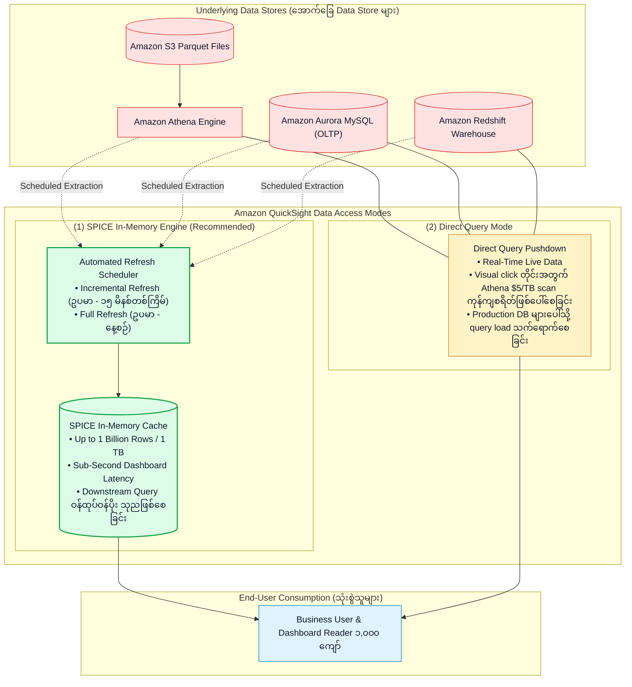
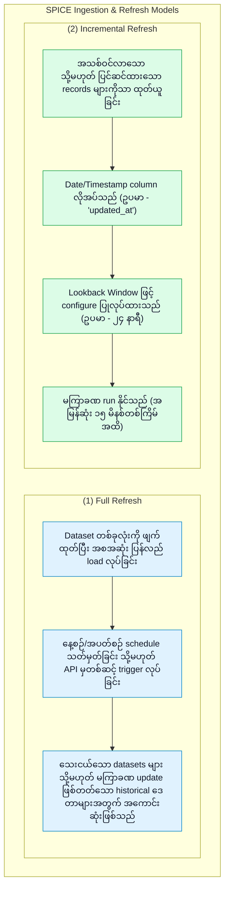
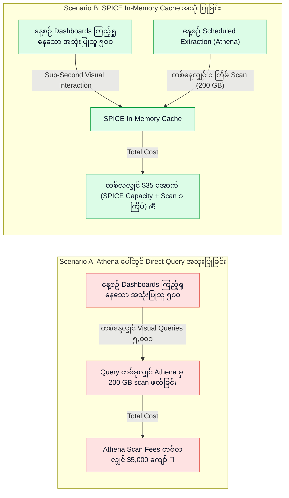

# ⚡ Amazon QuickSight SPICE In-Memory Engine, Refresh Strategies & Cost Optimization

- **Category**: Analytics / High-Performance In-Memory Analytics & Query Caching
- **Language / ဘာသာစကား**: [English (Original)](/en/02-services/analytics-streaming/quicksight/quicksight-spice-engine) | **မြန်မာဘာသာ (Burmese)**
- **Primary Use Case**: Dashboard queries များကို sub-second speed အထိ မြန်ဆန်စေခြင်း၊ Full နှင့် Incremental SPICE refresh များကို configure ပြုလုပ်ခြင်း၊ နှင့် Amazon Athena နှင့် database scan costs များကို သိသိသာသာ လျှော့ချခြင်း။
- **Slide Reference**: Pages 479–498 in `[AWSCertifiedDataEngineerSlides.pdf](/docs/AWSCertifiedDataEngineerSlides.pdf)`
- **Hub Links**: `[[mm/index|index]]` | `[[mm/02-services/analytics-streaming/quicksight/quicksight|quicksight]]` | `[[mm/02-services/analytics-streaming/athena/athena|athena]]` | `[[mm/02-services/database/redshift|redshift]]` | `[[mm/02-services/database/rds-and-aurora|rds-and-aurora]]`

---

## 1. High-Level Summary

**SPICE (Superfast, Parallel, In-memory Calculation Engine)** သည် records သန်းရာနှင့်ချီရှိသော ဒေတာများပေါ်တွင် ရှုပ်ထွေးသည့် aggregations၊ filters များနှင့် pivot tables များကို sub-second response time ဖြင့် ဖြေကြားပေးနိုင်ရန် တည်ဆောက်ထားသည့် Amazon QuickSight ၏ columnar, in-memory data store ဖြစ်သည်။

**DEA-C01** စာမေးပွဲအတွက် **SPICE vs. Direct Query** ကို မည်သည့်အချိန်တွင် အသုံးပြုရမည်၊ **Lookback Window ဖြင့် Incremental Refresh** ကို မည်သို့ configure လုပ်ရမည်၊ နှင့် SPICE သည် **Athena data scanning costs** များကို မည်သို့ သိသိသာသာ လျှော့ချပေးနိုင်သည်ကို နားလည်ထားခြင်းသည် အရေးကြီးသော architectural skill တစ်ခုဖြစ်သည်။



---

## 2. SPICE vs. Direct Query Mode Comparison Matrix

| အကဲဖြတ်မှု အတိုင်းအတာ (Evaluation Dimension) | SPICE (In-Memory Mode) | Direct Query Mode |
| :--- | :--- | :--- |
| **Query Latency** | တစ်သမတ်တည်း **Sub-second** ($< 500\text{ ms}$) ရရှိသည်။ | စက္ကန့်ပိုင်းမှ မိနစ်ပိုင်းအထိ (အောက်ခြေ database/Athena engine ၏ စွမ်းဆောင်ရည်အပေါ် မူတည်သည်)။ |
| **Data Freshness (ဒေတာ လတ်ဆတ်မှု)** | နောက်ဆုံး scheduled သို့မဟုတ် API refresh ပြုလုပ်ထားသည့် အချိန်အတိုင်း လတ်ဆတ်သည် (ဥပမာ - ၁၅ မိနစ် / ၁ နာရီတစ်ကြိမ်)။ | Source database မှ **၁၀၀% real-time live** ဒေတာ ဖြစ်သည်။ |
| **Downstream Impact (မူရင်းစနစ်အပေါ် သက်ရောက်မှု)** | အသုံးပြုသူများ ဝင်ရောက်ကြည့်ရှုနေစဉ် source database ပေါ်တွင် **လုံးဝ သက်ရောက်မှုမရှိပါ (Zero impact)**။ | Visual click သို့မဟုတ် filter တစ်ခုစီတိုင်းသည် source database ပေါ်တွင် live query တစ်ခုစီ run စေသည်။ |
| **Athena Cost Impact (Athena ကုန်ကျစရိတ် သက်ရောက်မှု)** | **ပုံသေ၊ သက်သာသော ကုန်ကျစရိတ် (Fixed, low cost)** ဖြစ်သည်။ သတ်မှတ်ထားသော scheduled ingestion အချိန်များတွင်သာ ဒေတာ scan ဖတ်သည်။ | **ကုန်ကျစရိတ် အလွန်များပြားသည် (Extremely expensive)**။ Dashboard reload သို့မဟုတ် filter ပြောင်းလဲမှုတိုင်းသည် **၁ TB လျှင် \$5 နှုန်း** ဖြင့် ဒေတာ scan ဖတ်သည်။ |
| **Maximum Dataset Size (အများဆုံး Dataset အရွယ်အစား)** | Dataset တစ်ခုလျှင် **Rows ၁ ဘီလီယံ (သို့မဟုတ် 1 TB)** အထိ (Enterprise Edition)။ | အကန့်အသတ်မရှိ (Source database ၏ capacity အပေါ်တွင်သာ မူတည်သည်)။ |
| **Best Used For (အသုံးပြုရန် အသင့်တော်ဆုံး အခြေအနေများ)** | လျင်မြန်သော interactive dashboards များ၊ executive KPI reports များ၊ OLTP databases များကို ဝန်မပိစေရန် ကာကွယ်ခြင်းနှင့် S3 data lakes များအတွက်။ | တိကျသော real-time operational monitoring၊ 1 TB ထက် ကျော်လွန်သော datasets များ၊ သို့မဟုတ် pre-optimized Redshift clusters များအတွက်။ |

---

## 3. SPICE Refresh Strategies (SPICE Refresh ပြုလုပ်နည်း ဗျူဟာများ)



### 1. Incremental Refresh Mechanics (Incremental Refresh ၏ လုပ်ဆောင်ပုံ ယန္တရား):
- **Timestamp Field Requirement (Timestamp Field လိုအပ်ချက်)**: Source dataset တွင် `date` သို့မဟုတ် `timestamp` column (ဥပမာ `order_timestamp` သို့မဟုတ် `last_modified_date`) ပါဝင်ရမည်။
- **Lookback Window**: QuickSight သည် `current_time - lookback_window` အတိုင်းအတာအတွင်းရှိ records များကို ဆွဲယူသည်။
  - *ဥပမာ*: **၂၄ နာရီ** Lookback window သတ်မှတ်ထားခြင်းဖြင့် လွန်ခဲ့သော ၂၄ နာရီအတွင်း နောက်ကျမှ ဝင်ရောက်လာသော order status updates များ (သို့မဟုတ် late-arriving CDC records များ) ကို multi-gigabyte table scan အပြည့်အစုံ ဖတ်စရာမလိုဘဲ SPICE ထဲတွင် update ဖြစ်စေရန် သေချာစေသည်။

### 2. Event-Driven Programmatic Refresh:
Static clock schedules များကို အသုံးပြုမည့်အစား ခေတ်မီ data engineering pipelines များတွင် AWS SDK / boto3 API ကို အသုံးပြု၍ ETL job ပြီးဆုံးသည်နှင့် တပြိုင်နက် SPICE refresh များကို programmatic နည်းလမ်းဖြင့် trigger လုပ်ကြသည်:
```python
import boto3

quicksight = boto3.client('quicksight')

response = quicksight.create_ingestion(
    DataSetId='orders-dataset-id',
    IngestionId='ingest-job-2026-08-19-01',
    AwsAccountId='123456789012',
    IngestionType='INCREMENTAL_REFRESH'  # or 'FULL_REFRESH'
)
```

---

## 4. Cost Optimization: Slashing Athena & Database Query Bills (Athena နှင့် Database Query ကုန်ကျစရိတ်များကို လျှော့ချခြင်း)



### Cost Optimization Rules (ကုန်ကျစရိတ် သက်သာစေမည့် စည်းမျဉ်းများ):
1. **Athena Scan Reduction (Athena Scan လျှော့ချခြင်း)**: QuickSight မှ S3 data lakes များကို Athena ဖြင့် တိုက်ရိုက် query လုပ်ခြင်းသည် visual filter အပြောင်းအလဲ သို့မဟုတ် page refresh ပြုလုပ်တိုင်း raw files များကို scan ဖတ်သည့် SQL query အသစ်တစ်ခု ဖြစ်ပေါ်စေသောကြောင့် cloud ကုန်ကျစရိတ်များ အဆမတန် မြင့်တက်လာနိုင်သည်။ Athena table ကို **SPICE** ထဲသို့ import လုပ်ခြင်းဖြင့် Athena scanning ကို သတ်မှတ်ထားသော scheduled ingestion intervals များတွင်သာ အလုပ်လုပ်စေရန် သီးသန့် ကန့်သတ်ပေးသည်။
2. **Protecting Production Databases (Production Database များကို ကာကွယ်ခြင်း)**: Direct Query သည် လုပ်ငန်းသုံး operational databases (Aurora/RDS) များဆီသို့ ကြိုတင်ခန့်မှန်းမရနိုင်သော ပြိုင်တူ (concurrent) SQL queries များကို ပေးပို့စေသည်။ SPICE သည် OLTP application workloads များပေါ်တွင် analytical queries များကြောင့် ဖြစ်ပေါ်လာမည့် ဝန်ပိမှု (query contention) ကို ကာကွယ်ပေးသည်။

---

## 5. DEA-C01 Exam Essentials (စာမေးပွဲအတွက် မဖြစ်မနေ သိထားရမည့်အချက်များ)

> [!IMPORTANT]
> **SPICE အတွက် အဓိက စာမေးပွဲ Decision Triggers များ**:
>
> - **"Business analysts များက Athena မှတစ်ဆင့် S3 data lake ကို query လုပ်ထားသော dashboards များသည် နှေးကွေးပြီး scanning cost များစွာ ကုန်ကျနေသည်ဟု တိုင်ကြားလာခြင်း"** $\rightarrow$ Dataset access mode ကို **Direct Query** မှ **SPICE** သို့ ပြောင်းလဲပါ။
> - **"နှေးကွေးသော full reload ကို run စရာမလိုဘဲ rows သန်းပေါင်းများစွာရှိသော SPICE dataset ကို အသစ်ရောက်ရှိလာသော records များဖြင့် မကြာခဏ update ပြုလုပ်လိုခြင်း"** $\rightarrow$ Timestamp column ပေါ်တွင် **Lookback Window** ဖြင့် **Incremental Refresh** ကို configure ပြုလုပ်ပါ။
> - **"AWS Glue ETL job က S3 သို့ ဒေတာရေးသားပြီးစီးသည်နှင့် တပြိုင်နက် SPICE ကို refresh လုပ်လိုခြင်း"** $\rightarrow$ AWS Step Functions state machine သို့မဟုတ် Lambda function အတွင်းမှ **QuickSight `CreateIngestion` API** ကို ခေါ်ယူပါ။
> - **"Enterprise Capacity Limit"** $\rightarrow$ SPICE သည် Enterprise Edition တွင် dataset တစ်ခုလျှင် **Rows ၁ ဘီလီယံ (သို့မဟုတ် 1 TB)** အထိ ထောက်ပံ့ပေးသည်။

---

## 📌 Related Notes
- `[[mm/02-services/analytics-streaming/quicksight/quicksight|quicksight]]` — QuickSight Master Hub
- `[[mm/02-services/analytics-streaming/quicksight/quicksight-data-preparation-and-modeling|quicksight-data-preparation-and-modeling]]` — Dataset Joins & Calculated Fields
- `[[mm/02-services/analytics-streaming/athena/athena|athena]]` — Amazon Athena Query Engine
- `[[mm/02-services/database/redshift|redshift]]` — Amazon Redshift Data Warehousing
- `[[mm/02-services/analytics-streaming/glue/glue-etl-jobs|glue-etl-jobs]]` — Orchestrating ETL Pipelines before SPICE Ingestion
