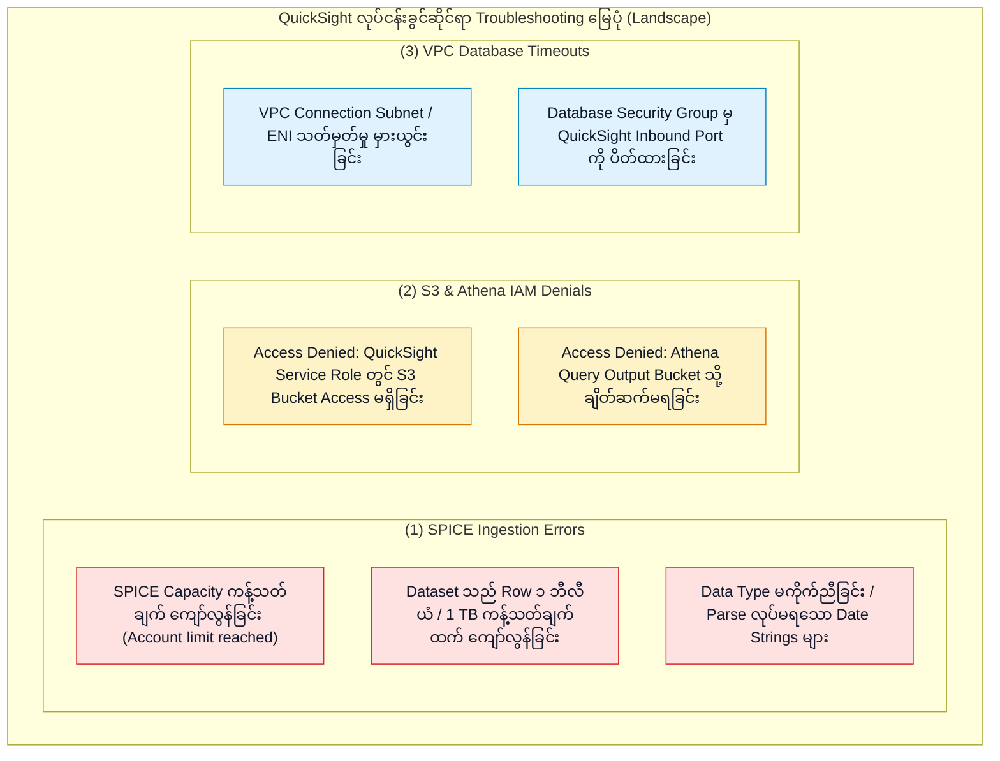
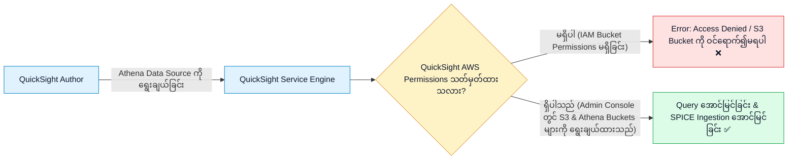
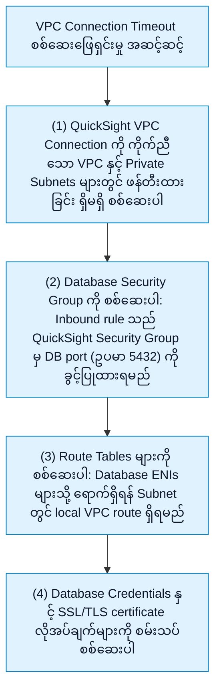

# 🔧 Amazon QuickSight Troubleshooting, Permissions & BI Architecture Patterns

- **Category**: Analytics / Production Troubleshooting, Permissions & BI System Design
- **Language / ဘာသာစကား**: [English (Original)](/en/02-services/analytics-streaming/quicksight/quicksight-troubleshooting-and-patterns) | **မြန်မာဘာသာ (Burmese)**
- **Primary Use Case**: SPICE ingestion ကျရှုံးမှုများကို ဖြေရှင်းခြင်း၊ Amazon S3 နှင့် Athena IAM permission ငြင်းပယ်မှုများ (denials) ကို ရှာဖွေစစ်ဆေးခြင်း၊ VPC database timeout များကို ပြင်ဆင်ခြင်း၊ နှင့် QuickSight ကို အခြား analytical service များနှင့် နှိုင်းယှဉ်သုံးသပ်ခြင်း။
- **Slide Reference**: Pages 479–498 in `[AWSCertifiedDataEngineerSlides.pdf](/docs/AWSCertifiedDataEngineerSlides.pdf)`
- **Hub Links**: `[[mm/index]]` | `[[quicksight]]` | `[[quicksight-spice-engine]]` | `[[athena]]` | `[[redshift]]`

---

## 1. High-Level Summary (အကျဉ်းချုပ်)

Amazon QuickSight ကို production ပတ်ဝန်းကျင်တွင် အသုံးပြုရာတွင် **SPICE Capacity Exceeded Errors**၊ **S3 / Athena Access Denials**၊ နှင့် **VPC Security Group Timeouts** ကဲ့သို့သော ပြဿနာများကို ဖြေရှင်းရန် စနစ်တကျ ပြဿနာရှာဖွေဖြေရှင်းနည်း အဆင့်ဆင့် (structured diagnostic workflows) လိုအပ်ပါသည်။

ဤအဖြစ်များသော troubleshooting scenario များကို ကျွမ်းကျင်စွာ နားလည်ထားခြင်းနှင့် AWS BI service decision matrix ကို သိရှိထားခြင်းသည် **DEA-C01** စာမေးပွဲတွင် အမှတ်ကောင်းကောင်းရရှိရန် အလွန်အရေးကြီးပါသည်။

---

## 2. Resolving SPICE Ingestion Failures (SPICE Ingestion ကျရှုံးမှုများကို ဖြေရှင်းခြင်း)

### 1. `SPICE Capacity Exceeded`
- **Root Cause (အရင်းခံအကြောင်းအရင်း)**: SPICE ထဲသို့ load ပြုလုပ်ထားသော dataset များ၏ စုစုပေါင်းပမာဏသည် AWS account / region အတွက် ဝယ်ယူထားသော SPICE storage capacity ထက် ကျော်လွန်နေခြင်း။
- **Remediation (ဖြေရှင်းနည်း)**:
  1. *Immediate Action (ချက်ချင်းလုပ်ဆောင်ရမည့် အဆင့်)*: **Manage QuickSight $\rightarrow$ SPICE Capacity** console တွင် SPICE capacity အပိုကို ထပ်မံဝယ်ယူပါ (\$0.25/GB-month)။
  2. *Architectural Remedy (ဗိသုကာဆိုင်ရာ ပြင်ဆင်ချက်)*: အသုံးမပြုသော high-cardinality text column များကို ဖယ်ရှားရန် dataset ကို edit လုပ်ပါ၊ ၂ နှစ်ထက်ကျော်လွန်သော သမိုင်းဝင် record များကို ဖယ်ထုတ်ရန် row-level filter များကို ထည့်သွင်းပါ သို့မဟုတ် မသုံးတော့သော SPICE dataset များကို ဖျက်ပစ်ပါ။

---

### 2. `Dataset Size Exceeds Limit (1 Billion Rows / 1 TB)`
- **Root Cause (အရင်းခံအကြောင်းအရင်း)**: Single dataset တစ်ခုတည်းသည် QuickSight Enterprise Edition ၏ hard limit ဖြစ်သော Row ၁ ဘီလီယံ သို့မဟုတ် 1 TB ထက် ကျော်လွန်နေခြင်း။
- **Remediation (ဖြေရှင်းနည်း)**:
  - QuickSight ထဲသို့ import မလုပ်မီ upstream တွင် **AWS Glue ETL** သို့မဟုတ် **Amazon EMR (Spark)** ကို အသုံးပြု၍ data များကို ကြိုတင် aggregate ပြုလုပ်ပါ (pre-aggregate)။
  - သို့မဟုတ်ပါက SPICE အစား Amazon Redshift သို့မဟုတ် Snowflake သို့ တိုက်ရိုက်ချိတ်ဆက်သည့် **Direct Query Mode** သို့ ပြောင်းလဲအသုံးပြုပါ။

---

## 3. Resolving S3 & Athena IAM Permission Denials (S3 နှင့် Athena IAM Permission ငြင်းပယ်မှုများကို ဖြေရှင်းခြင်း)

DEA-C01 စာမေးပွဲတွင် အလွန်မကြာခဏ တွေ့ရလေ့ရှိသော ပြဿနာမှာ QuickSight မှ Athena table သို့မဟုတ် S3 bucket ကို query ပြုလုပ်သည့်အခါ `Access Denied` error ဖြင့် ကျရှုံးခြင်း ဖြစ်ပါသည်:

### Resolution Steps (ဖြေရှင်းရန် အဆင့်များ):
1. **Manage QuickSight** $\rightarrow$ **Security & Permissions** သို့ သွားပါ။
2. **QuickSight access to AWS services** အောက်တွင် **Amazon S3** နှင့် **Amazon Athena** ကို enable ပြုလုပ်ထားခြင်း ရှိမရှိ စစ်ဆေးပါ။
3. **Select S3 Buckets** ကို နှိပ်ပြီး QuickSight အား underlying data lake bucket အတွက် read access နှင့် **Athena query results staging bucket** (`s3://aws-athena-query-results-...`) အတွက် write access ကို တိကျစွာ ခွင့်ပြုပေးပါ။

---

## 4. Diagnosing VPC Private Database Timeouts (VPC Private Database Timeout များကို ရှာဖွေစစ်ဆေးခြင်း)

QuickSight သည် private VPC subnet တွင် ရှိသော Amazon RDS MySQL, PostgreSQL သို့မဟုတ် Amazon Redshift cluster သို့ ချိတ်ဆက်ရန် ကြိုးပမ်းသည့်အခါ `Connection Timeout` ဖြစ်ပေါ်ပါက:

---

## 5. Master Troubleshooting Cheat Sheet (ပင်မ Troubleshooting အကျဉ်းချုပ် ဇယား)

| Symptom / Error Message | Root Cause | Immediate Remediation | Long-Term Architectural Fix |
| :--- | :--- | :--- | :--- |
| `SPICE capacity limit exceeded` | Account-level SPICE storage ပြည့်သွားခြင်း။ | SPICE capacity အပို ဝယ်ယူပါ သို့မဟုတ် dataset အဟောင်းများကို ဖျက်ပါ။ | Data prep လုပ်ဆောင်စဉ် မလိုအပ်သော column များ/row များကို filter ပြုလုပ်ပါ။ |
| `S3 Access Denied / Bucket not found` | QuickSight service role တွင် bucket IAM permission မရှိခြင်း။ | QuickSight Admin console တွင် သက်ဆိုင်ရာ S3 bucket checkbox ကို အမှန်ခြစ်ပေးပါ။ | QuickSight Security & Permissions settings မှတစ်ဆင့် bucket permission များကို သတ်မှတ်ပေးပါ။ |
| `Athena query result bucket access denied` | QuickSight သည် Athena staging bucket ကို write/read မလုပ်နိုင်ခြင်း။ | `aws-athena-query-results-*` သို့ QuickSight access ပေးပါ။ | သီးသန့် Athena workgroup output bucket တစ်ခုကို configure လုပ်ပါ။ |
| `Connection timed out` (RDS / Redshift) | Security Group မှ QuickSight ENI ကို block ပြုလုပ်ထားခြင်း။ | QuickSight SG ကို ခွင့်ပြုပေးသည့် inbound rule ကို DB Security Group တွင် ထည့်သွင်းပါ။ | Managed QuickSight VPC Connection တစ်ခုကို ဖန်တီးပြီး ချိတ်ဆက်ပါ။ |
| Dashboard visual တွင် အချို့ user များအတွက် `Unavailable` ဟု ပြသနေခြင်း | Column-Level Security (CLS) သတ်မှတ်ထားခြင်း။ | အဆိုပါ user သည် ခွင့်ပြုထားသော CLS group ၏ အဖွဲ့ဝင် မဟုတ်ခြင်း။ | ကန့်သတ်ထားသော sensitive field များ (PII/Salary) အတွက် မျှော်လင့်ထားသည့် ပုံမှန်အပြုအမူဖြစ်ခြင်း။ |

---

## 6. Definitive AWS BI & Reporting Decision Matrix (AWS BI & Reporting ရွေးချယ်မှုဆိုင်ရာ နှိုင်းယှဉ်ချက် ဇယား)

| Analytics Requirement | Amazon QuickSight | Amazon Athena | Amazon OpenSearch Dashboards | Amazon Redshift |
| :--- | :--- | :--- | :--- | :--- |
| **Primary Use Case** | Executive dashboards, SPICE BI, paginated reporting, RLS/CLS။ | S3 data lake များပေါ်တွင် Ad-hoc serverless SQL queries များ လုပ်ဆောင်ခြင်း။ | Operational log visualization, infrastructure APM, SIEM။ | Enterprise OLAP data warehousing & ရှုပ်ထွေးသော SQL joins များ။ |
| **User Persona** | Business analysts, executive leadership, SaaS tenants။ | Data engineers, SQL developers။ | DevOps, SREs, security analysts။ | BI engineers, enterprise data warehouse teams။ |
| **Data Source Format** | မည်သည့် database/lake သို့မဆို SPICE in-memory သို့မဟုတ် Direct Query ဖြင့် ချိတ်ဆက်ခြင်း။ | S3 အတွင်းရှိ Parquet, ORC, CSV, JSON, Iceberg။ | OpenSearch indices (JSON documents)။ | Relational columnar tables များ။ |
| **Pricing Model** | Authors (\$18-\$24/လ), Readers (\$0.30/session အများဆုံး \$5/လ)။ | **Scanned ပြုလုပ်သော Data 1 TB လျှင် \$5**။ | OpenSearch cluster / Serverless OCU တွင် ပါဝင်ပြီးဖြစ်ခြင်း။ | Provisioned node-hours သို့မဟုတ် Serverless RPUs။ |

---

## 7. DEA-C01 Exam Essentials (စာမေးပွဲအတွက် မဖြစ်မနေသိထားရမည့် အချက်များ)

> [!IMPORTANT]
> **QuickSight Troubleshooting & Design ဆိုင်ရာ စာမေးပွဲ အဓိက သော့ချက်များ (Key Decision Triggers)**:
>
> - **"Author သည် access denied error ကြောင့် QuickSight မှ Athena table သို့မဟုတ် S3 data lake ကို access မလုပ်နိုင်ပါ"** $\rightarrow$ **Manage QuickSight $\rightarrow$ Security & Permissions** တွင် permission များကို configure လုပ်ပြီး S3 data bucket နှင့် Athena result bucket များကို စစ်ဆေးရွေးချယ်ပေးပါ။
> - **"QuickSight သည် private VPC subnet အတွင်းရှိ Amazon Redshift cluster သို့ ချိတ်ဆက်၍ မရပါ"** $\rightarrow$ **QuickSight VPC Connection** တစ်ခုကို ဖန်တီးပြီး QuickSight security group မှ port **5439** ဖြင့် ဝင်ရောက်လာသော inbound traffic များကို ခွင့်ပြုရန် Redshift security group ကို update လုပ်ပါ။
> - **"Executive reporting အတွက် တနင်္လာနေ့ မနက်တိုင်း pixel-perfect multi-page PDF များကို အလိုအလျောက် ပေးပို့ရန် လိုအပ်ပါသည်"** $\rightarrow$ **QuickSight Paginated Reports** ကို အသုံးပြုပါ။
> - **"Reader Pricing ပါရှိသော BI Tool"** $\rightarrow$ QuickSight Reader sessions များသည် **၃၀ မိနစ် session တစ်ခုလျှင် \$0.30 ကျသင့်ပြီး တစ်လလျှင် အများဆုံး \$5 သာ ကန့်သတ်ထားပါသည် (capped at \$5/month)**။ ထို့ကြောင့် dashboard ကို ရံဖန်ရံခါသာ ကြည့်ရှုသည့် အသုံးပြုသူ ထောင်ပေါင်းများစွာအတွက် ကုန်ကျစရိတ် အသက်သာဆုံး ဖြေရှင်းချက် ဖြစ်ပါသည်။

---

## 📌 Related Notes
- `[[quicksight]]` — QuickSight Master Hub
- `[[quicksight-spice-engine]]` — SPICE In-Memory Engine & Incremental Refresh
- `[[quicksight-security-rls-and-governance]]` — Row-Level & Column-Level Security
- `[[athena]]` — Amazon Athena Query Staging
- `[[redshift]]` — Amazon Redshift Architecture
