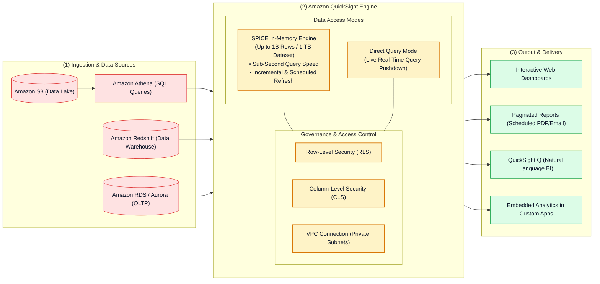
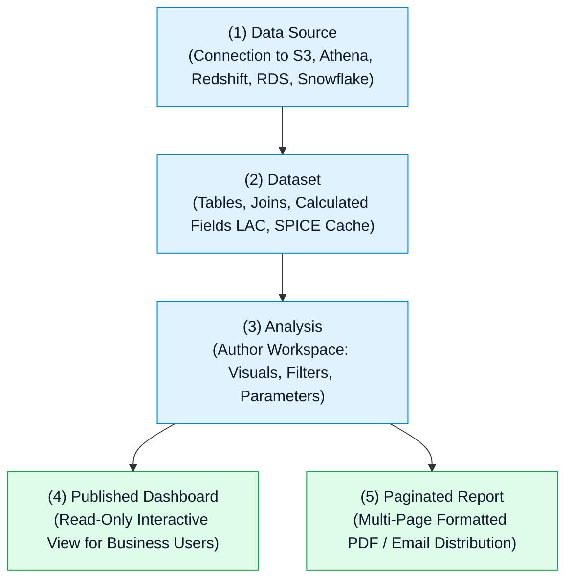

# 📊 Amazon QuickSight Hub (Cloud-Native Business Intelligence)

- **Category**: Analytics / Cloud Business Intelligence & Interactive Reporting
- **Language / ဘာသာစကား**: [English (Original)](/en/02-services/analytics-streaming/quicksight/quicksight) | **မြန်မာဘာသာ (Burmese)**
- **Primary Use Case**: Serverless business intelligence၊ sub-second interactive dashboards၊ SPICE in-memory calculation engine၊ ML-powered anomaly detection၊ paginated executive reports များနှင့် embedded analytics များ လုပ်ဆောင်ခြင်း။
- **Slide Reference**: `[AWSCertifiedDataEngineerSlides.pdf](/docs/AWSCertifiedDataEngineerSlides.pdf)` မှ Pages 479–498
- **Hub Links**: `[[mm/index]]` | `[[service-catalog]]` | `[[domain-3-data-operations-and-support]]` | `[[athena]]` | `[[redshift]]`

---

## 1. High-Level Summary

**Amazon QuickSight** သည် တစ်ပြိုင်နက်တည်း အသုံးပြုနေသော user ထောင်ပေါင်းများစွာထံသို့ လျင်မြန်ပြီး အပြန်အလှန်အသုံးပြုနိုင်သော (interactive) dashboard များ၊ ad-hoc data analysis၊ paginated PDF/CSV report များနှင့် machine learning insights များကို ပေးပို့နိုင်ရန် ဒီဇိုင်းထုတ်ထားသည့် cloud-native, serverless Business Intelligence (BI) service တစ်ခု ဖြစ်သည်။

Amazon QuickSight သည် server provisioning ပြုလုပ်ရခြင်း၊ licensing lock-in များ ဖြစ်ပေါ်ခြင်းနှင့် ရှုပ်ထွေးသော desktop client စီမံခန့်ခွဲမှုများကို ဖယ်ရှားပေးသည်။ ၎င်းသည် AWS data store များ (Amazon Athena၊ Amazon Redshift၊ Amazon S3၊ Amazon RDS၊ Amazon Aurora၊ Amazon OpenSearch) အပြင် third-party database များနှင့် SaaS platform များနှင့်လည်း ချောမွေ့စွာ ချိတ်ဆက်နိုင်သည်။

---

## 2. Amazon QuickSight Editions & User Roles

| Edition / Dimension | Standard Edition | Enterprise Edition (Recommended) |
| :--- | :--- | :--- |
| **SPICE Capacity per Dataset** | **25 Million rows** (သို့မဟုတ် 25 GB) အထိ။ | Dataset တစ်ခုလျှင် **1 Billion rows** (သို့မဟုတ် 1 TB) အထိ။ |
| **Security & Governance** | Basic IAM authentication၊ IAM dataset permissions။ | **Row-Level Security (RLS)**၊ **Column-Level Security (CLS)**၊ IAM Identity Center (SSO)၊ Private VPC connections နှင့် HIPAA/SOC compliance။ |
| **Advanced Capabilities** | အခြေခံ interactive dashboard များ။ | **Paginated Reporting**၊ **QuickSight Q (GenAI)**၊ **ML Insights** နှင့် ၁ နာရီခြား scheduled/incremental SPICE refresh များ။ |
| **User Role Types** | **Author** (Analysis/dashboard များ ဖန်တီးသူ)၊ **Admin** (SPICE/user များကို စီမံခန့်ခွဲသူ)။ | **Reader** (Pay-per-session ဖြင့် ကြည့်ရှုသူ)၊ **Author**၊ **Admin** နှင့် **Reader Capacity Pricing**။ |

---

## 3. The Core QuickSight Asset Hierarchy

1. **Data Source**: Connection credential များ၊ VPC endpoint configuration၊ database hostname များနှင့် SSL setting များကို သိမ်းဆည်းပေးသည်။
2. **Dataset**: Data source တစ်ခု သို့မဟုတ် တစ်ခုထက်ပိုသော source များမှ data များကို ပြင်ဆင်ပြီး model ပြုလုပ်ပေးသည်၊ field data type များကို သတ်မှတ်သည်၊ table join များကို တည်ဆောက်သည်၊ Calculated Fields (Level of Aware Calculations) များကို အသုံးပြုဆောင်ရွက်စေပြီး **SPICE** နှင့် **Direct Query** ကြား ရွေးချယ်ပေးသည်။
3. **Analysis**: BI engineer များမှ chart များ၊ pivot table များ၊ map များနှင့် KPI များကို တည်ဆောက်နိုင်သည့် interactive authoring canvas ဖြစ်သည်။
4. **Dashboard**: Reader များနှင့် မျှဝေရန် သို့မဟုတ် application များအတွင်း ထည့်သွင်း (embed) ရန်အတွက် analysis တစ်ခုကို လုံခြုံစွာ publish လုပ်ထားသော read-only release ဖြစ်သည်။

---

## 4. Modular QuickSight Deep-Dive Topics

**AWS Certified Data Engineer - Associate (DEA-C01)** စာမေးပွဲအတွက် Amazon QuickSight ကို ကျွမ်းကျင်စေရန်၊ အောက်ဖော်ပြပါ modular note များကို လေ့လာပါ:

1. `[[quicksight-spice-engine]]` — **SPICE In-Memory Calculation Engine, Direct Query vs. SPICE, Incremental Refresh & Cost Offloading**
2. `[[quicksight-data-preparation-and-modeling]]` — **Data Sources, Multi-Table Joins, Level of Aware Calculations (LAC-A / LAC-M), Parameters & Cascading Filters**
3. `[[quicksight-security-rls-and-governance]]` — **Row-Level Security (RLS), Column-Level Security (CLS), VPC Connections, and IAM Identity Center (SSO)**
4. `[[quicksight-reporting-ml-and-embedding]]` — **Paginated Reports, ML Insights Anomaly Detection, QuickSight Q (GenAI) & Embedded Analytics**
5. `[[quicksight-troubleshooting-and-patterns]]` — **SPICE Ingestion Errors, Athena/S3 Permissions, VPC Timeouts & BI Service Decision Matrix**

---

## 5. DEA-C01 Exam Essentials

> [!IMPORTANT]
> **Amazon QuickSight အတွက် အဓိက စာမေးပွဲ စည်းမျဉ်းများ (Key Exam Rules)**:
>
> - **Sub-Second Dashboard Performance on Massive Datasets**: ကြီးမားသော dataset များတွင် dashboard performance ကို စက္ကန့်ပိုင်းအတွင်း (sub-second) ရရှိစေရန် Direct Query ကို အသုံးပြုမည့်အစား data ကို **SPICE** (Superfast, Parallel, In-memory Calculation Engine) ထဲသို့ အမြဲတမ်း import လုပ်ပါ။
> - **Cost Optimization for Athena Queries**: QuickSight တွင် Direct Query ကို အသုံးပြုပြီး ကြီးမားသော S3 data lake များကို visualize လုပ်ခြင်းသည် visual refresh ပြုလုပ်တိုင်း scan ဖတ်သည့် TB တစ်ခုလျှင် \$5 ကျသင့်စေသည်။ Athena dataset ကို **SPICE** ထဲသို့ import လုပ်ခြင်းသည် data ကို တစ်ကြိမ်သာ scan ဖတ်ပြီး user dashboard refresh သန်းပေါင်းများစွာကို **Athena query cost ထပ်မံကုန်ကျခြင်း လုံးဝမရှိဘဲ (zero additional cost)** ဝန်ဆောင်မှုပေးနိုင်သည်။
> - **Multi-Tenant Security**: ဒေသဆိုင်ရာ မန်နေဂျာများ (regional managers) အနေဖြင့် မိမိတို့၏ သက်ဆိုင်ရာ နယ်မြေဒေတာကိုသာ မြင်တွေ့နိုင်စေရန် dashboard data ကို ကန့်သတ်လိုပါက permissions dataset ဖြင့် **User-Based Row-Level Security (RLS)** ကို configure လုပ်ပါ။
> - **Private Database Ingestion**: Public internet access မရှိသော private VPC subnet အတွင်းရှိ Amazon RDS သို့မဟုတ် Redshift cluster သို့ QuickSight ကို ချိတ်ဆက်ရန် **Amazon QuickSight VPC Connection** ကို configure လုပ်ပါ။

---

## 📌 Related Notes
- `[[quicksight-spice-engine]]` — SPICE Capacity, Incremental Refresh & Cost Offload
- `[[quicksight-security-rls-and-governance]]` — Row-Level & Column-Level Security
- `[[athena]]` — Serverless SQL Data Lake Engine
- `[[redshift]]` — Enterprise Data Warehouse Storage
- `[[domain-3-data-operations-and-support]]` — Governance & Operational Excellence
