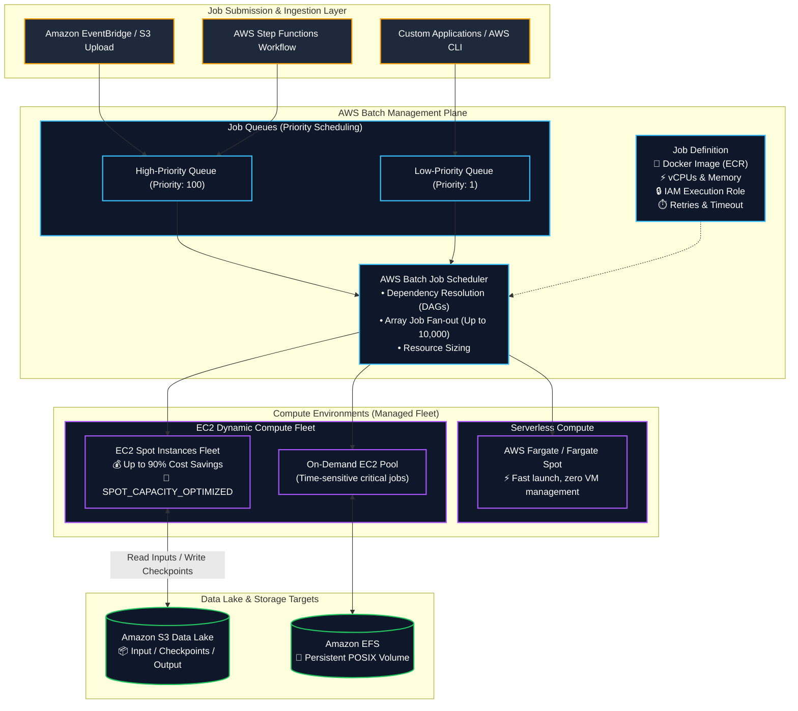
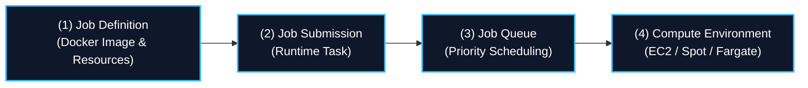
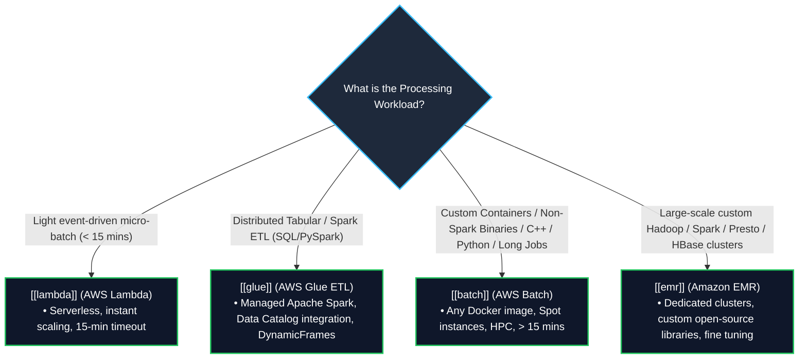

# 📦 AWS Batch (Managed Containerized Batch Computing & HPC Workloads) (စီမံခန့်ခွဲပေးထားသော ကွန်တိန်နာ အသုတ်လိုက် တွက်ချက်ခြင်း)

- **Category**: Compute (Containerized Batch Processing & High-Performance Computing)
- **Language / ဘာသာစကား**: [English Version](file:///home/monetine/Workspace/Wathon/aws-dea-c01/content/en/02-services/compute-containers/batch.md) | **မြန်မာဘာသာ (Burmese)**
- **အဓိက အသုံးပြုမှု**: အချိန်ကြာမြင့်သော (> 15 min) batch computing jobs များ၊ Spark မဟုတ်သော custom data transformations များ၊ scientific simulations၊ ML data preprocessing များနှင့် Dockerized image processing များကို EC2, Spot Instances, သို့မဟုတ် AWS Fargate ပေါ်တွင် မောင်းနှင်ခြင်း။
- **Slide Reference**: Pages 311–312 in `[[AWSCertifiedDataEngineerSlides.pdf]]`
- **Hub Links**: `[[mm/index]]` | `[[en/index]]` | `[[lambda]]` | `[[glue]]` | `[[emr]]` | `[[ecr-ecs-eks]]` | `[[step-functions]]`

---

## ၁။ အကျဉ်းချုပ် (High-Level Summary)

**AWS Batch** သည် Data Engineers၊ Data Scientists များနှင့် Developers များအား ရာထောင်ချီသော Batch နှင့် High-Performance Computing (HPC) လုပ်ငန်းများကို AWS ပေါ်တွင် လွယ်ကူစွာ မောင်းနှင်နိုင်စေရန် ကူညီပေးသည့် Fully Managed Batch Computing ဝန်ဆောင်မှု ဖြစ်သည်။ AWS Batch သည် တင်သွင်းလာသော Job များ၏ လိုအပ်ချက် (CPU၊ Memory သို့မဟုတ် GPU) အပေါ် မူတည်၍ Compute Resources များကို အလိုအလျောက် Dynamic Provisioning ပြုလုပ်ပေးသည်။

Data Engineering စနစ်များတွင် AWS Batch သည် အောက်ပါ အခြေအနေများတွင် မရှိမဖြစ် လိုအပ်သည်-
1. **Serverless Limits ကျော်လွန်ခြင်း**: Task များသည် **၁၅ မိနစ် AWS Lambda Timeout** ထက် ပိုမိုကြာမြင့်ခြင်း။
2. **Spark မဟုတ်သော Workloads များ**: Custom Compiled C/C++ Binaries၊ Python Scripts၊ R Statistical Models သို့မဟုတ် **Apache Spark / AWS Glue တွင် မ run နိုင်သော** Third-Party Libraries များကို Docker Container ဖြင့် run ရခြင်း။
3. **Array Jobs (အပြိုင် မောင်းနှင်မှုများ)**: တူညီသော Task ပေါင်း ထောင်သောင်းချီကို Parameter အပြောင်းအလဲဖြင့် တစ်ပြိုင်နက် မောင်းနှင်ခြင်း (Parameter Sweeps / Sharded Data Processing)။
4. **Spot Instances ဖြင့် ကုန်ကျစရိတ် ချွေတာခြင်း**: **EC2 Spot Instances** များကို အသုံးပြု၍ ပုံမှန်ထက် **၉၀% အထိ ကုန်ကျစရိတ် လျှော့ချနိုင်ခြင်း**။

---

## ၂။ အခြေခံ အစိတ်အပိုင်း ၄ ရပ် (Core Architecture Components)

1. **Job Definitions**: မည်သို့ run မည်ကို သတ်မှတ်ထားသော Blueprint ဖြစ်သည်။ `[[ecr-ecs-eks]]` (Amazon ECR) မှ Docker Image၊ လိုအပ်သော vCPUs/Memory၊ IAM Job Role များနှင့် Retry Strategies များကို သတ်မှတ်သည်။
2. **Job Queues**: တင်သွင်းလာသော Job များကို Compute Capacity အဆင်သင့်ဖြစ်သည်အထိ စောင့်ဆိုင်းပေးသည့် တန်းစီစနစ် ဖြစ်သည်။ ဦးစားပေးအဆင့် (Priority) သတ်မှတ်နိုင်သည်။
3. **Compute Environments**: Job များကို အမှန်တကယ် run မည့် Compute Fleet ဖြစ်သည်။ **Managed Compute Environment** တွင် `Min vCPUs = 0` ထားရှိပါက Queue ထဲတွင် Job မရှိချိန်တွင် အလိုအလျောက် သုညအထိ Scale Down သဖြင့် ကုန်ကျစရိတ် မရှိပါ။
   - **`SPOT_CAPACITY_OPTIMIZED`**: Spot Capacity အများဆုံးရှိသော Pool မှ ရွေးချယ်ပေးသဖြင့် Spot Interruption ကို သိသာစွာ လျှော့ချပေးသည်။

---

## ၃။ Master Decision Matrix: Batch vs. Glue vs. Lambda vs. EMR

### Complete Comparative Matrix

| Dimension | AWS Batch | AWS Glue ETL | AWS Lambda | Amazon EMR |
| :--- | :--- | :--- | :--- | :--- |
| **Execution Framework** | **Docker Containers (မည်သည့်ဘာသာစကား/Binary မဆို)** | **Apache Spark / Python Shell / Ray** | **Function Handlers (Serverless snippets)** | **Hadoop / Spark / Presto / Flink Ecosystem** |
| **Primary Workload** | Non-Spark batch jobs, custom C++/R binaries, HPC, Video processing | Relational & tabular S3 Data Lake ETL to Parquet | Micro-batching, real-time file validation, triggers | Petabyte-scale big data analytics, custom open-source stacks |
| **Max Execution Time** | **Unlimited** (နာရီမှ ရက်ပေါင်းများစွာ) | **Unlimited** (Default 48 hours timeout) | ⏱️ **15 Minutes (900s)** | **Unlimited** (Dedicated clusters) |
| **Infrastructure Model** | Managed EC2 / Spot / Fargate | Serverless DPUs (Data Processing Units) | Serverless | EC2 Clusters / EMR Serverless / EMR on EKS |
| **Spot Cost Savings** | ✅ **Native Spot integration** (up to 90% off) | ⚠️ Flex execution tier (35% off) | ❌ Standard duration pricing | ✅ **Spot Task nodes** (up to 90% off) |

---

## ၄။ DEA-C01 စာမေးပွဲ အဓိက အချက်အလက်များနှင့် ထောင်ချောက်များ (Exam Tips & Traps)

> [!IMPORTANT]
> **Key Exam Trigger Keywords**:
> - **"Run containerized batch processing jobs exceeding 15 minutes with specialized dependencies (C++, Python, R, custom binaries)"** $\rightarrow$ **AWS Batch**.
> - **"Massive parallel processing of thousands of independent parametric sub-tasks"** $\rightarrow$ **AWS Batch Array Jobs (`AWS_BATCH_JOB_ARRAY_INDEX`)**.
> - **"Fault-tolerant, cost-optimized batch processing with maximum discount"** $\rightarrow$ **AWS Batch with EC2 Spot Instances (`SPOT_CAPACITY_OPTIMIZED`)**.

> [!WARNING]
> **Exam Traps (သတိထားရမည့် အချက်များ)**:
> 1. **Batch vs. Glue Trap**: အကယ်၍ ပြဿနာသည် Apache Spark (PySpark) ဖြင့် S3 CSV မှ Parquet သို့ ပြောင်းလဲခြင်းဖြစ်ပါက **AWS Glue** ကို ရွေးပါ (AWS Batch မဟုတ်ပါ)။
> 2. **Spot Checkpointing**: Spot Instances များ အချိန်မရွေး ပြန်လည်သိမ်းဆည်းခံရနိုင်သဖြင့် Batch Task များသည် ကြားဖြတ်အခြေအနေ (State Checkpoints) များကို **Amazon S3** သို့ မကြာခဏ ရေးသားထားရမည်။

---

## 📌 ဆက်စပ် မှတ်စုများ (Related Notes)

- `[[lambda]]` — AWS Lambda (၁၅ မိနစ်အောက် Serverless Functions)
- `[[glue]]` — AWS Glue (Serverless Spark ETL)
- `[[emr]]` — Amazon EMR (Petabyte-scale Big Data)
- `[[ecr-ecs-eks]]` — Amazon ECR Registry နှင့် ECS/EKS
- `[[step-functions]]` — Step Functions ဖြင့် AWS Batch Pipelines စီမံခန့်ခွဲခြင်း
