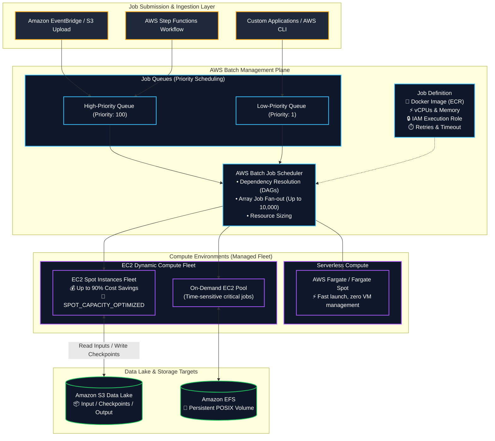
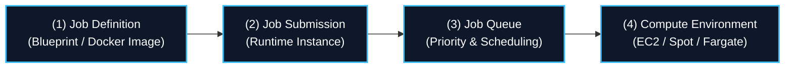
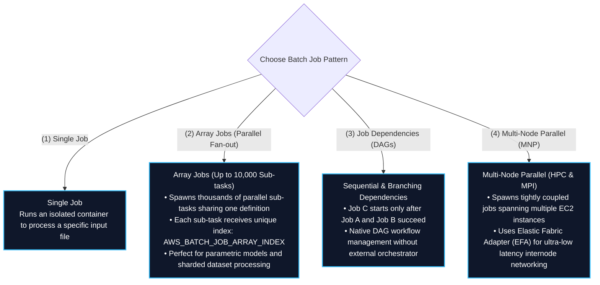
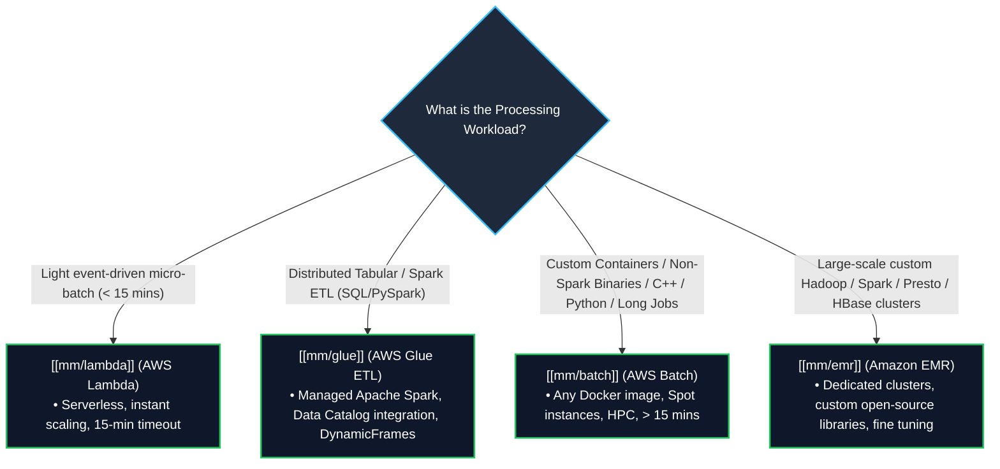
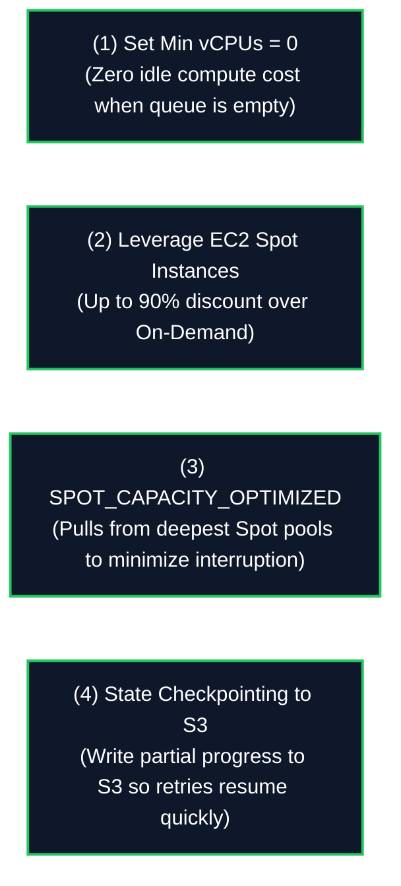

# 📦 AWS Batch (Managed Containerized Batch Computing & HPC Workloads)

- **Category**: Compute (Containerized Batch Processing & High-Performance Computing)
- **Language / ဘာသာစကား**: [English (Original)](file:///home/monetine/Workspace/Wathon/aws-dea-c01/content/en/02-services/compute-containers/batch.md) | **မြန်မာဘာသာ (Burmese)**
- **Primary Use Case**: အချိန်ကြာမြင့်စွာ run ရသော (> 15 min) batch computing job များ၊ Spark မဟုတ်သော data transformation များ၊ scientific simulation များ၊ ML data preprocessing နှင့် Dockerized image processing များကို managed EC2, Spot Instances, သို့မဟုတ် AWS Fargate တွင် run ရန်။
- **Slide Reference**: `[[AWSCertifiedDataEngineerSlides.pdf]]` မှ Pages 311–312
- **Hub Links**: [[mm/index]] | [[mm/service-catalog]] | [[mm/domain-1-ingestion-and-processing]] | [[mm/lambda]] | [[mm/glue]] | [[mm/emr]] | [[mm/ecr-ecs-eks]] | [[mm/step-functions]]

---

## 1. High-Level Summary

**AWS Batch** သည် data engineer များ၊ scientist များနှင့် developer များအား AWS ပေါ်တွင် သောင်းနှင့်ချီသော batch နှင့် High-Performance Computing (HPC) job များကို run နိုင်စေသည့် fully managed batch computing service တစ်ခုဖြစ်ပါသည်။ AWS Batch သည် submit လုပ်ထားသော batch job များ၏ အရေအတွက်နှင့် သီးခြား resource လိုအပ်ချက်များအပေါ် မူတည်၍ အကောင်းဆုံး အရေအတွက်နှင့် အမျိုးအစားရှိသော compute resource များ (ဥပမာ CPU, memory-optimized, သို့မဟုတ် GPU instance များ) ကို အလိုအလျောက် (dynamically) ဖန်တီးပေးပါသည်။

Data engineering architecture များတွင်၊ AWS Batch သည် အောက်ပါ အရေးကြီးသော လိုအပ်ချက်များကို ဖြည့်ဆည်းပေးပါသည်:
1. **Jobs Exceed Serverless Limits**: Task များသည် တင်းကြပ်သော **15-minute AWS Lambda timeout** ထက်ပို၍ အချိန်ကြာမြင့်ခြင်း။
2. **Non-Spark Workloads**: Task များသည် custom compiled binary များ၊ C/C++, Python script များ၊ R statistical model များ၊ သို့မဟုတ် **Apache Spark / AWS Glue တွင် native အနေဖြင့် run ၍မရသော** proprietary third-party library များကို အသုံးပြုထားခြင်း။
3. **Massive Parallelism (Array Jobs)**: တူညီသော sub-task ထောင်ပေါင်းများစွာကို တပြိုင်နက်တည်း (in parallel) လုပ်ဆောင်၍ parameter sweep များ၊ Monte Carlo simulation များ၊ သို့မဟုတ် bulk data formatting များကို run ခြင်း။
4. **Extreme Cost Optimization**: automated capacity bidding နှင့် allocation strategy များနှင့်အတူ **EC2 Spot Instances** ကို အသုံးပြုခြင်းဖြင့် **90% အထိ cost savings** ကို ရရှိနိုင်ခြင်း။

---

## 2. Core Architecture & Building Blocks

AWS Batch သည် အချင်းချင်းချိတ်ဆက်ထားသော abstraction ၄ ခုဖြင့် အလုပ်လုပ်ပါသည်:

### 1. Job Definitions
Job များကို မည်သို့ execute လုပ်မည်ကို သတ်မှတ်ထားသော blueprint တစ်ခုဖြစ်သည်:
- **Container Properties**: [[mm/ecr-ecs-eks]] (Amazon ECR) တွင် host လုပ်ထားသော Docker image URI, လိုအပ်သော vCPUs (ဥပမာ 4 vCPU), memory allocation (ဥပမာ 16 GB), command parameter များနှင့် environment variable များ။
- **IAM Roles**:
  - **Job Role**: Container application code ကို ပေးထားသော permission များ (ဥပမာ `s3:GetObject`, `s3:PutObject`, `dynamodb:UpdateItem`)။
  - **Execution Role**: Container agent မှ ECR မှ image များကို ဆွဲယူရန် (pull) နှင့် Amazon CloudWatch သို့ log များကို ပို့ရန် အသုံးပြုပါသည်။
- **Retry Strategy & Timeouts**: ကျရှုံးခဲ့ပါက ပြန်လည်ကြိုးစားမည့် အကြိမ်အရေအတွက် (ဥပမာ 3 retries) နှင့် အလုပ်လုပ်မည့် အချိန်ကန့်သတ်ချက် (execution timeout limit)။
- **Storage Mounts**: Local host storage သို့မဟုတ် အမြဲတမ်းသိမ်းဆည်းထားနိုင်သော shared **Amazon EFS** volume များ။

### 2. Job Queues
- Compute capacity အဆင်သင့်မဖြစ်မချင်း submit လုပ်ထားသော job များကို buffer အဖြစ် သိမ်းဆည်းပေးပါသည်။
- **Priority-Based Scheduling**: ပိုမြင့်သော priority integer ရှိသည့် queue များကို အရင်ဆုံးတွက်ချက်ပြီး၊ ပိုနိမ့်သော priority queue များထက် အရင် compute resource များကို ခွဲဝေပေးပါသည်။
- Job Queue တစ်ခုတည်းမှ job များကို Compute Environment အများအပြားသို့ ခွဲဝေပေးပို့နိုင်ပါသည် (ဥပမာ - အဓိက Spot pool ကိုသုံးပြီး မရပါက On-Demand သို့ ပြောင်းလဲအသုံးပြုခြင်း)။

### 3. Compute Environments
Batch job များကို အလုပ်လုပ်ရန် အသုံးပြုမည့် compute resource အစုအဝေးဖြစ်သည်:

| Dimension | Managed Compute Environment | Unmanaged Compute Environment |
| :--- | :--- | :--- |
| **Infrastructure Management** | **Fully Managed by AWS**: Queue ၏ အတိမ်အနက် (depth) အပေါ် မူတည်၍ instance များကို အလိုအလျောက် provision လုပ်ခြင်း၊ scale လုပ်ခြင်း၊ update လုပ်ခြင်း နှင့် terminate လုပ်ခြင်းများကို ဆောင်ရွက်ပေးသည်။ | **Customer Managed**: User သည် custom EC2 AMIs နှင့် container daemon များကို ကိုယ်တိုင် provision လုပ်ပြီး configure လုပ်ရသည်။ |
| **Compute Types Supported** | **EC2 On-Demand**, **EC2 Spot**, **AWS Fargate**, **Fargate Spot** | Custom Amazon EC2 instances |
| **Instance Type Selection** | `optimal` (AWS မှ အကောင်းဆုံး cost/performance ရသော instance များကို ရွေးချယ်ပေးသည်) သို့မဟုတ် သတ်မှတ်ထားသော instance family များ (`c6i`, `r6i`, `g5`, `p4d` GPUs)။ | ကြိုတင်လွှင့်တင်ထားသော (Pre-launched) instance များ |
| **Min / Desired / Max vCPUs** | ချိန်ညှိနိုင်သော (Configurable) scaling ဘောင်များ (ဥပမာ Min: 0, Max: 256 vCPUs). Idle ဖြစ်နေချိန်တွင် compute cost မရှိစေရန် **Min vCPUs = 0** ဟု သတ်မှတ်ပါ! | Manual scaling |

#### Allocation Strategies for EC2 Environments:
- **`BEST_FIT`**: Job ၏ လိုအပ်ချက်များနှင့် အသင့်တော်ဆုံးဖြစ်ပြီး vCPU တစ်ခုအတွက် ဈေးအသက်သာဆုံးဖြစ်မည့် instance အမျိုးအစားများကို ရွေးချယ်ပေးသည်။
- **`BEST_FIT_PROGRESSIVE`**: ပထမဦးစားပေး ရွေးချယ်ထားသော instance အမျိုးအစားများ မရရှိနိုင်ပါက နောက်ထပ် instance အမျိုးအစားများကို ရွေးချယ်ပေးသည်။
- **`SPOT_CAPACITY_OPTIMIZED`** (Spot အတွက် အကြံပြုသည်): Spot အသုံးပြုနိုင်မှု အများဆုံးရှိသော (deepest Spot capacity pools) နေရာများမှ Spot Instance များကို ရွေးချယ်ပေးခြင်းဖြင့်၊ Spot interruption နှုန်းကို သိသိသာသာ လျှော့ချပေးသည်။

---

## 3. Job Execution Patterns & Workflows

---

## 4. Master Decision Matrix: AWS Batch vs. AWS Glue vs. AWS Lambda vs. Amazon EMR

AWS batch compute engine များအကြား ရွေးချယ်ခြင်းသည် DEA-C01 စာမေးပွဲတွင် အများဆုံး မေးလေ့ရှိသော အကြောင်းအရာများထဲမှ တစ်ခုဖြစ်သည်:

### Complete Comparative Matrix (Slide 312 Exam Focus)

| Dimension | AWS Batch | AWS Glue ETL | AWS Lambda | Amazon EMR |
| :--- | :--- | :--- | :--- | :--- |
| **Execution Framework** | **Docker Containers (Any language/binary)** | **Apache Spark / Python Shell / Ray** | **Function Handlers (Serverless snippets)** | **Hadoop / Spark / Presto / Flink Ecosystem** |
| **Primary Workload** | Spark မဟုတ်သော batch job များ, custom C++/R/Python binary များ, HPC simulation များ, video rendering | Relational & tabular data integration, S3 Data Lake ETL မှ Parquet သို့ | Micro-batching, အချိန်နှင့်တပြေးညီ (real-time) file validation, event trigger များ | Petabyte-scale big data analytics, custom distributed framework များ |
| **Max Execution Time** | **Unlimited** (နာရီများမှ ရက်များအထိ) | **Unlimited** (Default အားဖြင့် 48 နာရီ timeout) | ⏱️ **15 Minutes (900s)** | **Unlimited** (အချိန်ကြာမြင့်စွာ run ရသော သို့မဟုတ် ခဏတာ (ephemeral) cluster များ) |
| **Infrastructure Model** | Managed EC2 / Spot / Fargate | Serverless DPUs (Data Processing Units) | Serverless | EC2 Clusters / EMR Serverless / EMR on EKS |
| **Spot Cost Savings** | ✅ **Native Spot integration** (90% အထိ လျှော့စျေး) | ⚠️ Flex execution tier (35% လျှော့စျေး) | ❌ Standard duration pricing သာ | ✅ **Spot Task nodes** (90% အထိ လျှော့စျေး) |
| **AWS Catalog Integration**| Manual (SDK / Athena မှတဆင့်) | ✅ **Native Glue Data Catalog integration** | Manual (SDK မှတဆင့်) | ✅ Native Glue Data Catalog အထောက်အပံ့ |

---

## 5. Cost Optimization Strategies for Batch Workloads

1. **Scale-to-Zero (`Min vCPUs = 0`)**: Queue ထဲတွင် job များ မရှိချိန်၌ instance များကို အလိုအလျောက် ပိတ်ပစ်နိုင်ရန်အတွက် managed compute environment များတွင် `Min vCPUs` ကို 0 အဖြစ် သတ်မှတ်ထားရန် သေချာစေပါ။
2. **Spot Capacity Optimization**: လုပ်ငန်းလုပ်ဆောင်နေစဉ်အတွင်း instance terminate ဖြစ်ပွားနိုင်ခြေကို သိသိသာသာ လျှော့ချရန်အတွက် `SPOT_CAPACITY_OPTIMIZED` ကို allocation strategy အဖြစ် အမြဲတမ်း configure လုပ်ပါ။
3. **Automated Retries & Checkpointing**: Spot instance များကို ၂ မိနစ် ကြိုတင်အကြောင်းကြားချက်ဖြင့် ပြန်လည်သိမ်းယူနိုင်သောကြောင့်၊ checkpoint file များကို **Amazon S3** ထဲသို့ အချိန်အပိုင်းအခြားအလိုက် သိမ်းဆည်းနိုင်ရန် batch processing algorithm များကို ဒီဇိုင်းဆွဲပါ။ အကယ်၍ job တစ်ခုသည် terminate ဖြစ်သွားပါက၊ AWS Batch သည် အဆိုပါ job ကို အသစ်သော instance တစ်ခုပေါ်တွင် အလိုအလျောက် ပြန်လည်လုပ်ဆောင်ပေးပါမည် (retries)။

---

## 6. High-Yield DEA-C01 Exam Tips & Traps

> [!IMPORTANT]
> **Key Exam Trigger Keywords**:
> - **"Run containerized batch processing jobs exceeding 15 minutes with specialized dependencies (C++, Python, R, custom binaries)"** $\rightarrow$ **AWS Batch**.
> - **"Massive parallel processing of thousands of independent parametric sub-tasks"** $\rightarrow$ **AWS Batch Array Jobs (`AWS_BATCH_JOB_ARRAY_INDEX`)**.
> - **"Fault-tolerant, cost-optimized batch processing with maximum discount"** $\rightarrow$ **AWS Batch with EC2 Spot Instances (`SPOT_CAPACITY_OPTIMIZED`)**.
> - **"Tightly coupled High-Performance Computing (HPC) across distributed cluster nodes"** $\rightarrow$ **AWS Batch Multi-Node Parallel (MNP) with Elastic Fabric Adapter (EFA)**.

> [!WARNING]
> **Exam Traps & Failure Modes**:
> 1. **Batch vs. Glue Selection Trap**:
>    - အကယ်၍ workload သည် S3 CSV file များကို Parquet အဖြစ်ပြောင်းလဲရန် **Apache Spark (PySpark/Scala)** ကို အသုံးပြုထားသော ပုံမှန် tabular data transformation ဖြစ်ပါက၊ AWS Batch ကိုမရွေးဘဲ **AWS Glue** ကို ရွေးချယ်ပါ။ AWS Batch သည် **arbitrary non-Spark Docker containerized workload များအတွက်** ရည်ရွယ်ပါသည်။
> 2. **Batch vs. Lambda Timeout Trap**:
>    - အကယ်၍ မေးခွန်းတစ်ခုတွင် လက်ရှိ AWS Lambda ပေါ်၌ run နေသော ETL script တစ်ခုသည် **15-minute timeout** ကြောင့် fail ဖြစ်နေသည်ဟု ဖော်ပြထားပါက၊ ဖြေရှင်းချက်မှာ **ထို script ကို Docker container တစ်ခုအဖြစ် package လုပ်ပြီး AWS Batch ပေါ်တွင် run ရန်** (သို့မဟုတ် AWS Glue) ဖြစ်သည်။
> 3. **Spot Interruption Handling**:
>    - မဖြစ်မနေ ပြီးမြောက်ရမည့်၊ အချိန်အလွန်အရေးကြီးသော၊ နှောင့်နှေးမှုများကို လက်ခံနိုင်ခြင်းမရှိသည့် batch job များအတွက်ဆိုလျှင် Job Queue ကို Spot အစား **On-Demand Compute Environment** ဖြင့် configure လုပ်ပါ။

---

## 📌 Related Notes

- [[mm/lambda]] — ဆာဗာမဲ့ micro-batch processing အတွက် AWS Lambda (< 15 mins)
- [[mm/glue]] — Distributed serverless Apache Spark ETL အတွက် AWS Glue
- [[mm/emr]] — Petabyte-scale distributed big data cluster များအတွက် Amazon EMR
- [[mm/ecr-ecs-eks]] — Amazon ECR container registry နှင့် ECS/EKS orchestration
- [[mm/step-functions]] — AWS Batch ၏ အဆင့်များစွာပါဝင်သော data pipeline များကို စီမံခန့်ခွဲရန် (Orchestrating)
- [[mm/domain-1-ingestion-and-processing]] — DEA-C01 Domain 1 Study Guide
- [[mm/service-comparisons]] — Master DEA-C01 Service Decision Matrix
