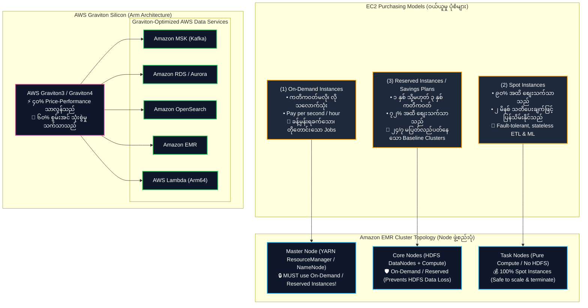
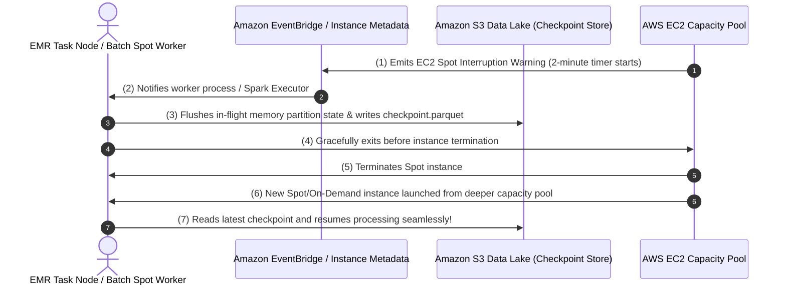
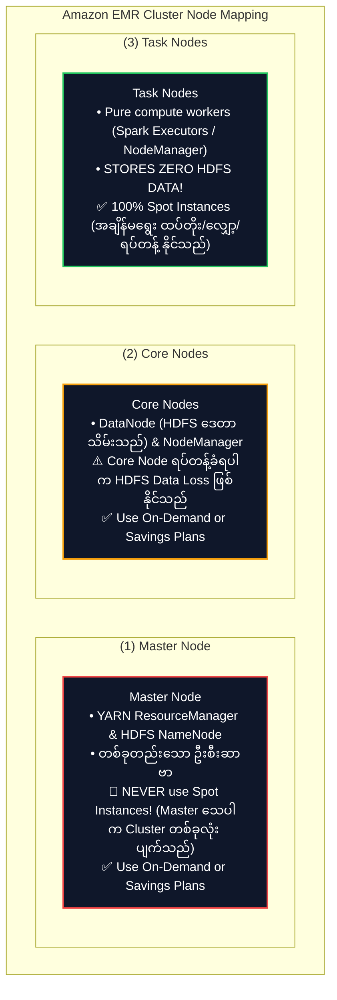
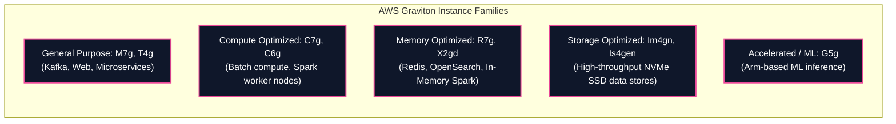

# 🖥️ Amazon EC2 & AWS Graviton in Big Data (Purchasing Models & Arm Architecture) (EC2 ဝယ်ယူမှုပုံစံများနှင့် Graviton ပရိုဆက်ဆာများ)

- **Category**: Compute (Virtual Machine Infrastructure, Spot Pricing & Arm Processors)
- **Language / ဘာသာစကား**: [English Version](file:///home/monetine/Workspace/Wathon/aws-dea-c01/content/en/02-services/compute-containers/ec2-and-graviton.md) | **မြန်မာဘာသာ (Burmese)**
- **အဓိက အသုံးပြုမှု**: Self-hosted Data Platform များအတွက် အခြေခံ Compute အဖြစ် သုံးခြင်း၊ `[[emr]]` Cluster များ၏ Node Topology (Master, Core, Task nodes) ကို ဖွဲ့စည်းခြင်း၊ နှင့် `[[msk-kafka]]`၊ `[[rds-and-aurora]]`၊ `[[opensearch]]`၊ `[[lambda]]` တို့တွင် **AWS Graviton** Arm Processors ဖြင့် Price-Performance အမြင့်ဆုံး ရယူခြင်း။
- **Slide Reference**: Pages 286–288 in `[[AWSCertifiedDataEngineerSlides.pdf]]`
- **Hub Links**: `[[mm/index]]` | `[[en/index]]` | `[[emr]]` | `[[batch]]` | `[[ecr-ecs-eks]]` | `[[lambda]]`

---

## ၁။ အကျဉ်းချုပ် (High-Level Summary)

**Amazon Elastic Compute Cloud (Amazon EC2)** သည် AWS Cloud တွင် စိတ်ကြိုက်ပြောင်းလဲနိုင်သော Compute Capacity ကို ပေးဆောင်သည်။ Data Engineering စနစ်များတွင် EC2 သည် Distributed Big Data Cluster များ (**Amazon EMR**), Managed Database များ (**Amazon RDS/Aurora**), Streaming Brokers များ (**Amazon MSK**) နှင့် Custom Container Fleets များကို မောင်းနှင်ပေးသည့် အဓိက အခြေခံအဆောက်အအုံ ဖြစ်သည်။

**AWS Graviton Processors** သည် AWS မှ သီးသန့် ဒီဇိုင်းထုတ်ထားသော 64-bit Arm Neoverse-based Microprocessors ဖြစ်ပြီး သမားရိုးကျ x86 Processors များနှင့် နှိုင်းယှဉ်ပါက Databases၊ Analytics၊ In-Memory Caching နှင့် Container များတွင် **၄၀% အထိ ပိုမိုကောင်းမွန်သော Price-Performance** ကို ပေးစွမ်းသည်။

---

## ၂။ EC2 Purchasing Options နှိုင်းယှဉ်ချက် (ဝယ်ယူမှု ရွေးချယ်စရာများ)

| Purchasing Option | စျေးသက်သာမှု | Interruption Risk (ရပ်တန့်ခံရနိုင်ခြေ) | အကောင်းဆုံး Data Engineering အသုံးချမှု |
| :--- | :--- | :--- | :--- |
| **On-Demand** | ပုံမှန်စျေးနှုန်း ($0\%$) | **လုံးဝမရှိပါ** (အသုံးပြုသူ မရပ်မချင်း အာမခံသည်) | • Dev/Test စမ်းသပ်မှုများ • အရေးကြီးပြီး မပြတ်တောက်နိုင်သော One-off Jobs • **EMR Master Nodes** |
| **Spot Instances** | **၉၀% အထိ လျှော့စျေး** | ⚠️ **AWS မှ ၂ မိနစ် သတိပေးချက်ဖြင့် ပြန်သိမ်းနိုင်သည်** | • **EMR Task Nodes** (HDFS ဒေတာ မသိမ်းသော Compute Node များ) • **AWS Batch jobs with S3 checkpointing** • Distributed ML Model Training |
| **Compute Savings Plans / EC2 Savings Plans** | **၇၂% အထိ လျှော့စျေး** | **လုံးဝမရှိပါ** (၁ နှစ် သို့မဟုတ် ၃ နှစ် ကတိကဝတ်) | • ၂၄/၇ Production Databases (`[[rds-and-aurora]]`) • အမြဲလည်ပတ်နေသော **EMR Master & Core Nodes** • **Amazon MSK** Kafka Broker Fleets |

---

## ၃။ Spot Instances & Fault-Tolerant Big Data Topologies

### EMR Cluster Node Mapping Strategy (စာမေးပွဲ အဓိက မေးခွန်းပုံစံ)

---

## ၄။ AWS Graviton Processors in Data Engineering (Arm Architecture)

### Graviton Adoption Across AWS Data Services

| Managed Service | Graviton Instance Option | Data Engineering အကျိုးကျေးဇူး |
| :--- | :--- | :--- |
| **Amazon EMR** | `c7g`, `m7g`, `r7g` | Apache Spark၊ Hive နှင့် Presto များတွင် **၃၀% စျေးသက်သာပြီး ၁၅% ပိုမိုမြန်ဆန်သည်**။ |
| **Amazon MSK (Kafka)** | `kafka.m7g.*` | Streaming Ingest တွင် Throughput ပိုမိုမြင့်မားပြီး Latency နည်းပါးသည်။ |
| **Amazon RDS & Aurora** | `db.r7g.*`, `db.m7g.*` | PostgreSQL နှင့် MySQL များတွင် **၂၀% ပိုမိုကောင်းမွန်သော Transaction Throughput** ကို ရရှိသည်။ |
| **Amazon OpenSearch** | `r7g.search.*`, `m7g.search.*`| Indexing Throughput **၃၈% ပိုမိုမြန်ဆန်သည်**။ |
| **AWS Lambda** | **`arm64` Architecture** | x86_64 နှင့် နှိုင်းယှဉ်ပါက Duration ကုန်ကျစရိတ် **၂၀% ပိုမိုသက်သာသည်**။ |

---

## ၅။ DEA-C01 စာမေးပွဲ အဓိက အချက်အလက်များနှင့် ထောင်ချောက်များ (Exam Tips & Traps)

> [!IMPORTANT]
> **Key Exam Trigger Keywords**:
> - **"Cost-optimized compute for fault-tolerant, stateless ETL and ML with checkpointing"** $\rightarrow$ **EC2 Spot Instances**.
> - **"EMR Task nodes compute selection"** $\rightarrow$ **Spot Instances** (Task node များသည် HDFS ဒေတာ မသိမ်းဆည်းပါ).
> - **"EMR Master node compute selection"** $\rightarrow$ **On-Demand သို့မဟုတ် Reserved Instances** (Spot လုံးဝ မသုံးရပါ!).
> - **"Best price-performance for managed data services (EMR, MSK, RDS, OpenSearch, Lambda)"** $\rightarrow$ **AWS Graviton (Arm-based instances with 'g' suffix, e.g. `m7g`, `r7g`, `c7g`)**.

> [!WARNING]
> **Exam Traps (သတိထားရမည့် အချက်များ)**:
> 1. **Spot Instances for EMR Master Nodes Trap**: EMR Master Node တွင် Spot Instances ကို လုံးဝ မရွေးချယ်ရပါ။ Master ပြုတ်ကျပါက Cluster တစ်ခုလုံး ပျက်စီးပြီး လုပ်လက်စ အားလုံး ဆုံးရှုံးသည်။
> 2. **Graviton Binary Compatibility**: Graviton သည် Arm64 ဖြစ်သဖြင့် Python၊ PySpark၊ Java များသည် အဆင်ပြေစွာ Run နိုင်သော်လည်း Custom C/C++ Binaries များကို Docker Container သွင်းမည်ဆိုပါက `linux/arm64` ဖြင့် Compile လုပ်ထားရမည်။

---

## 📌 ဆက်စပ် မှတ်စုများ (Related Notes)

- `[[emr]]` — Amazon EMR Master/Core/Task Node ဖွဲ့စည်းပုံ
- `[[batch]]` — AWS Batch Spot-driven Batch Compute
- `[[lambda]]` — AWS Lambda Arm64 Graviton Architecture
- `[[ecr-ecs-eks]]` — Containers on EC2, Fargate, and EKS
- `[[msk-kafka]]` — Amazon MSK Graviton Broker Deployment
