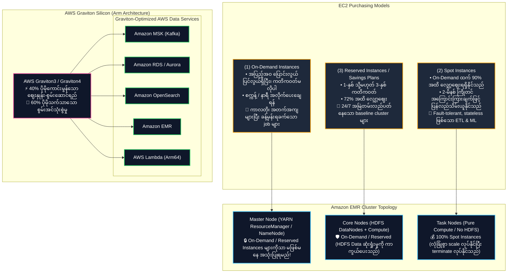
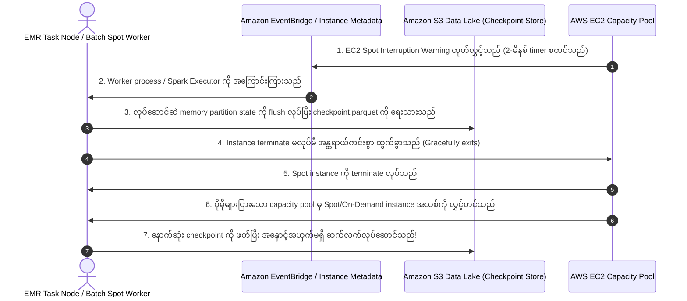
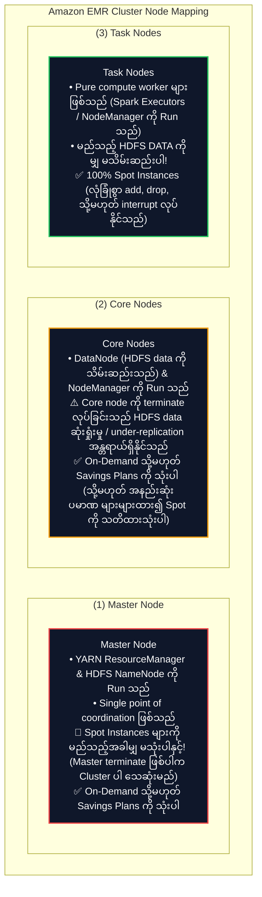
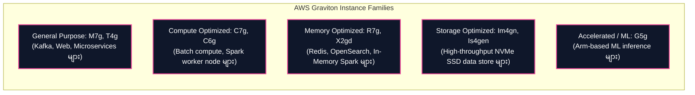

# 🖥️ Amazon EC2 & AWS Graviton in Big Data (Purchasing Models & Arm Architecture)

- **Category**: Compute (Virtual Machine Infrastructure, Spot Pricing & Arm Processors)
- **Language / ဘာသာစကား**: [English (Original)](file:///home/monetine/Workspace/Wathon/aws-dea-c01/content/en/02-services/compute-containers/ec2-and-graviton.md) | **မြန်မာဘာသာ (Burmese)**
- **Primary Use Case**: ကိုယ်ပိုင် hosting လုပ်ထားသော data platform များအတွက် Compute အဓိကအစိတ်အပိုင်း၊ [[emr]] cluster များ (Master, Core, Task nodes) အတွက် အခြေခံ instance ဖွဲ့စည်းပုံ၊ နှင့် [[msk-kafka]], [[rds-and-aurora]], [[opensearch]], နှင့် [[lambda]] တို့တွင် ကိုယ်ပိုင် **AWS Graviton** silicon ကို အသုံးပြု၍ ဈေးနှုန်း-စွမ်းဆောင်ရည် (price-performance) အမြင့်ဆုံးရယူခြင်း။
- **Slide Reference**: `[[AWSCertifiedDataEngineerSlides.pdf]]` မှ စာမျက်နှာ 286–288
- **Hub Links**: [[mm/index]] | [[service-catalog]] | [[domain-1-ingestion-and-processing]] | [[domain-2-data-store-management]] | [[emr]] | [[batch]] | [[ecr-ecs-eks]] | [[lambda]]

---

## 1. High-Level Summary

**Amazon Elastic Compute Cloud (Amazon EC2)** သည် AWS Cloud တွင် အလွယ်တကူ ချဲ့ထွင်နိုင်သော on-demand compute capacity ကို ထောက်ပံ့ပေးသည်။ Data engineering architecture များတွင် EC2 instance များသည် ဖြန့်ကြက်ထားသော big data cluster များ (**Amazon EMR**), managed database များ (**Amazon RDS/Aurora**), streaming broker များ (**Amazon MSK**), နှင့် custom containerized ETL fleet များကို မောင်းနှင်ပေးသည့် အဓိက compute အခြေခံအစိတ်အပိုင်းများ ဖြစ်ကြသည်။

**AWS Graviton Processors** ဆိုသည်မှာ database များ၊ analytics များ၊ memory cache များ၊ နှင့် containerized microservice များတစ်လျှောက် အခြားသော x86 processor များနှင့် နှိုင်းယှဉ်ပါက **ဈေးနှုန်း-စွမ်းဆောင်ရည် (price-performance) ကို 40% အထိ ပိုမိုကောင်းမွန်စေရန်** AWS မှ တီထွင်ဖန်တီးထားသော ကိုယ်ပိုင် 64-bit Arm Neoverse အခြေခံ microprocessor များ ဖြစ်ကြသည်။

**AWS Certified Data Engineer – Associate (DEA-C01)** စာမေးပွဲအတွက် အောက်ပါအချက်များကို သင် သေချာစွာ တတ်ကျွမ်းထားရမည်:
1. **EC2 Purchasing Models**: On-Demand vs. Spot Instances vs. Reserved Instances (RI) / Savings Plans.
2. **Spot Instances for Analytics**: 2-မိနစ် ကြိုတင်အကြောင်းကြားချက်များ (interruption notices) ကို ကျော်လွှားနိုင်ရန်အတွက် **S3 state checkpointing** ဖြင့် အခြေအနေမမှတ်သားသော (stateless)၊ fault-tolerant ဖြစ်သော workload များ (ဥပမာ EMR Task nodes, AWS Batch) အတွက် Spot ကို အသုံးပြုခြင်း။
3. **EMR Cluster Node Architecture**: **Master Nodes** (On-Demand), **Core Nodes** (On-Demand/Reserved), နှင့် **Task Nodes** (Spot) များအကြား EC2 purchasing model များကို တွဲဖက်သတ်မှတ်ခြင်း။
4. **AWS Graviton Instance Families**: AWS analytics နှင့် data service များတစ်လျှောက် Graviton အသုံးပြုထားသော instance အမျိုးအစားများ (`c7g`, `m7g`, `r7g`, `is4gen`) ကို ခွဲခြားသိမြင်ခြင်း။

---

## 2. EC2 Purchasing Options for Data Engineering Workloads

| Purchasing Option | Cost Discount | Interruption Risk | Best Data Engineering Workload |
| :--- | :--- | :--- | :--- |
| **On-Demand** | အခြေခံ ဈေးနှုန်း ($0\%$) | **None** (ရပ်တန့်မခံရမချင်း ရရှိနိုင်ရန် အာမခံသည်) | • Dev/Test ပတ်ဝန်းကျင်များ • အချိန်တို၊ ကြားဖြတ်ရပ်တန့်၍မရသော တစ်ကြိမ်တည်းသော data processing များ • EMR Master node များ |
| **Spot Instances** | **90% အထိ လျှော့ဈေး** | ⚠️ **AWS မှ 2-မိနစ် ကြိုတင်အကြောင်းကြားချက်ဖြင့် ပြန်လည်သိမ်းယူနိုင်သည်** | • **EMR Task Nodes** (Compute သီးသန့်၊ HDFS storage မပါဝင်) • **S3 checkpointing ပါဝင်သော AWS Batch job များ** • ဖြန့်ကြက်ထားသော ML model training နှင့် hyperparameter tuning |
| **Compute Savings Plans / EC2 Instance Savings Plans** | **72% အထိ လျှော့ဈေး** | **None** (1-နှစ် သို့မဟုတ် 3-နှစ် တစ်နာရီသုံးစွဲမှု ကတိကဝတ်) | • 24/7 Production database များ ([[rds-and-aurora]]) • အချိန်ကြာမြင့်စွာ အမြဲတမ်းလည်ပတ်နေသော **EMR Master & Core node များ** • 24/7 **Amazon MSK** Kafka broker fleet များ |

---

## 3. Spot Instances & Fault-Tolerant Big Data Topologies

Spot Instance များဆိုသည်မှာ အလွန်သက်သာသော ဈေးနှုန်းများဖြင့် ရရှိနိုင်သော အသုံးမပြုရသေးသည့် EC2 compute capacity များ ဖြစ်သည်။ သို့သော်လည်း AWS မှ အဆိုပါ capacity ကို ပြန်လည်လိုအပ်လာသောအခါ၊ ထို instance သည် **2-မိနစ် rebalance recommendation / interruption notice (ကြိုတင်အကြောင်းကြားချက်)** ကို ရရှိမည်ဖြစ်သည်။

### EMR Cluster Node Mapping Strategy (Top Exam Focus):

---

## 4. AWS Graviton Processors in Data Engineering

AWS Graviton processor များသည် 7nm/5nm silicon နည်းပညာကို အသုံးပြု၍ AWS မှ ဒီဇိုင်းထုတ်လုပ်ထားသော ကိုယ်ပိုင် 64-bit Arm processor များ ဖြစ်ကြသည်:

### Graviton Adoption Across AWS Managed Data Services

| Managed Service | Graviton Instance Option | Benefits for Data Engineering |
| :--- | :--- | :--- |
| **Amazon EMR** | `c7g`, `m7g`, `r7g` | ဆင်တူသော x86 instance များနှင့် နှိုင်းယှဉ်ပါက Apache Spark, Hive, နှင့် Presto job များအတွက် **30% အထိ ကုန်ကျစရိတ်သက်သာခြင်း** နှင့် **15% ပိုမိုမြင့်မားသော စွမ်းဆောင်ရည်** ကို ရရှိသည်။ |
| **Amazon MSK (Kafka)** | `kafka.m7g.*` | ပမာဏများပြားသော streaming ingest များအတွက် ဒေါ်လာအလိုက် ပိုမိုမြင့်မားသော network throughput ကိုရရှိပြီး tail latency ကို လျှော့ချပေးသည်။ |
| **Amazon RDS & Aurora** | `db.r7g.*`, `db.m7g.*` | ပိုမိုသက်သာသော ကုန်ကျစရိတ်ဖြင့် PostgreSQL နှင့် MySQL workload များအတွက် **20% အထိ ပိုမိုကောင်းမွန်သော transaction throughput** ကို ပေးစွမ်းသည်။ |
| **Amazon OpenSearch** | `r7g.search.*`, `m7g.search.*`| Search cluster များအတွက် **38% အထိ indexing throughput တိုးတက်မှု** နှင့် 20% query latency လျော့ကျမှုတို့ကို ရရှိစေသည်။ |
| **AWS Lambda** | **`arm64` Architecture** | တူညီသော Python/Node/Java function များအတွက် `x86_64` နှင့် နှိုင်းယှဉ်ပါက compute duration မီလီစက္ကန့်တိုင်းတွင် **20% ပိုမိုသက်သာသော ဈေးနှုန်း** ကိုရရှိသည်။ |

---

## 5. High-Yield DEA-C01 Exam Tips & Traps

> [!IMPORTANT]
> **Key Exam Trigger Keywords**:
> - **"Cost-optimized compute for fault-tolerant, stateless ETL and machine learning with checkpointing"** (Checkpointing ပါဝင်သော fault-tolerant, stateless ETL နှင့် machine learning များအတွက် ကုန်ကျစရိတ်သက်သာသော compute) $\rightarrow$ **EC2 Spot Instances**.
> - **"EMR Task nodes compute selection"** (EMR Task node များအတွက် compute ရွေးချယ်မှု) $\rightarrow$ **Spot Instances** (Task node များသည် မည်သည့် HDFS data ကိုမျှ မသိမ်းဆည်းထားဘဲ လုံခြုံစွာ ရပ်တန့် (terminate) နိုင်သည်။)
> - **"EMR Master node compute selection"** (EMR Master node အတွက် compute ရွေးချယ်မှု) $\rightarrow$ **On-Demand or Reserved Instances** (Spot ကို လုံးဝ အသုံးမပြုရပါ!)
> - **"Best price-performance for managed data services (EMR, MSK, RDS, OpenSearch, Lambda)"** (Managed data service များအတွက် အကောင်းဆုံးသော ဈေးနှုန်း-စွမ်းဆောင်ရည်) $\rightarrow$ **AWS Graviton (Arm-based instance types with 'g' suffix, e.g. `m7g`, `r7g`, `c7g`)**.

> [!WARNING]
> **Exam Traps & Failure Modes**:
> 1. **Spot Instances for EMR Master Nodes Trap**:
>    - Amazon EMR cluster ၏ **Master Node** အတွက် Spot Instance များကို မည်သည့်အခါမျှ မရွေးချယ်ပါနှင့်။ အကယ်၍ Master node ပြန်လည်သိမ်းယူခံရပါက၊ cluster တစ်ခုလုံး ကျရှုံးပြီး job အလုပ်လုပ်ဆောင်မှု မှတ်တမ်းများအားလုံး ပျက်စီးဆုံးရှုံးမည်ဖြစ်သည်။
> 2. **Spot Interruption Mitigation**:
>    - Data processing အတွက် Spot instance များကို အသုံးပြုသည့်အခါတိုင်း၊ **Amazon S3 သို့ state checkpointing လုပ်ခြင်း** ကို အမြဲတမ်း ထည့်သွင်းဆောင်ရွက်ပါ။ သို့မှသာ instance ပြန်လည်သိမ်းယူခံရသောအခါ၊ ပြန်လည်လုပ်ဆောင်မည့် (retry) job သည် အစကနေ ပြန်လည်စတင်မည့်အစား နောက်ဆုံး checkpoint မှနေ၍ ဆက်လက်လုပ်ဆောင်နိုင်မည်ဖြစ်သည်။
> 3. **Graviton Binary Compatibility**:
>    - Graviton သည် **Arm64** instruction set ပေါ်တွင် အလုပ်လုပ်သည်။ Python, PySpark, Java, နှင့် Node.js code များသည် မည်သည့်ပြင်ဆင်မှုမှမလိုဘဲ အလုပ်လုပ်နိုင်သော်လည်း၊ Docker container များအတွင်း ထုပ်ပိုးထားသော custom compiled C/C++ သို့မဟုတ် Go binary များကို `linux/arm64` အတွက် သီးသန့် compile လုပ်ပေးရမည်ဖြစ်သည်။

---

## 📌 Related Notes

- [[emr]] — Amazon EMR cluster architecture, Master/Core/Task node mapping
- [[batch]] — AWS Batch for spot-driven containerized batch computing
- [[lambda]] — AWS Lambda Arm64 Graviton execution architecture
- [[ecr-ecs-eks]] — Running containers on EC2, Fargate, and EKS
- [[msk-kafka]] — Amazon MSK Graviton broker deployment
- [[domain-1-ingestion-and-processing]] — DEA-C01 Domain 1 Study Guide
- [[service-comparisons]] — Master DEA-C01 Service Decision Matrix
