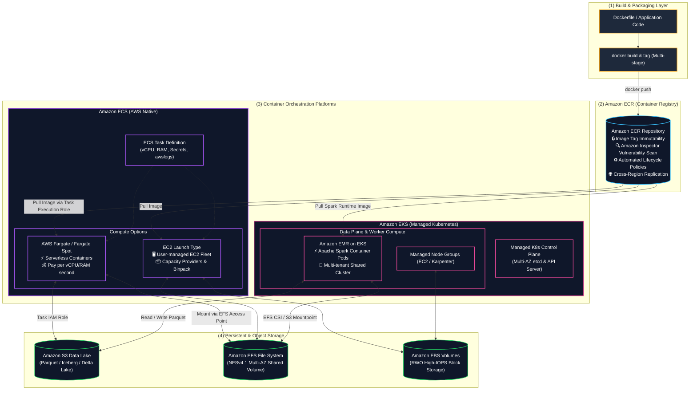
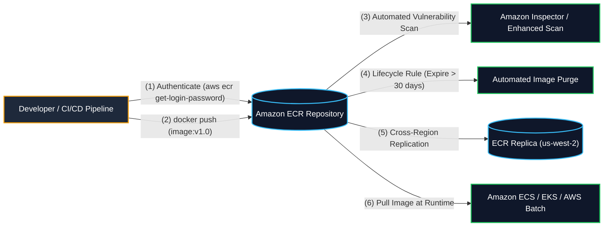
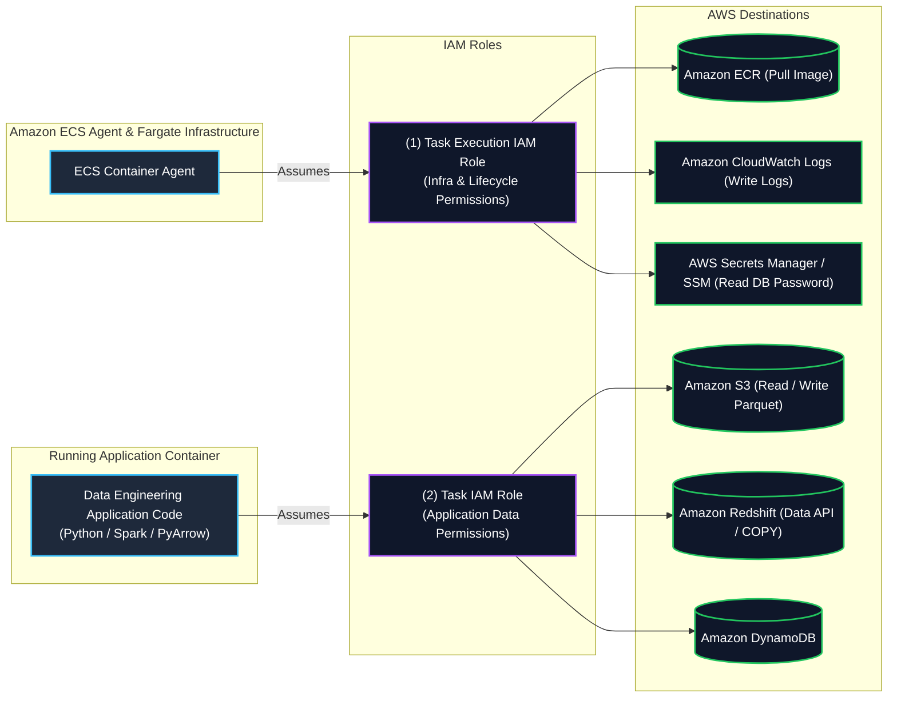
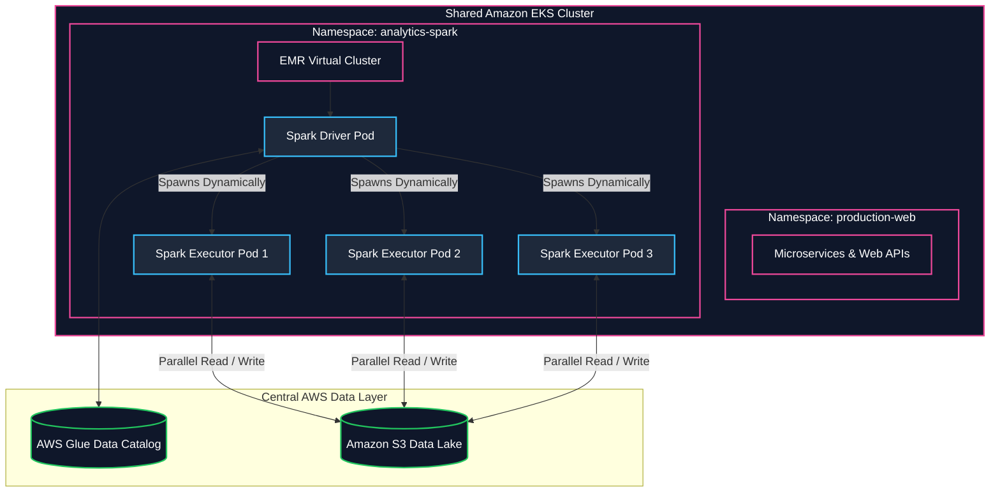

# 🐳 Amazon ECR, Amazon ECS & Amazon EKS (Containers & Kubernetes on AWS) (AWS ပေါ်ရှိ ကွန်တိန်နာနှင့် Kubernetes ဝန်ဆောင်မှုများ)

- **Category**: Compute & Containers (Container Registry, Serverless Containers & Kubernetes Orchestration)
- **Language / ဘာသာစကား**: [English Version](file:///home/monetine/Workspace/Wathon/aws-dea-c01/content/en/02-services/compute-containers/ecr-ecs-eks.md) | **မြန်မာဘာသာ (Burmese)**
- **အဓိက အသုံးပြုမှု**: Container Images များကို Amazon ECR တွင် သိမ်းဆည်းခြင်း၊ Containerized Microservices နှင့် Data Pipelines များကို Amazon ECS (EC2/Fargate) ဖြင့် မောင်းနှင်ခြင်း၊ နှင့် Apache Spark Big Data Engine များကို **Amazon EMR on EKS** ဖြင့် Kubernetes Cluster ပေါ်တွင် ပူးတွဲ run ခြင်း။
- **Slide Reference**: Pages 313–330 in `[[AWSCertifiedDataEngineerSlides.pdf]]`
- **Hub Links**: `[[mm/index]]` | `[[en/index]]` | `[[batch]]` | `[[lambda]]` | `[[emr]]` | `[[efs-and-fsx]]` | `[[s3]]` | `[[glue]]` | `[[step-functions]]`

---

## ၁။ အကျဉ်းချုပ် (High-Level Summary)

Container နည်းပညာသည် Application Code၊ Runtime Environment၊ System Libraries များနှင့် Dependencies အားလုံးကို မည်သည့် Environment (Development, Testing, Cloud Production) တွင်မဆို စိတ်ချယုံကြည်စွာ ပြေးနိုင်သော စံသတ်မှတ်ထားသည့် ပေါ့ပါးသော Unit တစ်ခုအဖြစ် ထုပ်ပိုးပေးသည်။

AWS Data Engineering စနစ်များတွင် အဓိက အသုံးပြုသော ဝန်ဆောင်မှုများမှာ-
1. **Amazon Elastic Container Registry (Amazon ECR)**: Custom ETL Code များနှင့် Machine Learning Model Scoring Containers များကို လုံခြုံစွာ သိမ်းဆည်းပေးသည့် OCI-compliant Private Docker Registry ဖြစ်သည်။
2. **Amazon Elastic Container Service (Amazon ECS)**: AWS-native Container Orchestrator ဖြစ်ပြီး **Amazon EC2 Launch Type** (User-managed) နှင့် ဆာဗာစီမံရန်မလိုသော **AWS Fargate** (Serverless) နှစ်မျိုးစလုံးကို ထောက်ပံ့ပေးသည်။
3. **Amazon Elastic Kubernetes Service (Amazon EKS)**: Managed Kubernetes စနစ်ဖြစ်ပြီး အထူးသဖြင့် **Amazon EMR on EKS** (Apache Spark) ကို အခြား Web/API Microservices များနှင့်အတူ Shared Cluster ပေါ်တွင် ပူးတွဲ run ရန် အသုံးများသည်။
4. **AWS Fargate**: ECS နှင့် EKS နှစ်မျိုးစလုံးအတွက် အောက်ခံ EC2 Virtual Machines များကို Patching၊ Scaling ပြုလုပ်စရာမလိုဘဲ Container Task အလိုက်သာ တွက်ချက်ခွင့်ပြုသည့် Serverless Compute Engine ဖြစ်သည်။

---

## ၂။ Amazon Elastic Container Registry (Amazon ECR)

Amazon ECR သည် Container Images များကို လုံခြုံစွာ စီမံခန့်ခွဲပေးသည့် Fully Managed Registry ဖြစ်သည်-

### အဓိက စွမ်းဆောင်ချက်များ:
1. **Image Tag Immutability**: Tag များ (`:prod`, `:v1.0`) ကို အသစ်ထပ်မံ Push လုပ်ခြင်းဖြင့် မတော်တဆ Overwrite မဖြစ်စေရန် တားဆီးပေးသည်။ Pipeline များအတွက် Deterministic Reproducible Runs များကို အာမခံသည်။
2. **Vulnerability Scanning (Amazon Inspector)**: Image Push လုပ်ချိန်တွင်သာမက CVE အသစ်များ ထွက်ပေါ်လာချိန်တိုင်း Continuous Vulnerability Scanning ပြုလုပ်ပေးသည်။
3. **Lifecycle Policies**: Tag မရှိသော သို့မဟုတ် သက်တမ်း ၃၀ ရက်ကျော်လွန်သော Image အဟောင်းများကို အလိုအလျောက် ရှင်းလင်းပေးခြင်းဖြင့် Storage Cost ကို ထိန်းချုပ်သည်။
4. **Private VPC Endpoints (Exam Critical)**: Private Subnet အတွင်းရှိ Tasks များမှ Internet/NAT Gateway မသုံးဘဲ ECR မှ Image ဆွဲယူရန် **Interface Endpoints (`ecr.api`, `ecr.dkr`)** နှင့် **Gateway Endpoint for Amazon S3** (Image Layer Blobs များ S3 တွင် သိမ်းဆည်းထားသဖြင့်) မဖြစ်မနေ လိုအပ်သည်။

---

## ၃။ Amazon Elastic Container Service (Amazon ECS)

### ၁။ Launch Types: EC2 vs. AWS Fargate

| Architectural Feature | AWS Fargate (Serverless) | AWS Fargate Spot | EC2 Launch Type |
| :--- | :--- | :--- | :--- |
| **Server Management** | **Zero Server Management** (ဆာဗာလုံးဝ စီမံစရာမလို) | **Zero Server Management** | **အသုံးပြုသူမှ EC2 Cluster စီမံရသည်** (OS, Patching, ASG) |
| **Pricing Model** | သုံးစွဲသည့် vCPU & Memory အလိုက် per-second ပေးချေရသည် | ပုံမှန် Fargate ထက် **၇၀% အထိ သက်သာသည်** | EC2 Instances များ run နေသရွေ့ အပြည့်ပေးချေရသည် |
| **Storage Persistence** | **Amazon EFS** (via Access Points) | **Amazon EFS** (via Access Points) | **Amazon EBS** သို့မဟုတ် **Amazon EFS** |
| **အကောင်းဆုံး DEA-C01 Fit** | **ခန့်မှန်းရခက်သော Spiky ETL Pipelines, Microservices** | **Stateless, Fault-tolerant Batch ETL with Checkpointing** | **၂၄/၇ အမြဲလည်ပတ်နေသော Sustained Workloads, Custom GPU Training** |

---

### ၂။ ECS IAM Role ခွဲခြားသတ်မှတ်မှု (Task Execution Role vs. Task Role - Core Exam Focus)

- **Task Execution Role (`executionRoleArn`)**: **ECS Container Agent** ကိုယ်တိုင် အသုံးပြုသည်။ ECR မှ Image ဆွဲယူခြင်း (`ecr:BatchGetImage`)၊ CloudWatch သို့ Logs ရေးသားခြင်း (`logs:PutLogEvents`) နှင့် Secrets Manager မှ Database Password ရယူခြင်းများအတွက် သုံးသည်။
- **Task Role (`taskRoleArn`)**: Container အတွင်းရှိ **Data Application Code** က အသုံးပြုသည်။ Amazon S3 သို့ Parquet ရေးသားခြင်း (`s3:PutObject`)၊ DynamoDB Query လုပ်ခြင်း၊ Redshift Data API ခေါ်ယူခြင်းတို့အတွက် Permissions ပေးရသည်။

---

## ၄။ Amazon EMR on EKS (Core Big Data Exam Focus)

**Amazon EMR on EKS** သည် Apache Spark Big Data Workload များကို Managed EKS Kubernetes Cluster ပေါ်တွင် ပူးတွဲ မောင်းနှင်ပေးသည့် စနစ်ဖြစ်သည်-

### EMR on EKS ကို အဘယ်ကြောင့် ရွေးချယ်သင့်သနည်း?
1. **Infrastructure Consolidation**: ကုမ္ပဏီတွင် ရှိပြီးသား Kubernetes Cluster ပေါ်တွင် Web App များနှင့်အတူ Apache Spark Data Pipelines များကို အတူတကွ မျှဝေသုံးစွဲနိုင်သဖြင့် Idle EC2 Cluster Waste ကို လုံးဝ ပပျောက်စေသည်။
2. **Dynamic Pod Lifecycle**: Job စတင်ချိန်တွင် Spark Driver နှင့် Executor Pods များကို အလိုအလျောက် တည်ဆောက်ပြီး Job ပြီးဆုံးပါက ချက်ချင်း ဖျက်သိမ်းပေးသည်။
3. **Up to 3x Faster**: Open-source Spark on K8s ထက် ၃ ဆ ပိုမိုမြန်ဆန်ပြီး ၆၈% စျေးသက်သာသည့် **EMR Runtime for Apache Spark** ကို အသုံးပြုသည်။

---

## ၅။ Master Comparative Matrix

| Dimension | AWS Lambda | AWS Batch | Amazon ECS (Fargate) | Amazon EKS (EMR on EKS) | Amazon EMR (EC2) |
| :--- | :--- | :--- | :--- | :--- | :--- |
| **Packaging** | Zip archive သို့မဟုတ် Container (10 GB) | Docker Container | Docker Container | Docker Container / K8s Pods | EC2 AMIs / Bootstrap Actions |
| **Max Runtime** | ⏱️ **15 Minutes** | Unlimited | Unlimited | Unlimited | Unlimited |
| **Orchestration** | AWS Event Triggers | Job Queues & Dependencies | ECS Task Definitions | Kubernetes Manifests / Helm | YARN ResourceManager |
| **Big Data Engine** | Custom Python scripts | Non-Spark batch containers | Custom container pipelines | **EMR Spark on Kubernetes** | Native Spark, Hadoop, Presto |
| **Storage Persistence** | `/tmp` (10 GB) သို့မဟုတ် EFS | EBS, Spot scratch, EFS | **Amazon EFS / Amazon EBS** | **EBS, EFS, FSx for Lustre, S3 CSI** | HDFS, S3 (EMRFS) |
| **Spot Cost Savings** | ❌ Standard duration pricing | ✅ **Native Spot integration** (90% off) | ✅ **Fargate Spot** (70% off) | ✅ **EC2 Spot Node Groups** (90% off) | ✅ **Spot Task nodes** (90% off) |

---

## ၆။ DEA-C01 စာမေးပွဲ အဓိက အချက်အလက်များနှင့် ထောင်ချောက်များ (Exam Tips & Traps)

> [!IMPORTANT]
> **Key Exam Trigger Keywords**:
> - **"Run containerized applications without managing underlying EC2 servers"** $\rightarrow$ **Amazon ECS with AWS Fargate launch type**.
> - **"Share Kubernetes cluster resources between microservices and Apache Spark data engineering jobs"** $\rightarrow$ **Amazon EMR on EKS**.
> - **"Grant containerized application in ECS permissions to access S3 or DynamoDB"** $\rightarrow$ **Attach IAM policy to the ECS Task IAM Role** (Task Execution Role မဟုတ်ပါ!).
> - **"Prevent overwriting container images in CI/CD pipelines"** $\rightarrow$ **Enable Image Tag Immutability on Amazon ECR**.
> - **"Persistent shared multi-task file storage for Fargate containers"** $\rightarrow$ **Mount Amazon EFS via EFS Access Points**.

> [!WARNING]
> **Exam Traps (သတိထားရမည့် အချက်များ)**:
> 1. **Task Role vs. Task Execution Role Trap**: Container အတွင်းရှိ App က S3 ဖတ်မရဘဲ `AccessDenied` ဖြစ်နေပါက Task Execution Role ကို ပြင်ဆင်ခြင်းဖြင့် မဖြေရှင်းနိုင်ပါ။ **Task IAM Role** တွင် `s3:GetObject` ပေးရမည်။
> 2. **EMR on EC2 vs. EMR on EKS**: ရှိပြီးသား K8s Cluster ကို မျှဝေသုံးလိုပါက **EMR on EKS** ကို ရွေးပါ။ Custom Hadoop/YARN ကန့်သတ်ချက်များ သို့မဟုတ် Dedicated Cluster လိုအပ်ပါက **EMR on EC2** ကို ရွေးပါ။

---

## 📌 ဆက်စပ် မှတ်စုများ (Related Notes)

- `[[batch]]` — AWS Batch (Managed Containerized Batch Computing)
- `[[lambda]]` — AWS Lambda (Serverless Functions)
- `[[emr]]` — Amazon EMR Distributed Big Data Clusters
- `[[efs-and-fsx]]` — Amazon EFS Storage Integration with Containers
- `[[s3]]` — Amazon S3 Data Lake Target
- `[[glue]]` — AWS Glue Serverless Spark ETL
