# 🐳 Amazon ECR, Amazon ECS & Amazon EKS (Containers & Kubernetes on AWS)

- **Category**: Compute & Containers (Container Registry, Serverless Containers & Kubernetes Orchestration)
- **Language / ဘာသာစကား**: [English (Original)](/en/02-services/compute-containers/ecr-ecs-eks) | **မြန်မာဘာသာ (Burmese)**
- **Primary Use Case**: Container image များကို Amazon ECR တွင် သိမ်းဆည်းခြင်း၊ containerized microservices များနှင့် data processing များကို Amazon ECS (EC2/Fargate) တွင် run ခြင်းနှင့် distributed big data engines (အထူးသဖြင့် **Amazon EMR on EKS**) များကို managed Kubernetes တွင် run ခြင်း။
- **Slide Reference**: Pages 313–330 in `[[AWSCertifiedDataEngineerSlides.pdf]]`
- **Hub Links**: [[mm/index]] | [[mm/service-catalog]] | [[mm/domain-1-ingestion-and-processing]] | [[mm/batch]] | [[mm/lambda]] | [[mm/emr]] | [[mm/efs-and-fsx]] | [[mm/s3]] | [[mm/glue]] | [[mm/step-functions]]

---

## 1. High-Level Summary (အဓိက အနှစ်ချုပ်)

Containers များသည် application code, runtime environments, system libraries များနှင့် configurations များကို standard ဖြစ်၊ isolated ဖြစ်ပြီး immutable ဖြစ်သော unit များအဖြစ် ပေါင်းစည်းပေးပြီး development, testing နှင့် cloud production environment များအကြားတွင် ယုံကြည်စိတ်ချစွာ run နိုင်စေပါသည်။

ခေတ်သစ် AWS data engineering architectures များတွင်-
1. **Amazon Elastic Container Registry (Amazon ECR)**: Secure ဖြစ်ပြီး scalable ဖြစ်သော private Docker နှင့် OCI-compliant registry ဖြစ်ပြီး custom ETL container images များ၊ machine learning model scoring containers များနှင့် [[mm/batch]] job definitions များကို သိမ်းဆည်းပေးသည်။
2. **Amazon Elastic Container Service (Amazon ECS)**: AWS-native ဖြစ်သော၊ သတ်မှတ်ချက်အတိအကျရှိသော (opinionated) container orchestration platform ဖြစ်ပြီး traditional **Amazon EC2 Launch Types** နှင့် serverless **AWS Fargate** compute နှစ်ခုလုံးကို အထောက်အပံ့ပေးသည်။
3. **Amazon Elastic Kubernetes Service (Amazon EKS)**: Managed Kubernetes platform ဖြစ်ပြီး enterprise များအား distributed big data analytics engines များ—အထူးသဖြင့် **Amazon EMR on EKS** (Apache Spark)—ကို operational microservices များနှင့်အတူ shared compute cluster တစ်ခုတည်းပေါ်တွင် run နိုင်စေသည်။
4. **AWS Fargate**: Amazon ECS နှင့် Amazon EKS နှစ်ခုလုံးအတွက် serverless compute engine ဖြစ်ပြီး virtual machine cluster များကို provision လုပ်ခြင်း၊ configure လုပ်ခြင်း၊ patch လုပ်ခြင်း သို့မဟုတ် scale လုပ်ခြင်းများ ပြုလုပ်ရန်မလိုအောင် ဖယ်ရှားပေးသည်။

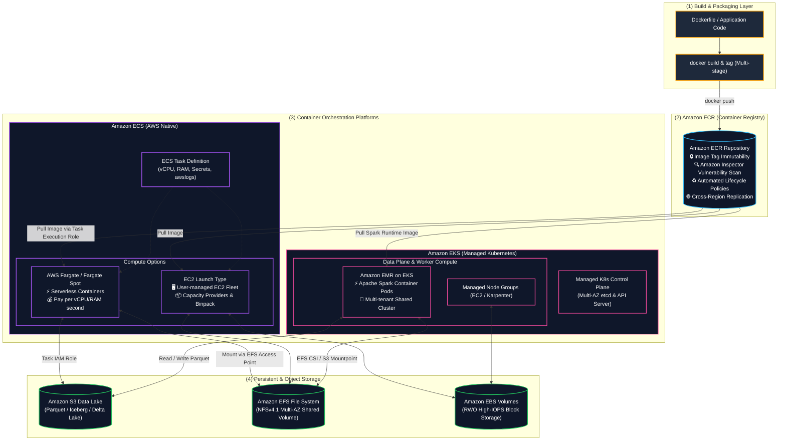

---

## 2. Container Fundamentals in Data Engineering (Data Engineering ရှိ Container အခြေခံများ)

Data architectures များတွင် containers များသည် traditional virtual machines များနှင့် serverless functions များထက် သိသာထင်ရှားသော အားသာချက်များကို ပေးစွမ်းနိုင်သည်-

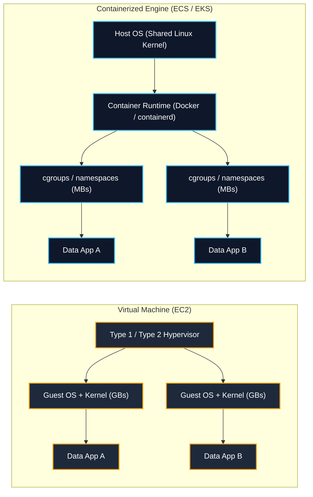

### Key Packaging Best Practices for Data Workloads (Data Workloads များအတွက် အဓိက Packaging အကောင်းဆုံးအလေ့အကျင့်များ):
1. **Multi-Stage Builds**: Compile/build dependencies များကို နောက်ဆုံး execution runtime မှ ခွဲထုတ်ပါ။ Image size ကို အနည်းဆုံးဖြစ်စေပြီး auto-scaling worker nodes များအကြားတွင် ECR pull times များကို မြန်ဆန်စေကာ attack surfaces များကို ဖယ်ရှားပေးသည်။
2. **Minimal Base Images**: `distroless` သို့မဟုတ် `alpine` base images များကို အသုံးပြုပါ။ Production ETL pipelines များအတွက် full Ubuntu/Debian operating system images များကို ရှောင်ကြဉ်ပါ။
3. **Non-Root Execution**: Container escape exploits များကို တားဆီးရန် Dockerfiles တွင် `USER 10001:10001` ကို configure လုပ်ပါ။
4. **Layer Caching Optimization**: မကြာခဏပြောင်းလဲလေ့မရှိသော အဆင့်များ (ဥပမာ `pip install pyarrow pyspark pandas`) ကို `Dockerfile` ၏ အပေါ်ပိုင်းတွင် ထားရှိပြီး dynamic application code (`COPY ./src /app`) ကို အောက်ခြေတွင် ထားပါ။

---

## 3. Amazon Elastic Container Registry (Amazon ECR)

Amazon ECR သည် fully managed ဖြစ်ပြီး OCI-compliant container registry တစ်ခုဖြစ်ကာ container images များကို သိမ်းဆည်းရန်၊ စီမံရန်၊ မျှဝေရန်နှင့် deploy လုပ်ရန် လွယ်ကူစေသည်-

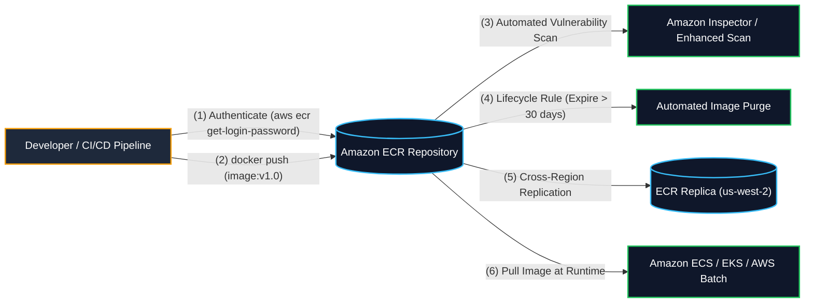

### 1. Image Tag Immutability (Image Tag မပြောင်းလဲနိုင်မှု)
- **Core Mechanism**: Image tags များ (ဥပမာ `:prod`, `:v1.2.0`, သို့မဟုတ် `:latest`) အား နောက်ထပ် pushes များဖြင့် overwrite လုပ်ခံရခြင်းမှ တားဆီးပေးသည်။
- **Data Engineering Significance**: Deterministic ဖြစ်ပြီး ထပ်မံထုတ်လုပ်နိုင်သော ETL pipeline runs များကို အာမခံပေးသည်။ Developer တစ်ဦးက လက်ရှိ release tag သို့ မရည်ရွယ်ဘဲ push လုပ်လိုက်ပါက စမ်းသပ်မထားသော code များ deploy လုပ်မိခြင်းကို တားဆီးပေးသည်။

### 2. Vulnerability Scanning: Basic vs. Enhanced (အားနည်းချက် စစ်ဆေးခြင်း- Basic နှင့် Enhanced)
- **Basic Scanning**: Open-source Clair engine ကို အသုံးပြု၍ Common Vulnerabilities and Exposures (CVEs) များအတွက် container images များကို scan လုပ်သည်။ **On push** တွင်ဖြစ်စေ manual ဖြစ်စေ scan လုပ်ရန် configure လုပ်နိုင်သည်။
- **Enhanced Scanning (Amazon Inspector Integration)**:
  - OS-level နှင့် programming language package အားနည်းချက်များ (ဥပမာ- Python `pip`, Java JARs, Node.js packages) နှစ်ခုလုံးအတွက် repository များကို အလိုအလျောက် စဉ်ဆက်မပြတ် scan လုပ်ပေးသည်။
  - CVE ထုတ်ပြန်ချက်အသစ်များ ထွက်ပေါ်လာသောအခါ သိမ်းဆည်းထားသော container images များကို re-push လုပ်ရန်မလိုဘဲ အလိုအလျောက် re-scan လုပ်ပေးသည်။
  - တွေ့ရှိချက်များအတွက် Amazon EventBridge events များကို ထုတ်လွှင့်ပေးပြီး automated remediation သို့မဟုတ် pipeline blocks များကို trigger လုပ်ပေးသည်။

### 3. ECR Lifecycle Policies
Lifecycle policies များသည် storage cost များကို ထိန်းချုပ်ရန်အတွက် အသုံးမပြုတော့သော (stale) container images များ ရှင်းလင်းခြင်းကို အလိုအလျောက်လုပ်ဆောင်ပေးသည်-
```json
{
  "rules": [
    {
      "rulePriority": 1,
      "description": "Expire untagged images older than 7 days",
      "selection": {
        "tagStatus": "untagged",
        "countType": "sinceImagePushed",
        "countUnit": "days",
        "countNumber": 7
      },
      "action": {
        "type": "expire"
      }
    },
    {
      "rulePriority": 2,
      "description": "Keep only the last 30 tagged production images",
      "selection": {
        "tagStatus": "tagged",
        "tagPrefixList": ["prod-", "release-"],
        "countType": "imageCountMoreThan",
        "countNumber": 30
      },
      "action": {
        "type": "expire"
      }
    }
  ]
}
```

### 4. Cross-Region & Cross-Account Replication
- Container images များကို AWS Regions များနှင့် AWS Accounts များအကြား အလိုအလျောက် replicate လုပ်ပေးသည်။
- Replicas များသည် AWS KMS customer-managed keys (CMKs) မှတစ်ဆင့် encryption ကို အမွေဆက်ခံရရှိသည်။
- Multi-region EKS/ECS cluster များ deploy လုပ်ရာတွင် cross-region data transfer latency နှင့် egress costs များကို လျှော့ချပေးသည်။

### 5. Pull Through Cache
- Upstream registries (**Docker Hub**, **Quay.io**, **Amazon ECR Public**, **Kubernetes `registry.k8s.io`**) များမှ public container images များကို သင်၏ private ECR namespace ထဲသို့ တိုက်ရိုက် အလိုအလျောက် cache လုပ်ပေးသည်။
- **Benefits (အကျိုးကျေးဇူးများ)**:
  - Upstream rate-limiting (ဥပမာ Docker Hub pull limits) ကို ဖယ်ရှားပေးသည်။
  - Workloads များကို external network failures သို့မဟုတ် upstream outages များမှ ကာကွယ်ပေးသည်။
  - Amazon Inspector အား third-party base images များကို အလိုအလျောက် scan လုပ်ခွင့်ပေးသည်။

### 6. Private VPC Endpoints for ECR (Exam Critical - စာမေးပွဲအတွက် အရေးကြီးသည်)
Internet access မရှိသော (NAT Gateway မရှိသော) private subnet အတွင်းမှ ECR မှ container images များကို pull လုပ်ရန်-
1. **Interface VPC Endpoint**: `com.amazonaws.<region>.ecr.api` (authentication ကဲ့သို့သော ECR control plane API calls များအတွက်)။
2. **Interface VPC Endpoint**: `com.amazonaws.<region>.ecr.dkr` (Docker registry commands များနှင့် image manifest ရယူခြင်းအတွက်)။
3. **Gateway VPC Endpoint**: `com.amazonaws.<region>.s3` (ECR သည် အမှန်တကယ် container image layer blobs များကို **Amazon S3** တွင် သိမ်းဆည်းသည်; Tasks များသည် public internet ကို မဖြတ်ကျော်ဘဲ S3 image layers များကို မဖြစ်မနေ ဒေါင်းလုဒ်လုပ်နိုင်ရမည်!)။

---

## 4. Amazon Elastic Container Service (Amazon ECS)

Amazon ECS သည် fully managed ဖြစ်ပြီး သတ်မှတ်ချက်အတိအကျရှိသော (opinionated) AWS-native container orchestration service တစ်ခုဖြစ်သည်-

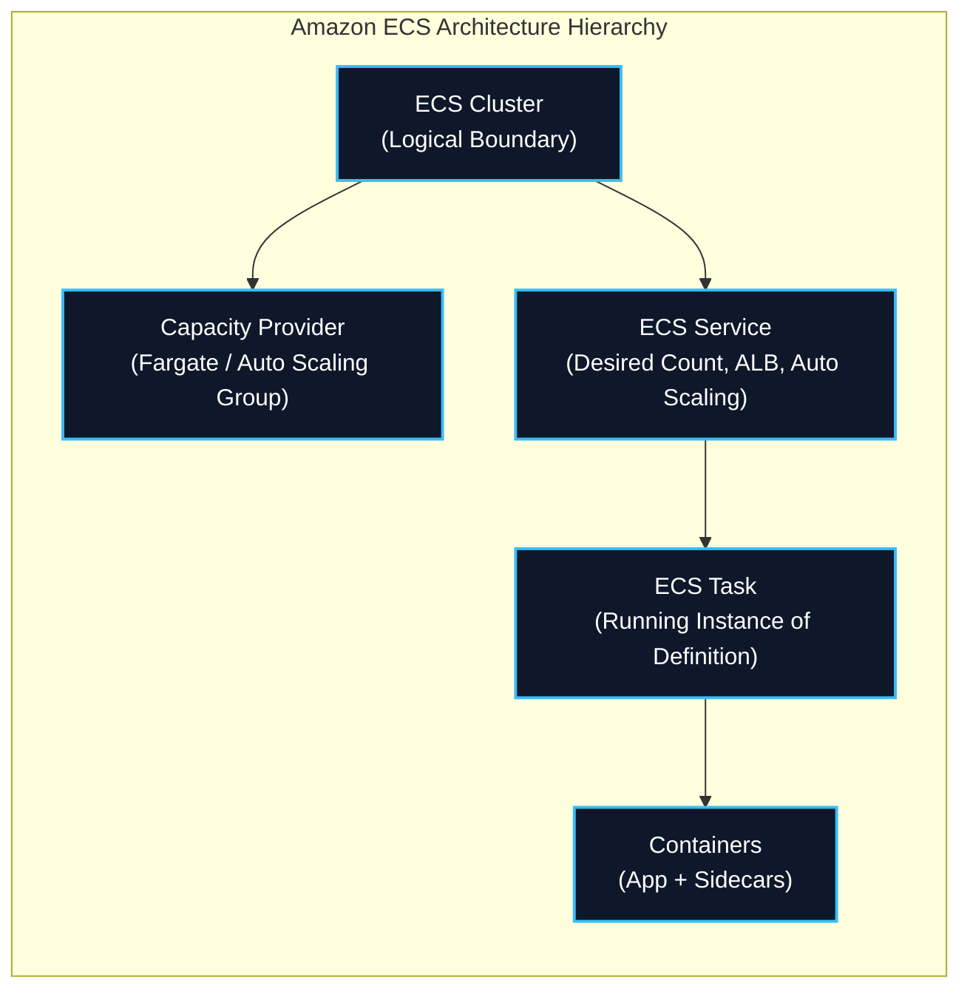

### 1. Launch Types: EC2 vs. AWS Fargate

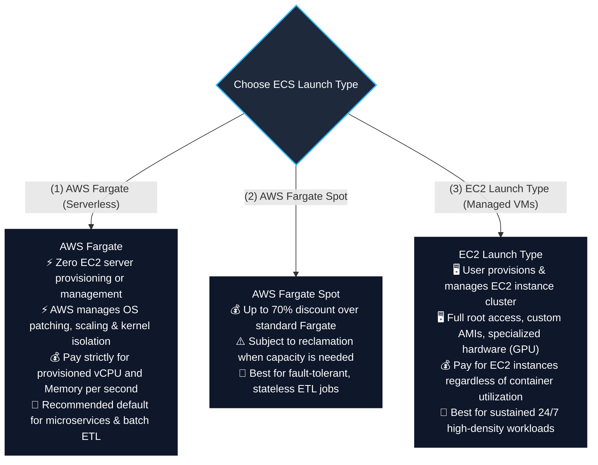

### Launch Types Comparison Matrix (Launch Types နှိုင်းယှဉ်ချက် ဇယား)

| Architectural Feature | AWS Fargate (Serverless) | AWS Fargate Spot | EC2 Launch Type |
| :--- | :--- | :--- | :--- |
| **Server Management** | **Zero server management** | **Zero server management** | **Customer manages EC2 cluster** (OS, patching, ASG) |
| **Pricing Model** | Pay per vCPU & GB memory per second | Up to **70% discount** over standard Fargate | Pay for running EC2 instances (even if half empty) |
| **Interruption Warning** | No interruptions | 2-minute interruption notice | Standard Spot 2-minute notice (if EC2 Spot used) |
| **Startup Time** | Fast (~30–60 seconds per container) | Fast (~30–60 seconds) | Instant if capacity exists; slower if ASG scales |
| **Custom AMIs / GPUs** | Standard AWS Linux container environment | Standard AWS Linux | Supports custom AMIs, GPU instances (`g5`, `p4d`), custom kernels |
| **Persistent Storage** | **Amazon EFS** (via Access Points) | **Amazon EFS** (via Access Points) | **Amazon EBS** or **Amazon EFS** |
| **Best DEA-C01 Fit** | **Spiky, unpredictable ETL pipelines, microservices, ad-hoc batch processing** | **Stateless, fault-tolerant batch ETL with checkpointing** | **Predictable 24/7 sustained processing, specialized GPU training** |

---

### 2. ECS IAM Role Separation: Task Execution Role vs. Task Role (Core Exam Focus - အဓိက စာမေးပွဲ အာရုံစိုက်မှု)

ဤ IAM role နှစ်ခုအကြား တင်းကျပ်သော နယ်နိမိတ်ကို နားလည်ခြင်းသည် DEA-C01 စာမေးပွဲတွင် ကျယ်ကျယ်ပြန့်ပြန့် စမ်းသပ်လေ့ရှိသည်-

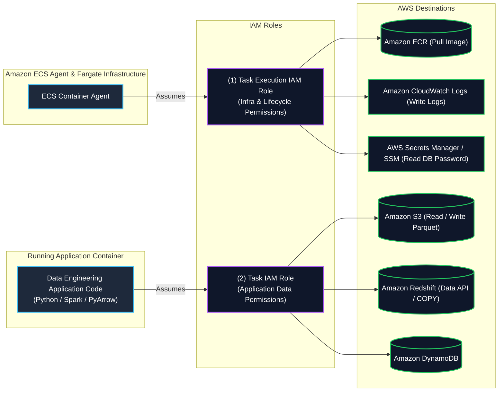

#### Detailed IAM Role Comparison (အသေးစိတ် IAM Role နှိုင်းယှဉ်ချက်):

| Parameter | Task Execution Role (`executionRoleArn`) | Task Role (`taskRoleArn`) |
| :--- | :--- | :--- |
| **Assumed By** | **ECS Container Agent** & Fargate Infrastructure | **Application Code** inside the container |
| **Purpose** | ECS အား container များကို launch လုပ်ရန်၊ images များကို pull လုပ်ရန်နှင့် configure လုပ်ရန် ခွင့်ပြုသည် | Application အား AWS data services များနှင့် interact လုပ်ရန် ခွင့်ပြုသည် |
| **Typical Permissions** | • `ecr:GetAuthorizationToken`<br/>• `ecr:BatchGetImage`<br/>• `logs:CreateLogStream`<br/>• `logs:PutLogEvents`<br/>• `secretsmanager:GetSecretValue`<br/>• `ssm:GetParameters` | • `s3:GetObject`, `s3:PutObject`<br/>• `dynamodb:Query`, `dynamodb:PutItem`<br/>• `redshift-data:ExecuteStatement`<br/>• `kms:Decrypt`<br/>• `kinesis:PutRecord` |
| **Failure Symptom** | Container fails to launch (`CannotPullContainerError`, `ResourceInitializationError`) | Application crashes with `AccessDeniedException` when querying S3 or DynamoDB |

#### Sample Task Definition Snippet Demonstrating Both Roles & Secrets Injection:
```json
{
  "family": "data-pipeline-task",
  "networkMode": "awsvpc",
  "requiresCompatibilities": ["FARGATE"],
  "cpu": "1024",
  "memory": "2048",
  "executionRoleArn": "arn:aws:iam::123456789012:role/ecsTaskExecutionRole",
  "taskRoleArn": "arn:aws:iam::123456789012:role/dataIngestionAppTaskRole",
  "containerDefinitions": [
    {
      "name": "parquet-transformer",
      "image": "123456789012.dkr.ecr.us-east-1.amazonaws.com/etl-transformer:v1.0",
      "essential": true,
      "secrets": [
        {
          "name": "DB_PASSWORD",
          "valueFrom": "arn:aws:secretsmanager:us-east-1:123456789012:secret:db-creds:password::"
        }
      ],
      "logConfiguration": {
        "logDriver": "awslogs",
        "options": {
          "awslogs-group": "/ecs/data-pipeline",
          "awslogs-region": "us-east-1",
          "awslogs-stream-prefix": "transformer"
        }
      }
    }
  ]
}
```

---

### 3. ECS Networking Modes

| Network Mode | Description | Port Mapping | Compatibility |
| :--- | :--- | :--- | :--- |
| **`awsvpc`** | Task တိုင်းအတွက် ၎င်းပိုင် **Elastic Network Interface (ENI)** နှင့် private IPv4 address တစ်ခုစီ သတ်မှတ်ပေးသည်။ VPC ပေါ်ရှိ first-class EC2 instance တစ်ခုကဲ့သို့ အလုပ်လုပ်သည်။ | Container port matches host port directly. | **Required for AWS Fargate**; supported on EC2. |
| **`bridge`** | EC2 host ပေါ်ရှိ Docker ၏ built-in virtual bridge network ကို အသုံးပြုသည်။ | Allows dynamic host port mapping (Host port 0 maps to dynamic ephemeral port). | EC2 only. |
| **`host`** | Docker network isolation ကို ကျော်ဖြတ်ပြီး container ကို EC2 host ၏ physical network interface သို့ တိုက်ရိုက် bind လုပ်သည်။ | Highest network packet throughput and lowest latency. | EC2 only. |
| **`none`** | Container တွင် external network connectivity မရှိပါ။ | None. | EC2 and Fargate. |

---

### 4. ECS Task Placement Strategies & Constraints (EC2 Launch Type)

User-managed EC2 clusters များပေါ်တွင် run သောအခါ၊ ECS သည် task နေရာချထားခြင်း (task placement) ကို algorithm ဖြင့် ထိန်းချုပ်ခွင့်ပြုသည်-

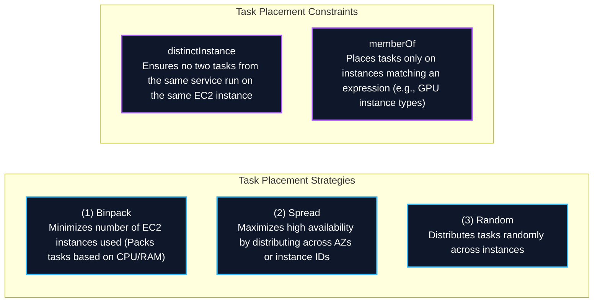

- **Data Engineering Cost Tip**: `spread(attribute:ecs.availability-zone)` နှင့် `binpack(memory)` တို့ကို ပေါင်းစပ်အသုံးပြုခြင်းသည် Multi-AZ high availability နှင့် အနည်းဆုံး EC2 compute instance ብክነት (wastage) နှစ်ခုလုံးကို ရရှိစေသည်။

---

### 5. Persistent Storage with Amazon EFS & Amazon EBS

Containers များသည် မူလအားဖြင့် stateless ဖြစ်ပြီး အလွယ်တကူပျောက်ပျက်နိုင်သော (ephemeral) အရာများဖြစ်သည်။ AWS ECS သည် အဓိက persistent storage options နှစ်ခုကို ထောက်ပံ့ပေးသည်-

1. **Amazon EFS Integration (Multi-AZ Shared File System)**:
   - **Amazon EFS** file system ကို **EFS Access Points** များမှတစ်ဆင့် containers များအတွင်းသို့ တိုက်ရိုက် mount လုပ်သည်။
   - **AWS Fargate နှင့် EC2 launch types နှစ်ခုလုံးတွင် အထောက်အပံ့ပေးသည်**။
   - တစ်ပြိုင်နက်အလုပ်လုပ်နေသော container tasks ရာပေါင်းများစွာအကြားတွင် မျှဝေအသုံးပြုနိုင်သော `ReadWriteMany` (RWX) access ကို ထောက်ပံ့ပေးသည်။
   - POSIX user identity (`UID`/`GID`) နှင့် directory path ကန့်သတ်ချက်များကို ပြဋ္ဌာန်းပေးသည်။
2. **Amazon EBS Task Volume Attachment**:
   - မြင့်မားသော စွမ်းဆောင်ရည်ရှိသည့် သီးသန့် **Amazon EBS** volumes များကို ECS tasks များနှင့် တိုက်ရိုက် တွဲဖက် (attach) နိုင်စေသည်။
   - Volume lifecycle ကို task lifecycle နှင့်အတူ အလိုအလျောက် စီမံခန့်ခွဲပေးသည်။

---

## 5. Amazon Elastic Kubernetes Service (Amazon EKS)

**Amazon EKS** သည် managed Kubernetes service တစ်ခုဖြစ်ပြီး Kubernetes control plane (API servers, `etcd` database) ကို AWS Availability Zones များစွာတစ်လျှောက် provision လုပ်ခြင်း၊ scale လုပ်ခြင်းနှင့် operate လုပ်ခြင်းတို့ကို ဆောင်ရွက်ပေးသည်။

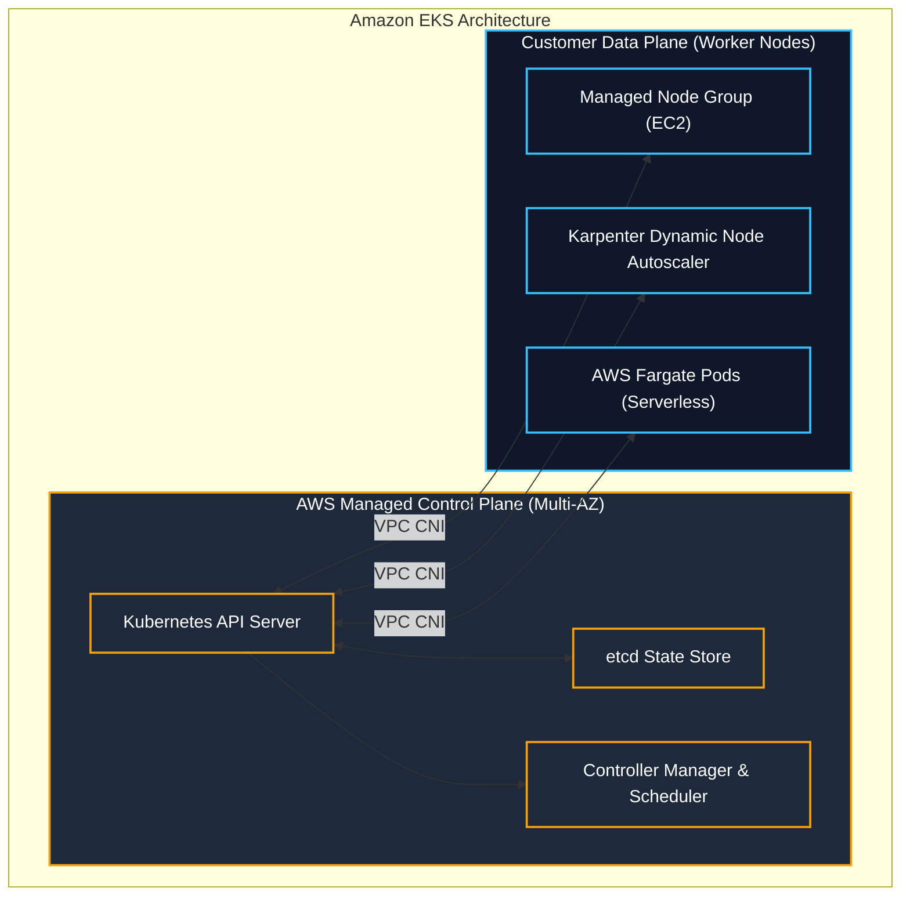

### 1. Kubernetes IAM: IRSA & EKS Pod Identity
Principle of least privilege ရရှိစေရန်၊ EKS ပေါ်တွင် run နေသော pods များသည် အောက်ခံ EC2 worker node ၏ IAM role ကို မည်သည့်အခါမှ အမွေမဆက်ခံသင့်ပါ-
- **IAM Roles for Service Accounts (IRSA)**: Kubernetes `ServiceAccount` tokens များအား သီးခြား AWS IAM roles များကို assume လုပ်ခွင့်ပေးရန် OpenID Connect (OIDC) identity provider ကို အသုံးပြုသည်။
- **EKS Pod Identity**: ရှုပ်ထွေးသော OIDC trust policies များကို စီမံစရာမလိုဘဲ EKS Pod Identity agent မှတစ်ဆင့် IAM roles များကို ServiceAccounts များနှင့် တိုက်ရိုက် တွဲဖက်ပေးခြင်းဖြင့် IAM association ကို ရိုးရှင်းစေသည်။

---

### 2. Kubernetes Storage: AWS Container Storage Interface (CSI) Drivers

| Storage Type | AWS CSI Driver | Kubernetes Volume Mode | Best Data Engineering Use Case |
| :--- | :--- | :--- | :--- |
| **Amazon EBS** | `ebs.csi.aws.com` | `ReadWriteOnce` (RWO - Single Pod) | Self-hosted Kafka brokers, PostgreSQL, Cassandra, OpenSearch |
| **Amazon EFS** | `efs.csi.aws.com` | `ReadWriteMany` (RWX - Multi-Node) | Shared Airflow DAG folders, JupyterHub multi-user home directories |
| **AWS FSx for Lustre** | `fsx.csi.aws.com` | `ReadWriteMany` (RWX - High-Throughput) | Sub-millisecond distributed ML model training & HPC staging |
| **Mountpoint for Amazon S3** | `s3.csi.aws.com` | `ReadOnlyMany` / `ReadWriteMany` | Direct POSIX read access to S3 object buckets at high throughput |

---

## 6. Amazon EMR on EKS (Core Big Data Exam Focus - အဓိက Big Data စာမေးပွဲ အာရုံစိုက်မှု)

**Amazon EMR on EKS** သည် data engineers များအား managed Amazon EKS clusters များပေါ်တွင် **Apache Spark** applications များ run နိုင်ရန် လုပ်ဆောင်ပေးသော deployment option တစ်ခုဖြစ်သည်-

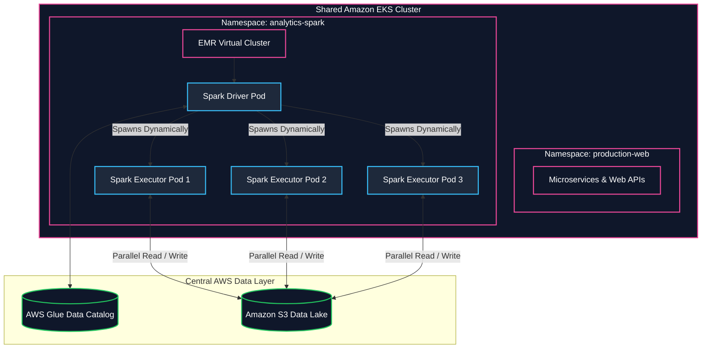

### Why Choose EMR on EKS? (ဘာကြောင့် EMR on EKS ကို ရွေးချယ်သင့်သလဲ)
1. **Infrastructure Consolidation**: Spark big data pipelines များကို web applications များနှင့် APIs များ run နေသော Kubernetes cluster ပေါ်တွင် အတူတကွ run ခြင်းဖြင့် compute resources များကို ပေါင်းစည်းပေးပြီး၊ အလကားဖြစ်နေသော EC2 cluster wastage ကို ဖယ်ရှားပေးသည်။
2. **Dynamic Pod Lifecycle**: EMR သည် job စတင်သောအခါ Spark driver နှင့် executor pods များကို dynamically provision လုပ်ပေးပြီး job ပြီးဆုံးသည်နှင့် ၎င်းတို့ကို ချက်ချင်း terminate လုပ်ပေးသည်။
3. **Up to 3x Faster**: စွမ်းဆောင်ရည် အကောင်းဆုံးဖြစ်အောင် ပြင်ဆင်ထားသော **EMR runtime for Apache Spark** ကို အသုံးပြုသည် (open-source Spark on Kubernetes ထက် ၃ ဆအထိ ပိုမြန်ပြီး ကုန်ကျစရိတ် ၆၈% ပိုသက်သာသည်)။
4. **Per-Job Isolation**: မတူညီသောအဖွဲ့များသည် မတူညီသော Spark versions များနှင့် custom Docker container images များကို သီးခြား IAM execution roles များဖြင့် cluster တစ်ခုတည်းပေါ်တွင် run နိုင်ကြသည်။
5. **Native Integration**: [[mm/glue]] Data Catalog များနှင့် data governance အတွက် [[mm/lake-formation]] တို့နှင့် ချောမွေ့စွာ ချိတ်ဆက်ပေးသည်။

---

## 7. AWS Batch & AWS App Runner in Container Architectures

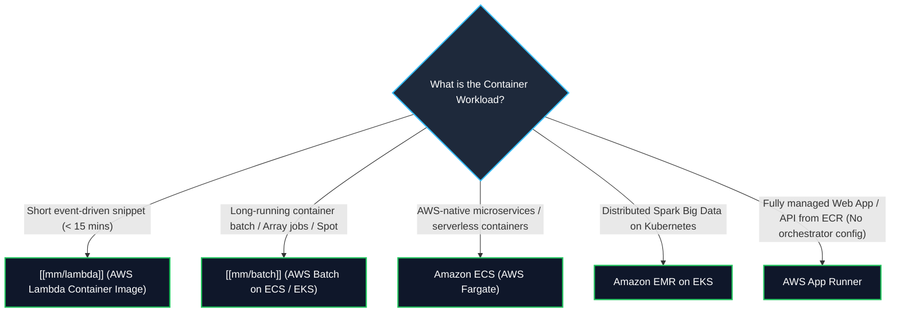

- **AWS Batch with Containers**: EC2 Spot fleets များတစ်လျှောက် parallel array jobs (tasks ၁၀,၀၀၀ အထိ) ကို schedule လုပ်ရန် နောက်ကွယ်တွင် Amazon ECS သို့မဟုတ် EKS ကို အသုံးပြုသည်။
- **AWS App Runner**: VPCs, load balancers များနှင့် orchestrators များကို ဖုံးကွယ် (abstract) ပေးပြီး containerized web applications များနှင့် APIs များကို ECR သို့မဟုတ် source code မှတစ်ဆင့် fully managed, serverless အနေဖြင့် တိုက်ရိုက် run နိုင်စေသည်။

---

## 8. Master Decision Frameworks & Comparison Matrices (အဓိက ဆုံးဖြတ်ချက် Frameworks များနှင့် နှိုင်းယှဉ်ချက် ဇယားများ)

### Master Container & Compute Comparative Matrix

| Dimension | AWS Lambda | AWS Batch | Amazon ECS (Fargate) | Amazon EKS (EMR on EKS) | Amazon EMR (EC2) |
| :--- | :--- | :--- | :--- | :--- | :--- |
| **Packaging** | Zip archive or Container (up to 10 GB) | Docker Container | Docker Container | Docker Container / K8s Pods | EC2 AMIs / Bootstrap Actions |
| **Max Runtime** | ⏱️ **15 Minutes** | Unlimited | Unlimited | Unlimited | Unlimited |
| **Orchestration** | AWS-managed event triggers | Job Queues & Dependencies | ECS Task Definitions / Services | Kubernetes Manifests / Helm | YARN ResourceManager |
| **Big Data Engine** | Custom Python scripts | Non-Spark batch containers | Custom container pipelines | **EMR Spark on Kubernetes** | Native Spark, Hadoop, Presto |
| **Storage Persistence** | `/tmp` (10 GB) or EFS | EBS, Spot scratch, EFS | **Amazon EFS / Amazon EBS** | **EBS, EFS, FSx for Lustre, S3 CSI** | HDFS, S3 (EMRFS) |
| **Spot Cost Savings** | ❌ Standard duration pricing | ✅ **Native Spot integration** (up to 90% off) | ✅ **Fargate Spot** (up to 70% off) | ✅ **EC2 Spot Node Groups** (up to 90% off) | ✅ **Spot Task nodes** (up to 90% off) |

---

## 9. Production Architecture Patterns (ထုတ်လုပ်မှု Architecture ပုံစံများ)

### Pattern 1: Serverless Event-Driven Containerized ETL (ECS Fargate + S3)

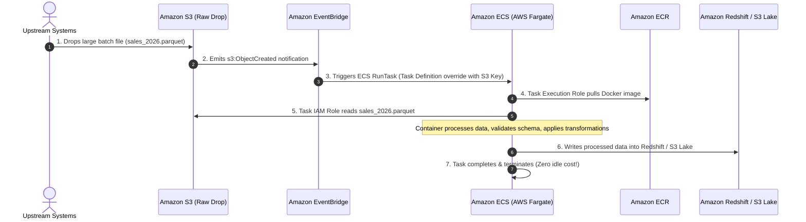

### Pattern 2: Enterprise Secure Container Supply Chain

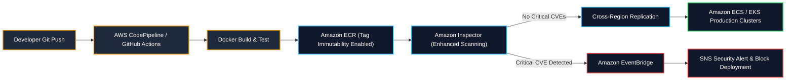

---

## 10. Common Failures, Troubleshooting & Anti-Patterns (အဖြစ်များသော ချို့ယွင်းချက်များ၊ ပြဿနာဖြေရှင်းခြင်းနှင့် Anti-Patterns များ)

| Error / Failure Mode | Root Cause | DEA-C01 Resolution |
| :--- | :--- | :--- |
| **`CannotPullContainerError`** | Private subnet အတွင်းရှိ ECS task သည် ECR registry သို့ မချိတ်ဆက်နိုင်ပါ။ | • Public subnet သို့ **NAT Gateway** ချိတ်ဆက်ပါ၊ သို့မဟုတ်<br/>• **Interface VPC Endpoints** (`ecr.api`, `ecr.dkr`) များကို **Amazon S3 အတွက် Gateway VPC Endpoint** နှင့် **တွဲ၍** provision လုပ်ပါ။ |
| **`OutOfMemory (OOM) / Exit Code 137`** | Container သည် Task Definition တွင် ခွင့်ပြုထားသော memory ကန့်သတ်ချက်ကို ကျော်လွန်သွားသည်။ | Task Definition တွင် container memory reservation သို့မဟုတ် task memory allocation ကို တိုးမြှင့်ပါ။ |
| **`AccessDeniedException` on S3 read** | **Task IAM Role** တွင် IAM permissions မပါရှိပါ။ | `s3:GetObject` ကို **Task IAM Role** သို့ ချိတ်ဆက်ပါ (Task Execution Role သို့မဟုတ် EC2 Instance Profile သို့ မဟုတ်ပါ!)။ |
| **`ResourceInitializationError` on Secrets** | ECS agent သည် AWS Secrets Manager မှ database secret ကို မရယူနိုင်ပါ။ | `secretsmanager:GetSecretValue` နှင့် `kms:Decrypt` ကို **Task Execution IAM Role** သို့ ပေးအပ်ပါ။ |
| **Image tag overwrite in CI/CD** | Pipeline run စဉ်အတွင်း မတော်တဆ image tag overwrite ဖြစ်သွားသည်။ | Amazon ECR repository တွင် **Image Tag Immutability** ကို ဖွင့်ပါ။ |

---

## 11. High-Yield DEA-C01 Exam Tips & Traps (DEA-C01 စာမေးပွဲအတွက် အရေးကြီးသော အကြံပြုချက်များနှင့် ထောင်ချောက်များ)

> [!IMPORTANT]
> **Key Exam Trigger Keywords (အဓိက စာမေးပွဲ အမှတ်အသား စကားလုံးများ)**:
> - **"Run containerized applications on AWS without managing underlying EC2 instances"** $\rightarrow$ **Amazon ECS with AWS Fargate launch type**.
> - **"Share Kubernetes cluster resources between microservices and Apache Spark data engineering jobs"** $\rightarrow$ **Amazon EMR on EKS**.
> - **"Grant containerized application running in ECS permissions to access S3 or DynamoDB"** $\rightarrow$ **Attach IAM policy to the ECS Task IAM Role** (Not the Task Execution Role or EC2 Instance Profile!).
> - **"Prevent overwriting container images in CI/CD pipelines"** $\rightarrow$ **Enable Image Tag Immutability on Amazon ECR**.
> - **"Persistent shared multi-task file storage for Fargate containers"** $\rightarrow$ **Mount Amazon EFS via EFS Access Points**.
> - **"Pull container images from ECR in a private VPC with no internet gateway or NAT gateway"** $\rightarrow$ **Interface VPC Endpoints for ECR (`ecr.api`, `ecr.dkr`) + Gateway VPC Endpoint for Amazon S3**.

> [!WARNING]
> **Exam Traps & Failure Modes (စာမေးပွဲ ထောင်ချောက်များနှင့် ချို့ယွင်းမှု ပုံစံများ)**:
> 1. **Task Role vs. Task Execution Role Trap**:
>    - Containerized application သည် Amazon S3 မှ ဖတ်ရန်ကြိုးစားစဉ် `AccessDenied` ရရှိပါက၊ **Task Execution Role** ကို ပြင်ဆင်ခြင်းက ပြဿနာကို ဖြေရှင်းပေးမည်မဟုတ်ပါ။ `s3:GetObject` ကို **Task Role** သို့ မဖြစ်မနေ ပေးအပ်ရမည်!
> 2. **EMR on EC2 vs. EMR on EKS**:
>    - အဖွဲ့အစည်းသည် Kubernetes ကို အသုံးပြုထားပြီးသားဖြစ်ကာ **analytics နှင့် operational အဖွဲ့များအကြား compute infrastructure ကို မျှဝေအသုံးပြုလိုပါက** **EMR on EKS** ကို ရွေးချယ်ပါ။ Hadoop/YARN configurations, HBase, သို့မဟုတ် dedicated long-running clusters များအပေါ် အသေးစိတ် ထိန်းချုပ်မှု (fine-grained control) လိုအပ်ပါက **EMR on EC2** ကို ရွေးချယ်ပါ။
> 3. **EBS vs. EFS on Fargate**:
>    - AWS Fargate သည် shared multi-AZ persistent storage အတွက် **Amazon EFS** mount လုပ်ခြင်းကို ထောက်ပံ့ပေးသည်။ ၎င်းသည် task-level volume management မပါဘဲ လိုရာသုံး (arbitrary) Amazon EBS volumes များကို Fargate tasks များနှင့် တိုက်ရိုက် ချိတ်ဆက်ခြင်းကို **မထောက်ပံ့ပါ**။

---

## 📌 Related Notes (ဆက်စပ် မှတ်စုများ)

- [[mm/batch]] — Managed containerized batch compute နှင့် Spot optimization အတွက် AWS Batch
- [[mm/lambda]] — Serverless micro-batch processing နှင့် container image packaging အတွက် AWS Lambda
- [[mm/emr]] — Amazon EMR distributed analytics နှင့် EMR on EKS architecture
- [[mm/efs-and-fsx]] — Containers များနှင့် Amazon EFS shared storage ပေါင်းစပ်မှု
- [[mm/s3]] — Containerized ETL pipelines များအတွက် Amazon S3 Data Lake ပစ်မှတ်
- [[mm/glue]] — AWS Glue serverless Spark ETL နှင့် Data Catalog ပေါင်းစပ်မှု
- [[mm/step-functions]] — ECS/EKS containerized pipelines များကို Orchestrate လုပ်ခြင်း
- [[mm/domain-1-ingestion-and-processing]] — DEA-C01 Domain 1 လေ့လာမှုလမ်းညွှန်
- [[mm/service-comparisons]] — Master DEA-C01 Service Decision ဇယား
